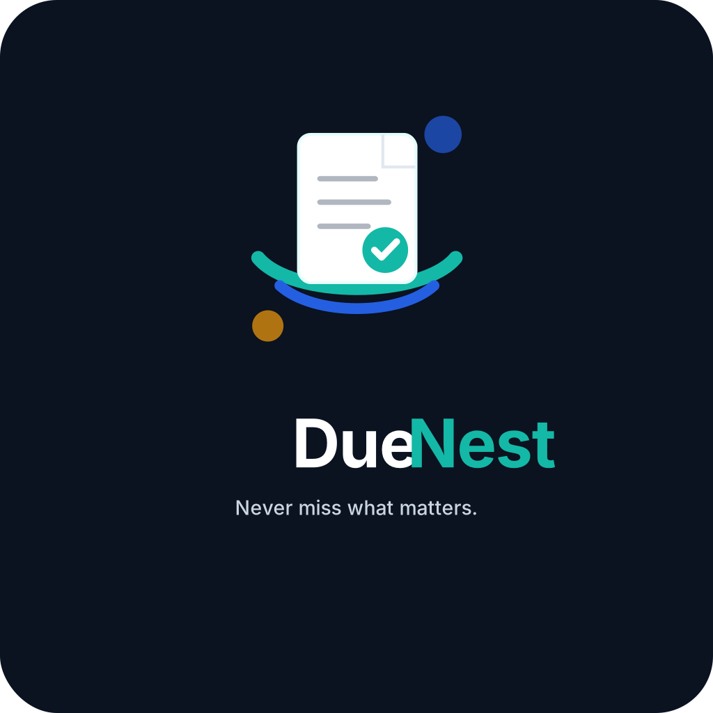

<p align="center">
  
</p>

<h1 align="center">DueNest</h1>

<p align="center">
  <strong>AI-powered life admin platform for documents, deadlines, renewals, reminders, and application-ready document packs.</strong>
</p>

<p align="center">
  Never miss what matters. Keep your documents ready. Stay ahead of every deadline.
</p>

<p align="center">
  
  
  
  
  
  
</p>

---

## Overview

**DueNest** is a SaaS-ready full-stack platform designed to help users manage important documents, deadlines, renewals, reminders, subscriptions, and reusable application document packs in one secure workspace.

The platform helps users organize essential files, track expiry dates, manage recurring obligations, receive deadline reminders, and prepare application-ready document bundles for jobs, scholarships, visas, internships, universities, grants, and professional opportunities.

The long-term vision is to turn DueNest into an **AI-powered life admin operating system** for students, professionals, immigrants, freelancers, families, and small teams.

DueNest is being built **documents-first**: the immediate focus is making the
Documents module a premium, pay-worthy **document renewal and expiry management
vault** before expanding into subscriptions, application packs, and AI. See the
[Document Vault Roadmap](./docs/document-vault-roadmap.md) for the phased plan,
paid-MVP definition, and build order.

---

## Table of Contents

* [Overview](#overview)
* [Problem](#problem)
* [Solution](#solution)
* [Product Vision](#product-vision)
* [Core Features](#core-features)
* [Target Users](#target-users)
* [Tech Stack](#tech-stack)
* [Platform Strategy](#platform-strategy)
* [Planned Architecture](#planned-architecture)
* [Repository Structure](#repository-structure)
* [Brand Assets](#brand-assets)
* [Product Modules](#product-modules)
* [Project Status](#project-status)
* [Current Focus](#current-focus)
* [Roadmap](#roadmap)
* [Documentation](#documentation)
* [Security Principles](#security-principles)
* [Local Development](#local-development)
* [Git Workflow](#git-workflow)
* [Why This Project Matters](#why-this-project-matters)
* [Disclaimer](#disclaimer)
* [Author](#author)
* [Note](#note)

---

## Problem

Important documents, renewals, subscriptions, and deadlines are often scattered across emails, cloud drives, laptops, WhatsApp chats, screenshots, paper folders, and memory.

This creates real problems:

* Forgotten subscription renewals and trial endings
* Missed visa, passport, insurance, or license expiry dates
* Lost certificates, transcripts, CVs, recommendation letters, and application documents
* Repeated preparation of the same documents for different applications
* Missed contract, domain, hosting, warranty, or professional renewal deadlines
* Lack of one trusted workspace for personal and professional life admin
* Stress, wasted time, lost money, and missed opportunities caused by poor deadline tracking

For many people, missing one important deadline can delay an application, create unnecessary financial loss, or block an opportunity.

---

## Solution

DueNest provides one secure workspace where users can:

* Store essential documents
* Track expiry dates and renewal deadlines
* Manage subscriptions and recurring obligations
* Receive reminders before important dates
* Create reusable application document packs
* Organize documents by category, purpose, and status
* Later use AI to extract dates, classify documents, and suggest actions automatically

DueNest is not only a reminder app. It is designed to become a trusted system for managing important personal, academic, professional, and administrative obligations.

---

## Product Vision

DueNest is built around one core question:

> What important document, deadline, renewal, or application requirement am I about to miss?

The product is designed around four main pillars:

| Pillar                | Description                                               |
| --------------------- | --------------------------------------------------------- |
| Document Vault        | Securely store and organize important documents           |
| Deadline Intelligence | Track expiry dates, renewals, and preparation windows     |
| Application Readiness | Generate reusable document packs for applications         |
| AI Automation         | Extract metadata, classify documents, and suggest actions |

---

## Core Features

### v0.1 — Core MVP

The first version focuses on building a stable, useful, and professional foundation.

* User authentication
* Secure document vault
* Manual document metadata entry
* Expiry date tracking
* Renewal and subscription tracker
* Dashboard for upcoming deadlines
* Basic reminders
* Application document packs
* Document categories and statuses
* Responsive web interface

### v0.2 — Smart Automation

This version introduces intelligent document processing.

* PDF text extraction
* AI-powered document classification
* Expiry date extraction
* Renewal date extraction
* Confidence score for extracted data
* User confirmation and correction flow
* Smart reminder suggestions

### v0.3 — Application Packs & Secure Sharing

This version makes DueNest more useful for real applications.

* Create reusable document packs
* Download selected documents as ZIP files
* Generate secure share links
* Add link expiration
* Track access logs
* Revoke shared access
* Add templates for jobs, scholarships, visas, internships, grants, and universities

### v0.4 — Integrations

This version connects DueNest with user workflows.

* Gmail scanning for renewal and subscription emails
* Google Calendar reminders
* Email notifications
* Optional WhatsApp or Telegram reminders
* Cloud storage integration

### v1.0 — SaaS-Ready Product

This version prepares DueNest for public demonstration or launch.

* Polished landing page
* Demo account
* Public documentation
* CI/CD pipeline
* Automated tests
* Production deployment
* Security hardening
* Monitoring and error tracking
* Pricing page
* Billing foundation

---

## Target Users

| User Group             | Use Case                                                         |
| ---------------------- | ---------------------------------------------------------------- |
| Students               | Scholarships, internships, university applications, certificates |
| International students | Visas, passports, insurance, school documents, application packs |
| Professionals          | CVs, certificates, licenses, contracts, job applications         |
| Freelancers            | Client contracts, invoices, software subscriptions, renewals     |
| Families               | Shared documents, IDs, insurance, household renewals             |
| Small teams            | Business documents, tools, licenses, vendor renewals             |

---

## Tech Stack

### Frontend

* Next.js
* TypeScript
* Tailwind CSS
* shadcn/ui
* React Hook Form
* Zod
* TanStack Query
* Recharts

### Backend

* Django
* Django REST Framework
* PostgreSQL-ready configuration
* Celery
* Redis
* Django Simple JWT
* Django CORS Headers
* python-decouple
* dj-database-url

### AI & Document Processing

Planned for later versions:

* OCR
* PDF text extraction
* LLM-powered structured extraction
* Document classification
* Metadata extraction
* Confidence scoring

### DevOps & Infrastructure

Planned:

* Docker
* Docker Compose
* GitHub Actions
* PostgreSQL
* Redis
* Vercel for frontend deployment
* Render, Railway, Fly.io, or similar for backend deployment
* S3-compatible storage for documents

---

## Platform Strategy

DueNest will be built in this order:

1. **Responsive Web App**
   The main product experience for document management, dashboards, uploads, tables, application packs, and settings.

2. **Progressive Web App**
   An installable mobile-like experience for quick access, reminders, and deadline checking.

3. **Native Mobile App**
   A future app focused on quick uploads, document scanning, mobile reminders, and deadline alerts.

The first version will prioritize a high-quality web dashboard because the product requires forms, file uploads, data tables, charts, settings, and workflow management.

---

## Planned Architecture

```txt
DueNest
│
├── Frontend
│   └── Next.js + TypeScript
│
├── Backend API
│   └── Django REST Framework
│
├── Database
│   └── PostgreSQL
│
├── Background Jobs
│   └── Celery + Redis
│
├── File Storage
│   ├── Local development storage
│   └── S3-compatible production storage later
│
└── AI Layer
    ├── OCR
    ├── PDF extraction
    ├── Document classification
    └── Metadata extraction
```

---

## Repository Structure

```txt
duenest/
│
├── backend/
│   ├── apps/
│   │   ├── core/
│   │   └── users/
│   ├── common/
│   ├── config/
│   │   └── settings/
│   ├── tests/
│   ├── manage.py
│   ├── requirements.txt
│   ├── .env.example
│   └── README.md
│
├── frontend/
│   └── Next.js + TypeScript frontend
│
├── docs/
│   ├── product-blueprint.md
│   ├── architecture.md
│   ├── database-design.md
│   ├── api-spec.md
│   ├── security-plan.md
│   └── roadmap.md
│
├── brand/
│   ├── logo/
│   ├── icons/
│   ├── colors/
│   ├── social/
│   ├── guidelines/
│   ├── messaging/
│   └── README.md
│
├── .github/
│   ├── workflows/
│   └── ISSUE_TEMPLATE/
│
├── README.md
├── .gitignore
└── docker-compose.yml
```

---

## Brand Assets

DueNest brand assets are stored in the [`brand/`](./brand/) folder.

This includes:

* Logo variations
* App icons and favicons
* Color palette
* UI design tokens
* Social and pitch assets
* Brand guidelines
* Messaging references

The main logo used in this README is located at:

[`brand/logo/duenest-logo.png`](./brand/logo/duenest-logo.png)

Brand asset folders:

| Folder                                     | Purpose                                              |
| ------------------------------------------ | ---------------------------------------------------- |
| [`brand/logo/`](./brand/logo/)             | Main logo, logo variations, SVG and PNG assets       |
| [`brand/icons/`](./brand/icons/)           | Favicons, app icons, and PWA icon assets             |
| [`brand/colors/`](./brand/colors/)         | Color palette, CSS variables, and UI tokens          |
| [`brand/social/`](./brand/social/)         | Social banners, Open Graph images, and pitch visuals |
| [`brand/guidelines/`](./brand/guidelines/) | Brand guideline documents                            |
| [`brand/messaging/`](./brand/messaging/)   | Messaging system, landing copy, and profile copy     |
| [`brand/README.md`](./brand/README.md)     | Brand asset usage guide                              |

---

## Product Modules

### Authentication

User registration, login, protected routes, user profile, and secure access to personal data.

### Document Vault

A secure place to upload, categorize, search, preview, and manage important documents.

### Deadline Tracker

Tracks expiry dates, renewal dates, preparation windows, and upcoming actions.

### Renewal Manager

Manages subscriptions, contracts, warranties, domains, insurance, licenses, and recurring obligations.

### Application Packs

Allows users to bundle documents for specific use cases such as scholarships, jobs, visas, internships, grants, or university applications.

### Reminder System

Sends reminders before important dates and helps users stay ahead of deadlines.

### Dashboard

Provides a clear overview of upcoming deadlines, expired documents, active renewals, monthly costs, and important actions.

### AI Extraction

Uses AI to extract document type, expiry date, provider, amount, renewal date, and recommended actions from uploaded files.

---

## Project Status

| Area                   | Status        |
| ---------------------- | ------------- |
| Planning               | ✅ Completed   |
| Branding               | ✅ Completed   |
| Repository Setup       | ✅ Completed   |
| Product Documentation  | ✅ Completed   |
| Backend Foundation     | ✅ Completed   |
| Backend Authentication | ✅ Completed |
| Frontend               | ⚪ Not Started |
| MVP Development        | 🔵 Planned    |
| AI Features            | 🔵 Planned    |
| Deployment             | 🔵 Planned    |

### Status Legend

| Symbol | Meaning     |
| ------ | ----------- |
| ✅      | Completed   |
| 🟡     | In Progress |
| 🔵     | Planned     |
| ⚪      | Not Started |
| 🔴     | Blocked     |

---

## Current Focus

The project foundation, planning phase, branding, documentation, and initial backend foundation are now in place.

The Django REST Framework backend foundation has been started with:

* Django project setup
* Split settings structure
* Development, testing, and production settings
* Environment variable support
* PostgreSQL-ready database configuration
* Django REST Framework configuration
* CORS configuration
* Simple JWT configuration
* Token blacklist support
* Custom user model foundation
* Core health check endpoint
* Backend README

The health check endpoint is available at:

```txt
GET /api/v1/health/
```

Expected response:

```json
{
  "status": "ok",
  "service": "duenest-backend",
  "version": "v0.1"
}
```

Implemented API endpoints so far:

```txt
POST   /api/v1/auth/register/     # username/password registration
POST   /api/v1/auth/login/        # JWT login
POST   /api/v1/auth/refresh/      # JWT refresh
POST   /api/v1/auth/google/       # Google ID-token sign-in
GET    /api/v1/users/me/          # current user
GET    /api/v1/documents/         # list current user's documents
POST   /api/v1/documents/         # create document
GET    /api/v1/documents/:id/     # retrieve document
PATCH  /api/v1/documents/:id/     # update document
DELETE /api/v1/documents/:id/     # delete document

GET    /api/v1/documents/:id/files/                  # list a document's files
POST   /api/v1/documents/:id/files/                  # upload a file (multipart)
GET    /api/v1/documents/:id/files/:file_id/         # file metadata
DELETE /api/v1/documents/:id/files/:file_id/         # delete a file
GET    /api/v1/documents/:id/files/:file_id/download/ # controlled download
GET    /api/v1/documents/:id/files/:file_id/preview/  # controlled inline preview
GET    /api/v1/documents/:id/files/:file_id/share-links/
POST   /api/v1/documents/:id/files/:file_id/share-links/
POST   /api/v1/documents/:id/files/:file_id/share-links/:share_id/revoke/
GET    /api/v1/documents/:id/files/:file_id/activity/

GET    /api/v1/share/files/:token/                   # public shared-file metadata
POST   /api/v1/share/files/:token/verify-code/
GET    /api/v1/share/files/:token/preview/
GET    /api/v1/share/files/:token/download/
```

The document API and its file attachments are strictly scoped to the
authenticated owner. Uploads are validated (type + 10 MB limit) and stored
under git-ignored local media in development; files are served only through the
authenticated preview/download endpoints, never as public static media. Share
links grant controlled access to one file only, enforce expiry/revocation and
view-only/download permissions server-side, and can require hashed access codes.

The next implementation focus is:

* Add expiry/renewal status automation
* Add search, filters, and attention-needed views
* Continue polishing the document vault workspace

The next backend branch after this foundation PR will be:

```txt
backend/document-status-intelligence
```

---

## Roadmap

### Sprint Progress

* [x] Sprint 0 — Project Foundation
* [x] Sprint 1 — Backend Foundation
* [x] Sprint 2 — Authentication
* [ ] Sprint 3 — Frontend Foundation
* [ ] Sprint 4 — Document Vault
* [ ] Sprint 5 — Renewal Tracker
* [ ] Sprint 6 — Dashboard
* [ ] Sprint 7 — Application Packs
* [ ] Sprint 8 — Reminders and Notifications
* [ ] Sprint 9 — MVP Polish

---

<details>
<summary><strong>Sprint 0 — Project Foundation</strong> ✅</summary>

### Goal

Prepare the repository, documentation, branding, roadmap, and initial product structure.

### Tasks

* [x] Create GitHub repository
* [x] Configure repository visibility and description
* [x] Clone repository using SSH
* [x] Create project foundation branch
* [x] Set up backend folder
* [x] Set up frontend folder
* [x] Set up docs folder
* [x] Set up brand folder
* [x] Set up GitHub workflow folders
* [x] Add initial README
* [x] Add brand assets to repository
* [x] Add product blueprint
* [x] Add architecture document
* [x] Add database design
* [x] Add API specification
* [x] Add security plan
* [x] Add implementation roadmap

### Deliverable

A clean, professional repository foundation ready for backend and frontend implementation.

</details>

<details>
<summary><strong>Sprint 1 — Backend Foundation</strong> ✅</summary>

### Goal

Set up the Django REST Framework backend foundation.

### Tasks

* [x] Create Django project inside `backend/`
* [x] Configure virtual environment
* [x] Install Django and Django REST Framework
* [x] Configure project settings
* [x] Set up environment variables
* [x] Configure PostgreSQL-ready settings
* [x] Create modular backend structure
* [x] Add custom user model foundation
* [x] Add basic health check endpoint
* [x] Add initial backend README

### Deliverable

A working Django REST Framework backend foundation ready for authentication implementation.

</details>

<details>
<summary><strong>Sprint 2 — Authentication</strong> ✅</summary>

### Goal

Implement secure user registration, login, token refresh, and current user profile access.

### Tasks

* [x] Create user serializers
* [x] Create registration endpoint
* [x] Configure JWT login endpoint
* [x] Configure JWT refresh endpoint
* [x] Create protected current-user endpoint
* [x] Add Google sign-in endpoint (ID-token verification)
* [x] Add password validation
* [x] Add authentication permissions
* [x] Add authentication tests
* [ ] Document authentication API usage

### Deliverable

Users can register, log in, refresh tokens, and access protected account information.

</details>

<details>
<summary><strong>Sprint 3 — Frontend Foundation</strong> ⚪</summary>

### Goal

Set up the Next.js frontend foundation.

### Tasks

* [ ] Create Next.js application inside `frontend/`
* [ ] Configure TypeScript
* [ ] Configure Tailwind CSS
* [ ] Install and configure shadcn/ui
* [ ] Create global layout
* [ ] Build landing page
* [ ] Build login page
* [ ] Build register page
* [ ] Create dashboard shell
* [ ] Set up API client

### Deliverable

A working frontend foundation with landing page, authentication screens, and dashboard shell.

</details>

<details>
<summary><strong>Sprint 4 — Document Vault</strong> ⚪</summary>

### Goal

Build the first core product module for managing essential documents.

### Tasks

* [ ] Create document model
* [ ] Create document serializer
* [ ] Create document API endpoints
* [ ] Add file upload support
* [ ] Add file validation
* [ ] Add document listing
* [ ] Add document detail view
* [ ] Add document metadata editing
* [ ] Add document deletion
* [ ] Add document download
* [ ] Add categories and document types
* [ ] Add expiry date field
* [ ] Add expiry status calculation
* [ ] Build document vault frontend page

### Deliverable

Users can upload, view, organize, edit, and manage important documents.

</details>

<details>
<summary><strong>Sprint 5 — Renewal Tracker</strong> ⚪</summary>

### Goal

Build the renewal and subscription management module.

### Tasks

* [ ] Create renewal model
* [ ] Create renewal serializer
* [ ] Create renewal API endpoints
* [ ] Add subscription amount and currency
* [ ] Add renewal date
* [ ] Add recurring frequency
* [ ] Add provider field
* [ ] Add cancellation URL
* [ ] Add renewal status
* [ ] Build renewal tracker frontend page
* [ ] Add monthly and yearly cost summary

### Deliverable

Users can manage subscriptions, renewals, and recurring obligations.

</details>

<details>
<summary><strong>Sprint 6 — Dashboard</strong> ⚪</summary>

### Goal

Build the central dashboard experience.

### Tasks

* [ ] Add upcoming deadlines widget
* [ ] Add expiring documents widget
* [ ] Add renewals due soon widget
* [ ] Add expired items widget
* [ ] Add subscription cost summary
* [ ] Add deadline timeline
* [ ] Add quick action cards
* [ ] Add basic charts
* [ ] Add empty states
* [ ] Improve responsive layout

### Deliverable

Users can quickly understand what requires attention and what deadlines are approaching.

</details>

<details>
<summary><strong>Sprint 7 — Application Packs</strong> ⚪</summary>

### Goal

Allow users to prepare reusable document bundles for applications.

### Tasks

* [ ] Create application pack model
* [ ] Create pack-document relationship
* [ ] Create application pack API endpoints
* [ ] Build pack creation form
* [ ] Allow users to select documents
* [ ] Add pack details page
* [ ] Add pack editing
* [ ] Add ZIP export
* [ ] Add templates for jobs, scholarships, visas, and university applications

### Deliverable

Users can generate reusable document packs for real-world applications.

</details>

<details>
<summary><strong>Sprint 8 — Reminders and Notifications</strong> ⚪</summary>

### Goal

Build the reminder and notification foundation.

### Tasks

* [ ] Create reminder model
* [ ] Create notification model
* [ ] Add reminder API endpoints
* [ ] Add notification API endpoints
* [ ] Configure Celery
* [ ] Configure Redis
* [ ] Add background reminder jobs
* [ ] Add in-app notifications
* [ ] Add email reminder foundation
* [ ] Add reminder preferences

### Deliverable

Users can receive reminders before important deadlines and renewal dates.

</details>

<details>
<summary><strong>Sprint 9 — MVP Polish</strong> ⚪</summary>

### Goal

Prepare a presentable DueNest v0.1 MVP for portfolio, recruiter, and demo use.

### Tasks

* [ ] Polish landing page
* [ ] Polish dashboard UI
* [ ] Add empty states
* [ ] Add sample demo data
* [ ] Update README with actual progress
* [ ] Add screenshots
* [ ] Write demo flow
* [ ] Fix known bugs
* [ ] Review security checklist
* [ ] Prepare portfolio case study outline

### Deliverable

A presentable MVP that demonstrates product thinking, full-stack engineering, security awareness, and SaaS execution.

</details>

---

## Documentation

Detailed project documentation is maintained in the [`docs/`](./docs/) folder.

| Document                                         | Purpose                                                                 | Status      |
| ------------------------------------------------ | ----------------------------------------------------------------------- | ----------- |
| [Product Blueprint](./docs/product-blueprint.md) | Product vision, target users, features, MVP scope, and product strategy | ✅ Completed |
| [Architecture](./docs/architecture.md)           | System architecture, technical decisions, and platform structure        | ✅ Completed |
| [Database Design](./docs/database-design.md)     | Database models, relationships, indexes, and ERD planning               | ✅ Completed |
| [API Specification](./docs/api-spec.md)          | API endpoints, request/response formats, and backend contracts          | ✅ Completed |
| [Security Plan](./docs/security-plan.md)         | Security principles, risks, privacy controls, and protection strategy   | ✅ Completed |
| [Roadmap](./docs/roadmap.md)                     | Sprint plan, feature prioritization, and release roadmap                | ✅ Completed |
| [Backend README](./backend/README.md)            | Backend setup, environment configuration, and local API health check    | ✅ Started   |
| [Brand Guide](./brand/README.md)                 | Brand assets, logos, icons, colors, and messaging references            | ✅ Completed |

---

## Security Principles

DueNest may handle sensitive personal documents, so security is a core product principle.

Planned security practices include:

* Private-by-default documents
* Strict user ownership checks
* Secure authentication
* Encrypted file storage in production
* Signed URLs for document access
* Expiring share links
* Access logs
* Revocable sharing
* Environment variables for secrets
* No hardcoded credentials
* Secure file upload validation
* Careful handling of personal documents

During development, only test or sample documents should be used.

> Do not upload real passports, visas, IDs, certificates, financial documents, or private documents during development.

---

## Local Development

Clone the repository:

```bash
git clone git@github.com:nouhandoumbouya655/duenest.git
```

Enter the project:

```bash
cd duenest
```

Backend setup instructions are available in:

[backend/README.md](./backend/README.md)

Current backend health check:

```txt
http://127.0.0.1:8000/api/v1/health/
```

Frontend, Docker, deployment, and production database setup instructions will be added during later implementation sprints.

---

## Git Workflow

This project follows a branch-based workflow.

Example branches:

```txt
setup/project-foundation
docs/initial-readme
brand/add-initial-assets
docs/product-blueprint
docs/architecture
docs/database-design
docs/api-spec
docs/security-plan
docs/roadmap
backend/django-setup
backend/authentication
frontend/nextjs-setup
feature/document-vault
feature/renewal-tracker
feature/dashboard
feature/application-packs
feature/reminders
feature/ai-extraction
```

Commit message examples:

```txt
chore: initialize project structure
docs: add product roadmap
brand: add initial brand assets
backend: set up Django project foundation
backend: add custom user model
feat: add user registration API
feat: build document upload endpoint
fix: correct expiry status calculation
refactor: reorganize document services
test: add document ownership tests
```

---

## Why This Project Matters

DueNest is not a basic CRUD project. It is designed to demonstrate real software engineering ability through:

* Full-stack architecture
* Authentication
* File handling
* Database modeling
* Background jobs
* Dashboards
* Reminders
* Security-conscious design
* AI-powered automation
* Product thinking
* SaaS execution
* Professional documentation

The goal is to build something that can serve as both a standout portfolio project and a serious startup MVP.

---

## Disclaimer

DueNest is currently in early development. The project is not yet production-ready and should not be used to store real sensitive documents until security, storage, access control, deployment hardening, and privacy controls are fully implemented.

---

## Author

Built by **Nouhan Doumbouya**.

DueNest is built as a flagship full-stack SaaS project focused on real-world product design, secure document workflows, deadline intelligence, and AI-powered automation.

---

## Note

DueNest has completed its planning, branding, documentation, and initial Django REST Framework backend foundation. The next phase is backend authentication.
