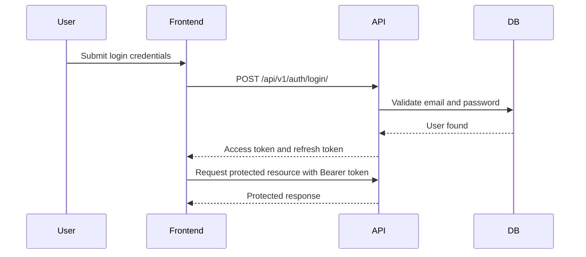

# CertaNest API Specification

**Version:** v0.1  
**Status:** Planning  
**API Style:** REST  
**Backend Framework:** Django REST Framework  
**Authentication:** JWT-based authentication  
**Primary Client:** Next.js frontend  
**Base Path:** `/api/v1/`

---

## 1. API Specification Summary

This document defines the planned REST API for CertaNest.

CertaNest APIs will support:

- user authentication
- user profile management
- document vault operations
- renewal and subscription tracking
- reminders
- notifications
- dashboard summaries
- application document packs
- future AI document extraction

The API should be secure, predictable, versioned, well-documented, and designed around user-owned resources.

---

## 2. API Design Goals

| Goal | Description |
| --- | --- |
| Security-first | Every protected resource must be scoped to the authenticated user |
| Consistency | Endpoints, responses, errors, and pagination should follow predictable patterns |
| Versioning | APIs should use `/api/v1/` from the beginning |
| Maintainability | API endpoints should map cleanly to product modules |
| Frontend readiness | Responses should be easy for the Next.js frontend to consume |
| Extensibility | Future AI, sharing, workspace, and billing features should fit without redesign |
| Clear validation | Invalid input should return useful validation errors |
| Production awareness | API behavior should support testing, CI/CD, monitoring, and deployment |

---

## 3. API Base URL

### Local Development

```txt
http://localhost:8000/api/v1/
```

### Production

```txt
https://api.certanest.com/api/v1/
```

The production domain is a placeholder and may change.

---

## 4. API Versioning Strategy

All v0.1 endpoints should use:

```txt
/api/v1/
```

Example:

```txt
/api/v1/documents/
```

Versioning from the beginning prevents future breaking changes from affecting old clients.

Future versions may use:

```txt
/api/v2/
```

---

## 5. Content Types

### JSON Requests

Most endpoints should accept and return JSON:

```http
Content-Type: application/json
Accept: application/json
```

### File Upload Requests

Document upload endpoints should use multipart form data:

```http
Content-Type: multipart/form-data
```

---

## 6. Authentication Strategy

CertaNest will use JWT-based authentication.

### Token Types

| Token | Purpose |
| --- | --- |
| Access token | Used for authenticated API requests |
| Refresh token | Used to obtain a new access token |

### Authorization Header

Protected endpoints require:

```http
Authorization: Bearer <access_token>
```

### Authentication Flow



---

## 7. Standard Response Format

### Success Response

For single-resource responses:

```json
{
  "data": {
    "id": "uuid",
    "title": "Passport"
  }
}
```

For list responses:

```json
{
  "count": 25,
  "next": "http://localhost:8000/api/v1/documents/?page=2",
  "previous": null,
  "results": []
}
```

### Error Response

All error responses should follow a consistent shape:

```json
{
  "error": {
    "code": "DOCUMENT_NOT_FOUND",
    "message": "The requested document was not found.",
    "details": {}
  }
}
```

### Validation Error Response

```json
{
  "error": {
    "code": "VALIDATION_ERROR",
    "message": "Invalid request data.",
    "details": {
      "title": ["This field is required."],
      "expiry_date": ["Date has wrong format. Use YYYY-MM-DD."]
    }
  }
}
```

---

## 8. HTTP Status Code Strategy

| Status Code | Meaning |
| --- | --- |
| `200 OK` | Request succeeded |
| `201 Created` | Resource created successfully |
| `204 No Content` | Resource deleted successfully |
| `400 Bad Request` | Invalid request data |
| `401 Unauthorized` | Missing or invalid authentication |
| `403 Forbidden` | Authenticated but not allowed |
| `404 Not Found` | Resource does not exist or does not belong to user |
| `409 Conflict` | Request conflicts with existing data |
| `413 Payload Too Large` | Uploaded file is too large |
| `415 Unsupported Media Type` | Uploaded file type is not supported |
| `429 Too Many Requests` | Rate limit exceeded |
| `500 Internal Server Error` | Unexpected server error |

Important security note:

> For user-owned resources, if a resource exists but belongs to another user, the API should usually return `404 Not Found`, not `403 Forbidden`, to avoid leaking resource existence.

Scoped rate limits apply to abuse-prone public endpoints. Current limits include
login/Google login (`10/min`), registration (`10/hour`), file-share/emergency
pack/secure-room/Quick Share access-code verification (`10/min`), Quick Share
"Receive code" lookups (`quick_share_receive`, `10/min`), feedback (`20/hour`),
waitlist (`5/hour`), and invite validation (`20/hour`). Exceeding a scope returns
`429 Too Many Requests`.

---

## 9. Pagination Strategy

List endpoints use page-number pagination (`apps.core.pagination.StandardResultsSetPagination`).
The default page size is `20`. Clients may request a smaller or larger page
with `?page_size=` (capped at `max_page_size = 100`); the paginated `count` is
always the full total regardless of page size, so count-only callers can pass
`page_size=1` to avoid serializing a full page. A few endpoints opt out of
pagination (`pagination_class = None`) because they return small, finite,
curated sets (e.g. feature-completion and launch-checklist items).

Example request:

```http
GET /api/v1/documents/?page=1&page_size=20
```

Example response:

```json
{
  "count": 42,
  "next": "http://localhost:8000/api/v1/documents/?page=2&page_size=20",
  "previous": null,
  "results": []
}
```

### Recommended Defaults

| Parameter | Default | Notes |
| --- | --- | --- |
| `page` | `1` | Current page |
| `page_size` | `20` | Default page size |
| `max_page_size` | `100` | Prevent excessive responses |

---

## 10. Filtering, Searching, and Sorting

APIs should support useful filtering from the beginning where needed.

### Common Query Parameters

| Parameter | Purpose |
| --- | --- |
| `search` | Search by title, provider, or name |
| `category` | Filter by category |
| `status` | Filter by status |
| `ordering` | Sort results |
| `created_after` | Filter by creation date |
| `created_before` | Filter by creation date |

### Example

```http
GET /api/v1/documents/?category=immigration&status=expiring_soon&ordering=expiry_date
```

### Unified quick search (command palette)

A single owner-scoped endpoint powers the command palette (Cmd/Ctrl+K). It looks
across the user's documents, subscriptions, and organizations and returns a
small, capped list of "go here" results. Trashed documents and archived
subscriptions are excluded; a blank query returns an empty list.

```http
GET /api/v1/search/?q=passport
```

```json
{
  "query": "passport",
  "results": [
    { "type": "document", "id": 12, "title": "UK Passport", "subtitle": "Passport · UK", "url": "/dashboard/documents/12" },
    { "type": "subscription", "id": 4, "title": "Passport photo service", "subtitle": "Snappy", "url": "/dashboard/subscriptions/4" },
    { "type": "organization", "id": 2, "title": "Passport Club", "subtitle": "Club", "url": "/dashboard/organizations/2" }
  ]
}
```

Each type is capped at 5 results. Authentication is required; results never
include another user's data.

---

## 11. Resource Ownership Rules

Every protected resource must be scoped to the authenticated user.

Unsafe example:

```python
Document.objects.get(id=document_id)
```

Safe example:

```python
Document.objects.get(id=document_id, user=request.user)
```

### Ownership Table

| Resource | Ownership Rule |
| --- | --- |
| Document | `document.user == request.user` |
| Renewal | `renewal.user == request.user` |
| Reminder | `reminder.user == request.user` |
| Notification | `notification.user == request.user` |
| ApplicationPack | `application_pack.user == request.user` |
| ApplicationPackDocument | pack and document must belong to same user |
| AIExtractionResult | linked document must belong to request user |

---

# 12. Authentication API

## 12.1 Register User

```http
POST /api/v1/auth/register/
```

### Request

```json
{
  "username": "nouhan",
  "email": "nouhan@example.com",
  "first_name": "Nouhan",
  "last_name": "Doumbouya",
  "password": "StrongPassword123!",
  "invite_code": "DN-ABCDE-12345"
}
```

### Response: `201 Created`

```json
{
  "id": 12,
  "username": "nouhan",
  "email": "nouhan@example.com",
  "first_name": "Nouhan",
  "last_name": "Doumbouya",
  "plan": "free"
}
```

### Validation Rules

- Username and email must be unique enough for Django user creation.
- Password must meet minimum security requirements.
- When `PRIVATE_BETA_ENABLED=true`, `invite_code` is required.
- Invite codes must be active, unexpired, and below their max-use limit.
- Existing users are not blocked from logging in when private beta mode is enabled.

---

## 12.2 Login User

```http
POST /api/v1/auth/login/
```

### Request

```json
{
  "email": "nouhan@example.com",
  "password": "StrongPassword123!"
}
```

### Response: `200 OK`

```json
{
  "data": {
    "access": "access_token_here",
    "refresh": "refresh_token_here",
    "user": {
      "id": "7b9c0c30-12e2-4f5a-a7ab-62e9f4fd7c11",
      "full_name": "Nouhan Doumbouya",
      "email": "nouhan@example.com"
    }
  }
}
```

---

## 12.3 Refresh Token

```http
POST /api/v1/auth/refresh/
```

### Request

```json
{
  "refresh": "refresh_token_here"
}
```

### Response: `200 OK`

```json
{
  "data": {
    "access": "new_access_token_here"
  }
}
```

---

## 12.4 Logout User

```http
POST /api/v1/auth/logout/
```

### Authentication

Required.

### Request

```json
{
  "refresh": "refresh_token_here"
}
```

### Response: `204 No Content`

This endpoint may blacklist the refresh token if token blacklisting is enabled.

---

## 12.5 Google Sign-In

```http
POST /api/v1/auth/google/
```

Exchanges a Google ID token (obtained by the frontend via Google Sign-In) for
CertaNest Simple JWT tokens. This sits alongside username/password login and does
not replace it.

The backend verifies the ID token against `GOOGLE_OAUTH_CLIENT_ID`, then either
finds the matching user (by Google id, then by email) or creates a new one, and
returns CertaNest tokens.

### Request

```json
{
  "id_token": "GOOGLE_ID_TOKEN_HERE"
}
```

### Response: `200 OK`

```json
{
  "refresh": "refresh_token_here",
  "access": "access_token_here",
  "user": {
    "id": 1,
    "username": "example",
    "email": "example@gmail.com",
    "first_name": "Example",
    "last_name": "User"
  }
}
```

### Behavior & Errors

- A new local user is created on first Google sign-in (with an unusable password).
- If a password account already uses the token's email, that account is linked to the Google id.
- `400 Bad Request` if the token's email is not verified or the payload is incomplete.
- `401 Unauthorized` if the ID token is missing, invalid, or issued for another application.

---

# 13. User API

## 13.1 Get Current User

```http
GET /api/v1/users/me/
```

### Authentication

Required.

### Response: `200 OK`

```json
{
  "data": {
    "id": "7b9c0c30-12e2-4f5a-a7ab-62e9f4fd7c11",
    "full_name": "Nouhan Doumbouya",
    "email": "nouhan@example.com",
    "plan": "free",
    "date_joined": "2026-06-05T10:30:00Z"
  }
}
```

The read-only `plan` field is `free` or `pro_placeholder` and drives the usage
limits described in section 13C.6.

---

## 13.2 Update Current User

```http
PATCH /api/v1/users/me/
```

### Authentication

Required.

### Request

```json
{
  "full_name": "Nouhan D."
}
```

### Response: `200 OK`

```json
{
  "data": {
    "id": "7b9c0c30-12e2-4f5a-a7ab-62e9f4fd7c11",
    "full_name": "Nouhan D.",
    "email": "nouhan@example.com",
    "updated_at": "2026-06-05T11:00:00Z"
  }
}
```

> Implementation note: `GET /users/me/` includes a read-only
> **`profile_image_url`** — the effective avatar to display, resolved as the
> user's uploaded picture (an inline `data:` URL) → the Google picture
> (`avatar_url`) → empty string (the client then shows a default human avatar).
> `PATCH /users/me/` accepts **`first_name`** and **`last_name`** only; email and
> username are identity-sensitive and are not editable here.

## 13.2.1 Profile picture

```http
POST   /api/v1/users/me/avatar/   (multipart/form-data, field: "avatar")
DELETE /api/v1/users/me/avatar/
```

### Authentication

Required.

### Behavior

- **POST** accepts an image file (`avatar`). It is re-encoded server-side
  (EXIF-stripped, downscaled to ~256px, JPEG) and stored inline on the user as a
  base64 `data:` URL — CertaNest never serves avatars via a public/object-storage
  URL, consistent with its file-delivery model. Returns the updated user.
- **DELETE** clears the uploaded picture (the Google picture, if any, then
  applies). Returns the updated user.
- Invalid or unreadable uploads, or files larger than 8 MB, return `400`.

## 13.2.2 Saved personal details (for form pre-fill)

```http
GET    /api/v1/users/me/profile-details/
PATCH  /api/v1/users/me/profile-details/
DELETE /api/v1/users/me/profile-details/
```

### Authentication

Required. Strictly owner-scoped — only ever reads/writes the signed-in user's
own record.

### Fields

All optional strings: `legal_name`, `preferred_name`, `date_of_birth`,
`nationality`, `phone`, `address_street`, `address_city`, `address_region`,
`address_postal_code`, `address_country`, `passport_number`, `national_id`.

### Behavior

- **GET** returns every field (unset ones as `""`).
- **PATCH** partially updates; send `""` to clear a single field. Returns the
  full set.
- **DELETE** clears all saved details.
- Values are **encrypted at rest** (AES-256-GCM, AAD-bound) as a single
  ciphertext blob — CertaNest never stores them in plaintext. They are returned
  only to the owner, never shared, and are removed with the account.

---

## Smart Profile V1

Per-user **reusable application data** (education, work, skills, achievements,
common answers + scalar extras) with a deterministic completeness score, so
users store information once and reuse it across applications, packs, letters,
CVs, and forms later. **Deterministic — no AI call, no AI credits, no R2, no
private file URLs.** Strictly owner-scoped. Behind the founder-only rollout flag
`smart_profile` until launched; available to Free and Pro.

**Privacy:** the most-sensitive identity/document numbers (passport number,
national ID) are **not** stored or returned here — they live in the encrypted
`UserProfileDetails` store (`/users/me/profile-details/`). Smart Profile reads
only non-secret identity values plus presence booleans (`has_passport_number`,
`has_national_id`). Smart Profile is never exposed publicly (no share endpoints).

| Method | Path | Description |
| --- | --- | --- |
| `GET` | `/api/v1/smart-profile/` | Unified payload (identity summary + extras + collections + completeness) |
| `PATCH` | `/api/v1/smart-profile/` | Update the reusable extras (subset allowed) |
| `GET` | `/api/v1/smart-profile/completeness/` | Completeness score + sections + next actions |
| `GET`/`POST` | `/api/v1/smart-profile/education/` | List/create education entries (list is paginated) |
| `GET`/`PATCH`/`DELETE` | `/api/v1/smart-profile/education/{id}/` | Detail CRUD |
| `GET`/`POST` · `…/{id}/` | `/api/v1/smart-profile/work/` | Work / experience entries |
| `GET`/`POST` · `…/{id}/` | `/api/v1/smart-profile/skills/` | Skills (`technical`/`language`/`soft`/`tool`/`other`) |
| `GET`/`POST` · `…/{id}/` | `/api/v1/smart-profile/achievements/` | Achievements (8 categories; optional `related_document`, owner-validated) |
| `GET`/`POST` · `…/{id}/` | `/api/v1/smart-profile/common-answers/` | Common application answers (`scholarship`/`visa`/`job`/`university`/`general`) |

**Extras (PATCH `/smart-profile/`):** `email_for_applications`,
`country_of_residence`, `current_address`, `permanent_address`,
`passport_expiry_date`, `emergency_contact_name`,
`emergency_contact_relationship`, `emergency_contact_phone`.

**Completeness** (also embedded in the unified payload): `{ score (0–100),
label, sections: [{key, label, complete, missing_fields[]}], next_actions:
[{type, label, priority}] }`. Eight sections (basic identity, contact, address,
education, work, skills, achievements, emergency contact); score =
complete-sections ÷ 8 × 100. Labels: 90–100 "Ready to reuse", 70–89 "Mostly
ready", 40–69 "Getting ready", 0–39 "Incomplete". Empty profile returns a stable
zeroed payload.

Sub-entries are owner-scoped (a foreign id → `404`); `related_document` must
belong to the user (`400` otherwise); all rows cascade-delete with the account.
`build_application_context_from_profile(user, application)` (service-only, not a
public endpoint) assembles a deterministic profile+application+pack context for
**future** AI document generation — it makes no AI call and never includes
passport/ID numbers or file URLs.

---

# 13.3 Onboarding, Trust, Demo, and Account Controls API (implemented)

These endpoints are user-owned support surfaces for the document module. They
do not expose another user's records and all protected routes require
`Authorization: Bearer <access_token>`.

## 13.3.1 Document onboarding state

`UserOnboardingState` is a one-to-one record for the authenticated user. It
stores durable setup timestamps and lightweight metadata used by the frontend
onboarding experience.

| Method | Path | Description |
| --- | --- | --- |
| `GET` | `/api/v1/onboarding/state/` | Retrieve or create the user's onboarding state |
| `PATCH` | `/api/v1/onboarding/state/` | Update allowed state fields (`has_completed_document_onboarding`, `metadata`) |
| `POST` | `/api/v1/onboarding/complete/` | Mark document onboarding complete |
| `POST` | `/api/v1/onboarding/dismiss/` | Dismiss onboarding from the dashboard |
| `POST` | `/api/v1/onboarding/attention-reviewed/` | Record that Attention Needed was reviewed |
| `POST` | `/api/v1/onboarding/trust-reviewed/` | Record that the Trust Center was reviewed |

Read-only progress fields include:

```txt
first_document_created_at
first_file_uploaded_at
first_expiry_date_added_at
first_reminder_created_at
first_share_link_created_at
first_checklist_created_at
checklist_completed_at
dismissed_onboarding_at
```

Document, file, expiry, reminder, checklist, share-link, and checklist-complete
events are marked from the real document workflows where practical. The state
endpoint also backfills progress from existing owner-scoped data.

## 13.3.2 Guided document setup checklist

```http
GET /api/v1/onboarding/document-setup-checklist/
```

Returns computed progress from real user data:

- create first document
- upload first file
- add expiry or renewal date
- review Attention Needed
- create reminder rule
- create renewal checklist
- try secure sharing
- review Trust Center

Response shape:

```json
{
  "is_complete": false,
  "percent": 50,
  "required_percent": 67,
  "counts": {
    "documents": 1,
    "files": 1,
    "attention_needed": 0,
    "reminders": 1,
    "checklists": 0,
    "share_links": 0
  },
  "steps": [
    {
      "key": "create_first_document",
      "title": "Create your first document",
      "completed": true,
      "status": "completed",
      "is_required": true,
      "href": "/dashboard/documents/new"
    }
  ]
}
```

Step statuses are `completed`, `current`, `pending`, or `optional`.

## 13.3.3 Demo document data

Demo data is always fake, owner-scoped, and labeled with `[Demo]` plus the
internal marker `DUENEST_DEMO_DATA`.

| Method | Path | Description |
| --- | --- | --- |
| `POST` | `/api/v1/demo/create-document-demo-data/` | Create sample passport, visa, insurance, bundle, checklist, reminder, file, and share-link data for the caller |
| `DELETE` | `/api/v1/demo/clear-document-demo-data/` | Remove only the caller's labeled demo document data |

The create endpoint clears existing demo data for that user first, making it
safe to run repeatedly.

## 13.3.4 Trust summary

```http
GET /api/v1/trust/security-summary/
```

Returns safe capability flags and beta limitations for the signed-in user. It
must not include secrets, raw credentials, access-code hashes, internal storage
paths, or environment values.

## 13.3.5 Account data controls

| Method | Path | Description |
| --- | --- | --- |
| `GET` | `/api/v1/account/data-summary/` | Owner-scoped counts for documents, files, shares, reminders, checklists, bundles, proof records, emergency packs, exports, and active deletion request status |
| `POST` | `/api/v1/account/request-data-export/` | Create a full-vault metadata export through the same export generator as `/document-exports/` |
| `POST` | `/api/v1/account/request-account-deletion/` | Create or return the user's active deletion request |
| `POST` | `/api/v1/account/cancel-account-deletion/` | Cancel a pending deletion request |

Account deletion is request-based. The API does **not** delete accounts
synchronously; a pending request can be cancelled while its status is
`requested`.

---

# 13.5 Documents API (implemented)

Manages user-owned document metadata and returns computed document intelligence
fields. File upload/preview/sharing is handled by nested file endpoints below.
Notification generation/delivery is handled by the separate notifications app
and management command. Every endpoint requires
authentication, and all access is scoped to the authenticated user: a document
that belongs to another user returns `404 Not Found`.

Base path:

```http
/api/v1/documents/
```

| Method   | Path                      | Description                          |
| -------- | ------------------------- | ------------------------------------ |
| `GET`    | `/api/v1/documents/`      | List the current user's documents    |
| `POST`   | `/api/v1/documents/`      | Create a document for the current user |
| `GET`    | `/api/v1/documents/:id/`  | Retrieve one of the user's documents |
| `PATCH`  | `/api/v1/documents/:id/`  | Update one of the user's documents   |
| `DELETE` | `/api/v1/documents/:id/`  | Move one of the user's documents to trash |
| `GET`    | `/api/v1/documents/attention-needed/` | Documents requiring action (excludes snoozed) |
| `POST`   | `/api/v1/documents/:id/snooze/` | Hide a document from the attention surfaces for a while. Body `{ "days": int }` (default 7, capped at 365; `0` or less clears the snooze). Sets `attention_snoozed_until` — the real expiry/renewal dates are unchanged. |
| `GET`    | `/api/v1/documents/trash/` | List trashed documents |
| `POST`   | `/api/v1/documents/:id/trash/` | Move a document to trash with optional reason |
| `POST`   | `/api/v1/documents/:id/restore/` | Restore a trashed document |
| `DELETE` | `/api/v1/documents/:id/permanent-delete/` | Permanently delete a trashed document |
| `GET`    | `/api/v1/document-categories/` | List system categories + the user's own private categories |
| `POST`   | `/api/v1/document-categories/` | Create a private category for the current user |
| `PATCH`/`DELETE` | `/api/v1/document-categories/:id/` | Rename/restyle or delete one of the user's **own** categories |

`document-categories` responses include `is_system` (true for the shared system
vocabulary, false for the user's own), plus optional `icon`/`color`. `POST`
accepts `{ "name", "description?", "icon?", "color?" }` and always assigns
`owner` to the requester; names must be unique within scope (system vs. the
user's own), returning `400` on a clash. The detail endpoint (`PATCH`/`DELETE`)
only operates on the user's **own** categories — system categories return `404`
there and are never editable. Deleting a category leaves its documents
(`category` FK is `SET_NULL`). The documents list accepts `?category=none`
(or `uncategorized`) to return documents with no category. The list never
exposes another user's categories.

Document responses include read-only, owner-scoped usage indicators:
`is_shared_externally` (an active external share exists), `in_bundle` (linked by
a bundle requirement), and `in_emergency` (included in an emergency access pack).
The documents list can filter on these: `?shared=true` and
`?in_bundle=true|false` (e.g. `in_bundle=false` for "not in a bundle").

Documents have a writable `is_pinned` flag (set via `PATCH /documents/:id/`);
pinned documents always sort first, and `?pinned=true` filters to them.

Trashed documents and files include `days_until_permanent_deletion` (null when
not trashed or auto-purge is disabled). The `purge_expired_trash` management
command permanently removes items older than `TRASH_RETENTION_DAYS` (default 30;
run it on a schedule).

### Authentication

Required (`Authorization: Bearer <access_token>`).

### Create Request

```json
{
  "title": "My Passport",
  "document_type": "passport",
  "category": 1,
  "issuer": "Immigration Department",
  "country": "Guinea",
  "reference_number": "X1234567",
  "issue_date": "2020-01-01",
  "expiry_date": "2030-01-01",
  "renewal_date": "2029-10-01",
  "notes": "Renew before travel.",
  "physical_location_label": "Home safe",
  "physical_location_details": "Folder A, top shelf",
  "original_available": "yes",
  "certified_copy_available": "unknown",
  "translation_available": "no",
  "notes_about_original": "Original should not leave the house.",
  "status": "active"
}
```

Only `title` is required. `owner` is **never** accepted from the client — it is
set from the authenticated user. `category` is optional and references a
`DocumentCategory` id.

### Response: `201 Created`

```json
{
  "id": 1,
  "owner": 7,
  "category": 1,
  "category_name": "Passport",
  "title": "My Passport",
  "document_type": "passport",
  "issuer": "Immigration Department",
  "country": "Guinea",
  "reference_number": "X1234567",
  "issue_date": "2020-01-01",
  "expiry_date": "2030-01-01",
  "renewal_date": "2029-10-01",
  "notes": "Renew before travel.",
  "physical_location_label": "Home safe",
  "physical_location_details": "Folder A, top shelf",
  "original_available": "yes",
  "certified_copy_available": "unknown",
  "translation_available": "no",
  "notes_about_original": "Original should not leave the house.",
  "status": "active",
  "is_trashed": false,
  "trashed_at": null,
  "computed_status": "active",
  "status_label": "Active",
  "status_reason": "This document looks up to date.",
  "urgency_level": "none",
  "days_until_expiry": 1297,
  "days_until_renewal": 1205,
  "is_expired": false,
  "is_expiring_soon": false,
  "is_renewal_due": false,
  "has_file": true,
  "missing_expiry_date": false,
  "missing_file": false,
  "needs_attention": false,
  "created_at": "2026-06-12T10:30:00Z",
  "updated_at": "2026-06-12T10:30:00Z"
}
```

### Status values

```txt
active | expired | renewal_due | archived
```

Manual `status` remains writable for compatibility and archiving. The backend
also returns read-only intelligence fields without overwriting user-entered
status unless the user updates it.

### Computed status values

```txt
active | expiring_soon | renewal_due | expired | missing_file |
missing_expiry_date | archived
```

`needs_attention` is returned as a boolean so the API can preserve the most
specific `computed_status` while still supporting a focused attention inbox.

### Computed document health fields

| Field | Type | Notes |
| --- | --- | --- |
| `computed_status` | string | Derived from manual archive state, expiry date, renewal date, and file presence |
| `status_label` | string | Human-readable label for `computed_status` |
| `status_reason` | string | Short user-facing explanation |
| `urgency_level` | string | `none`, `low`, `medium`, `high`, or `critical` |
| `days_until_expiry` | integer/null | Negative when expired |
| `days_until_renewal` | integer/null | Negative when renewal date is in the past |
| `is_expired` | boolean | `expiry_date < today` |
| `is_expiring_soon` | boolean | Expiry is within 90 days and not expired |
| `is_renewal_due` | boolean | Renewal date is today/past and the document is not expired |
| `has_file` | boolean | At least one attached file exists |
| `missing_expiry_date` | boolean | No expiry date is present |
| `missing_file` | boolean | No attached files exist |
| `needs_attention` | boolean | Expired, renewal due, expiring soon, missing file, or missing expiry date |

Archived documents keep `computed_status = "archived"` and do not appear in
Attention Needed results.

Active document list responses exclude trashed documents. Trashed documents
remain owner-owned and recoverable through `/api/v1/documents/trash/` until the
owner calls `permanent-delete`.

### List search, filters, and ordering

`GET /api/v1/documents/` accepts:

| Parameter | Description |
| --- | --- |
| `search` | Searches `title`, `document_type`, `issuer`, `country`, `reference_number`, and `notes` |
| `status` | Manual stored status: `active`, `expired`, `renewal_due`, `archived` |
| `computed_status` | Computed status value such as `expiring_soon`, `expired`, `missing_file`, `missing_expiry_date`, `archived` |
| `category` | Category id or category slug |
| `document_type` | Case-insensitive partial match |
| `country` | Case-insensitive partial match |
| `issuer` | Case-insensitive partial match |
| `has_file` | Boolean (`true`, `false`, `1`, `0`, `yes`, `no`) |
| `missing_file` | Boolean |
| `missing_expiry_date` | Boolean |
| `needs_attention` | Boolean |
| `expiry_from` | `YYYY-MM-DD`, filters `expiry_date >= value` |
| `expiry_to` | `YYYY-MM-DD`, filters `expiry_date <= value` |
| `expiring_within_days` | Integer; includes non-expired documents expiring within that many days |
| `ordering` | One of `expiry_date`, `-expiry_date`, `created_at`, `-created_at`, `updated_at`, `-updated_at`, `title`, `-title` |

Invalid `ordering` values fall back to `-created_at`. Invalid dates and invalid
`expiring_within_days` values are ignored. All search and filter results remain
scoped to `request.user`.

### Attention Needed

```http
GET /api/v1/documents/attention-needed/
```

Returns the authenticated user's non-archived documents where
`needs_attention = true`, sorted by urgency and relevant dates.

```json
{
  "count": 1,
  "items": [
    {
      "id": 1,
      "title": "Passport",
      "computed_status": "expiring_soon",
      "urgency_level": "medium",
      "status_reason": "Expires in 58 days.",
      "expiry_date": "2026-08-10",
      "days_until_expiry": 58,
      "needs_attention": true
    }
  ]
}
```

Items use the same document serializer shape as `GET /api/v1/documents/`.
Attention Needed never exposes another user's documents and does not include
public/shared-link documents.

### Validation rules

- `title` is required.
- `expiry_date` cannot be earlier than `issue_date` (when both are set).
- `renewal_date` cannot be later than `expiry_date` (when both are set).
- `owner`, `id`, `is_trashed`, `trashed_at`, computed health fields,
  `created_at`, and `updated_at` are read-only.

List responses are paginated using the standard pagination envelope
(`count`, `next`, `previous`, `results`).

---

# 13.6 Document Files API (implemented)

Files attached to a document. Nested under the parent document and scoped to
its owner: a user can only reach files for documents they own. All endpoints
require authentication.

| Method   | Path                                                | Description                       |
| -------- | --------------------------------------------------- | --------------------------------- |
| `GET`    | `/api/v1/documents/:id/files/`                      | List files for the document       |
| `POST`   | `/api/v1/documents/:id/files/`                      | Upload a file (multipart)         |
| `GET`    | `/api/v1/documents/:id/files/:file_id/`             | Retrieve file metadata            |
| `DELETE` | `/api/v1/documents/:id/files/:file_id/`             | Move the file to trash            |
| `GET`    | `/api/v1/documents/:id/files/:file_id/download/`    | Controlled download (owner only)  |
| `GET`    | `/api/v1/documents/:id/files/:file_id/preview/`     | Inline preview for PDF/JPEG/PNG   |
| `GET`    | `/api/v1/documents/:id/files/trash/`                | List trashed files for a document |
| `POST`   | `/api/v1/documents/:id/files/:file_id/trash/`       | Move a file to trash              |
| `POST`   | `/api/v1/documents/:id/files/:file_id/restore/`     | Restore a trashed file            |
| `DELETE` | `/api/v1/documents/:id/files/:file_id/permanent-delete/` | Permanently delete a trashed file |
| `POST`   | `/api/v1/documents/:id/files/:file_id/versions/`    | Upload a replacement file and record a version |

### File Inbox API

Standalone files can be uploaded before the user chooses or creates the right
document. Inbox files are scoped by `uploaded_by=request.user`; once attached,
they behave like document files.

| Method   | Path                                      | Description |
| -------- | ----------------------------------------- | ----------- |
| `GET`    | `/api/v1/files/`                          | List active standalone inbox files |
| `POST`   | `/api/v1/files/`                          | Upload a standalone file (multipart) |
| `GET`    | `/api/v1/files/:file_id/`                 | Retrieve inbox file metadata |
| `DELETE` | `/api/v1/files/:file_id/`                 | Move inbox file to trash |
| `GET`    | `/api/v1/files/:file_id/download/`        | Controlled owner-only download |
| `GET`    | `/api/v1/files/:file_id/preview/`         | Owner-only inline preview for PDF/JPEG/PNG |
| `GET`    | `/api/v1/files/trash/`                    | List trashed standalone files |
| `POST`   | `/api/v1/files/:file_id/restore/`         | Restore a trashed standalone file |
| `DELETE` | `/api/v1/files/:file_id/permanent-delete/` | Permanently delete a trashed standalone file |
| `POST`   | `/api/v1/files/:file_id/attach-document/` | Attach inbox file to an existing owned document |
| `POST`   | `/api/v1/files/:file_id/create-document/` | Create a new document from the inbox file |
| `GET`    | `/api/v1/files/check-duplicate/?filename=&checksum=&size=` | Owner-scoped duplicate signal before upload. Strongest match wins: `checksum` (exact) → name+`size` (possible) → name (weak). Returns `{exists, count, level: exact\|possible\|name\|none, matches:[{id,file_uuid,original_filename,file_size,content_type,created_at,document_id,reasons[]}]}`. Read-only; never deletes/replaces. `filename`-only callers still get `{exists,count}` |

### Document Scanner API

The in-browser scanner (`/dashboard/scanner`) captures a document, flattens and
enhances it, builds a PDF client-side, and uploads it here. The scanned PDF
becomes a normal owner-scoped **inbox file** through the existing encrypted
storage pipeline; OCR text (best effort) is stored as a `DocumentExtraction`.

| Method | Path | Description |
| ------ | ---- | ----------- |
| `POST` | `/api/v1/scanner/upload-scanned-document/` | Upload a scanned PDF (or imported image). Multipart field `file`. |

Authenticated (owner). Rate-limited per user (DRF throttle scope `scanner_upload`,
`30/min`) and counts against the file plan limit. Validates size
(`SCANNER_MAX_UPLOAD_MB`), MIME (`SCANNER_ALLOWED_MIME_TYPES`), and PDF structure;
optional ClamAV malware scan (`CLAMD_ENABLED`); lossless `pypdf` compression.

Success (`201`):

```json
{
  "status": "success",
  "document_id": 123,
  "file_uuid": "…",
  "preview_url": "<secure preview route>",
  "download_url": "<secure download route>",
  "ocr_text_stored": true,
  "size_bytes": 84211
}
```

Raw storage paths are never returned. Errors return `{"error": "…"}` with status
`400` (invalid/malware), `413` (too large), `415` (unsupported type), `422`
(OCR required and failed), `429` (rate limited), or `503` (malware scan
unavailable, fail-closed). See `docs/DOCUMENT_SCANNER.md` for the full design.

`create-document/` accepts optional `title`, `document_type`, `notes`,
`expiry_date`, `issue_date`, `category` (a system or the caller's own category
id — others are ignored), `country`, and `reference_number`, so metadata can be
captured during the post-upload flow.

### Upload Request

`multipart/form-data` with a single `file` field:

```http
POST /api/v1/documents/12/files/
Content-Type: multipart/form-data

file: <binary>
```

### Response: `201 Created`

```json
{
  "id": 1,
  "document": 12,
  "document_title": "Passport",
  "assignment_status": "attached",
  "uploaded_by": 7,
  "original_filename": "passport.pdf",
  "content_type": "application/pdf",
  "file_size": 184213,
  "checksum": "9f86d0818988…",
  "download_url": "http://localhost:8000/api/v1/documents/12/files/1/download/",
  "preview_url": "http://localhost:8000/api/v1/documents/12/files/1/preview/",
  "is_previewable": true,
  "is_trashed": false,
  "trashed_at": null,
  "created_at": "2026-06-12T10:30:00Z",
  "updated_at": "2026-06-12T10:30:00Z"
}
```

### Validation rules

- Max size **10 MB**.
- Allowed types: PDF, JPEG, PNG, DOC, DOCX (checked by extension **and** the
  client-reported content type).
- Previewable types: PDF, JPEG, PNG only. DOC/DOCX remain download-only.
- The parent document must belong to the authenticated user (otherwise `404`).
- For File Inbox uploads, `document` is `null`, `assignment_status` is
  `inbox`, and `download_url`/`preview_url` point to `/api/v1/files/...`.

### Security notes

- `uploaded_by` is set from the request user, never the client.
- The internal storage path is **never** exposed; clients use `download_url`,
  which is itself authenticated and ownership-checked.
- `preview_url` is authenticated and ownership-checked exactly like download.
- Accessing another user's file (list, retrieve, download, delete) returns
  `404 Not Found`.
- Active file lists, preview, download, share-link creation, and bundle-linking
  exclude trashed files. Existing public share links to a trashed file or
  trashed parent document return `410 Gone`.
- Permanent file deletion is guarded: the file must already be in trash.
- Standalone inbox files use the same validation, plan-limit counting, storage
  privacy, owner-only preview/download, trash, restore, and permanent-delete
  rules as document-attached files.

---

# 13.7 Secure File Sharing and Activity API (implemented)

Share links grant controlled access to **one specific document file**, not the
owner's full vault. Owner management endpoints require authentication and verify
that the parent document belongs to `request.user`.

## Owner share-link endpoints

| Method   | Path                                                                           | Description                  |
| -------- | ------------------------------------------------------------------------------ | ---------------------------- |
| `GET`    | `/api/v1/documents/:id/files/:file_id/share-links/`                            | List share links for a file  |
| `POST`   | `/api/v1/documents/:id/files/:file_id/share-links/`                            | Create a file share link     |
| `GET`    | `/api/v1/documents/:id/files/:file_id/share-links/:share_id/`                  | Retrieve one share link      |
| `POST`   | `/api/v1/documents/:id/files/:file_id/share-links/:share_id/revoke/`           | Revoke a link immediately    |
| `DELETE` | `/api/v1/documents/:id/files/:file_id/share-links/:share_id/`                  | Delete a share link record   |
| `GET`    | `/api/v1/documents/:id/files/:file_id/activity/`                               | Owner-only file activity log |

### Create share link request

```json
{
  "permission": "view_only",
  "expires_at": "2026-06-20T10:30:00Z",
  "access_code_required": true,
  "access_code": "482913",
  "label": "University visa office",
  "recipient_email": "visaoffice@example.edu",
  "purpose": "Student pass renewal submission"
}
```

`permission` is either `view_only` or `download_allowed`. If
`access_code_required` is true and no code is provided, the backend generates a
6-digit code and returns it only in the initial creation response. Access codes
are stored hashed, never in plain text.

### Owner response fields

```json
{
  "id": 24,
  "token": "unguessable-token",
  "permission": "view_only",
  "download_allowed": false,
  "status": "active",
  "expires_at": "2026-06-20T10:30:00Z",
  "revoked_at": null,
  "access_code_required": true,
  "label": "University visa office",
  "recipient_email": "visaoffice@example.edu",
  "purpose": "Student pass renewal submission",
  "created_at": "2026-06-12T10:30:00Z",
  "last_accessed_at": null,
  "access_code": "482913"
}
```

Owner-facing labels, recipient email, and purpose notes are not exposed through
public share endpoints.

## Public share endpoints

| Method | Path                                      | Description                             |
| ------ | ----------------------------------------- | --------------------------------------- |
| `GET`  | `/api/v1/share/files/:token/`             | Safe shared-file metadata               |
| `POST` | `/api/v1/share/files/:token/verify-code/` | Verify an access-code protected link    |
| `GET`  | `/api/v1/share/files/:token/preview/`     | Public inline preview for PDF/JPEG/PNG  |
| `GET`  | `/api/v1/share/files/:token/download/`    | Public download when permission allows  |

Access-code protected metadata, preview, and download requests must include:

```http
X-Access-Code: 482913
```

Public metadata returns only safe fields:

```json
{
  "file_name": "passport.pdf",
  "content_type": "application/pdf",
  "file_size": 184213,
  "permission": "view_only",
  "expires_at": "2026-06-20T10:30:00Z",
  "is_previewable": true,
  "download_allowed": false,
  "access_code_required": true
}
```

Invalid links return `404`. Expired, revoked, trashed-file, and trashed-document
links return `410`. View-only links can preview supported files but cannot
download. Correct access codes do not bypass expiry, revocation, trash state, or
permission checks.

## Activity log

`GET /api/v1/documents/:id/files/:file_id/activity/` returns owner-only entries
for upload, preview, download, share creation, public opens, shared preview,
shared download, revocation, and access-code verification/failure. Public share
viewers cannot access this log.

---

# 13.8 Document Reminder Rules API (implemented)

Reminder rules let users define when CertaNest should remind them before a
document expires or reaches its renewal date. The document reminder API still
returns calculated upcoming rule dates synchronously. Actual in-app/email
delivery is handled separately by the notification worker command documented in
`docs/NOTIFICATIONS.md` and `docs/EMAIL_REMINDERS.md`.

All endpoints require authentication. Rules are resolved through an
owner-owned parent document, so another user's document or rule returns
`404 Not Found`.

| Method | Path | Description |
| --- | --- | --- |
| `GET` | `/api/v1/documents/:document_id/reminder-rules/` | List reminder rules for a document |
| `POST` | `/api/v1/documents/:document_id/reminder-rules/` | Create a reminder rule |
| `GET` | `/api/v1/documents/:document_id/reminder-rules/:rule_id/` | Retrieve one rule |
| `PATCH` | `/api/v1/documents/:document_id/reminder-rules/:rule_id/` | Update one rule |
| `DELETE` | `/api/v1/documents/:document_id/reminder-rules/:rule_id/` | Delete one rule |
| `GET` | `/api/v1/documents/reminders/upcoming/` | List enabled future calculated reminders |

### Trigger types

```txt
before_expiry
before_renewal_date
on_expiry
```

### Create request

```json
{
  "trigger_type": "before_expiry",
  "days_before": 30,
  "is_enabled": true
}
```

`on_expiry` always uses `days_before = 0`. `days_before` cannot be negative.

### Response

```json
{
  "id": 4,
  "owner": 7,
  "document": 12,
  "trigger_type": "before_expiry",
  "days_before": 30,
  "is_enabled": true,
  "upcoming_reminder_date": "2026-07-11",
  "date_source": "expiry_date",
  "created_at": "2026-06-13T00:13:00Z",
  "updated_at": "2026-06-13T00:13:00Z"
}
```

### Validation rules

- `before_expiry` and `on_expiry` require the document to have `expiry_date`.
- `before_renewal_date` requires the document to have `renewal_date`.
- Users cannot create or manage rules for another user's document.
- `owner` and `document` are read-only and set from the authenticated request
  plus URL-scoped parent document.

### Upcoming reminders

```http
GET /api/v1/documents/reminders/upcoming/
```

Returns enabled rules for the authenticated user whose calculated reminder date
is today or in the future, sorted by reminder date and document title.

```json
{
  "count": 1,
  "items": [
    {
      "id": 4,
      "document": 12,
      "trigger_type": "before_expiry",
      "days_before": 30,
      "is_enabled": true,
      "upcoming_reminder_date": "2026-07-11",
      "date_source": "expiry_date"
    }
  ]
}
```

---

# 13B. Document Renewal Workspace API (implemented)

The Renewal Workspace moves CertaNest from *"something is expiring"* to *"here is
what you need to prepare."* It adds preparation checklists, application/renewal
bundles, an aggregated timeline, and an OCR-assisted extraction foundation.

All endpoints require authentication. Every resource is strictly owner-scoped:
a user can only ever see or change their own checklists, bundles, requirements,
and extractions. Cross-user access returns `404 Not Found` (the resource is
simply not in the caller's queryset), never `403`.

## 13B.1 Checklist templates (shared, read-only)

System templates are seeded with the `seed_checklist_templates` management
command and are shared across all users. They are read-only through the API.

| Method | Path | Description |
| --- | --- | --- |
| `GET` | `/api/v1/documents/checklist-templates/` | List active checklist templates |
| `GET` | `/api/v1/documents/checklist-templates/:id/` | Retrieve one template + its items |

Seeded templates: passport renewal, visa renewal, student pass renewal,
insurance renewal, scholarship application, travel document readiness.

## 13B.2 User checklists (nested under a document)

| Method | Path | Description |
| --- | --- | --- |
| `GET` | `/api/v1/documents/:document_id/checklists/` | List a document's checklists |
| `POST` | `/api/v1/documents/:document_id/checklists/` | Create a blank checklist |
| `POST` | `/api/v1/documents/:document_id/checklists/from-template/` | Create a checklist + items from a template |
| `GET` | `/api/v1/documents/:document_id/checklists/:checklist_id/` | Retrieve one checklist |
| `PATCH` | `/api/v1/documents/:document_id/checklists/:checklist_id/` | Update a checklist |
| `DELETE` | `/api/v1/documents/:document_id/checklists/:checklist_id/` | Delete a checklist |
| `POST` | `/api/v1/documents/:document_id/checklists/:checklist_id/items/` | Add an item |
| `PATCH` | `/api/v1/documents/:document_id/checklists/:checklist_id/items/:item_id/` | Update an item |
| `DELETE` | `/api/v1/documents/:document_id/checklists/:checklist_id/items/:item_id/` | Delete an item |

- Checklist `progress_percent` and `status` are recalculated from the items
  whenever an item is created, updated, or deleted. Completed and skipped items
  both count as resolved; a checklist is `completed` only when every item is
  resolved.
- `from-template` request body: `{ "template": <id>, "title?": str,
  "due_date?": date, "bundle?": <id> }`. When a `due_date` is supplied, item
  `suggested_due_offset_days` is used to compute each item's `due_date`.
- A checklist item may link an owner-owned `linked_document` / `linked_file`;
  linking another user's resource returns `400`.

Checklist response includes a derived `progress` object:

```json
{
  "id": 5,
  "owner": 7,
  "document": 12,
  "title": "Passport renewal checklist",
  "status": "in_progress",
  "progress_percent": 50,
  "progress": {
    "percent": 50,
    "status": "in_progress",
    "total_items": 6,
    "completed_items": 3,
    "required_incomplete": 2
  },
  "items": [ /* DocumentChecklistItem objects */ ]
}
```

## 13B.3 Application / renewal bundles (top-level)

| Method | Path | Description |
| --- | --- | --- |
| `GET` | `/api/v1/document-bundles/` | List the user's bundles |
| `POST` | `/api/v1/document-bundles/` | Create a bundle |
| `GET` | `/api/v1/document-bundles/:bundle_id/` | Retrieve a bundle + requirements + readiness |
| `PATCH` | `/api/v1/document-bundles/:bundle_id/` | Update a bundle |
| `DELETE` | `/api/v1/document-bundles/:bundle_id/` | Delete a bundle |
| `GET` | `/api/v1/document-bundles/:bundle_id/readiness/` | Structured pack readiness (V1) — score, per-requirement status, warnings, next actions |
| `GET` | `/api/v1/document-bundles/readiness-summary/` | Deterministic readiness rollup across the user's active packs |
| `POST` | `/api/v1/document-bundles/:bundle_id/requirements/` | Add a requirement |
| `PATCH` | `/api/v1/document-bundles/:bundle_id/requirements/:requirement_id/` | Update a requirement |
| `DELETE` | `/api/v1/document-bundles/:bundle_id/requirements/:requirement_id/` | Delete a requirement |
| `POST` | `/api/v1/document-bundles/:bundle_id/requirements/:requirement_id/link-document/` | Link an owner-owned document |
| `POST` | `/api/v1/document-bundles/:bundle_id/requirements/:requirement_id/link-file/` | Link an owner-owned file (Vault or File Inbox) |
| `GET` | `/api/v1/document-bundles/pack-templates/` | List generic, non-official pack templates (gated: `application_pack_templates`) |
| `GET` | `/api/v1/document-bundles/:bundle_id/activity/` | Owner-only pack activity feed (gated: `application_pack_timeline`) |

- **Readiness** (`readiness_score`, 0–100) is derived from required, non-skipped
  requirements: a bundle is "ready" only when every required requirement is
  `attached` or `completed`. Missing required requirements reduce the score
  proportionally. When there are no required requirements, readiness falls back
  to optional ones. The score is recalculated whenever a requirement changes.
- **Application Pack Readiness V1** (`apps/documents/pack_readiness.py`): the
  `GET .../readiness/` endpoint returns a **deterministic** structured payload
  (a superset of the legacy fields — old keys preserved):
  `{ pack_id, name, score, base_score, label, has_checklist, is_ready_to_share,
  summary{ required_count, satisfied_count, missing_count, warning_count,
  expired_count, expiring_soon_count }, required_documents[],
  satisfied_requirements[], missing_requirements[], attached_documents[],
  warnings[], next_actions[] }`. Per-requirement `status` is
  `satisfied | missing | expired | expiring_soon | needs_review` (an attached
  document with no file is `needs_review`, never silently "satisfied"). The
  headline `score` is the base required-ratio with capped penalties (expired −20,
  expiring-soon −10, missing-file −15, needs-review −5; clamped 0–100); labels
  90+/70+/40+/else map to Ready / Mostly ready / Needs attention / At risk.
  `is_ready_to_share` requires score ≥ 90, no missing/expired required items, and
  no critical warnings. **No AI call, no AI credits, no R2, no private file URLs.**
  Missing documents come only from real requirement rows — never invented.
  `base_score` (the unpenalized ratio) is what `bundle_readiness()` / Life Radar
  use, so those are unaffected. `readiness-summary/` returns
  `{ total_packs, ready_packs, needs_attention_packs, total_missing_required,
  packs[] }` across the user's active (non-completed/archived) packs.
- `link-document` / `link-file` accept `{ "document": <id> }` / `{ "file": <id> }`,
  verify ownership (`404` otherwise), set the link, and flip a `missing`
  requirement to `attached`. Both also append a bundle-scoped activity event.
- Requirement `status`: `missing`, `attached`, `completed`, `skipped`.

**Application Pack Preparation (Application Packs).** Built on bundles and gated
for controlled launch (all default `founder_only`, server-enforced):

- `POST /document-bundles/` accepts an optional `template` key (e.g.
  `scholarship`, `visa`, `university`, `job`, `travel`, `renewal`, `custom`).
  When `application_pack_templates` is enabled for the caller, the backend seeds
  an editable starter checklist of `DocumentBundleRequirement` rows and aligns
  the bundle type. Templates are suggestions only — never presented as official
  ("requirements vary — verify with the official source"). `custom` seeds nothing.
- `GET /document-bundles/pack-templates/` returns each template's `key`, `label`,
  `description`, `bundle_type`, `disclaimer`, and `items` (`title`, `is_required`).
  `503` when the feature is unavailable to the caller.
- `GET /document-bundles/:bundle_id/activity/` returns an owner-only, privacy-safe
  feed (`{ "items": [...] }`) of pack events — created, template applied, item
  added/removed/status-changed, document attached, status changed, exported,
  shared via SafeSend. No file contents or recipient/link data. `503` when the
  feature is unavailable.
- **SafeSend handoff:** sharing a whole pack reuses the existing Quick Share
  endpoint (`bundle_ids`, ownership enforced server-side); no link is created
  until the user confirms. A `shared_via_safesend` activity event is recorded on
  the bundle. The UI shortcut is gated by `application_pack_safesend`.

Bundle response includes a `readiness` object:

```json
{
  "id": 3,
  "title": "UK visa renewal 2026",
  "bundle_type": "renewal",
  "status": "in_progress",
  "readiness_score": 50,
  "missing_required_count": 1,
  "readiness": {
    "score": 50,
    "is_ready": false,
    "required_total": 2,
    "required_satisfied": 1,
    "required_missing": 1,
    "missing_required_titles": ["Passport photo"]
  },
  "requirements": [ /* DocumentBundleRequirement objects */ ]
}
```

## 13B.4 Timeline

```http
GET /api/v1/documents/timeline/
```

Aggregates the authenticated user's upcoming dates into one ordered feed. Only
the caller's own events are ever returned.

Query parameters (all optional): `start_date`, `end_date`, `event_type`,
`document_id`, `bundle_id`.

Event types: `document_expiry`, `document_renewal`, `reminder`,
`checklist_item_due`, `bundle_target_date`, `bundle_requirement_due`.

```json
{
  "count": 2,
  "items": [
    {
      "id": "document_expiry:12",
      "event_type": "document_expiry",
      "title": "Passport expires",
      "description": "Passport expires on this date.",
      "date": "2026-07-01",
      "urgency_level": "high",
      "related_document": 12,
      "related_bundle": null,
      "related_checklist": null,
      "metadata": { "document_type": "passport" }
    }
  ]
}
```

`urgency_level` is derived from how soon the date is: overdue → `critical`,
≤7 days → `high`, ≤30 days → `medium`, else `low`.

## 13B.5 OCR-assisted extraction foundation (nested under a file)

| Method | Path | Description |
| --- | --- | --- |
| `GET` | `/api/v1/documents/:document_id/files/:file_id/extractions/` | List a file's extractions |
| `POST` | `/api/v1/documents/:document_id/files/:file_id/extractions/` | Run a new extraction attempt |
| `GET` | `/api/v1/documents/:document_id/files/:file_id/extractions/:extraction_id/` | Retrieve one extraction |
| `PATCH` | `/api/v1/documents/:document_id/files/:file_id/extractions/:extraction_id/` | Stage reviewed fields |
| `POST` | `/api/v1/documents/:document_id/files/:file_id/extractions/:extraction_id/apply/` | Apply chosen reviewed fields to the document |

This is a safe, **local** extraction pipeline — not an automatic AI service:

- Extraction uses a pluggable provider abstraction with two real providers:
  - `local_text` — reads a PDF **text layer** with `pypdf` (fast, exact).
  - `local_ocr` — runs **Tesseract OCR** (`pytesseract`) on images, and on
    scanned PDFs with no text layer (rasterized locally via `pdf2image` +
    poppler). OCR only runs when the `tesseract` binary is installed; otherwise
    the result degrades gracefully to `needs_review`.
- **Files are never sent to a third-party OCR service** — all processing is on
  the server, on local storage.
- The provider parses labelled values where it can (e.g. `Date of expiry: …`,
  `Passport No: …`), normalizes dates to ISO `YYYY-MM-DD` (day-first for
  ambiguous numeric dates), and reports a `confidence_score`.
- Extracted values are always *suggestions*. The owner reviews/edits them
  (`PATCH extracted_fields`), then explicitly applies a chosen subset
  (`POST .../apply/` with `{ "fields": ["issuer", ...] }`). A document field is
  never overwritten automatically.
- Only these fields may be staged/applied: `title`, `document_type`, `issuer`,
  `country`, `reference_number`, `issue_date`, `expiry_date`, `renewal_date`.
- `raw_text` is owner-only and is **never** returned by the API; responses
  expose only a `has_raw_text` boolean.

**Dependencies.** PDF text extraction works out of the box (`pypdf`). Image /
scanned-PDF OCR additionally requires the system `tesseract` binary (and
`poppler` for scanned PDFs); without it, image extraction returns
`needs_review`. See the project `README.md` ("Optional: document OCR") for
install notes.

```json
{
  "id": 9,
  "owner": 7,
  "document": 12,
  "file": 4,
  "extraction_status": "needs_review",
  "extracted_fields": { "issuer": "HM Passport Office" },
  "confidence_score": 0.4,
  "provider": "local_text",
  "has_raw_text": true,
  "reviewed_at": null,
  "applied_at": null
}
```

---

# 13C. Document Vault Maturity API (implemented)

These endpoints add recoverable deletion, version history, structured exports,
emergency access packs, proof records, and a document-wide activity timeline.
All owner endpoints require authentication and follow the same owner-scoped
`404` behavior as the rest of the document vault.

## 13C.1 Version history

Versions are metadata snapshots for a document. They do **not** duplicate file
blobs or expose internal file paths.

| Method | Path | Description |
| --- | --- | --- |
| `GET` | `/api/v1/documents/:document_id/versions/` | List version snapshots |
| `GET` | `/api/v1/documents/:document_id/versions/:version_id/` | Retrieve one version |
| `POST` | `/api/v1/documents/:document_id/versions/:version_id/restore-metadata/` | Restore metadata from a version |

Versions are recorded when a document is created, important metadata changes,
a file is uploaded/replaced, extraction suggestions are applied, or metadata is
restored from a version. Restoring metadata creates a new version so the action
is itself reversible.

## 13C.2 Exports

Exports are generated synchronously for structured metadata only. They never
include raw uploaded files, raw OCR text, share tokens, access-code hashes, or
internal storage paths.

| Method | Path | Description |
| --- | --- | --- |
| `GET` | `/api/v1/document-exports/` | List the user's export requests |
| `POST` | `/api/v1/document-exports/` | Generate a metadata export |
| `GET` | `/api/v1/document-exports/:export_id/` | Retrieve export metadata |
| `GET` | `/api/v1/document-exports/:export_id/download/` | Download a completed, unexpired export |

Supported `export_type` values:

```txt
documents_json | documents_csv | full_vault_metadata
```

`future_full_archive` is intentionally rejected until full file archives are
implemented safely. Generated files expire after 7 days.

`POST /api/v1/account/request-data-export/` uses the same generator with
`full_vault_metadata` and returns the same export serializer shape.

Bundle exports are generated from the bundle endpoint so the scope is explicit.
They include bundle metadata, readiness, requirements, linked document/file
summaries, checklist progress, and proof-record summaries. They do not include
raw uploaded files, raw OCR text, share tokens, access-code hashes, access
codes, or internal storage paths.

| Method | Path | Description |
| --- | --- | --- |
| `GET` | `/api/v1/document-bundles/:bundle_id/exports/` | List export requests for one owner-owned bundle |
| `POST` | `/api/v1/document-bundles/:bundle_id/exports/` | Generate a bundle metadata export |
| `GET` | `/api/v1/document-bundles/:bundle_id/exports/:export_id/` | Retrieve bundle export metadata |
| `GET` | `/api/v1/document-bundles/:bundle_id/exports/:export_id/download/` | Download a completed, unexpired bundle export |

Supported bundle `export_type` values:

```txt
bundle_metadata_json | bundle_requirements_csv
```

Bundle export types are rejected by `/api/v1/document-exports/`; vault-wide
export types are rejected by the bundle export endpoint.

## 13C.3 Emergency access packs (Emergency Protocol)

Emergency packs are owner-selected document/file collections. A pack never
grants access to the whole vault, and public responses expose only safe item
metadata plus preview/download routes for selected files.

Each pack has an **unlock rule** (`unlock_mode`) governing what happens when a
trusted person opens the public link:

- `delayed` (recommended default for new packs): a request starts a countdown of
  `unlock_delay_hours` and unlocks automatically unless the owner denies it.
- `owner_approval`: access opens only when the owner approves the request.
- `instant_code`: the QR + access code open selected documents immediately.
- `disabled_until_activated`: prepared but closed until the owner activates.

Additional pack fields: `access_duration_minutes` (how long an unlocked request
stays open; null = until pack expiry/revoke), `allow_downloads`, optional
off-by-default location (`location_enabled`, `location_precision`,
`last_known_location`, `last_known_location_at`), and `last_reviewed_at`.

| Method | Path | Description |
| --- | --- | --- |
| `GET` | `/api/v1/emergency-packs/` | List the user's packs |
| `POST` | `/api/v1/emergency-packs/` | Create a pack (defaults to `delayed`) |
| `GET` | `/api/v1/emergency-packs/:pack_id/` | Retrieve a pack |
| `PATCH` | `/api/v1/emergency-packs/:pack_id/` | Update a pack (incl. `unlock_mode`, `unlock_delay_hours`, `allow_downloads`) |
| `DELETE` | `/api/v1/emergency-packs/:pack_id/` | Delete a pack |
| `POST` | `/api/v1/emergency-packs/:pack_id/items/` | Add an owner-owned document/file |
| `DELETE` | `/api/v1/emergency-packs/:pack_id/items/:item_id/` | Remove an item |
| `POST` | `/api/v1/emergency-packs/:pack_id/enable/` | Activate the pack |
| `POST` | `/api/v1/emergency-packs/:pack_id/disable/` | Disable public access |
| `POST` | `/api/v1/emergency-packs/:pack_id/regenerate-link/` | Rotate the public token |
| `POST` | `/api/v1/emergency-packs/:pack_id/review/` | Mark the setup as freshly reviewed |
| `GET`/`POST` | `/api/v1/emergency-packs/:pack_id/contacts/` | List / add trusted contacts |
| `PATCH`/`DELETE` | `/api/v1/emergency-packs/:pack_id/contacts/:contact_id/` | Edit / remove a trusted contact |
| `POST` | `/api/v1/emergency-packs/:pack_id/location/` | Toggle / update the optional last-known location |
| `POST` | `/api/v1/emergency-packs/:pack_id/checkin/arm/` | Arm the safety check-in (`interval_minutes`, `message`, `reveal_location`) — gated `emergency_checkin` |
| `POST` | `/api/v1/emergency-packs/:pack_id/checkin/extend/` | Push the check-in deadline out (optional `interval_minutes`) |
| `POST` | `/api/v1/emergency-packs/:pack_id/checkin/cancel/` | Disarm the check-in ("I'm safe") — nothing is sent |
| `GET` | `/api/v1/emergency-packs/:pack_id/activity/` | Emergency activity log (latest 100) |
| `GET` | `/api/v1/emergency-packs/:pack_id/unlock-requests/` | List unlock requests (settles due countdowns) |
| `POST` | `/api/v1/emergency-packs/:pack_id/unlock-requests/:req_id/approve/` | Approve a request |
| `POST` | `/api/v1/emergency-packs/:pack_id/unlock-requests/:req_id/deny/` | Deny a request |
| `POST` | `/api/v1/emergency-packs/:pack_id/unlock-requests/:req_id/revoke/` | Revoke access |

If `access_code_required` is true, `access_code` must be supplied. The code is
write-only and stored hashed; it is never returned by the API. Trusted contacts
never receive credentials automatically — storing a contact does not grant
access; access is always governed by the unlock rules.

While a pack is shareable, the owner serializer returns two relative paths:
`share_url_path` (the public JSON API path) and `public_url_path`
(`/emergency/:token/`, the frontend viewer page the owner shares with trusted
people). Both are `null` when the pack is not currently shareable.

Public emergency-pack endpoints:

| Method | Path | Description |
| --- | --- | --- |
| `GET` | `/api/v1/share/emergency-packs/:token/` | Public pack metadata. Items are only included when access is open; request-gated packs return `access_state: "request_required"` with empty items. |
| `POST` | `/api/v1/share/emergency-packs/:token/request/` | Start an unlock request (verifies access code if required). Returns `request_token` + `status` + `unlock_at`, or `{state: "open"}` for instant packs. |
| `GET` | `/api/v1/share/emergency-packs/:token/request/:request_token/` | Poll request status; settles a due countdown and includes items + location once unlocked. |
| `POST` | `/api/v1/share/emergency-packs/:token/verify-code/` | Verify a pack access code |
| `GET` | `/api/v1/share/emergency-packs/:token/items/:item_id/preview/` | Preview a selected file (gated by request token for request-gated packs) |
| `GET` | `/api/v1/share/emergency-packs/:token/items/:item_id/download/` | Download a selected file (requires `allow_downloads`) |

For request-gated packs the requester proves an open request with the header
`X-Request-Token: <request_token>`. Access-code protected public requests use the
same header as file share links:

```http
X-Access-Code: 246810
```

The emergency **location** is off by default and is only included in public
responses after access is unlocked AND the owner enabled it; `approximate`
precision withholds exact coordinates. The owner can set the location either by
typing a place name (`label`) or by capturing GPS coordinates from their device
(the dashboard's "Use my current location" calls the browser geolocation API and
posts `lat`/`lng` to the `/location/` endpoint — a one-off snapshot, not live
tracking). An optional **foreground auto-refresh** ("Keep updating while this
page is open") uses `watchPosition` to re-post coordinates with `auto: true`
while the owner's page stays open (throttled ~5 min / 50 m); the `auto` flag
suppresses the `LOCATION_UPDATED` activity entry so background ticks don't spam
the log. There is **no true background tracking** — it stops when the tab closes
(real background updates would require a native mobile app). When precise
coordinates are shared, the recipient viewer shows a "View on map" link.

The optional **safety check-in** ("dead man's switch", gated `emergency_checkin`)
lets the owner arm a deadline: if they don't `checkin/cancel` ("I'm safe") or
`checkin/extend` before it, a scheduled job (`process_emergency_checkins`) emails
the pack's trusted contacts the owner's `message` (and, if `reveal_location` is
on, the last-known location). It runs server-side, so it fires even with the
owner's phone off — and it is a one-shot escalation, not live tracking. Arming
requires at least one trusted contact with an email; the owner is nudged in-app
~15 min before the deadline. Arm/extend/cancel/trigger are written to the
activity log. Scans, requests, wrong-code attempts,
approvals/denials, views, downloads, and location reveals are written to the
pack's activity log (never storing codes or tokens), and the owner receives
in-app notifications for requests, unlocks, downloads, and wrong-code attempts.

Expired, disabled, non-share-link, or trashed-item packs return unavailable
responses and do not expose file contents.

## 13C.4 Proof records

Proof records capture submission confirmations, payment receipts, tracking
numbers, approval/rejection notices, or related evidence. They are owner-only
and may link to a document, bundle, checklist, or file owned by the same user.

| Method | Path | Description |
| --- | --- | --- |
| `GET` | `/api/v1/proof-records/` | List the user's proof records |
| `POST` | `/api/v1/proof-records/` | Create a proof record |
| `GET` | `/api/v1/proof-records/:proof_id/` | Retrieve one proof record |
| `PATCH` | `/api/v1/proof-records/:proof_id/` | Update one proof record |
| `DELETE` | `/api/v1/proof-records/:proof_id/` | Delete one proof record |
| `GET` | `/api/v1/documents/:document_id/proof-records/` | List proof records for a document |
| `GET` | `/api/v1/document-bundles/:bundle_id/proof-records/` | List proof records for a bundle |

## 13C.5 Document activity

```http
GET /api/v1/documents/:document_id/activity/
```

Returns a merged owner-only activity timeline for document-level events and
file/share events. Raw IP addresses, user agents, internal file paths, tokens,
and access-code data are not exposed.

## 13C.6 Plan limits & usage

Each user has a `plan` (`free` or `pro_placeholder`) exposed read-only on
`GET /api/v1/users/me/`. Limits are defined in `apps/users/plans.py` and
enforced on the relevant create and upload endpoints. The billing layer keeps
`User.plan` in sync via `entitlements.sync_user_plan(user)`.

**Enforced Free limits:** 30 documents, 60 files, 1 application pack/bundle,
10 active reminders (enabled rules on non-trashed documents), 5 active share
links, 1 emergency pack, 100 MB storage (104,857,600 bytes).

**Pro limits:** 1,000 documents; 10 GB storage (10,737,418,240 bytes); files,
bundles, active reminders, share links, and emergency packs are effectively
unlimited (high numeric cap).

| Method | Path | Description |
| --- | --- | --- |
| `GET` | `/api/v1/plan/usage/` | Read-only plan + per-resource usage snapshot |

### Response: `200 OK`

```json
{
  "plan": "free",
  "plan_label": "Free",
  "is_free": true,
  "resources": {
    "documents": { "resource": "documents", "label": "documents", "used": 3, "limit": 30, "remaining": 27, "at_limit": false, "unlimited": false },
    "files": { "...": "..." },
    "bundles": { "resource": "bundles", "label": "bundles", "used": 0, "limit": 1, "remaining": 1, "at_limit": false, "unlimited": false },
    "reminders": { "resource": "reminders", "label": "reminders", "used": 2, "limit": 10, "remaining": 8, "at_limit": false, "unlimited": false },
    "active_share_links": { "...": "..." },
    "emergency_packs": { "...": "..." }
  },
  "storage": { "used_bytes": 10240, "limit_bytes": 104857600, "remaining_bytes": 104847360, "unlimited": false }
}
```

The `storage` block contains `used_bytes`, `limit_bytes`, `remaining_bytes`, and
`unlimited`. Free `limit_bytes` is `104857600` (100 MB); Pro `limit_bytes` is
`10737418240` (10 GB). Storage used is the sum of `DocumentFile.file_size` for the
user's non-trashed files — computed from the database, never from Cloudflare R2.

### Limit enforcement

Creating a document, file, bundle, reminder rule, active share link, or
emergency pack while at the free-tier limit returns `403 Forbidden`. Uploading a
file that would exceed the storage quota also returns `403 Forbidden`.

All limit violations share the same response shape:

```http
403 Forbidden
```

```json
{
  "detail": "You've reached the Free plan limit of 30 documents. Remove some or upgrade to add more.",
  "code": "plan_limit_exceeded",
  "resource": "documents",
  "limit": 30,
  "plan": "free"
}
```

The `resource` field identifies which limit was hit: `"documents"`, `"files"`,
`"bundles"`, `"reminders"`, `"active_share_links"`, `"emergency_packs"`, or
`"storage_bytes"`. The frontend's single global upgrade paywall keys on
`code: "plan_limit_exceeded"`.

The `pro_placeholder` plan treats every resource as effectively unlimited. Counts are
strictly owner-scoped; one user's usage never affects another's limits.

---

## 13C.7 Life Radar V1 (readiness dashboard)

The signature readiness surface. One authenticated call returns a deterministic,
owner-scoped snapshot of what needs attention across documents, deadlines,
application packs, and emergency access.

| Method | Path | Description |
| --- | --- | --- |
| `GET` | `/api/v1/documents/life-radar/` | Deterministic readiness score + sections |

**Deterministic & free to compute.** Life Radar V1 is built purely from the
user's own DB rows (`apps/documents/life_radar.py` → `build_life_radar`). It
makes **no AI/Anthropic call**, consumes **no AI credits**, and never touches R2
or exposes private file URLs. Available to Free and Pro alike (never gated).

**Readiness score (0–100):** starts at 100 and subtracts (per-category capped)
for expired documents, documents expiring within 30 days, overdue reminders,
urgent upcoming reminders (≤7 days), incomplete packs, missing required pack
documents, emergency access not configured, and storage near the limit. Clamped
to `[0, 100]`. Labels: 90–100 "Ready", 70–89 "Mostly ready", 40–69 "Needs
attention", 0–39 "At risk". A brand-new (empty) vault returns a neutral score of
`30` with onboarding-focused suggested actions.

### Response: `200 OK`

```json
{
  "score": 72,
  "label": "Mostly ready",
  "is_empty": false,
  "generated_at": "2026-06-24T12:00:00Z",
  "summary": {
    "expiring_soon": 2,
    "upcoming_deadlines": 3,
    "overdue_reminders": 0,
    "missing_documents": 1,
    "incomplete_packs": 1,
    "emergency_ready": false
  },
  "sections": {
    "urgent": [],
    "expiring_documents": [],
    "upcoming_deadlines": [],
    "incomplete_packs": [],
    "missing_documents": [],
    "emergency_access": {
      "configured": false, "status": "none",
      "pack_count": 0, "active_pack_count": 0,
      "item_count": 0, "trusted_contact_count": 0
    },
    "suggested_actions": [
      { "key": "setup_emergency_access", "label": "Set up emergency access",
        "description": "...", "action": "setup_emergency" }
    ]
  }
}
```

`suggested_actions` are deterministic and plan-aware (e.g. a `upgrade_plan`
nudge for Free users near their storage limit). `missing_documents` is derived
from real required `DocumentBundleRequirement` rows — never invented. Deeper pack
readiness lands in `product/application-pack-readiness-v1`; AI-enhanced
suggestions are future work (`product/life-radar-ai-insights`).

---

## 13C.8 Application Tracker V1

Tracks the lifecycle of an application/renewal (scholarship, visa, job, grant,
permit, university, internship, …) and optionally links it to an application
pack (`DocumentBundle`). **Deterministic — no AI call, no AI credits, no R2, no
private file URLs.** Owner-scoped. Behind the founder-only rollout flag
`application_tracker` until launched.

| Method | Path | Description |
| --- | --- | --- |
| `GET` | `/api/v1/applications/` | List the user's applications (`?status=`, `?type=`, `?archived=true`; archived excluded by default) |
| `POST` | `/api/v1/applications/` | Create an application (plan-limited) |
| `GET` | `/api/v1/applications/{id}/` | Retrieve one application |
| `PATCH` | `/api/v1/applications/{id}/` | Update an application |
| `DELETE` | `/api/v1/applications/{id}/` | **Archive** (soft-delete) — preserves history, frees the active limit |
| `GET` | `/api/v1/applications/summary/` | Account-wide counts |

**Types:** `scholarship`, `university`, `visa`, `job`, `internship`, `grant`,
`permit`, `renewal`, `other`.
**Statuses:** `planning`, `checklist_created`, `documents_missing`,
`ready_to_submit`, `submitted`, `under_review`, `interview`, `accepted`,
`rejected`, `withdrawn`, `renewal_needed`.
**Priority:** `low` / `medium` / `high`.

Create/update accept: `title` (required), `application_type`, `status`,
`linked_bundle` (must belong to the user — `400` otherwise), `source_url`,
`organization_name`, `deadline_date`, `submitted_at`, `decision_date`,
`target_start_date`, `notes`, `priority`, `is_archived`.

### List / detail item shape

```json
{
  "id": 12,
  "title": "Malaysia Student Visa Renewal",
  "type": "visa",
  "status": "documents_missing",
  "status_label": "Documents missing",
  "suggested_status": "documents_missing",
  "suggested_status_label": "Documents missing",
  "priority": "high",
  "source_url": "https://...",
  "organization_name": null,
  "deadline_date": "2026-08-31",
  "days_until_deadline": 42,
  "deadline_state": "soon",
  "submitted_at": null,
  "decision_date": null,
  "target_start_date": null,
  "linked_pack": {
    "id": 5, "name": "Visa Renewal Pack", "readiness_score": 72,
    "has_checklist": true, "is_ready_to_share": false,
    "missing_count": 3, "warning_count": 1
  },
  "next_actions": [ { "type": "finish_missing_documents", "label": "…", "description": "…", "priority": "high", "bundle_id": 5 } ],
  "notes": "",
  "is_archived": false,
  "created_at": "…", "updated_at": "…"
}
```

- **Deadline states:** `no_deadline`, `upcoming` (>30d), `soon` (≤30d), `urgent`
  (≤7d), `overdue` (deadline past and not submitted/closed), `completed`
  (accepted/rejected/withdrawn). Once submitted/under-review/interview, deadline
  pressure is relieved (state `upcoming`).
- **Suggested status** is computed deterministically from the linked pack's
  readiness — no checklist → `planning`; missing required docs → `documents_missing`;
  ready → `ready_to_submit` — and is returned **alongside** (never overriding) the
  user's chosen `status`. The UI may offer "Apply suggestion".
- `GET /applications/summary/` returns `{ total_active, urgent, ready_to_submit,
  submitted, overdue, completed, archived }` (archived excluded from `total_active`).

### Plan limit

Active (non-archived) applications are limited per plan: **Free 3 / Pro 100**
(`resource: "applications"`). Creating beyond the limit returns
`403 plan_limit_exceeded` (same shape/discriminator as other limits; the global
upgrade paywall handles it). Archiving an application frees a slot.

### Life Radar integration (additive)

`GET /api/v1/documents/life-radar/`'s `summary` gains four additive keys —
`active_applications`, `urgent_applications`, `ready_to_submit_applications`,
`overdue_applications` — and may add "submit ready application" / "deadline
approaching" suggested actions. Existing Life Radar keys/shape are unchanged.

---

## 13B.6 AI: Ask your documents (grounded Q&A)

| Method | Path | Description |
| --- | --- | --- |
| `POST` | `/api/v1/documents/ask/` | Answer a natural-language question grounded in the owner's own documents |

Opt-in, **key-gated** Q&A. Request body: `{ "question": "when does my visa expire?" }`.
Optionally pass `"document_id": <id>` to scope the answer to a single owned
document (the contextual "ask about this document" entry point).

- **Gated three ways.** The `ai_features` master gate AND `ai_document_qa` flags
  must be on (else `503`), and an `ANTHROPIC_API_KEY` must be configured. If the
  flags are on but no key is set, the endpoint returns `200` with
  `{ "available": false, "reason": "not_configured" }` so the UI can explain it.
- **Owner-scoped + grounded.** Only the asking user's non-trashed documents are
  considered; Claude is instructed to answer **only** from them and to cite the
  documents it used. Relevant document fields/notes are sent to Anthropic on this
  path (off by default; see `docs/architecture.md` → AI foundation).
- **Optional single-document scope.** When `document_id` is supplied, grounding is
  restricted to that one document. It stays owner-scoped, so a foreign or unknown
  id grounds on nothing (`reason: no_documents`) rather than leaking other docs.
- **Rate limited** per authenticated user (`ai_qa` throttle scope) to bound cost.
- Always returns `200` with a structured body; failures are reported in-band
  (`reason`), never as an exception.

Response shape:

```json
{
  "available": true,
  "reason": "ok",
  "answer": "Your UK Passport expires on 1 January 2030.",
  "answered": true,
  "citations": [{ "document_id": 12, "title": "UK Passport" }],
  "sources": [
    {
      "document_id": 12,
      "document_title": "UK Passport",
      "chunk_index": 3,
      "page_number": null,
      "excerpt": "…date of expiry 01 JAN 2030…"
    }
  ],
  "retrieval_mode": "chunk_lexical",
  "indexed": true,
  "document_count": 8
}
```

`reason` is one of `ok` / `not_configured` / `consent_required` /
`no_documents` / `empty_question` / `budget` / `ai_feature_not_in_plan` /
`ai_credits_exhausted` / `error`. `answered` is `false` when the answer wasn't found.
Single-document Q&A (with `document_id`) uses the `document_qa` feature key (1 credit,
available on Free). Whole-vault Q&A (no `document_id`) uses `multi_document_qa` (5
credits, Pro-only).

**Chunk-level RAG (v1).** When the relevant document(s) have been indexed (see
13B.6a), retrieval grounds on slices of the document's extracted **body text**
(`DocumentChunk`) and returns `sources` (excerpts with `chunk_index`/`page_number`)
plus `retrieval_mode` (`chunk_vector` when embedded, else `chunk_lexical`). When a
document has no chunks, it falls back to the document-level metadata path
(`retrieval_mode: "document_fallback"`, `sources: []`, `indexed: false`) so
behaviour never regresses. Context sent to Claude is bounded by `AI_RAG_TOP_K` and
`AI_RAG_MAX_CONTEXT_CHARS`. Sources contain excerpts of the owner's own documents
and **never** signed file URLs.

---

## 13B.6a AI: Index a document for chunk-level RAG

| Method | Path | Description |
| --- | --- | --- |
| `POST` | `/api/v1/documents/{id}/ai/index/` | Chunk a document's extracted body text for content Q&A |
| `GET` | `/api/v1/documents/{id}/ai/index-status/` | Whether a document is indexed (chunk count + embedded flag) |

Manual, explicit indexing (no automatic vault indexing). Same gates as Q&A
(`ai_features` + `ai_document_qa` flags + AI consent); owner-scoped (`404` for a
document the caller doesn't own). The index endpoint **never calls Anthropic**;
it only chunks text the app already extracted (`DocumentExtraction.raw_text`, with
notes/metadata fallback) and, **only if a Voyage embeddings key is configured**,
embeds the chunks. No file binaries are sent to any AI provider. Rate limited via
the `ai_index` throttle scope. Pass `{ "force": true }` to reindex unchanged text.

Index response shape:

```json
{ "status": "indexed", "chunks_created": 6, "embeddings": "unavailable", "embedded": false }
```

`status` ∈ `indexed` / `unchanged` / `no_text` / `forbidden` /
`consent_required`. `embeddings` ∈ `ready` / `unavailable` / `failed` (failure
keeps chunks for lexical retrieval). Status endpoint returns
`{ "indexed", "chunk_count", "embedded", "embeddings_configured" }`.

---

## 13B.7 AI: Drafting assistant (letters / emails)

| Method | Path | Description |
| --- | --- | --- |
| `POST` | `/api/v1/documents/draft/` | Draft a letter/email from the owner's instructions, optionally grounded in their documents |

Opt-in, **key-gated** drafting. Request body:
`{ "instructions": "request a replacement for my expired passport", "document_ids": [12], "tone": "formal" }`.

- `instructions` (required) — what to write. `document_ids` (optional) — owner's
  documents to ground on so real dates/reference numbers can be referenced
  (non-owned/invalid ids are silently dropped). `tone` (optional) — `formal`
  (default) / `friendly` / `concise`.
- **Suggestion only.** Returns a `{subject, body}` draft for the owner to review
  and edit. **Nothing is saved to the vault and nothing is sent.**
- **Grounded, never invented.** Claude is told to use only the instructions +
  supplied documents and to insert clearly-marked placeholders (`[your address]`)
  for missing details — never to fabricate names/dates/numbers.
- **Gated** by `ai_features` + `ai_document_drafting` (503 when off) and platform
  configuration (no key → `200 {available:false, reason:"not_configured"}`).
  Owner-scoped; per-user rate limited (`ai_draft` scope).

Response shape:

```json
{
  "available": true,
  "reason": "ok",
  "subject": "Request for replacement passport",
  "body": "Dear Sir or Madam, ...",
  "used_document_ids": [12]
}
```

`reason` is one of `ok` / `not_configured` / `empty_instructions` / `error`.

---

## 13B.8 AI: Application Pack Copilot (goal → gap analysis)

| Method | Path | Description |
| --- | --- | --- |
| `POST` | `/api/v1/documents/pack-copilot/` | For a goal, build the requirement checklist, match it against the user's vault, and flag documents expiring before the deadline |

Opt-in, **key-gated** flagship feature. Request body:
`{ "goal": "UK Skilled Worker visa", "deadline": "2026-09-01" }` (deadline optional, ISO date).

- For the goal, Claude lists the typically-required documents and, for each,
  decides **have / missing / unclear** against the user's own vault — citing the
  documents that satisfy it.
- **Expiry-vs-deadline is computed in Python** from the stored
  `Document.expiry_date` (never the model): each matched document carries
  `expires_before_deadline`.
- A requirement the model marks `have` but cites no owned document for is
  **downgraded to `unclear`** — CertaNest never claims a match it can't point to.
- **Never official.** Requirements vary by country/institution/case; the model
  is instructed to say so and to prefer `unclear` over guessing. Owner-scoped;
  gated by `ai_features` + `ai_pack_copilot` (503 when off) and platform config
  (no key → `200 {available:false, reason:"not_configured"}`); per-user rate
  limited (`ai_pack_copilot` scope).

Response shape:

```json
{
  "available": true,
  "reason": "ok",
  "goal": "UK Skilled Worker visa",
  "deadline": "2026-09-01",
  "summary": "You already have 3 of 6 documents...",
  "requirements": [
    {
      "name": "Valid passport",
      "description": "A current passport valid for the duration of the visa.",
      "status": "have",
      "documents": [
        { "document_id": 12, "title": "UK Passport", "expiry_date": "2026-03-01", "expires_before_deadline": true }
      ]
    },
    { "name": "Bank statements", "description": "Recent statements.", "status": "missing", "documents": [] }
  ],
  "document_count": 9,
  "have_count": 3,
  "missing_count": 3
}
```

`reason` is one of `ok` / `not_configured` / `empty_goal` / `error`; `status` per
requirement is `have` / `missing` / `unclear`.

### Create a bundle from the analysis

| Method | Path | Description |
| --- | --- | --- |
| `POST` | `/api/v1/documents/pack-copilot/create-bundle/` | Turn a copilot analysis into a real draft bundle |

Body: `{ "goal", "deadline"?, "requirements": [{ "name", "description", "document_ids": [..] }] }`.
Creates a draft **application** bundle titled after the goal, one requirement per
item — matched **owned** documents are linked (status `attached`), the rest are
`missing`. Pure CRUD (no model call); `document_ids` are re-validated server-side
against the owner's vault, so a foreign id is silently dropped. Gated by
`ai_features` + `ai_pack_copilot`. Returns `201` with
`{ "bundle_id", "title", "readiness_score" }`.

---

## 13B.8a AI: Requirement Link → Checklist (import requirements from a URL)

Paste a scholarship, visa, university, job, grant, school, or permit page URL
into an application pack; the backend safely fetches **only that one page**,
Claude extracts a structured requirements checklist, the user reviews it, then
selects items to apply to the pack. The flow is strictly **Extract → Review →
Apply** — nothing is added to the pack until the user approves.

### Gating

- **Rollout flag:** `ai_requirement_import` (default `founder_only`) **and**
  `ai_features` master gate. Returns `503` when either flag is off for the caller.
- **AI consent required:** `AiPreference.ai_enabled` must be on; otherwise returns
  `200 { "available": false, "reason": "consent_required" }`.
- **Plan:** Pro-only. The entitlement flag `ai_requirement_checklist` is disabled
  on Free. Free users receive `200 { "available": false, "reason": "ai_feature_not_in_plan" }`
  with upgrade copy.
- **Cost:** 5 AI credits per successful extraction (feature key
  `requirement_link_checklist`). Credits are charged **only** after a genuine
  model-backed success (`ai_call_succeeded`). Failed fetch, validation,
  budget-block, AI error, or AI refusal charges **0 credits**. The Apply step
  consumes no credits.

### Step 1 — Extract (POST import-link)

```http
POST /api/v1/document-bundles/{bundle_id}/requirements/import-link/
```

Authentication required. Owner-scoped: the bundle must belong to the
authenticated user.

#### Request

```json
{ "url": "https://www.example.edu/scholarships/apply" }
```

#### Response: `200 OK` — extraction succeeded

```json
{
  "draft_id": "abc123",
  "status": "extracted",
  "credits_charged": 5,
  "title": "Merit Scholarship 2026",
  "summary": "Annual merit scholarship for undergraduates.",
  "confidence": 0.87,
  "source_url": "https://www.example.edu/scholarships/apply",
  "page_title": "Merit Scholarship — Apply Now",
  "required_documents": [
    { "title": "Official transcript", "notes": "Current academic year.", "source_snippet": "…official transcript for the current academic year…" }
  ],
  "optional_documents": [
    { "title": "Recommendation letter", "notes": "Optional but encouraged.", "source_snippet": "…optional recommendation…" }
  ],
  "deadlines": [
    { "label": "Application deadline", "date": "2026-09-15", "source_snippet": "…deadline: 15 September 2026…" }
  ],
  "eligibility_notes": ["Must be enrolled full-time."],
  "submission_instructions": ["Submit via the online portal."],
  "warnings": []
}
```

#### Response: `200 OK` — fetch or AI blocked (no draft created, no credit charged)

```json
{
  "available": false,
  "reason": "timeout",
  "message": "The page did not respond in time. Try again or check the URL."
}
```

`reason` is one of the AI blocked reason codes (see §13B.13) or a fetch-specific
code:

| Reason | Meaning |
| --- | --- |
| `consent_required` | User has not turned on AI |
| `ai_feature_not_in_plan` | Pro required |
| `ai_credits_exhausted` | Monthly credits exhausted |
| `budget` | Infrastructure budget guard triggered |
| `invalid_url` | URL failed basic validation |
| `unsupported_scheme` | Non-http/https scheme (e.g. `file://`, `ftp://`) |
| `blocked_address` | Host resolved to a private, loopback, or reserved IP (SSRF guard) |
| `too_many_redirects` | More than 3 redirects followed |
| `timeout` | Request timed out (10 s) |
| `too_large` | Response exceeded 2 MB |
| `not_readable` | Content is not HTML or plain text |
| `fetch_error` | Other network or connection error |

### Step 2 — Apply (POST import-link/apply)

```http
POST /api/v1/document-bundles/{bundle_id}/requirements/import-link/{draft_id}/apply/
```

Authentication required. Owner-scoped. No AI call; no credits consumed.

#### Request

```json
{
  "selected_required_documents": ["Official transcript"],
  "selected_optional_documents": ["Recommendation letter"],
  "selected_deadlines": [0],
  "create_reminders": false
}
```

`selected_required_documents` and `selected_optional_documents` are lists of
titles from the draft. `selected_deadlines` is a list of zero-based indices
into the draft's `deadlines` array. When `create_reminders` is `true` and a
selected deadline has an unambiguous ISO date, the pack's `target_date` is set.

#### Response: `200 OK`

```json
{
  "applied": true,
  "created_requirements": 2,
  "created_reminders": 1,
  "target_date_set": true,
  "pack_readiness": { "score": 20, "label": "Needs attention", "..." : "..." }
}
```

**Apply behavior:** creates `DocumentBundleRequirement` rows for the selected
items (required/optional status preserved), deduplicates by normalized
(case-insensitive, whitespace-collapsed) title against existing requirements,
and never deletes or overwrites existing requirements. A selected unambiguous
deadline sets the pack's `target_date`; `created_reminders` reflects that count.
The `pack_readiness` payload is the same deterministic Pack Readiness V1 shape
(see §13B.3) so missing documents and next actions appear immediately.

---

## 13B.9 AI: Share readiness (is this pack ready to send?)

```txt
POST /api/v1/document-bundles/:id/share-readiness/   # owner-only
```

Reviews an application pack (bundle) before sharing and returns a readiness report.
**Deterministic facts are always included** — unmet required items (blockers) and
expired attached documents (warnings) — computed from `bundle_readiness`. When AI is
configured **and** the `ai_features` + `ai_share_readiness` flags are on, Claude adds
a purpose-aware review grounded in the pack's requirements and attached documents
(types, expiry). The endpoint **never 500s on an AI failure** — it falls back to the
deterministic report, and never reports `ready` while a required item is missing.

Response shape:

```json
{
  "ai": true,
  "overall": "issues",
  "summary": "Almost there — one item is missing.",
  "findings": [
    {
      "severity": "blocker",
      "title": "Missing proof of address",
      "detail": "Most landlords require one dated within 3 months.",
      "fix": "Attach a recent utility bill or bank statement."
    }
  ]
}
```

`ai` is false when only the deterministic facts ran (no key / flag off). `overall` is
`ready` / `issues` / `blocked`; `severity` is `blocker` / `warning` / `suggestion`.
Assistive — the UI labels AI findings and asks the user to review before submitting.

---

## 13B.10 AI: Proactive briefing ("what to do now")

| Method | Path | Description |
| --- | --- | --- |
| `POST` | `/api/v1/documents/ai-briefing/` | A prioritized, plain-language action briefing across the user's vault |

Opt-in, **key-gated**. Returns a short, prioritized briefing built from the
user's **real** document health (Python computes statuses/day counts via
`get_document_health`; Claude prioritizes and phrases the suggested actions —
it never changes a date or status). Read-only — nothing is modified. When
nothing needs attention, returns a positive, empty briefing **without** calling
the model. Gated by `ai_features` + `ai_briefing` (503 when off) and platform
config (no key → `200 {available:false, reason:"not_configured"}`); owner-scoped;
per-user rate limited (`ai_briefing` scope).

```json
{
  "available": true,
  "reason": "ok",
  "summary": "Two things worth handling this week.",
  "items": [
    {
      "title": "Renew your passport",
      "detail": "It expires in 20 days.",
      "urgency": "high",
      "action_label": "Renew now",
      "document_id": 12,
      "document_title": "UK Passport"
    }
  ],
  "attention_count": 2
}
```

`reason` is `ok` / `not_configured` / `error`; `urgency` is `high` / `medium` /
`low`.

---

## 13B.11 AI: Conversational assistant (chat)

| Method | Path | Description |
| --- | --- | --- |
| `POST` | `/api/v1/documents/ai-chat/` | Chat grounded in the user's documents, with confirm-gated action suggestions |

Opt-in, **key-gated**. Body: `{ "message": "...", "history": [{role, content}] }`.
Returns a `reply` grounded in the user's own documents plus typed,
**confirm-gated** `actions` the UI renders as buttons into existing flows. The
endpoint performs **no writes or shares** — the user completes any action in its
destination flow. Owner-scoped; gated by `ai_features` + `ai_chat` (503 when
off) / no key → `200 {available:false}`; rate limited (`ai_chat`).

Action types: `draft` / `pack` (carry `goal`), `open_document` (carries
`document_id` + `document_title`, mapped to a real owned document), `briefing`.

```json
{
  "available": true,
  "reason": "ok",
  "reply": "Your passport is in your vault. Want to start a renewal?",
  "actions": [
    { "type": "draft", "label": "Draft a renewal letter", "goal": "passport renewal" },
    { "type": "open_document", "label": "Open passport", "document_id": 12, "document_title": "UK Passport" }
  ]
}
```

`reason` is `ok` / `not_configured` / `empty_message` / `error`.

---

## 13B.12 AI: Smart Intake (understand a file + next actions)

| Method | Path | Description |
| --- | --- | --- |
| `POST` | `/api/v1/files/<id>/intake/` | Understand an owned file and propose confirm-gated next actions |

Opt-in, **key-gated**. For an owner's inbox/document file, returns a one-line
`summary`, the `suggested_fields` (reused from extraction — never re-extracted),
and **confirm-gated** `suggestions` (`create_document` / `set_reminder` /
`add_to_pack` / `draft`, the last two carrying `goal`). The endpoint performs no
writes; the user confirms any action in its flow. Owner-scoped; gated by
`ai_features` + `ai_intake` (503 when off) / no key → `200 {available:false}`;
rate limited (`ai_intake`).

```json
{
  "available": true,
  "reason": "ok",
  "summary": "This looks like a passport.",
  "suggested_fields": { "title": "UK Passport", "document_type": "passport", "expiry_date": "2030-01-01" },
  "suggestions": [
    { "type": "create_document", "label": "Save as a tracked document" },
    { "type": "set_reminder", "label": "Set a renewal reminder" }
  ]
}
```

`reason` is `ok` / `not_configured` / `error`.

---

## 13B.13 AI: Preferences, consent & plan credits

| Method | Path | Description |
| --- | --- | --- |
| `GET` | `/api/v1/ai/preferences/` | Read AI consent state, privacy mode, and monthly credit usage |
| `PATCH` | `/api/v1/ai/preferences/` | Update AI consent (`ai_enabled`) and privacy-mode settings |

Authentication required.

### GET /api/v1/ai/preferences/ — response shape

```json
{
  "ai_enabled": true,
  "privacy_mode": false,
  "credits": {
    "limit": 10,
    "used": 3,
    "remaining": 7,
    "period": "month"
  }
}
```

`credits.limit` and `credits.remaining` are `null` for uncapped plans. `period`
is always `"month"`. The credit values reflect the current calendar month.

### AI blocked reason codes

All AI action endpoints return `200` with `available: false` when a call cannot
proceed. The `reason` field identifies why:

| Reason | Meaning |
| --- | --- |
| `ok` | Call succeeded |
| `not_configured` | No `ANTHROPIC_API_KEY` is set |
| `consent_required` | User has not turned on AI (AiPreference.ai_enabled is off) |
| `budget` | Infrastructure budget guard triggered (token/cost cap reached) |
| `ai_feature_not_in_plan` | The requested feature is not available on the user's plan |
| `ai_credits_exhausted` | User has used all monthly AI credits |
| `ai_index_limit_exceeded` | Indexing this document would exceed the plan's AI-indexed document cap |
| `error` | Provider or internal error |

Each blocked response also includes a human-readable `message` and an `upgrade`
boolean (true when upgrading to Pro would unlock the action):

```json
{
  "available": false,
  "reason": "ai_credits_exhausted",
  "message": "You have used all 10 AI credits for this month. Upgrade to Pro for 200 credits/month.",
  "upgrade": true
}
```

Credits are spent **only** after a genuinely successful AI call (`available: true,
reason: "ok"`). Blocked, failed, budget-paused, or consent-missing calls never
consume a credit.

---

## 13C.7 Document intelligence polish

Intelligence fields are computed read-only on every document (`GET/LIST
/api/v1/documents/`):

| Field | Notes |
| --- | --- |
| `confidence_score` / `confidence_label` / `confidence_reasons` | 0–100 readiness derived from file, expiry, reminder, location, status, and (when relevant) proof. Reasons list each factor with `met`/`weight`/`hint`. |
| `last_safe_action_date` | Effective last date to act. Uses `last_safe_action_override` if set, else renewal date, else expiry minus a 30-day buffer. |
| `days_until_last_safe_action` / `last_safe_action_status` | `unknown` / `ok` / `approaching` / `passed`. |
| `is_shared_externally` | Whether the document has an active file share link. |

Writable additions on create/update: `lifecycle_status` (owner-managed, separate
from `computed_status`), `custom_fields` (flat object of string values),
`tag_ids` (owner's tag ids), and `last_safe_action_override`.

New list filters: `?tag=<id|slug>` and `?lifecycle_status=<value>`.

### Scanners

| Method | Path | Description |
| --- | --- | --- |
| `GET` | `/api/v1/documents/missing-summary/` | Grouped missing/risky items: missing files, missing expiry, no reminders, low confidence, bundles missing required items |
| `GET` | `/api/v1/documents/health-overview/` | Documents grouped into health sections (expired, expiring soon, missing info, needs review, healthy, shared externally, low confidence) |

### Tags

| Method | Path | Description |
| --- | --- | --- |
| `GET` / `POST` | `/api/v1/document-tags/` | List / create owner tags |
| `GET` / `PATCH` / `DELETE` | `/api/v1/document-tags/:tag_id/` | Retrieve / update / delete a tag |

### Renewal history (nested under a document)

| Method | Path | Description |
| --- | --- | --- |
| `GET` / `POST` | `/api/v1/documents/:document_id/renewal-events/` | List / add renewal events |
| `GET` / `PATCH` / `DELETE` | `/api/v1/documents/:document_id/renewal-events/:event_id/` | Retrieve / update / delete one |

### Appointments

| Method | Path | Description |
| --- | --- | --- |
| `GET` / `POST` | `/api/v1/appointments/` | List (filter `?document=` / `?bundle=` / `?status=`) / create |
| `GET` / `PATCH` / `DELETE` | `/api/v1/appointments/:appointment_id/` | Retrieve / update / delete |

An appointment must link to a document and/or bundle the caller owns.

### Renewal / application costs

| Method | Path | Description |
| --- | --- | --- |
| `GET` / `POST` | `/api/v1/payments/` | List (filter `?document=` / `?bundle=` / `?payment_status=`) / create |
| `GET` / `PATCH` / `DELETE` | `/api/v1/payments/:payment_id/` | Retrieve / update / delete |

All intelligence resources are strictly owner-scoped: linked documents, bundles,
and proof records must belong to the requesting user.

---

## 13D. Billing, plans & promo codes

CertaNest's own monetization (the `apps.billing` app) — distinct from the user
subscription tracker in §section above. Provider-aware (`manual` for offline
dev/test, `stripe` for production). Prices are integer minor units. See
`docs/BILLING.md` for setup. The live Stripe path is integration-ready but not
verified without credentials.

| Method | Path | Auth | Description |
| --- | --- | --- | --- |
| `GET` | `/api/v1/billing/plans/` | Public | Active public plans + entitlements (no provider price IDs) |
| `GET` | `/api/v1/billing/status/` | User | Effective plan, subscription status, renewal/trial/cancel/grace, manual-access badge |
| `GET` | `/api/v1/billing/usage/` | User | Plan usage snapshot + entitlements |
| `GET` | `/api/v1/billing/invoices/` | User | Provider invoices mirrored locally |
| `POST` | `/api/v1/billing/promo/validate/` | User | Validate a promo code (rate-limited) |
| `POST` | `/api/v1/billing/checkout/` | User | Create a checkout session for `{plan_key, interval, promo_code?}`. Manual mode activates immediately. |
| `POST` | `/api/v1/billing/portal/` | User | Create a billing-portal session |
| `POST` | `/api/v1/billing/cancel/` | User | Cancel at period end |
| `POST` | `/api/v1/billing/resume/` | User | Resume a cancel-at-period-end subscription |
| `POST` | `/api/v1/billing/webhook/stripe/` | Provider | Signature-verified, idempotent webhook |

Founder/admin (staff/superuser only):

| Method | Path | Description |
| --- | --- | --- |
| `GET` | `/api/v1/founder/billing/overview/` | MRR/ARR estimates (app-derived), counts |
| `GET` | `/api/v1/founder/billing/subscribers/` | Subscriber list (filter by `status`/`plan`) |
| `GET`/`POST` | `/api/v1/founder/billing/promo-codes/` | List / create promo codes |
| `GET`/`PATCH` | `/api/v1/founder/billing/promo-codes/:id/` | Retrieve / update a promo code |
| `GET`/`POST` | `/api/v1/founder/billing/manual-access/` | List / grant manual access |
| `DELETE` | `/api/v1/founder/billing/manual-access/:id/` | Revoke a manual grant |
| `GET` | `/api/v1/founder/billing/events/` | Recent webhook/billing events |
| `GET`/`PATCH` | `/api/v1/founder/billing/receipts/settings/` | Read / update branded-receipt config (`enabled`, `mode`, `send_for_manual`, merchant fields) |
| `POST` | `/api/v1/founder/billing/receipts/test-send/` | Email a sample receipt to the founder to preview the format |

`checkout` validates `plan_key` + `interval` server-side and never trusts a
client-supplied price. Webhook processing is idempotent on the provider event
ID. Downgrade/cancel never deletes user documents. `User.plan`
(`free`/`pro_placeholder`) is kept in sync so existing limit enforcement is
unchanged.

---

# 14. Dashboard API

## 14.1 Get Dashboard Summary

```http
GET /api/v1/dashboard/summary/
```

### Authentication

Required.

### Response: `200 OK`

```json
{
  "data": {
    "documents": {
      "total": 18,
      "valid": 12,
      "expiring_soon": 3,
      "expired": 1,
      "no_expiry": 2
    },
    "renewals": {
      "total": 7,
      "due_soon": 2,
      "active": 6,
      "cancelled": 1,
      "monthly_cost": "49.99",
      "yearly_cost": "599.88",
      "currency": "USD"
    },
    "reminders": {
      "upcoming": 5,
      "overdue": 1
    },
    "notifications": {
      "unread": 4
    },
    "application_packs": {
      "total": 3
    }
  }
}
```

---

## 14.2 Get Upcoming Deadlines

```http
GET /api/v1/dashboard/upcoming-deadlines/
```

### Authentication

Required.

### Optional Query Parameters

| Parameter | Description |
| --- | --- |
| `days` | Number of future days to include. Default: `30` |
| `type` | `document`, `renewal`, or `all` |

### Response: `200 OK`

```json
{
  "data": [
    {
      "id": "doc_uuid",
      "type": "document",
      "title": "Passport",
      "date": "2026-07-01",
      "status": "expiring_soon"
    },
    {
      "id": "renewal_uuid",
      "type": "renewal",
      "title": "Domain Renewal",
      "date": "2026-07-10",
      "status": "due_soon"
    }
  ]
}
```

---

# 15. Document API (older planning reference)

> Current implementation lives in sections **13.5 Documents API**, **13.6
> Document Files API**, **13.7 Secure File Sharing and Activity API**, and
> **13.8 Document Reminder Rules API** above. The examples in this section are
> retained as an older planning reference and should not be treated as the
> current API contract.

## 15.1 List Documents

```http
GET /api/v1/documents/
```

### Authentication

Required.

### Query Parameters

| Parameter | Description |
| --- | --- |
| `search` | Search by title or file name |
| `category` | Filter by category |
| `document_type` | Filter by document type |
| `status` | Filter by status |
| `expires_before` | Filter documents expiring before date |
| `expires_after` | Filter documents expiring after date |
| `ordering` | Sort by `created_at`, `expiry_date`, `title` |

### Response: `200 OK`

```json
{
  "count": 2,
  "next": null,
  "previous": null,
  "results": [
    {
      "id": "document_uuid",
      "title": "Passport",
      "document_type": "passport",
      "category": "immigration",
      "file_name": "passport.pdf",
      "mime_type": "application/pdf",
      "file_size": 245000,
      "issue_date": "2023-09-14",
      "expiry_date": "2028-09-14",
      "status": "valid",
      "created_at": "2026-06-05T10:30:00Z",
      "updated_at": "2026-06-05T10:30:00Z"
    }
  ]
}
```

---

## 15.2 Create Document

```http
POST /api/v1/documents/
```

### Authentication

Required.

### Content Type

```http
multipart/form-data
```

### Request Fields

| Field | Type | Required |
| --- | --- | --- |
| `file` | File | Yes |
| `title` | String | Yes |
| `document_type` | String | Yes |
| `category` | String | Yes |
| `issue_date` | Date | No |
| `expiry_date` | Date | No |
| `notes` | String | No |

### Example Form Data

```txt
file=@passport.pdf
title=Passport
document_type=passport
category=immigration
issue_date=2023-09-14
expiry_date=2028-09-14
notes=Primary passport document
```

### Response: `201 Created`

```json
{
  "data": {
    "id": "document_uuid",
    "title": "Passport",
    "document_type": "passport",
    "category": "immigration",
    "file_name": "passport.pdf",
    "mime_type": "application/pdf",
    "file_size": 245000,
    "issue_date": "2023-09-14",
    "expiry_date": "2028-09-14",
    "status": "valid",
    "notes": "Primary passport document",
    "created_at": "2026-06-05T10:30:00Z",
    "updated_at": "2026-06-05T10:30:00Z"
  }
}
```

---

## 15.3 Retrieve Document

```http
GET /api/v1/documents/{document_id}/
```

### Authentication

Required.

### Response: `200 OK`

```json
{
  "data": {
    "id": "document_uuid",
    "title": "Passport",
    "document_type": "passport",
    "category": "immigration",
    "file_name": "passport.pdf",
    "mime_type": "application/pdf",
    "file_size": 245000,
    "issue_date": "2023-09-14",
    "expiry_date": "2028-09-14",
    "status": "valid",
    "notes": "Primary passport document",
    "created_at": "2026-06-05T10:30:00Z",
    "updated_at": "2026-06-05T10:30:00Z"
  }
}
```

---

## 15.4 Update Document

```http
PATCH /api/v1/documents/{document_id}/
```

### Authentication

Required.

### Request

```json
{
  "title": "Updated Passport",
  "expiry_date": "2028-10-01",
  "notes": "Updated after verification"
}
```

### Response: `200 OK`

```json
{
  "data": {
    "id": "document_uuid",
    "title": "Updated Passport",
    "expiry_date": "2028-10-01",
    "status": "valid",
    "notes": "Updated after verification",
    "updated_at": "2026-06-05T11:00:00Z"
  }
}
```

---

## 15.5 Delete Document

```http
DELETE /api/v1/documents/{document_id}/
```

### Authentication

Required.

### Response: `204 No Content`

Deleting a document should remove metadata and the associated file from storage.

---

## 15.6 Download Document

```http
GET /api/v1/documents/{document_id}/download/
```

### Authentication

Required.

### Response

Returns the file if the user owns the document.

Security rule:

> A user must never be able to download another user’s file.

---

# 16. Renewal API

## 16.1 List Renewals

```http
GET /api/v1/renewals/
```

### Authentication

Required.

### Query Parameters

| Parameter | Description |
| --- | --- |
| `search` | Search by title or provider |
| `category` | Filter by category |
| `status` | Filter by status |
| `due_before` | Filter renewals due before date |
| `due_after` | Filter renewals due after date |
| `ordering` | Sort by `renewal_date`, `amount`, `created_at` |

### Response: `200 OK`

```json
{
  "count": 1,
  "next": null,
  "previous": null,
  "results": [
    {
      "id": "renewal_uuid",
      "title": "GitHub Pro",
      "provider": "GitHub",
      "category": "software",
      "amount": "4.00",
      "currency": "USD",
      "renewal_date": "2026-07-01",
      "frequency": "monthly",
      "status": "active",
      "cancellation_url": "https://github.com/settings/billing",
      "created_at": "2026-06-05T10:30:00Z",
      "updated_at": "2026-06-05T10:30:00Z"
    }
  ]
}
```

---

## 16.2 Create Renewal

```http
POST /api/v1/renewals/
```

### Authentication

Required.

### Request

```json
{
  "title": "GitHub Pro",
  "provider": "GitHub",
  "category": "software",
  "amount": "4.00",
  "currency": "USD",
  "renewal_date": "2026-07-01",
  "frequency": "monthly",
  "cancellation_url": "https://github.com/settings/billing",
  "notes": "Developer subscription"
}
```

### Response: `201 Created`

```json
{
  "data": {
    "id": "renewal_uuid",
    "title": "GitHub Pro",
    "provider": "GitHub",
    "category": "software",
    "amount": "4.00",
    "currency": "USD",
    "renewal_date": "2026-07-01",
    "frequency": "monthly",
    "status": "active",
    "cancellation_url": "https://github.com/settings/billing",
    "notes": "Developer subscription",
    "created_at": "2026-06-05T10:30:00Z",
    "updated_at": "2026-06-05T10:30:00Z"
  }
}
```

---

## 16.3 Retrieve Renewal

```http
GET /api/v1/renewals/{renewal_id}/
```

### Authentication

Required.

---

## 16.4 Update Renewal

```http
PATCH /api/v1/renewals/{renewal_id}/
```

### Authentication

Required.

### Request

```json
{
  "renewal_date": "2026-08-01",
  "status": "active"
}
```

---

## 16.5 Delete Renewal

```http
DELETE /api/v1/renewals/{renewal_id}/
```

### Authentication

Required.

### Response: `204 No Content`

---

# 17. Reminder API (planned generic reminders)

> Document-specific reminder rules are implemented in section **13.8 Document
> Reminder Rules API**. The generic reminder endpoints below are still planned
> for a later notification/reminder module.

## 17.1 List Reminders

```http
GET /api/v1/reminders/
```

### Authentication

Required.

### Query Parameters

| Parameter | Description |
| --- | --- |
| `status` | Filter by pending, sent, failed, cancelled |
| `reminder_type` | Filter by type |
| `before` | Reminders before datetime |
| `after` | Reminders after datetime |

---

## 17.2 Create Reminder

```http
POST /api/v1/reminders/
```

### Authentication

Required.

### Request

```json
{
  "document": "document_uuid",
  "renewal": null,
  "reminder_type": "document_expiry",
  "remind_at": "2026-08-01T09:00:00Z"
}
```

### Response: `201 Created`

```json
{
  "data": {
    "id": "reminder_uuid",
    "document": "document_uuid",
    "renewal": null,
    "reminder_type": "document_expiry",
    "remind_at": "2026-08-01T09:00:00Z",
    "status": "pending",
    "sent_at": null,
    "created_at": "2026-06-05T10:30:00Z"
  }
}
```

### Validation Rule

A reminder must be linked to at least one target:

```txt
document OR renewal
```

---

## 17.3 Update Reminder

```http
PATCH /api/v1/reminders/{reminder_id}/
```

---

## 17.4 Delete Reminder

```http
DELETE /api/v1/reminders/{reminder_id}/
```

### Response: `204 No Content`

---

# 18. Notification API

Notifications are owner-scoped in-app records created by the
`process_due_notifications` management command or future account/security event
hooks. Email delivery is tracked on the same record but email bodies use
privacy-safe summaries only.

All endpoints require authentication and only return notifications for the
requesting user.

## 18.1 List Notifications

```http
GET /api/v1/notifications/
```

### Query Parameters

| Parameter | Description |
| --- | --- |
| `unread` | `1`/`true` to return unread, non-dismissed notifications |
| `status` | Filter by `pending`, `delivered`, `read`, `dismissed`, `failed`, or `cancelled` |
| `type` | Filter by notification type, e.g. `document_expiry` |
| `severity` | Filter by `info`, `warning`, `urgent`, `security`, or `success` |
| `search` | Case-insensitive search across safe title/message text |
| `include_dismissed` | `1`/`true` to include dismissed notifications when no status filter is provided |

### Response: `200 OK`

Paginated DRF response:

```json
{
  "count": 1,
  "next": null,
  "previous": null,
  "results": [
    {
      "id": 12,
      "type": "document_expiry",
      "title": "Passport expiry is coming up",
      "message": "Open the document and plan the next step.",
      "severity": "warning",
      "status": "delivered",
      "source_type": "document",
      "source_id": "42",
      "action_url": "/dashboard/documents/42?tab=renewal",
      "scheduled_for": "2026-06-14T09:00:00Z",
      "delivered_in_app_at": "2026-06-14T09:01:00Z",
      "delivered_email_at": "2026-06-14T09:01:01Z",
      "read_at": null,
      "dismissed_at": null,
      "metadata": {
        "target_date": "2026-06-21",
        "reminder_date": "2026-06-14",
        "lead_days": 7
      },
      "created_at": "2026-06-14T09:01:00Z",
      "updated_at": "2026-06-14T09:01:01Z",
      "is_unread": true
    }
  ]
}
```

## 18.2 Summary

```http
GET /api/v1/notifications/summary/
```

Returns unread counts and the five latest unread notifications:

```json
{
  "unread_count": 3,
  "urgent_count": 1,
  "latest": []
}
```

## 18.3 Mark One Notification as Read

```http
POST /api/v1/notifications/{notification_id}/mark-read/
```

Returns the updated notification record.

## 18.4 Mark All Notifications as Read

```http
POST /api/v1/notifications/mark-all-read/
```

```json
{
  "updated": 5
}
```

## 18.5 Dismiss Notification

```http
POST /api/v1/notifications/{notification_id}/dismiss/
```

Marks the notification read and dismissed. Dismissed notifications are hidden
from the default list unless `include_dismissed=1` or `status=dismissed` is
provided.

## 18.6 Preferences

```http
GET /api/v1/notifications/preferences/
PATCH /api/v1/notifications/preferences/
```

Preference fields:

```json
{
  "in_app_enabled": true,
  "email_enabled": true,
  "push_enabled": false,
  "push_quiet_hours_enabled": false,
  "push_quiet_start_hour": 22,
  "push_quiet_end_hour": 7,
  "document_reminders_enabled": true,
  "subscription_reminders_enabled": true,
  "checklist_bundle_reminders_enabled": true,
  "organization_reminders_enabled": true,
  "emergency_reminders_enabled": true,
  "security_alerts_enabled": true,
  "activity_notifications_enabled": false,
  "reminder_digest_enabled": false,
  "weekly_radar_email_enabled": false,
  "default_reminder_lead_days": [90, 30, 7, 1],
  "timezone": "UTC",
  "created_at": "2026-06-14T09:00:00Z",
  "updated_at": "2026-06-14T09:00:00Z"
}
```

`weekly_radar_email_enabled` is a strict opt-in toggle (default `false`) for the
**Weekly Radar email** (see §18.7). It is editable via `PATCH` and surfaced as a
toggle in the frontend notification settings.

## 18.7 Weekly Radar Email

The **Weekly Radar email** is a deterministic, owner-scoped weekly email that
brings users back to CertaNest with what needs attention — expiring documents,
upcoming/overdue deadlines, incomplete application packs, applications needing
attention, Magic Inbox items to review, emergency-access state, and storage
warnings. It is built entirely from the existing **Life Radar** service
(`build_life_radar`, see §13B) as the single source of truth, so it **makes no AI
call and consumes no AI credits**.

The email contains a readiness score + label, up to five prioritized attention
items (title + short detail, e.g. "Passport — Expires in 5 days"), one clear next
action mapped to an in-app route, compact detail sections, and a preferences
link. The subject is `N things need attention in CertaNest` when there are urgent
items, otherwise `Your CertaNest Weekly Radar`. HTML + plain-text both extend the
shared `emails/base.html` / `base.txt`.

**Privacy:** it reuses the same safe Life Radar payload (no file URLs). It never
includes document contents, private file URLs, attachments, passport/ID numbers,
raw OCR text, or notes — only titles, counts, dates, and internal app routes.

**Eligibility / sending:** sent only to users who are active, have a valid email,
have opted in (`weekly_radar_email_enabled`) with `email_enabled` on, and have
**not** received a Weekly Radar in the last 6 days (deduped via `EmailLog`).
Suppression + one-click unsubscribe are enforced inside the shared
`send_branded_email` (category `lifecycle`). A per-recipient failure never aborts
the batch.

There is no public send endpoint. Delivery is a management command:

```bash
python manage.py send_weekly_radar_emails [--dry-run] [--limit N] \
    [--user-id ID] [--force] [--dedupe-days N]
```

A Celery beat schedule (`apps.notifications.tasks.send_weekly_radar_emails`, weekly
Monday 07:00 UTC, queue `notifications`) runs it automatically where the beat
process is enabled (`ENABLE_CELERY_BEAT`); otherwise run the command via cron. It
no-ops gracefully unless email is configured and users have opted in. See
`docs/NOTIFICATIONS.md`.

## PWA Web Push (opt-in)

Web Push is off until the server has VAPID keys configured. All endpoints
require authentication and are owner-scoped. Payloads delivered to devices are
generic and lock-screen-safe — see `docs/PWA.md` §9.

```http
GET  /api/v1/notifications/push/public-key/
POST /api/v1/notifications/push/subscribe/
POST /api/v1/notifications/push/unsubscribe/
```

`GET .../public-key/` returns whether push is available and the VAPID public key
to subscribe with:

```json
{ "enabled": true, "public_key": "<base64url VAPID public key>" }
```

`POST .../subscribe/` registers (or refreshes) this device's browser
`PushSubscription`:

```json
{
  "endpoint": "https://push.example.com/...",
  "p256dh": "<base64url>",
  "auth": "<base64url>",
  "device_label": "Chrome on Android"
}
```

`POST .../unsubscribe/` removes this device by endpoint:

```json
{ "endpoint": "https://push.example.com/..." }
```

---

# 19. Application Pack API

## 19.1 List Application Packs

```http
GET /api/v1/application-packs/
```

### Authentication

Required.

---

## 19.2 Create Application Pack

```http
POST /api/v1/application-packs/
```

### Authentication

Required.

### Request

```json
{
  "name": "Scholarship Application Pack",
  "purpose": "scholarship",
  "description": "Documents commonly needed for scholarship applications."
}
```

### Response: `201 Created`

```json
{
  "data": {
    "id": "pack_uuid",
    "name": "Scholarship Application Pack",
    "purpose": "scholarship",
    "description": "Documents commonly needed for scholarship applications.",
    "documents": [],
    "created_at": "2026-06-05T10:30:00Z",
    "updated_at": "2026-06-05T10:30:00Z"
  }
}
```

---

## 19.3 Retrieve Application Pack

```http
GET /api/v1/application-packs/{pack_id}/
```

### Authentication

Required.

### Response: `200 OK`

```json
{
  "data": {
    "id": "pack_uuid",
    "name": "Scholarship Application Pack",
    "purpose": "scholarship",
    "description": "Documents commonly needed for scholarship applications.",
    "documents": [
      {
        "id": "document_uuid",
        "title": "Transcript",
        "document_type": "transcript",
        "category": "academic",
        "file_name": "transcript.pdf"
      }
    ],
    "created_at": "2026-06-05T10:30:00Z",
    "updated_at": "2026-06-05T10:30:00Z"
  }
}
```

---

## 19.4 Update Application Pack

```http
PATCH /api/v1/application-packs/{pack_id}/
```

---

## 19.5 Delete Application Pack

```http
DELETE /api/v1/application-packs/{pack_id}/
```

### Response: `204 No Content`

Deleting a pack should delete the pack and join records, but not the original documents.

---

## 19.6 Add Document to Pack

```http
POST /api/v1/application-packs/{pack_id}/documents/
```

### Authentication

Required.

### Request

```json
{
  "document_id": "document_uuid",
  "sort_order": 1
}
```

### Response: `201 Created`

```json
{
  "data": {
    "id": "pack_document_uuid",
    "pack": "pack_uuid",
    "document": "document_uuid",
    "sort_order": 1,
    "created_at": "2026-06-05T10:30:00Z"
  }
}
```

### Security Rule

The document must belong to the same authenticated user who owns the application pack.

---

## 19.7 Remove Document from Pack

```http
DELETE /api/v1/application-packs/{pack_id}/documents/{document_id}/
```

### Response: `204 No Content`

---

## 19.8 Export Application Pack

```http
GET /api/v1/application-packs/{pack_id}/export/
```

### Authentication

Required.

### Response

Returns a ZIP file containing selected documents.

Security rules:

- User must own the pack.
- User must own every document inside the pack.
- Temporary ZIP files should not be permanently stored.

---

# 20. Future AI Extraction API

AI extraction should not be implemented in v0.1, but the API direction is documented for future planning.

## 20.1 Start AI Extraction

```http
POST /api/v1/documents/{document_id}/ai-extractions/
```

### Authentication

Required.

### Response: `202 Accepted`

```json
{
  "data": {
    "id": "extraction_uuid",
    "document": "document_uuid",
    "status": "pending",
    "message": "AI extraction has been queued."
  }
}
```

---

## 20.2 Retrieve AI Extraction Result

```http
GET /api/v1/ai-extractions/{extraction_id}/
```

### Response: `200 OK`

```json
{
  "data": {
    "id": "extraction_uuid",
    "document": "document_uuid",
    "extraction_type": "full_extraction",
    "status": "completed",
    "confidence_score": "0.91",
    "user_confirmed": false,
    "extracted_data": {
      "document_type": "passport",
      "expiry_date": "2028-09-14",
      "recommended_action": "Set a renewal preparation reminder 6 months before expiry."
    }
  }
}
```

---

## 20.3 Confirm AI Extraction Result

```http
POST /api/v1/ai-extractions/{extraction_id}/confirm/
```

### Request

```json
{
  "confirmed_data": {
    "document_type": "passport",
    "expiry_date": "2028-09-14"
  }
}
```

### Response: `200 OK`

```json
{
  "data": {
    "id": "extraction_uuid",
    "status": "confirmed",
    "user_confirmed": true
  }
}
```

---

# 21. File Upload Rules

## Allowed File Types for v0.1

```txt
application/pdf
image/png
image/jpeg
image/webp
```

## Recommended File Size Limit

```txt
10 MB per file for v0.1
```

This can be increased later after storage and security controls are stronger.

## File Upload Security

The API should:

- validate MIME type
- validate file extension
- validate file size
- rename stored files safely
- avoid trusting original file names
- prevent public file URLs by default
- avoid logging file contents

---

# 21.5 Document Vault API Plan

Planned endpoint groups for the documents-first roadmap (see
[`document-vault-roadmap.md`](document-vault-roadmap.md)). Status:
**Implemented** · **Planned MVP** · **Future**. All require authentication and
are scoped to the authenticated owner; cross-user access returns `404`.

### Documents — Implemented
```txt
GET    /api/v1/documents/
POST   /api/v1/documents/
GET    /api/v1/documents/:id/
PATCH  /api/v1/documents/:id/
DELETE /api/v1/documents/:id/
```

### Document files — Implemented
```txt
GET    /api/v1/documents/:id/files/
POST   /api/v1/documents/:id/files/
GET    /api/v1/documents/:id/files/:file_id/
DELETE /api/v1/documents/:id/files/:file_id/
GET    /api/v1/documents/:id/files/:file_id/download/   # controlled, owner-only
GET    /api/v1/documents/:id/files/:file_id/preview/    # controlled, owner-only inline preview
```

Preview is authorized exactly like download (owner-only, no public path).

### Search, filter, sort, and attention — Implemented
```txt
GET    /api/v1/documents/                    # ?search=&status=&computed_status=&needs_attention=&ordering=
GET    /api/v1/documents/attention-needed/   # expired / expiring-soon / renewal-due / missing-info
```

### Calendar — Future
```txt
GET    /api/v1/documents/calendar/      # ?from=&to= expiry/renewal events
```

### Reminder rules — Implemented
```txt
GET    /api/v1/documents/:id/reminder-rules/
POST   /api/v1/documents/:id/reminder-rules/
GET    /api/v1/documents/:id/reminder-rules/:rule_id/
PATCH  /api/v1/documents/:id/reminder-rules/:rule_id/
DELETE /api/v1/documents/:id/reminder-rules/:rule_id/
GET    /api/v1/documents/reminders/upcoming/
```

Reminder rules are stored and upcoming dates are calculated. Due delivery is
performed by `python manage.py process_due_notifications`.

### Checklists — Planned MVP
```txt
GET    /api/v1/documents/:id/checklist/
PATCH  /api/v1/documents/:id/checklist/:item_id/
```

### Share links — Implemented
```txt
GET    /api/v1/documents/:id/files/:file_id/share-links/
POST   /api/v1/documents/:id/files/:file_id/share-links/
GET    /api/v1/documents/:id/files/:file_id/share-links/:share_id/
POST   /api/v1/documents/:id/files/:file_id/share-links/:share_id/revoke/
DELETE /api/v1/documents/:id/files/:file_id/share-links/:share_id/
GET    /api/v1/documents/:id/files/:file_id/activity/
GET    /api/v1/share/files/:token/
POST   /api/v1/share/files/:token/verify-code/
GET    /api/v1/share/files/:token/preview/
GET    /api/v1/share/files/:token/download/
```

### OCR extraction — Future (Phase 4)
```txt
POST   /api/v1/documents/:id/files/:file_id/ocr/        # start extraction (async)
GET    /api/v1/documents/:id/files/:file_id/ocr/        # extraction result + confidence
POST   /api/v1/documents/:id/apply-ocr-suggestions/     # review-gated; never auto-applies
```

### Bundles — Future (Phase 5)
```txt
GET    /api/v1/document-bundles/
POST   /api/v1/document-bundles/
GET    /api/v1/document-bundles/:id/
PATCH  /api/v1/document-bundles/:id/
DELETE /api/v1/document-bundles/:id/
```

### Activity / version history / exports — Future (Phase 5)
```txt
GET    /api/v1/documents/:id/activity/
GET    /api/v1/documents/:id/files/:file_id/versions/
GET    /api/v1/documents/export/?format=pdf|csv         # vault summary
GET    /api/v1/documents/:id/files/export-zip/          # all files as ZIP
```

> Endpoint shapes are indicative and may change during implementation. Each
> group ships in its roadmap phase, behind the same ownership and validation
> rules as the implemented endpoints above.

---

# 22. Rate Limiting Strategy

Rate limiting should be considered for:

- login attempts
- registration attempts
- file uploads
- AI extraction requests later
- share link access later

Suggested early strategy:

| Endpoint Type | Suggested Limit |
| --- | --- |
| Login | Strict |
| Registration | Moderate |
| File uploads | Moderate |
| Normal authenticated API | Standard |
| AI extraction later | Strict |

---

# 23. API Security Checklist

Before v0.1 is considered complete:

- [ ] All protected endpoints require authentication.
- [ ] All user-owned data is filtered by `request.user`.
- [ ] Documents cannot be accessed by other users.
- [ ] Renewals cannot be accessed by other users.
- [ ] Application packs cannot include another user’s documents.
- [ ] File downloads verify ownership.
- [ ] File uploads validate type and size.
- [ ] Secrets are not hardcoded.
- [ ] Error messages do not expose sensitive information.
- [ ] Sensitive file contents are not logged.
- [ ] API responses are consistent.

---

# 24. API Acceptance Criteria for v0.1

The v0.1 API is acceptable when:

- users can register
- users can log in
- users can refresh access tokens
- users can retrieve their profile
- users can create documents
- users can list their documents
- users can update their documents
- users can delete their documents
- users can download only their own documents
- users can create renewals
- users can list their renewals
- users can update their renewals
- users can delete their renewals
- users can create reminders
- users can receive in-app notifications
- users can create application packs
- users can add documents to application packs
- users can export an application pack
- dashboard summary endpoint works
- ownership protection is enforced
- list endpoints are paginated
- validation errors are clear
- API behavior matches this specification

---

# 25. Summary

The CertaNest API should be secure, consistent, and product-focused.

The first version should prioritize:

- authentication
- user-owned resources
- document vault APIs
- renewal APIs
- reminder APIs
- notification APIs
- application pack APIs
- dashboard summary APIs
- strong ownership checks
- predictable response formats

Advanced APIs such as AI extraction, secure sharing, team workspaces, and billing should be added only after the core MVP is working correctly.

---

# 26. Private Beta Waitlist and Invites API

Public endpoints:

```txt
GET  /api/v1/private-beta/status/
POST /api/v1/waitlist/
POST /api/v1/invites/validate/
```

`POST /api/v1/waitlist/` accepts:

```json
{
  "full_name": "Amina Yusuf",
  "email": "amina@example.com",
  "persona": "international_student",
  "country": "Malaysia",
  "message": "I need help tracking visa renewals.",
  "referral_source": "campus"
}
```

Waitlist entries are public-create only. Listing, searching, notes, and status
changes are founder-only.

Founder endpoints:

```txt
GET   /api/v1/founder/private-beta/
GET   /api/v1/founder/waitlist/
GET   /api/v1/founder/waitlist/:entry_id/
PATCH /api/v1/founder/waitlist/:entry_id/
POST  /api/v1/founder/waitlist/:entry_id/create-invite/
GET   /api/v1/founder/invites/
POST  /api/v1/founder/invites/
GET   /api/v1/founder/invites/:invite_id/
PATCH /api/v1/founder/invites/:invite_id/
POST  /api/v1/founder/invites/:invite_id/disable/
```

Invite codes have `code`, `label`, `created_by`, `max_uses`, `used_count`,
`expires_at`, `is_active`, optional `persona_target`, notes, and timestamps.
The backend enforces inactive, expired, and max-use limits during signup.
Successful private-beta signup creates an invite-use log and increments
`used_count`.

When private beta mode is enabled, password registration and first-time Google
account creation require a valid invite code. Existing users can still log in,
and existing accounts can still be linked to Google without a new invite.

---

# 27. Founder Console V1 API

Founder Console V1 is implemented under `/api/v1/founder/` and is restricted
to authenticated staff/superuser accounts. Normal authenticated users receive
`403 Forbidden`.

Public/user-facing operational endpoints:

```txt
POST /api/v1/feedback/
POST /api/v1/errors/client/
POST /api/v1/events/client/
POST /api/v1/waitlist/
POST /api/v1/invites/validate/
```

`POST /api/v1/events/client/` records a small allowlist of UI interaction
events for product analytics. It is **authenticated** (returns `401` when the
caller is not logged in) and rate limited (`client_events` throttle scope). The
body is:

```json
{
  "event_type": "dashboard_viewed",
  "object_type": "document",
  "object_id": "optional-id",
  "metadata": { "card": "needs_attention" }
}
```

`event_type` must be one of the client allowlist
(`dashboard_viewed`, `vault_viewed`, `vault_card_clicked`, `quick_action_used`,
`empty_state_cta_used`, `forgetting_check_used`, `dashboard_load_failed`);
any other value returns `400`. Events are stored as `ProductEvent` rows with
`event_source = "frontend"`. `metadata` is sanitized server-side and must never
carry document titles, access codes, tokens, or other sensitive content. On
success the endpoint returns `204 No Content`. Clients send these
fire-and-forget; analytics failures never affect the UI.

Founder endpoints:

```txt
GET   /api/v1/founder/me/
GET   /api/v1/founder/dashboard/?range=7d|30d|90d|all
GET   /api/v1/founder/analytics/?range=7d|30d|90d|all
GET   /api/v1/founder/private-beta/
GET   /api/v1/founder/waitlist/
PATCH /api/v1/founder/waitlist/:entry_id/
POST  /api/v1/founder/waitlist/:entry_id/create-invite/
GET   /api/v1/founder/invites/
POST  /api/v1/founder/invites/
PATCH /api/v1/founder/invites/:invite_id/
POST  /api/v1/founder/invites/:invite_id/disable/
GET   /api/v1/founder/activation-funnel/
GET   /api/v1/founder/feature-adoption/
GET   /api/v1/founder/feature-completion/
POST  /api/v1/founder/feature-completion/
PATCH /api/v1/founder/feature-completion/:item_id/
GET   /api/v1/founder/feedback/
GET   /api/v1/founder/feedback/:feedback_id/
PATCH /api/v1/founder/feedback/:feedback_id/
GET   /api/v1/founder/templates/checklists/
POST  /api/v1/founder/templates/checklists/
GET   /api/v1/founder/templates/checklists/:template_id/
PATCH /api/v1/founder/templates/checklists/:template_id/
DELETE /api/v1/founder/templates/checklists/:template_id/
GET   /api/v1/founder/errors/
GET   /api/v1/founder/errors/:error_id/
PATCH /api/v1/founder/errors/:error_id/
POST  /api/v1/founder/errors/:error_id/resolve/
GET   /api/v1/founder/security-overview/
GET   /api/v1/founder/security-events/
GET   /api/v1/founder/audit-logs/
GET   /api/v1/founder/users/
GET   /api/v1/founder/users/:user_id/summary/
GET   /api/v1/founder/beta-users/
PATCH /api/v1/founder/beta-users/:profile_id/
GET   /api/v1/founder/launch-readiness/
PATCH /api/v1/founder/launch-readiness/:item_id/
GET   /api/v1/founder/beta-readiness/?include_counts=true|false
GET   /api/v1/founder/country-activity/?range=7d|30d|90d|all
```

`GET /api/v1/founder/beta-readiness/` returns an **automated, boolean-only**
private-beta readiness snapshot (founder-only): `{ generated_at, overall:
"ready"|"attention"|"blocked", summary, gates:[{key,label,status,detail}],
system_overall }`. It reuses `build_system_status` and adds launch-gate checks
(storage private, email/AI configured, feature flags seeded, founder account,
**Stripe test-vs-live mode**, Google OAuth configured, DEBUG/KEK/audit-salt/hosts,
unresolved-critical and scheduled-job counts). It **never** returns a secret value,
sends email, calls AI, or calls Google. The same report is available via
`python manage.py beta_readiness_check [--json] [--include-database-counts]`.

Privacy rule: founder endpoints return aggregate metrics and safe account
metadata only. They must not expose document contents, raw OCR text, access
codes, share tokens, internal file paths, private notes, or physical locations.

Founder analytics and country activity are aggregate-first. Product events use
server-side dedupe keys (`client_event_id` when provided, otherwise a short
time-bucketed identity key) to reduce double-counting repeated client events.
Country activity uses approximate country metadata and waitlist country fields
only and does not return raw IP addresses, GPS data, street-level location, or
city-level drilldowns. Country rows include product-event counts plus
`waitlist_entries` and accepted `beta_users`.

Feedback submissions support `urgency` and `contact_preference`; founder
updates support private `founder_notes` and a separate user-visible
`founder_response` with `responded_at`.

Launch readiness responses include manual checklist summary fields plus
generated feature blockers derived from high/critical Feature Completion rows.

Country source: product events store a 2-letter ISO country code read from a
CDN/edge country header (`CF-IPCountry`, `X-Vercel-IP-Country`, or
`X-Country-Code`) — never derived from raw IP geolocation by the app. When the
app runs without such an edge (e.g. local development), no country is recorded
and the Global Map shows its empty state; set `DEV_DEFAULT_EVENT_COUNTRY` to a
2-letter code to exercise the map locally.

See `docs/founder-console.md` for response intent and operational boundaries.

---

# 28. Premium Sharing, Bundles, Secure Rooms & Calendar V1

This section documents the sharing, export, secure-room, and calendar
endpoints added in the `premium-sharing-bundle-rooms-calendar` work. All
authenticated endpoints are strictly owner-scoped. Public (token-gated)
endpoints expose only the single shared resource and never the rest of the
vault, tokens, access-code hashes, or internal storage paths.

## 28.1 Access-code share flow (grant-based)

A share link or room with `access_code_required` is unlocked as follows:

1. `GET /share/files/:token/` (or `/public/rooms/:token/`) returns
   `403 {state: "requires_code"}` until verified.
2. `POST /share/files/:token/verify-code/` with `{access_code}` returns
   `{detail, grant, grant_expires_in}` on success. The grant is a short-lived
   (30 min) signed token bound to that single share token.
3. The viewer passes `?grant=<grant>` on metadata/preview/download. The raw
   code is never stored in the browser and a grant for one token can never
   unlock another. The legacy `X-Access-Code` header is still accepted.

## 28.2 Bundle files & ZIP export

```
GET  /api/v1/document-bundles/:id/files/                  # safe file metadata + missing items
POST /api/v1/document-bundles/:id/export-files/           # ZIP of all files; body: {name?}
POST /api/v1/document-bundles/:id/export-selected-files/  # body: {file_ids:[…], name?}
POST /api/v1/document-bundles/:id/export-merged-pdf/      # single merged PDF; body: {name?, cover?}
POST /api/v1/documents/files/export-selected/             # body: {file_ids:[…]} (normal bulk)
```

ZIPs are organised `Pack/Requirement/file.pdf` with a `bundle_manifest.json`
(name, type, deadline, readiness, included documents/files, missing required
items, proof/checklist summaries, warnings for expired docs / skipped missing
files). Trashed/unavailable files and other users' files are never included;
no internal paths, tokens, or access-code hashes appear in the manifest.

- **`name` (optional)** on the bundle ZIP/merged-PDF exports sets an
  application-friendly download filename. It is sanitized server-side
  (`sanitize_export_basename`: word/space/hyphen only, collapsed to underscores,
  case preserved, capped at 80 chars) and the extension is appended. Without it,
  a dated default derived from the bundle title is used.
- **`export-merged-pdf/`** (gated: `application_pack_preparation`) merges the
  pack's PDF files in requirement order via `pypdf`. Non-PDF files (e.g. images)
  and any unreadable PDF are skipped and counted, never silently dropped; the
  `X-Export-Files-Count` / `X-Export-Skipped-Count` headers report the result.
  Returns `400` (`state: "no_pdfs"`) when the pack has no PDFs to merge. Original
  files are never modified; the merge happens on decrypted bytes in memory.
  With `cover: true`, a one-page checklist **cover sheet** (pack title/type,
  readiness, each item's required/optional flag + status, non-official
  disclaimer; generated via `fpdf2`) is prepended ahead of the documents. A
  cover sheet is only added when there is at least one document page — a
  cover-only export is never produced.

## 28.3 Share link access limits, view-only & watermarking

Share-link create (`POST …/share-links/`) accepts, in addition to
`permission` and `expires_at`:

```
access_limit_type   unlimited | one_time | limited_count
max_views           required when limited_count
max_downloads       optional (download_allowed links only)
watermark_enabled   bool
privacy_screen_enabled bool
access_code_required / access_code
```

Enforcement is server-side: one-time links are consumed by the first successful
preview or download; limited links count each preview (and each download);
counters increment atomically. Exhausted links return
`410 {state: "limit_reached"}`. View-only links block download server-side.
Public file metadata exposes
`watermark_enabled`, `privacy_screen_enabled`, `short_id`, and `watermark_text`
(only when watermarking is enabled). Screenshot deterrence is **deterrence, not
prevention** — browsers cannot block OS-level screenshots.

## 28.4 Secure Rooms

Owner (auth):

```
GET/POST          /api/v1/share-rooms/
GET/PATCH/DELETE  /api/v1/share-rooms/:id/
POST              /api/v1/share-rooms/:id/items/         # {document|file|proof}
DELETE            /api/v1/share-rooms/:id/items/:item_id/
POST              /api/v1/share-rooms/:id/revoke/
GET               /api/v1/share-rooms/:id/activity/
```

Public (token-gated):

```
GET  /api/v1/public/rooms/:token/                         # metadata + included files only
POST /api/v1/public/rooms/:token/verify-code/             # → grant
GET  /api/v1/public/rooms/:token/files/:file_id/preview/
GET  /api/v1/public/rooms/:token/files/:file_id/download/
GET  /api/v1/public/rooms/:token/download-zip/            # download_allowed rooms only
```

A room exposes only its explicit items (documents/files/proofs), never the
whole vault. Expiry, revocation, access codes (grant flow), view-only download
blocking, and one-time/limited access limits are all enforced server-side.
One-time rooms are consumed by the first successful file preview, file download,
or room ZIP download; later metadata/file access returns
`410 {state: "limit_reached"}`.

## 28.5 Calendar V1

```
GET /api/v1/calendar/events/   ?start&end&type&urgency&search   # events + summary
GET /api/v1/calendar/summary/                                   # counts + next key dates
GET /api/v1/calendar/export.ics                                 # one-way .ics
```

`type` groups: `documents,reminders,bundles,appointments,proofs,shares,rooms,emergency,subscriptions`.
`urgency`: `overdue,critical,soon,upcoming,normal`. Events are aggregated from
existing models (no duplicate table), owner-scoped, and carry a
`linked_resource_url` back to the right workspace page. Appointment events
deep-link to the parent document's Renewal tab (or a bundle's Timeline tab)
with an `#appointments` anchor, so "Open appointment" lands on the appointment
itself rather than the top of the record. The `.ics` export is
one-way and uses safe `CertaNest: ...` titles only - no tokens, access codes,
internal paths, or sensitive numbers. **No Google/Outlook/two-way sync exists.**

# 29. Subscription / Recurring Renewal Tracker V1

A user-facing tracker for the user's **own** recurring payments and renewals
(streaming, software, domains, hosting, insurance, telecom, gym, memberships,
etc.). This is **not** CertaNest SaaS billing: there is no Stripe, no payment
checkout, no bank/card integration, and no CertaNest paid-plan subscription here.

All endpoints are authenticated and strictly owner-scoped. `owner` is always set
from the request and never trusted from the client; another user's subscriptions
are simply never in the queryset (so cross-user access returns `404`).

## 29.1 Endpoints

```
GET    /api/v1/subscription-categories/                     # system categories (read-only)

GET    /api/v1/subscriptions/                               # list (paginated, filters below)
POST   /api/v1/subscriptions/                               # create
GET    /api/v1/subscriptions/{id}/                          # retrieve
PATCH  /api/v1/subscriptions/{id}/                          # update
DELETE /api/v1/subscriptions/{id}/                          # delete (hard)

POST   /api/v1/subscriptions/{id}/archive/                  # soft archive
POST   /api/v1/subscriptions/{id}/restore/                  # restore archived
POST   /api/v1/subscriptions/{id}/mark-cancelled/           # status -> cancelled, auto_renew off
POST   /api/v1/subscriptions/{id}/mark-paid/                # log a payment + roll next_billing_date
POST   /api/v1/subscriptions/{id}/skip-next-renewal/        # roll next_billing_date by one cycle
POST   /api/v1/subscriptions/{id}/snooze/                   # hide from attention; body {days:int} (default 7, 0 clears)

GET    /api/v1/subscriptions/summary/                       # owner roll-up (costs, windows, top renewals)
GET    /api/v1/subscriptions/attention/                     # subscriptions needing attention + reasons (excludes snoozed)

GET    /api/v1/subscriptions/{id}/payments/                 # list payment records
POST   /api/v1/subscriptions/{id}/payments/                 # create a payment record
GET    /api/v1/subscriptions/{id}/payments/{payment_id}/    # retrieve
PATCH  /api/v1/subscriptions/{id}/payments/{payment_id}/    # update
DELETE /api/v1/subscriptions/{id}/payments/{payment_id}/    # delete
```

## 29.2 List filters & ordering

`status`, `category` (id or slug), `billing_cycle`, `auto_renew` (bool),
`currency`, `renews_within_days` (int), `search` (name/provider/plan/notes),
`archived` (bool — show archived instead of active). `ordering`:
`next_billing_date | -next_billing_date | amount | -amount | name | -name |
created_at | -created_at`. Lists are paginated.

## 29.3 Cost & recurrence logic

Monthly equivalent = `amount / cycle_months`, where one cycle spans:
weekly `12/52`, monthly `1`, quarterly `3`, yearly `12` months; custom uses
`count * unit_months` (days `1/30`, weeks `1/4.345`, months `1`, years `12`).
Yearly equivalent = monthly * 12. **No live currency conversion** - summary
totals are grouped by currency. A custom cycle without a count/unit is excluded
from cost totals and reported under `cost_unestimable_count`.

Urgency: `overdue` (past, active/trial), `renews_today`, `renews_soon` (<=7d),
`upcoming` (<=30d), else `normal`. Plus `cancellation_deadline_soon` (<=7d)
and `trial_ending_soon` (trial + <=7d).

## 29.4 Rule-based review intelligence

Each subscription response includes a read-only `state` object. V1 keys remain
available (`urgency`, `days_until_renewal`, `monthly_equivalent`,
`yearly_equivalent`, etc.). Renewal-intelligence keys added in V1.1:

```
urgency_status
days_until_next_billing
monthly_equivalent_amount
yearly_equivalent_amount
is_high_yearly_cost
is_rarely_used
review_status
review_reasons
next_best_action
```

`review_status` is one of `healthy`, `review`, `urgent`,
`trial_attention`, or `cancel_candidate`. These are transparent rule-based
signals only. They use owner-entered fields such as billing dates,
cancellation deadlines, auto-renew, amount/currency, importance, and last-used
date. There is no AI classification, bank inspection, real usage telemetry, or
external cancellation automation.

`GET /api/v1/subscriptions/summary/` also returns review and value roll-ups:
`trial_count`, `cancelled_count`, `paused_count`, `auto_renewing_soon`,
`high_yearly_cost_count`, `rarely_used_count`, `review_recommended_count`,
`by_importance`, and `spend_by_category`.

`GET /api/v1/subscriptions/attention/` includes `review_status` and
`next_best_action` on each item. Attention reasons are the same transparent
rules, plus near-term manual renewals.

## 29.5 Calendar & Timeline integration

Subscriptions appear in the existing Calendar and Timeline aggregators
(owner-scoped, no sensitive payment data). New event types:
`subscription_renewal`, `subscription_cancellation_deadline`,
`subscription_trial_ending`. The calendar groups these under a new
`subscriptions` category; timeline events carry `related_subscription` and link
to `/dashboard/subscriptions/{id}`.

## 29.6 Plan/usage

Subscriptions are a tracked resource: Free plan caps at **10** subscriptions
(Pro placeholder: unlimited), enforced on create via the shared plan-limit
helper and reported through the existing plan usage endpoint.

## 29.7 Privacy & limitations

* No full card numbers, CVV, or banking credentials are stored.
  `payment_method_label` is a human label only (e.g. "Visa ending 1234") and a
  validator rejects values that look like a full card number.
* Founder-console subscription adoption is aggregate only (`users_count` style
  metrics); names, providers, account emails, payment labels, exact per-user
  amounts, and notes are not exposed.
* **Deferred in V1:** receipt *file* uploads (payment records are metadata-only),
  automatic cancellation, live FX, and email/push reminder delivery (reminders
  are in-app via Calendar/Timeline only).

## 30. Organization Workspace V1

Organization Workspace V1 adds a separate organization-scoped document
operations module. It does not retrofit personal vault rows into shared rows.
Personal documents remain owner-scoped and are not visible inside an
organization unless a future explicit copy/attach flow is implemented.

### 30.1 Organizations

Protected endpoints:

```txt
GET    /api/v1/organizations/
POST   /api/v1/organizations/
GET    /api/v1/organizations/:id/
PATCH  /api/v1/organizations/:id/
DELETE /api/v1/organizations/:id/
POST   /api/v1/organizations/:id/logo/    (multipart 'logo'; admins)
DELETE /api/v1/organizations/:id/logo/
```

`POST` creates the organization and an active owner membership for the
authenticated user. `DELETE` archives the organization and is owner-only.

Branding: `PATCH` accepts `brand_color` (a `#RRGGBB` hex) and the `logo`
endpoint sets/clears the org logo (re-encoded + stored inline as a data URL,
admins only). Both are surfaced to recipients on public request pages
(`organization_brand_color`, `organization_logo`).
Lists are paginated by DRF.

### 30.2 Members and invites

```txt
GET    /api/v1/organizations/:id/members/
PATCH  /api/v1/organizations/:id/members/:membership_id/
DELETE /api/v1/organizations/:id/members/:membership_id/
GET    /api/v1/organizations/:id/invites/
POST   /api/v1/organizations/:id/invites/
POST   /api/v1/organizations/:id/invites/bulk/
POST   /api/v1/organizations/:id/invites/:invite_id/revoke/
GET    /api/v1/organization-invites/:token/
POST   /api/v1/organization-invites/:token/accept/
```

Roles are `owner`, `admin`, `member`, and `viewer`. Admins cannot remove or
change owners. The last active owner cannot be removed or demoted. Invite
tokens are unguessable, expire, can be revoked, and can only be accepted by the
matching authenticated email when an email is present.

### 30.3 Organization documents and files

```txt
GET  /api/v1/organizations/:id/documents/
POST /api/v1/organizations/:id/documents/
GET  /api/v1/organizations/:id/documents/:document_id/
PATCH /api/v1/organizations/:id/documents/:document_id/
DELETE /api/v1/organizations/:id/documents/:document_id/
GET  /api/v1/organizations/:id/documents/:document_id/files/
POST /api/v1/organizations/:id/documents/:document_id/files/
```

Files use multipart upload and the same V1 size/type rules as personal
document files. File responses expose safe metadata only, not internal paths.
Organization file preview/download endpoints are deferred in V1.

### 30.4 Document requests and public upload

```txt
GET    /api/v1/organizations/:id/document-requests/
POST   /api/v1/organizations/:id/document-requests/
GET    /api/v1/organizations/:id/document-requests/:request_id/
PATCH  /api/v1/organizations/:id/document-requests/:request_id/
DELETE /api/v1/organizations/:id/document-requests/:request_id/
POST   /api/v1/organizations/:id/document-requests/:request_id/submit/
POST   /api/v1/organizations/:id/document-requests/:request_id/approve/
POST   /api/v1/organizations/:id/document-requests/:request_id/reject/
POST   /api/v1/organizations/:id/document-requests/:request_id/request-changes/
POST   /api/v1/organizations/:id/document-requests/:request_id/remind/
GET    /api/v1/public/document-request-links/:token/
POST   /api/v1/public/document-request-links/:token/upload/
```

Internal members submit with authentication. Public upload links submit only to
one request and expose no workspace data. Upload tokens are unguessable and
expire.

When a request is created with a `recipient_email`, the recipient is emailed
their secure upload link (`org_document_request_invite`, a founder-editable
transactional email). The `remind` endpoint re-sends the link as a reminder
(`org_document_request_reminder`) and records the delivery in the activity log
(`email_delivery: sent | no_recipient`). Email sending is best-effort and never
blocks the originating action. Scheduled request/campaign notifications are
generated by `process_due_notifications`.

### 30.5 Campaigns, bundles, rooms, templates, and reports

```txt
GET    /api/v1/organizations/:id/campaigns/
POST   /api/v1/organizations/:id/campaigns/
GET    /api/v1/organizations/:id/campaigns/:campaign_id/
PATCH  /api/v1/organizations/:id/campaigns/:campaign_id/
DELETE /api/v1/organizations/:id/campaigns/:campaign_id/
POST   /api/v1/organizations/:id/campaigns/:campaign_id/activate/
POST   /api/v1/organizations/:id/campaigns/:campaign_id/cancel/
GET    /api/v1/organizations/:id/bundles/
POST   /api/v1/organizations/:id/bundles/
GET    /api/v1/organizations/:id/secure-rooms/
POST   /api/v1/organizations/:id/secure-rooms/
POST   /api/v1/organizations/:id/secure-rooms/:room_id/revoke/
GET    /api/v1/public/organization-secure-rooms/:token/
GET    /api/v1/organizations/:id/request-templates/
POST   /api/v1/organizations/:id/request-templates/
GET    /api/v1/organizations/:id/readiness-report/
```

Campaigns support requirements, target members, and aggregate progress.
Organization bundles are a V1 readiness foundation. Organization secure rooms
can expose selected organization document metadata publicly when active, not
personal vault data. Public organization room file download/ZIP export is
deferred in V1.

### 30.6 Summary, tasks, calendar, and activity

```txt
GET /api/v1/organizations/:id/summary/
GET /api/v1/organizations/:id/my-tasks/
GET /api/v1/organizations/:id/calendar/
GET /api/v1/organizations/:id/timeline/
GET /api/v1/organizations/:id/activity/
```

The summary returns member/document/request/campaign/bundle/room counts,
readiness score/status, recent activity, upcoming deadline count, and a
rule-based next recommended action. Calendar and timeline are organization
scoped and include safe summaries only.

### 30.7 Plan usage and limitations

Plan usage now reports `organizations`, `organization_documents`,
`organization_members`, `organization_document_requests`,
`organization_campaigns`, and `organization_secure_rooms`. Free limits are
enforced through the existing plan-limit helper. There is no Stripe, checkout,
or billing flow.

Deferred V1 items: personal-to-organization copy/attach, organization file
preview/download, secure room downloads, room access codes, email delivery,
CSV/PDF exports, full template/playbook generation, and unified organization
search.

# 31. Quick Share QR V1

Quick Share is a fast, secure, QR-based document exchange built on the same
token-gated model as Secure Rooms. A session exposes only the files the owner
explicitly selects — never the whole vault. The QR/claim URL carries **only the
random session token**: no file ids, storage paths, access codes, or permission
payloads. All access is validated server-side on every request.

## 31.1 Modes and permissions

Modes: `account_to_account`, `public_secure_qr`, `emergency_qr` (model support;
dedicated emergency-card UI deferred — see Emergency Access Packs), and
`organization_collection` (deferred — see Organization Workspace).

Permissions: `view_only`, `download_allowed`, `save_copy_allowed`. View-only
download is blocked server-side. Save-copy is only honoured when explicitly set;
the saved copy becomes fully receiver-owned and cannot be revoked afterwards.

Default ("Recommended protection"): view only, 10-minute expiry, watermark on,
no download, no save copy. Access code, one-time, limited claims, and sender
approval are optional.

## 31.2 Owner (sender) endpoints — auth required

```txt
POST   /api/v1/quick-share/sessions/
GET    /api/v1/quick-share/sessions/
GET    /api/v1/quick-share/sessions/:id/
DELETE /api/v1/quick-share/sessions/:id/
POST   /api/v1/quick-share/sessions/:id/revoke/
POST   /api/v1/quick-share/sessions/:id/extend/          { expires_at }
POST   /api/v1/quick-share/sessions/:id/approve-claim/   { claim_id }
POST   /api/v1/quick-share/sessions/:id/deny-claim/      { claim_id }
GET    /api/v1/quick-share/sessions/:id/activity/
```

Create body: `mode`, `share_method` (`qr` | `link` | `code`, default `qr` —
presentation only; every share supports all three), `title?`, `purpose?`,
`recipient_label?` (optional sender note about who the share is for; echoed back
to the recipient for trust context), `permission`, `expires_at`,
`access_code_required`, `access_code?` (write-only; auto-generated when required
but blank), `one_time`, `max_claims?`, `max_views?` / `max_downloads?`
(per-access caps, null = unlimited; counted server-side on every preview/download
— reaching the view cap closes the share, reaching the download cap blocks
further downloads), `require_sender_approval`, `watermark_enabled`,
`privacy_screen_enabled` (screenshot deterrence on the public viewer),
`verified` (request a tamper-evident, CertaNest-signed share — honoured only when
the `verified_shares` feature flag is enabled for the caller; otherwise silently
ignored), and the
item lists `file_ids[]`, `document_ids[]`, `bundle_ids[]`, and `proof_ids[]` (all must be owned by the requester; others are skipped, and a
session with no valid items is rejected). Quick Share is the single sharing
engine, so these cover everything the legacy single-file link and Share Rooms
exposed: a `document_id` shares the document's current active files, a `bundle_id`
shares all of the bundle's currently available files (the same file-set as
`document-bundles/:id/files/`), and a `proof_id` shares the proof's linked file —
all reflecting their contents over time; empty/trashed items are skipped. The create response
includes the one-time plain `access_code` (when generated), the session `token`
for the owner to build the QR, and the `dn_code` — a short, human-typable CertaNest
code (e.g. `DN-4KQ7-PXMR`) the owner can read out for the "Receive code" flow.
`dn_code` is independent of the secret token (never derived from it); the legacy
`fallback_code` field is kept as an alias of `dn_code`. The `access_code_hash` is
never returned. Creating a session counts toward the existing `active_share_links`
plan limit.

`extend` (owner only) moves a share's `expires_at` forward — and can re-open a
share that has already expired — by posting a future `expires_at`. It rejects a
past time, and a revoked or consumed share (returns `state: "revoked"` /
`"consumed"`); the action is recorded in the activity log as `session_extended`.
The owner list rows now also include `dn_code` and `claim_path` so list cards can
offer copy-link and quick actions without re-fetching each session.

### 31.1a Verifiable Shares — public verification

```txt
GET /api/v1/verify/key/            # { algorithm: "ed25519", public_key: <base64> }
GET /api/v1/verify/<token>/        # tamper-evidence result for a share
```

A **verified** share carries an Ed25519-signed manifest of its files' SHA-256
hashes (CertaNest holds the private key; only the public key is exposed, so
verification can become independent/offline later). Both endpoints are public
(`AllowAny`, rate-limited) and return **metadata only — never document bytes**.

`GET /api/v1/verify/<token>/` recomputes the currently served files' hashes,
compares them to the signed manifest, and checks the signature. Response:
`{ verified, status, signature_valid, content_intact, share, sender, issued_at,
files:[{name, sha256, matches}] }`. `status` is `verified` (signature valid and
every file matches), `altered` (signature valid but a file changed),
`not_verified` (the share was not created as a verified share), or `not_found`
(404). Verification asserts **provenance + integrity only** — that these exact
files are an unaltered copy shared from a CertaNest account — not the document's
real-world authenticity.

### 31.1b Share Requests — inbound fulfilment

```txt
# Owner (founder-gated by the `share_requests` flag)
GET    /api/v1/share-requests/                       # list own requests
POST   /api/v1/share-requests/                       # { title, message?, expires_at?, allow_external_upload?, items:[...] }
GET    /api/v1/share-requests/:id/                   # detail (token + items + external submissions)
POST   /api/v1/share-requests/:id/                   # close (stop accepting responses)
DELETE /api/v1/share-requests/:id/                   # delete
GET    /api/v1/share-requests/:id/submissions/:sid/download/  # owner-only; streams a decrypted external upload

# Public / responder (NOT flag-gated — the responder may not be a founder)
GET    /api/v1/share-requests/respond/:token/        # checklist metadata only (no vault data)
POST   /api/v1/share-requests/respond/:token/submit/ # auth; { items:[{ item_id, file_ids?, document_ids? }] }

# Public external upload — people WITHOUT a DueNest account
POST   /api/v1/public/share-requests/:token/upload/  # multipart 'file' (+email?, notes?); AllowAny
```

`allow_external_upload` (a **paid** capability — free users get a
`plan_limit_exceeded` 403) opens the request to anonymous uploads via
`public/share-requests/:token/upload/`. That endpoint reuses the organization
public-upload hardening: rate-limiting, strict file validation (extension /
declared type / magic bytes), malware scan (fail-closed), per-link abuse caps,
and **encryption-at-rest** (envelope encryption, AAD-bound). Uploads are streamed
back only through the owner-checked `submissions/:sid/download/` route — never a
storage URL.


A requester lists the documents they need; a **logged-in** responder fulfils the
checklist from their own vault. `respond/:token/` returns
`{ title, message, requester_name, status, is_open, expires_at, items:[{id, label,
description, is_required, expected_document_type}] }` only. On submit, the server
validates the responder owns the chosen files (whole `document_ids` are expanded to
their current files), requires every required item, then **delivers via the Quick
Share engine** — a session owned by the responder + a pre-accepted claim for the
requester — so it appears in the requester's **Shared with me** with a
notification. A request stays open (one link can collect responses from several
people); each responder may submit once. Reject reasons: foreign file (400),
missing required item (400), own request (400), already responded (409),
closed/expired (410).

## 31.2b Receive by CertaNest code — public

```txt
POST /api/v1/quick-share/receive/   { code }
```

Resolves a typed CertaNest code (case-insensitive; dashes/spaces and an optional
`DN` prefix are tolerated) to its share. On success returns `{ ok, token,
claim_path, mode }` so the caller hands off to the normal, fully guarded claim
flow (login, access code, accept, permission checks all still apply). Unknown
codes return `404 { state: "not_found" }`; malformed input returns `400 { state:
"invalid" }`; expired/revoked/consumed/limit-reached shares return `410` with the
matching state. The endpoint is throttled (`quick_share_receive`, 10/min) to make
code enumeration infeasible, and never returns the access-code hash or storage
paths.

## 31.3 Claim endpoints — token-gated

```txt
GET  /api/v1/quick-share/claim/:token/
POST /api/v1/quick-share/claim/:token/verify-code/   { access_code }
POST /api/v1/quick-share/claim/:token/accept/        (auth)
POST /api/v1/quick-share/claim/:token/decline/       (auth)
POST /api/v1/quick-share/claim/:token/request-extension/   (public, throttled)
GET  /api/v1/quick-share/claim/:token/files/:file_id/preview/
GET  /api/v1/quick-share/claim/:token/files/:file_id/download/
POST /api/v1/quick-share/claim/:token/files/:file_id/save-copy/   (auth)
```

`request-extension` lets a recipient ping the owner for more time; it records an
`extension_requested` entry on the share's activity trail (which the owner sees
on the share detail page) and works on an already-expired share, but not a
revoked one. It is rate-limited (`quick_share_extension_request`, 5/min) so it
cannot be used to spam the owner.

The claim metadata response exposes only safe data: mode, title, purpose,
recipient_label, permission flags, watermark, sender display name/initials,
expiry, and the selected files (id, name, source document title, size, type,
previewable). It never returns the token, hash, storage paths, or unrelated
vault data.

Access codes are supplied via the `X-Access-Code` request header and
re-validated on every request. Failed attempts are logged safely and throttled
(`quick_share_code`, 10/min). Errors are generic (`wrong_code`,
`requires_code`).

For `account_to_account`, file access requires the authenticated receiver to
hold an accepted (and, if required, approved) claim; the owner may preview their
own share ("view as recipient"). For `public_secure_qr`, access is anonymous,
subject to expiry/revoke/access-code/limits.

## 31.4 Shared with me — auth required (receiver)

```txt
GET  /api/v1/shared-with-me/
GET  /api/v1/shared-with-me/:claim_id/
POST /api/v1/shared-with-me/:claim_id/remove/
```

Accepted account-to-account shares appear here. `remove` hides a share from the
receiver's list without revoking it (only the owner can revoke). Detail includes
the selected files for inline preview/download/save-copy per the permission.

## 31.5 Security, activity, and limitations

State guards block expired, revoked, consumed, and claim-limit-reached sessions.
One-time sessions are consumed on the first accepted claim. Activity logs record
safe events only (created, opened, claim started/accepted/declined, approved/
denied, previewed, downloaded, copy saved, revoked, expired, code verified/
failed) and never store raw IPs, tokens, access codes, or file paths — only a
coarse user-agent summary.

Known limitations: QR does not prevent screenshots (watermark is deterrence
only); saved copies cannot be revoked after the receiver saves them; in-browser
camera scanning is not implemented (native camera + copy-link/fallback-code are
provided); emergency-card and organization-collection QR UIs are deferred.

---

## 32 — AI Application Document Generator V1 (`application-documents/`)

### Overview

From an application pack or renewal bundle, generate a professional document
(ATS resume, academic CV, scholarship CV, cover letter, motivation letter,
statement of purpose, recommendation request email, application email,
missing-document explanation, visa explanation letter) using Smart Profile +
application context. The flow is strictly:

**Generate → Review → Template → Export → Save to pack**

AI produces **structured content only**; nothing is written to the vault
automatically. Real PDF (fpdf2 — selectable text, never an image-based PDF) and
editable DOCX (python-docx — ATS-friendly) are created only on an explicit
export step and stored as encrypted, owner-scoped `DocumentFile` records.

### Gating

Three layers must all pass before a generation is attempted:

1. **Rollout flag** — `application_document_generation` (default `founder_only`)
   + `ai_features` master gate. Either flag off → `503`.
2. **AI consent** — `AiPreference.ai_enabled` must be true; else → `200`
   `{ available: false, reason: "consent_required" }`.
3. **Plan entitlement** — `ai_application_document_generation` is **Pro-only**
   (`Free=off`, `Pro=on`; seeded by billing migration `0015`).
   Free plan → `200` `{ available: false, reason: "ai_feature_not_in_plan" }`
   with upgrade copy.

`application_document_generation` is included in `AI_FEATURE_PLAN_FLAGS` and
`AI_FEATURE_CREDIT_COSTS`. Failed validation / not-found / not-configured /
blocked plan / disabled consent / AI refusal / provider error / budget block all
return **0 credits charged**.

### Variable AI credit costs

Credits are charged **only after a successful model-backed generation**
(`ai_call_succeeded`). Export and save-to-pack make no AI call and consume no
AI credits.

| Document types | Credits |
| --- | --- |
| `recommendation_request_email`, `application_email` | **3** |
| `cover_letter`, `motivation_letter`, `missing_document_explanation`, `visa_explanation_letter` | **5** |
| `statement_of_purpose`, `ats_resume`, `academic_cv`, `scholarship_cv` | **8** |

### Template registry

`GET /api/v1/application-documents/templates/`

Returns the full template registry. No authentication required; no AI call; no
credits consumed.

**Response:**
```json
{
  "content_styles": ["formal", "warm_professional", "academic", "scholarship_focused",
                     "embassy_safe", "corporate", "concise", "confident"],
  "document_types": [
    {
      "key": "ats_resume",
      "label": "ATS Résumé",
      "description": "...",
      "recommended_style": "formal",
      "length_guidance": "...",
      "best_for": "...",
      "export_formats": ["pdf", "docx"]
    }
    // ... 9 more document-type objects
  ],
  "templates": [
    {
      "key": "ats_classic",
      "label": "ATS Classic",
      "description": "...",
      "document_types": ["ats_resume", "cover_letter", ...],
      "export_formats": ["pdf", "docx"],
      "ats_safe": true,
      "recommended_for": ["ats_resume"],
      "best_for": "...",
      "preview": { "tone": "...", "divider": "...", "columns": 1, "header": "..." },
      "pro_only": false
    }
    // ... 5 more template objects
  ]
}
```

Each `document_types[]` entry now carries `recommended_style`, `length_guidance`,
`best_for`, `description`, and `export_formats`, driven by per-document-type
presets (recommended style/template, length guidance, quality rules, best-for)
that also shape the generation prompt.

Each `templates[]` entry now carries `best_for` and a presentational `preview`
hint — `{ tone, divider, columns, header }`. The `preview` block is a **UI-only**
display hint; it does **not** add graphics, columns, or styling to the exported
PDF/DOCX (exports stay ATS-safe).

Six visual templates — `ats_classic`, `ats_modern` (ATS-safe single-column,
PDF+DOCX), `academic_cv`, `scholarship_cv` (PDF+DOCX), `formal_letter`
(PDF+DOCX, embassy/university/company safe), `premium_letter` (PDF only,
human-review). Defined in `apps/documents/document_templates.py`.

Eight content styles: `formal`, `warm_professional`, `academic`,
`scholarship_focused`, `embassy_safe`, `corporate`, `concise`, `confident`.

### Generate

`POST /api/v1/application-documents/generate/`

Throttled: `ai_doc_generation`, 10 requests/minute per user.

**Request body:**
```json
{
  "document_type": "ats_resume",
  "content_style": "formal",
  "template_key": "ats_classic",
  "application_id": 42,
  "bundle_id": 7,
  "target_organization": "Acme Corp",
  "additional_instructions": "Emphasise Python and leadership."
}
```

`document_type` is required; all other fields are optional. `application_id` and
`bundle_id` scope context; omitting both results in Smart Profile context only.

**Success response (`200`):**
```json
{
  "available": true,
  "reason": "ok",
  "generated_document_id": 123,
  "document_type": "ats_resume",
  "credit_cost": 8,
  "credits_charged": 8,
  "title": "Résumé — Acme Corp — June 2026",
  "template_key": "ats_classic",
  "recommended_template": "ats_classic",
  "plain_text_preview": "...",
  "structured_content": { ... },
  "quality_checks": {
    "ats_safe": true,
    "score": 87,
    "warnings": ["No measurable achievements found."],
    "missing_information": ["Employment end dates missing for 2 roles."]
  },
  "ats_score": 87,
  "quality_score": 82,
  "warnings": [
    {
      "type": "missing_metrics",
      "severity": "medium",
      "message": "No measurable achievements found."
    }
  ],
  "available_exports": ["pdf", "docx"]
}
```

**Structured `warnings`.** The top-level `warnings` (on both the generate
response and the draft detail) is now a list of objects, **not** plain strings:

```json
{ "type": "missing_metrics", "severity": "low" | "medium" | "high", "message": "..." }
```

`type` values cover ATS-structure checks (`non_ats_template`, `missing_summary`,
`missing_education`, `missing_experience`, `missing_skills`, `missing_contact`,
`missing_metrics`, `long_bullets`), content-quality checks (`generic_language`,
`missing_target_organization`, `missing_application_context`, `weak_profile`),
and checks passed through from the model's own `quality_checks` (`risk`,
`missing_information`). Warnings are capped at **30**. The raw model
`quality_checks` object (with its string `warnings`/`missing_information`) is
retained for reference.

**`quality_score`** (`0–100` integer, or `null`) is a deterministic
content-quality score, separate from `ats_score`. It is derived from the
structured warnings only — base `100`, minus `18` per high-severity, `9` per
medium, `4` per low. It is persisted on the `GeneratedApplicationDocument` and
returned on the detail endpoint.

**Gating / error responses (all `200` unless noted):**
- `{ available: false, reason: "consent_required" }` — user has not opted in to AI.
- `{ available: false, reason: "ai_feature_not_in_plan" }` — Free plan; upgrade copy included.
- `{ available: false, reason: "ai_credits_exhausted" }` — monthly credit cap reached.
- `{ available: false, reason: "budget_exceeded" }` — infrastructure budget guard triggered.
- `{ available: false, reason: "ai_not_configured" }` — `ANTHROPIC_API_KEY` not set.
- `503` — rollout flag is `off` / `founder_only`.
- `429` — throttle exceeded (`ai_doc_generation` 10/min).

All gating / error paths charge **0 credits**.

**No-hallucination policy.** The model is instructed to use only the supplied
Smart Profile, application, and pack data. Missing information surfaces in
`quality_checks.missing_information`, never invented. The model context
explicitly excludes passport numbers and national-ID numbers (Smart Profile
context strips them before any AI call).

### Review / edit draft

```
GET  /api/v1/application-documents/{id}/
PATCH /api/v1/application-documents/{id}/
```

Owner-only. `GET` retrieves the full draft, including the persisted `ats_score`,
`quality_score`, and structured `warnings`. `PATCH` accepts edits to: `title`,
`status`, `template_key`, `content_style`, `structured_content`,
`plain_text_preview`.

When `structured_content` is edited, the backend **deterministically rebuilds**
`plain_text_preview` and **recomputes** `ats_score`, `quality_score`, and the
structured `warnings` from the edited content — **with no AI call and no credits
charged**. This is the editable review-before-export step: the full flow is
**Generate → Review → Edit → Choose Template → Export → Save to Pack**, and
nothing is auto-saved. Exports always render from the edited/persisted content.

### Export

`POST /api/v1/application-documents/{id}/export/`

**Request body:**
```json
{
  "format": "pdf",
  "template_key": "ats_classic",
  "save_to_pack": true
}
```

`format` is `"pdf"` or `"docx"`. `template_key` and `save_to_pack` are optional.

**Response:**
```json
{
  "exported": true,
  "format": "pdf",
  "file_id": 456,
  "download_url": "/api/v1/files/456/download/",
  "saved_to_pack": true,
  "document_id": 789,
  "pack_readiness": { ... }
}
```

**No AI call; no credits consumed.** Export renders the edited/persisted
`structured_content` into a real PDF (fpdf2, selectable text — never an image
PDF) or an editable DOCX (python-docx, ATS-friendly). The exported file is stored
as an encrypted, owner-scoped `DocumentFile` record (AES-256-GCM, same encryption
as all vault files). The `download_url` is the private, owner-only route — never a
raw storage/R2 URL.

PDFs apply per-template spacing/dividers with orphan-heading avoidance and
page-break awareness; letters render subject / salutation / sections / closing /
signature, and `premium_letter` adds a letterhead rule. DOCX uses standard
headings / paragraphs / bullets (no tables or images) and the same letter
structure (date / target org / subject / salutation / closing / signature), so it
stays editable and ATS-safe. **Unicode limitation:** PDF core fonts encode as
latin-1 with graceful character replacement; full Unicode font embedding is
future work.

Export enforces Free/Pro file and storage plan limits; exceeding either returns
`403` `{ code: "plan_limit_exceeded" }`.

ATS exports (`ats_classic`, `ats_modern`) are single-column, no tables / icons /
images / text-boxes / graphics, standard headings (Summary, Education, Experience,
Projects, Skills, Certifications, Awards, Leadership, Languages, Publications),
simple bullets.

Dependencies: `fpdf2` (existing), `python-docx==1.1.2` (pure-Python OOXML, no
LibreOffice or system dependencies).

### Save to pack

`POST /api/v1/application-documents/{id}/save-to-pack/`

Creates a vault `Document` and attaches it as a fulfilled bundle requirement.
Returns `pack_readiness`. **No AI call; no credits consumed.** Enforces the same
storage/file plan limits as export.

### ATS validator

`validate_ats_structure(structured_content, template_key)` →
`{ ats_safe: bool, score: int (0–100), warnings: [{ type, severity, message }] }`.

Each warning is a structured object (`severity` is `low` | `medium` | `high`).
`ats_safe` is `false` when the template is non-ATS **or** any high-severity
warning is present. ATS-structure warning `type` values include
`non_ats_template`, `missing_summary`, `missing_education`, `missing_experience`,
`missing_skills`, `missing_contact`, `missing_metrics`, and `long_bullets`.

### Privacy and storage

- Exported files are **encrypted at rest** (AES-256-GCM) exactly like all other
  `DocumentFile` records.
- Files are served **only** via `/api/v1/files/{id}/download/` (private,
  owner-only) — never via raw R2 or storage URLs.
- The AI model context **never includes** passport numbers or national-ID numbers.
  Smart Profile's `build_application_context_from_profile` strips them before
  the context is passed to any AI call.
- The generate step is **review-before-save**: structured content is returned for
  review; nothing is written to the vault until the user explicitly exports or
  saves to pack.
- The existing AI credit + budget guard system is reused; no second metering
  system is introduced.

---

## 33 — Magic Inbox V1 (`magic-inbox/`)

One place to drop a file, paste email/message/requirement text, or paste a link.
CertaNest analyzes the item and proposes routes into the rest of the vault. The
flow is strictly **Capture → Analyze → Review Suggestions → Apply** — nothing is
created automatically; the user selects suggestions before any record is written.

All endpoints are authenticated and **owner-scoped**: another user's item returns
`404 Not Found` (it is simply not in the caller's queryset). Backing model:
`MagicInboxItem` (`apps/documents/models.py`), migration
`documents/0034_magicinboxitem`.

| Method | Path | Description |
| --- | --- | --- |
| `GET` | `/api/v1/magic-inbox/` | List the user's items (`{items, count}`; optional `?status=`) |
| `POST` | `/api/v1/magic-inbox/` | Capture a new item — JSON (text/link) or multipart (file) |
| `GET` | `/api/v1/magic-inbox/{id}/` | Retrieve one item |
| `DELETE` | `/api/v1/magic-inbox/{id}/` | Delete one item |
| `POST` | `/api/v1/magic-inbox/{id}/analyze/` | Analyze the item (deterministic always; optional AI triage) |
| `POST` | `/api/v1/magic-inbox/{id}/apply/` | Apply selected suggestions (no AI, no credits) |
| `POST` | `/api/v1/magic-inbox/{id}/archive/` | Archive the item |

### Model

`MagicInboxItem` fields: `owner`; `item_type` (`file` | `text` | `link`);
`status` (`new` | `analyzed` | `applied` | `archived` | `failed`); `title`;
`source_label`; `source_url`; `pasted_text`; nullable FKs `linked_file`
(`DocumentFile`), `linked_document` (`Document`), `linked_bundle`
(`DocumentBundle`), `linked_application` (`TrackedApplication`);
`extracted_payload` / `suggestions` / `warnings` (JSON); `ai_model`;
`credits_charged`.

### Capture

`POST /api/v1/magic-inbox/`

- **Text / link:** JSON body, e.g. `{ "item_type": "text", "pasted_text": "…",
  "title": "…" }` or `{ "item_type": "link", "source_url": "https://…" }`.
- **File:** `multipart/form-data` with a `file` field. The file is stored as an
  encrypted `DocumentFile` through the existing File Inbox upload path (no raw
  storage URLs — reachable only via the private `/api/v1/files/{id}/download/`
  route) and enforces the Free/Pro **file + storage** plan limits
  (`403 plan_limit_exceeded` when exceeded).

### Analyze

`POST /api/v1/magic-inbox/{id}/analyze/`

Request: `{ "use_ai": bool, "bundle_id"?: int, "application_id"?: int }`.
Response: `{ available, reason, ai_used, credits_charged, item }`.

- **Deterministic analysis always runs** and works on **every plan** — it makes
  **no AI call and consumes no AI credits**. It detects dates (reuses the document
  extractor's date pattern/normalizer), spots likely required documents from known
  keywords only (never invents), and proposes basic suggestions.
- **Optional AI smart triage** (`use_ai: true`) calls Claude to classify the
  item, detect deadlines, and enrich suggestions with source snippets under a
  strict JSON, no-hallucination schema. It is gated by `ai_features` (master) +
  `magic_inbox_triage` feature flag + AI consent (`AiPreference.ai_enabled`) + the
  **Pro** plan (`ai_magic_inbox` entitlement) + monthly AI credits + the
  infrastructure budget guard. Cost: **3 credits**, charged **only** on a genuine
  model success.
- **`reason` / gating values** when AI triage is requested but not run (each
  charges **0 credits**): consent missing, feature not in plan, credits exhausted,
  budget paused, provider not configured / provider error, AI refusal. `available`
  reflects whether AI triage ran; `ai_used` is `true` only on a successful
  model-backed triage. The deterministic suggestions are still returned regardless.
- Throttle scope `magic_inbox_triage` at `10/min`.

### Suggestion types

`suggestions` items carry a `type` and a `data` payload. Types:

```txt
save_to_vault            categorize_document       attach_to_pack
link_to_application      create_application        create_pack
add_requirements_to_pack create_reminder           import_requirement_link
generate_application_document                       ignore_or_archive
```

### Apply

`POST /api/v1/magic-inbox/{id}/apply/`

Request: `{ "selected_suggestions": [{ "type": "…", "data": { … } }] }`.
Response: `{ applied, skipped, routes, item }`.

- **Applying NEVER calls AI and NEVER charges credits.** It creates only
  owner-scoped records for the suggestions the user selected.
- **Reminders** attach to a `Document` that has a date (the system's only reminder
  target, `DocumentReminderRule`). A `create_reminder` therefore needs a linked
  document **and** a clear ISO date, otherwise it is **skipped** (returned in
  `skipped`, not silently dropped).
- `import_requirement_link` and `generate_application_document` apply as
  **route hints** (`routes`) — they continue in their existing, separately gated
  flows. Magic Inbox does **not** itself fetch URLs or call those AI features.

### Life Radar integration (additive)

`GET /api/v1/documents/life-radar/`'s `summary` gains three additive keys —
`inbox_new_count`, `inbox_needs_review_count`, `inbox_failed_count`. Existing Life
Radar keys/shape are unchanged.

### Non-goal (V1)

Magic Inbox V1 is **in-app upload/paste only**. It does **not** integrate
Gmail/Outlook or any external mailbox. Gmail/Drive/Outlook import is future work.

## 34 — Document Request Links V1 (`document-requests/`)

Secure collection of **one document from another person**. An authenticated owner
creates a request; CertaNest mints an **unguessable public upload link**; a
recipient uploads a single file **without a CertaNest account**; the owner
**reviews and accepts / rejects / asks for a replacement**; an accepted file can
be **saved to the vault and/or attached to a pack requirement**. The entire flow
is **deterministic — no AI call, no AI credits.** This is the bridge toward B2B
Portals; full portals/staff/bulk/multi-recipient are not in V1.

Backing model: `DocumentRequestLink` (`apps/documents/models.py`), migration
`documents/0035_documentrequestlink`. Owner endpoints are authenticated and
owner-scoped; another user's request returns `404 Not Found`. Public endpoints are
`AllowAny` and resolved strictly by exact token match.

**Workflow:** Request → Upload → Review → Accept / Reject / Needs-replacement →
Attach / Save. **Nothing is auto-accepted** — the owner must review each upload.

**Statuses:** `draft`, `requested`, `opened`, `uploaded`, `under_review`,
`accepted`, `rejected`, `needs_replacement`, `expired`, `cancelled`.

### Owner endpoints (authenticated, owner-scoped)

| Method | Path | Description |
| --- | --- | --- |
| `GET` | `/api/v1/document-requests/` | List the owner's requests (`{requests, count}`; optional `?status=`) |
| `POST` | `/api/v1/document-requests/` | Create a request and mint a token (optional `send_email`) |
| `GET` | `/api/v1/document-requests/{id}/` | Retrieve one request |
| `PATCH` | `/api/v1/document-requests/{id}/` | Update editable metadata only (state changes go through actions) |
| `POST` | `/api/v1/document-requests/{id}/send/` | Email the secure upload link to the recipient |
| `POST` | `/api/v1/document-requests/{id}/cancel/` | Cancel the request |
| `POST` | `/api/v1/document-requests/{id}/review/` | `{action: accept\|reject\|needs_replacement, reason?}` |
| `POST` | `/api/v1/document-requests/{id}/accept/` | Accept the uploaded file |
| `POST` | `/api/v1/document-requests/{id}/reject/` | Reject (optional `reason`) |
| `POST` | `/api/v1/document-requests/{id}/needs-replacement/` | Ask for a replacement (optional `reason`) — re-opens upload |
| `POST` | `/api/v1/document-requests/{id}/save-to-vault/` | Save the accepted file as a `Document` |
| `POST` | `/api/v1/document-requests/{id}/attach-to-pack/` | Attach the accepted file to the linked pack requirement |

### Public endpoints (no auth, token only)

| Method | Path | Description |
| --- | --- | --- |
| `GET` | `/api/v1/public/document-request-links/{token}/` | Minimal upload metadata; marks the request opened |
| `POST` | `/api/v1/public/document-request-links/{token}/upload/` | Upload one file (`multipart/form-data`, field `file`) |

Throttles: `public_access_code` (metadata `GET`) and `public_document_upload`
(upload `POST`).

### Model

`DocumentRequestLink` fields: `owner`; unguessable 256-bit `token`
(`secrets.token_urlsafe`, unique indexed, same pattern as the app's other share
links); `status`; `requested_document_title`; `requested_document_type`;
`instructions`; `recipient_name`; `recipient_email`; `recipient_message`;
`due_date`; `expires_at`; `max_uploads` (=1) / `upload_count`; nullable FKs
`uploaded_file` (`DocumentFile`), `created_document` (`Document`), `linked_bundle`
(`DocumentBundle`), `linked_application` (`TrackedApplication`),
`linked_requirement` (`DocumentBundleRequirement`); `rejection_reason`;
`owner_note`; lifecycle timestamps (`opened_at`, `uploaded_at`, `reviewed_at`,
`accepted_at`, `rejected_at`, `created_at`, `updated_at`).

### Create

`POST /api/v1/document-requests/`

Body: `{ "requested_document_title" (required), "requested_document_type"?,
"instructions"?, "recipient_name"?, "recipient_email"?, "recipient_message"?,
"due_date"?, "expires_at"?, "owner_note"?, "linked_bundle"?, "linked_application"?,
"linked_requirement"?, "send_email"? }`. Any linked pack/application/requirement
must belong to the owner. Returns the owner serializer (`201`).

Set `send_email: true` to email the upload link on create (only when a
`recipient_email` is present); otherwise the owner copies `upload_url` manually.

### Owner serializer

Returns request metadata plus `token`, `upload_url` (`{APP_BASE_URL}/document-request/{token}`),
`is_expired`, `can_upload`, and — once a file is uploaded — `uploaded_file_info`
(`{id, original_filename, content_type, file_size, download_url}`). The
`download_url` is the **owner-only** private route `/api/v1/files/{id}/download/`;
it is never a raw/public storage URL and is never returned to the recipient.

### Public metadata (`GET`)

Returns **only** the fields a recipient needs to upload —
`requested_document_title`, `requested_document_type`, `instructions`,
`recipient_name`, `recipient_message`, `due_date`, `expires_at`, `status`,
`can_upload`, `from_name` (a safe owner display name), `app_name` (`"CertaNest"`),
and a `state` discriminator. It **never** exposes the owner's email, vault, notes,
the uploaded file, or any file URL. Unknown/invalid tokens return `404` with a
neutral message.

### Public upload (`POST`)

Accepts `multipart/form-data` with a single `file`. Allowed **only** when the
request is not expired/cancelled/accepted/rejected and within the upload allowance
(`needs_replacement` re-opens upload). The file is validated
(extension/type/magic-bytes), malware-scanned, and stored encrypted-at-rest as an
**owner-owned** `DocumentFile` through the standard private-storage chain. The
upload also enforces the **owner's** file + storage plan limits (the file lands in
their vault), returning `403 plan_limit_exceeded` when exceeded. On success returns
`{ "ok": true, "detail": "Your file was uploaded securely. Thank you." }` (`201`)
— never a download URL.

### Review & attach

- `review` / `accept` / `reject` / `needs-replacement` set the corresponding
  status; `reject` and `needs_replacement` may carry a `reason`. `needs_replacement`
  lets the recipient upload again.
- `save-to-vault` creates a `Document` from the accepted file (enforces the
  `documents` plan limit); returns `{ document_id, request }`.
- `attach-to-pack` satisfies the linked requirement (or adds one) and recomputes
  pack readiness; returns `{ requirement_id, bundle_id, readiness_score, request }`.
  Save/attach run **only after acceptance**.

### Plan limit

New resource `document_request_links` — Free **5**, Pro **100** **active** links.
Only active statuses count (`draft`/`requested`/`opened`/`uploaded`/`under_review`/
`needs_replacement`); terminal states free a slot. Over the limit returns
`403 { code: "plan_limit_exceeded", resource: "document_request_links" }`. See
`docs/BILLING.md`.

### Life Radar

The Life Radar `summary` gains additive keys `pending_document_requests`,
`uploaded_document_requests`, `needs_replacement_document_requests`, and
`overdue_document_requests` (existing shape preserved). The Weekly Radar email
benefits automatically since it reads the Life Radar summary.

### Email

Optional and **owner-triggered only** (create with `send_email` or the explicit
`send` action). Uses the shared branded-email path (`send_branded_email`, template
`document_request_link`, transactional, suppression + `EmailLog`) and carries only
the request details + the public upload link — no owner documents, attachments, or
private file URLs. No email is ever sent automatically.

### Frontend

Owner page `/dashboard/document-requests` (list + create + detail with copy-link,
accept/reject/needs-replacement, save-to-vault/attach-to-pack) and a **public**
`/document-request/{token}` upload page (no login); a "Requests" nav item. Security details
in `docs/security-plan.md` and `docs/PUBLIC_LINK_SECURITY.md`.

## 35 — Sharing Rooms V1 (`sharing-rooms/`)

A secure, owner-scoped **workspace shared around a pack, application, or
emergency case**. A Sharing Room bundles selected documents/files **plus**
Document Request Links behind **one unguessable public token**, with
expiry / revoke / archive controls and view/upload permission toggles. The entire
flow is **deterministic — no AI call, no AI credits.** This is a bridge toward
**CertaNest Portals**; it is **not** a full B2B portal — no staff roles,
per-participant tokens, redaction/watermarking, or bulk rooms in V1.

> **Distinct from the existing personal `ShareRoom`** (§28.4 Secure Rooms,
> `share-rooms/` + `public/rooms/`). That feature is a simple single-token
> multi-file share with access codes/watermark/view-limits and is unchanged.
> **Sharing Rooms V1 is a separate, new model** (`SharingRoom`) that adds
> pack/application linking, room types, view/upload toggles, and
> Document-Request-Link items. It does **not** replace `ShareRoom`.

Backing model: `SharingRoom` (`apps/documents/models.py`), migration
`documents/0036_…`. Owner endpoints are authenticated and owner-scoped; another
user's room returns `404 Not Found`. Public endpoints are `AllowAny` and resolved
strictly by exact token match on the public route only.

**Room types:** `application`, `pack`, `emergency`, `client`, `employee`,
`general`. **Statuses:** `active`, `expired`, `revoked`, `archived`.

### Owner endpoints (authenticated, owner-scoped)

| Method | Path | Description |
| --- | --- | --- |
| `GET` | `/api/v1/sharing-rooms/` | List the owner's rooms |
| `POST` | `/api/v1/sharing-rooms/` | Create a room and mint a token |
| `GET` | `/api/v1/sharing-rooms/{id}/` | Retrieve one room (items + participants) |
| `PATCH` | `/api/v1/sharing-rooms/{id}/` | Update editable metadata + toggles (state changes go through actions) |
| `POST` | `/api/v1/sharing-rooms/{id}/add-item/` | Add a `document` / `file` / `request` item |
| `POST` | `/api/v1/sharing-rooms/{id}/remove-item/` | Remove an item |
| `POST` | `/api/v1/sharing-rooms/{id}/revoke/` | Revoke the room (public access → `410`) |
| `POST` | `/api/v1/sharing-rooms/{id}/archive/` | Archive the room |
| `POST` | `/api/v1/sharing-rooms/from-pack/{bundle_id}/` | Create a room auto-populated from the pack's attached files/documents |
| `POST` | `/api/v1/sharing-rooms/from-application/{application_id}/` | Create a room auto-populated from the application's pack files/documents |

`add-item` / `remove-item`, linked pack/application references, and `from-pack` /
`from-application` sources must all belong to the owner (otherwise `404`/`400`).
Items not added to the room are never exposed publicly.

### Public endpoints (no auth, token only)

| Method | Path | Description |
| --- | --- | --- |
| `GET` | `/api/v1/public/sharing-rooms/{token}/` | Safe room metadata + selected items only |
| `GET` | `/api/v1/public/sharing-rooms/{token}/files/{file_id}/preview/` | Inline preview via decrypt-in-memory proxy |
| `GET` | `/api/v1/public/sharing-rooms/{token}/files/{file_id}/download/` | Download via proxy (gated by `allow_download`) |

Throttle: `public_access_code`. Revoked and expired rooms return `410`.

### Models

`SharingRoom` fields: `owner`; unguessable 256-bit `token`
(`secrets.token_urlsafe`, unique indexed column, resolved by exact match on the
public route only); `room_type`; `status`; `description`; nullable FKs
`linked_bundle` (`DocumentBundle`) / `linked_application` (`TrackedApplication`);
`expires_at`; `allow_download` / `allow_upload` toggles; `opened_at`,
`last_opened_at`, `open_count`, `revoked_at`; `created_at` / `updated_at`.

`SharingRoomItem` fields: `item_type` (`document` / `file` / `request`), nullable
`document` / `file` / `request_link`, `title`, `note`, `sort_order`.

`SharingRoomParticipant` fields: lightweight invite metadata (`name`, `email`,
`permission`, `last_opened_at`). The room's **single token governs access** —
there are **no per-participant tokens** in V1.

### Public payload (`GET /public/sharing-rooms/{token}/`)

Exposes **only** the selected items plus safe room metadata: title, `description`,
`room_type`, `status`, `allow_download` / `allow_upload`, `expires_at`, a safe
`from_name` display name, and pack/application **title** labels. It **never**
exposes the owner's vault, identity, email, or any raw storage URL. Files are
served only through the authenticated **proxy** routes (next section); the payload
carries no file URLs to object storage.

### File serving (decrypt-in-memory proxy)

Room files are streamed through the proxy routes
`/api/v1/public/sharing-rooms/{token}/files/{file_id}/preview|download/`, which
**decrypt in memory** and stream the bytes — a storage URL is **never** returned.
`download` is gated by `allow_download`; with downloads off, only `preview` is
available for supported types. R2 stays private. Accessing a `file_id` that was
not added to the room returns `404`.

### Uploads (via embedded request links)

There is **no second public upload system.** Document Request Links are added to a
room **as items**; the public room surfaces each request's own public token so
uploaders continue on the existing `/document-request/{token}` page (which has its
own review / accept flow — see §34). The room's `allow_upload` toggle gates whether
those request upload tokens are surfaced.

### Lifecycle

`revoke` → `revoked` (public `410`); `archive` → `archived`. The deterministic
sweep `expire_sharing_rooms()` marks past-expiry `active` rooms `expired`.

### Plan limit

New resource `sharing_rooms` — Free **3**, Pro **50** **active** rooms. Only
`active` rooms count; `expired` / `revoked` / `archived` free a slot. Over the
limit returns `403 { code: "plan_limit_exceeded", resource: "sharing_rooms" }`.
See `docs/BILLING.md`.

### Life Radar

The Life Radar `summary` gains additive keys `active_sharing_rooms`,
`expiring_sharing_rooms`, and `rooms_with_pending_requests` (existing shape
preserved). The Weekly Radar email benefits automatically since it reads the Life
Radar summary.

### Frontend

Owner page `/dashboard/rooms` ("Sharing Rooms") and a **public** `/room/{token}`
page (singular — distinct from the `ShareRoom` `/rooms/{token}` plural). Files are
served only via the proxy routes; no raw URLs. Security details in
`docs/security-plan.md` and `docs/PUBLIC_LINK_SECURITY.md`.

## 36 — Redaction + Watermarking V1 (`protected-copies/`)

Create a safe **protected copy** of an owned document/file before sharing it —
manual redaction rectangles and/or a watermark, generated **server-side** so
redaction is genuinely secure. The **original file is never modified**; the
protected copy is a brand-new encrypted, private file. Fully **deterministic — no
AI call, no AI credits, no automatic PII detection in V1.**

All endpoints are authenticated and owner-scoped (another user's copy returns
`404 Not Found`) and gated behind the founder-only feature flag
`redaction_watermarking`. There is **no public route** — protected copies are
shared through Sharing Rooms (§35) or the private owner download route; no raw
storage URLs are ever exposed.

**Supported formats:** PDF, PNG, JPEG only (the previewable types). DOC/DOCX and
other types return `400` ("available for PDF, PNG, and JPEG files only").

### Protection types & statuses

**`protection_type`:** `watermark`, `redaction`, `redaction_watermark`.
**`status`:** `draft`, `processing`, `ready`, `failed`, `archived`.

### Endpoints

| Method | Path | Description |
| --- | --- | --- |
| `GET` | `/api/v1/protected-copies/` | List the owner's protected copies |
| `POST` | `/api/v1/protected-copies/` | Create a `draft` from an owned `original_file` |
| `GET` | `/api/v1/protected-copies/{id}/` | Retrieve one protected copy |
| `PATCH` | `/api/v1/protected-copies/{id}/` | Edit settings while `draft` / `failed` |
| `POST` | `/api/v1/protected-copies/{id}/generate/` | Render the protected file |
| `POST` | `/api/v1/protected-copies/{id}/archive/` | Archive the copy |
| `POST` | `/api/v1/protected-copies/{id}/add-to-room/` | Add the **protected** file (never the original) to an owner Sharing Room; requires `status: ready`. Body `{ "sharing_room": <id> }` |

### Model

`ProtectedDocumentCopy` (`apps/documents/models.py`, migration
`documents/0037_protecteddocumentcopy`): `owner`; `original_file` (read-only
source `DocumentFile`); `original_document`; the generated `protected_file` /
`protected_document` output; `title`; `protection_type`; `status`;
`watermark_text`; `watermark_position` (`diagonal` / `center` / `footer` /
`header`); `opacity`; `redactions` JSON (normalized boxes); `output_mime_type`;
`page_count`; `error_message`; `created_at` / `updated_at` / `processed_at`.

### Redaction contract (normalized coordinates)

The frontend sends **only** redaction coordinates + watermark config; the backend
performs the actual redaction. Each redaction box uses **normalized coordinates**
— `x`, `y`, `width`, `height` as fractions (`0..1`) of page width/height — so they
are DPI/point independent. PDFs may carry a `page` index per box.

### Secure (non-overlay) redaction

This is **not** removable black-rectangle overlay redaction:

- **Images (PNG/JPEG):** redaction rectangles are drawn directly into pixel data
  and the watermark is baked into pixels — nothing recoverable.
- **PDFs with redaction:** each page is **rasterized** to an image
  (pdf2image/poppler at 150 DPI), the rectangles + watermark are burned in, and
  pages are recomposed into a new PDF. The underlying text/objects are destroyed,
  so redacted content is **not** extractable (this sacrifices selectable text in
  the redacted PDF).
- **Watermark-only PDFs:** a light watermark page is overlaid per page (pypdf + an
  fpdf2 transparent watermark page), so selectable text is **preserved** (nothing
  sensitive is hidden).

### Original preservation, storage & plan

The original is only ever **read** (decrypted in memory) and is byte-for-byte
unchanged. The protected output is a **new encrypted, private, owner-owned
`DocumentFile`**, referenced only via `/api/v1/files/{id}/download/` — never a raw
storage URL. It counts against the owner's existing **file + storage** plan limits
(enforced on `generate/`; over the limit returns `403 plan_limit_exceeded`). No
separate plan resource was added. See `docs/BILLING.md` and `docs/security-plan.md`.

## 37 — Audit Logs V1 (`audit-logs/`)

A unified, **owner-scoped** audit log of security-relevant document and sharing
events ("who uploaded/opened/downloaded this, who accepted a request, when was a
room revoked"). **Append-only.** **Deterministic — no AI call, no AI credits, no
R2, no file URLs.**

All endpoints are authenticated and **owner-only**: each returns only the
requesting user's own entries. Public actors (anonymous token visitors) can
**never** read audit logs — there is no public route. A logged event always
records *who* it happened to (the owner); public-route access is captured as an
anonymous `public_link` actor. Best-effort logging: recording an event can never
break the underlying user action (a logging failure is swallowed).

### Endpoints

| Method | Path | Description |
| --- | --- | --- |
| `GET` | `/api/v1/audit-logs/` | List the owner's audit entries, newest first, paginated |
| `GET` | `/api/v1/audit-logs/{id}/` | Retrieve one owner-scoped entry |
| `GET` | `/api/v1/audit-logs/summary/` | Compact 30-day owner-scoped counts |

### List filters

`GET /audit-logs/` accepts (all optional, owner-scoped):

| Parameter | Description |
| --- | --- |
| `category` | `document` / `file` / `document_request` / `sharing_room` / `protected_copy` / `application` / `pack` / `security` / `system` |
| `event_type` | Exact event type (e.g. `sharing_room_revoked`) |
| `severity` | `info` / `warning` / `critical` |
| `object_type` | Model class name of the subject (e.g. `SharingRoom`) |
| `object_id` | Subject id (string match) |
| `date_from` / `date_to` | ISO datetime bounds on `created_at` |
| `search` | Matches **safe labels only** (`object_label`, `related_object_label`, `event_type`) |

Results are paginated with the standard envelope (`count`, `next`, `previous`,
`results`).

### Model — `AuditLogEntry`

`AuditLogEntry` (`apps/documents/models.py`, migration
`documents/0038_auditlogentry`) is a **new unified model**, distinct from the
existing per-feature activity trails (`DocumentFileActivity`, `RoomActivity`,
`DocumentActivity`, `QuickShareActivity`, `ProductEvent`), which are unchanged.

Stored fields: `owner`; `actor_user` (nullable, `SET_NULL`); `actor_type`
(`owner` / `authenticated_user` / `public_link` / `system`); `actor_label`;
`event_type`; `category`; `severity`; `object_type` / `object_id` /
`object_label`; `related_object_type` / `related_object_id` /
`related_object_label`; `ip_hash`; `user_agent_hash`; `country_code`; `metadata`
(JSON); `created_at`.

### Safe response fields (serializer)

The serializer returns **only** these read-only fields:

```json
{
  "id": 42,
  "event_type": "sharing_room_revoked",
  "category": "sharing_room",
  "severity": "warning",
  "actor_type": "owner",
  "actor_label": "",
  "object_type": "SharingRoom",
  "object_id": "7",
  "object_label": "Scholarship pack room",
  "related_object_type": "",
  "related_object_id": "",
  "related_object_label": "",
  "country_code": "GN",
  "metadata": { "status_from": "active", "status_to": "revoked" },
  "created_at": "2026-06-24T10:30:00Z"
}
```

**Not returned (ever):** the salted `ip_hash` / `user_agent_hash` (excluded from
the serializer entirely), raw IP/user-agent, raw public tokens, share/access
codes, private file URLs, storage keys, document contents, or extracted text.
`metadata` is already sanitized at write time (only safe keys such as
`status_from` / `status_to`, file name/title, request/room/pack/application
titles, `due_date`, `result`, `reason_category` survive).

### Summary

```http
GET /api/v1/audit-logs/summary/
```

```json
{
  "total_events_30d": 128,
  "public_link_events_30d": 14,
  "downloads_30d": 9,
  "uploads_30d": 6,
  "critical_events_30d": 0
}
```

### Events integrated (V1)

Document Requests (created, email_sent, opened, file_uploaded, accepted,
rejected, needs_replacement, cancelled, saved-to-vault, requirement satisfied);
Sharing Rooms (created, opened, file previewed, file downloaded, item
added/removed, revoked, archived); Protected Copies (created, generated, failed,
added_to_room, archived); Applications/Packs (application created, application
status changed, pack created, pack requirement satisfied). Public-route events
(opens/uploads/previews/downloads) are recorded with `actor_type` `public_link`.
Read-only dashboard reads are **not** logged — only security-relevant
access/change events are.

The salted IP/UA hash setting (`AUDIT_LOG_HASH_SALT`), metadata sanitization, and
the full privacy contract live in `docs/security-plan.md` and
`docs/security/audit-logs.md`. The owner-only UI is `/dashboard/security/audit`.

## 38 — B2B Portals MVP (`organizations/{org_id}/portal/`)

An organization-facing portal workspace to manage **people**
(clients/students/applicants/employees) and document **cases**. It is an MVP that
**orchestrates existing primitives** — it does **not** introduce a second upload,
sharing-room, or request system. **Deterministic — no AI call, no AI credits, no
new public route.**

**Convergence.** The portal **reuses** the existing `Organization` +
`OrganizationMembership` (roles owner/admin/member/viewer) for the workspace and
permissions, and the per-user `apps.documents` primitives for the real work — a
case's checklist/progress is a `DocumentBundle` + requirements
(`bundle_readiness`), a case's secure workspace is a `SharingRoom`, each document
is collected via a `DocumentRequestLink` (recipient defaults to the case person;
satisfies a pack requirement on acceptance), plus `TrackedApplication` and the
unified `AuditLogEntry`. It **adds only three minimal new models** in
`apps/organizations`: `PortalPerson`, `PortalCase`, `PortalCaseDocumentRequest`
(migration `organizations/0005_*`). The older/parallel org systems
(`OrganizationSecureRoom`, `OrganizationDocument`, the org-side
`DocumentRequest`/campaigns, the personal `ShareRoom`) are **left untouched**.

### Permissions & gating

* **Authentication required** on every endpoint; the requester must be a **member**
  of `{org_id}`. Reads require any membership; **writes require an admin/owner
  role** (`require_role(ADMIN_ROLES)`).
* **Org isolation:** a member only sees their own organization's people/cases.
* **Feature flag `b2b_portals`** (FOUNDER_ONLY default) gates the whole surface —
  a `503` when the flag is off for the user.
* **No public portal route.** Recipients continue through the existing
  `/document-request/{token}` (upload) and `/room/{token}` (Sharing Room) public
  pages.

### Ownership model

The document primitives stay **User-owned** (no org FK). As of **Teams Plan +
Portal Limits V1** (§39), a case's room/request are owned by the **organization
owner** (`_case_owner`) and created with `enforce_limit=False`, so they no longer
draw down the acting member's personal Free/Pro limits — instead the **org plan
limits** (§39) are enforced. The acting member is still recorded as `created_by` /
audit actor. **Remaining limitation:** a case's pack (`DocumentBundle`) and its
uploaded files are still owned by the org-owner account and counted under that
account's personal storage/file limits until org-owned storage is built (future
work).

### Endpoints

All under `/api/v1/organizations/{org_id}/portal/` (authenticated, member-scoped,
feature-gated). Writes require admin/owner.

| Method | Path | Role | Description |
| --- | --- | --- | --- |
| `GET` | `/summary/` | member | Dashboard counts (see shape below) |
| `GET` | `/people/` | member | List the org's people |
| `POST` | `/people/` | admin | Create a person |
| `GET` | `/people/{id}/` | member | Retrieve a person |
| `PATCH` | `/people/{id}/` | admin | Update a person |
| `POST` | `/people/{id}/archive/` | admin | Archive a person |
| `GET` | `/cases/` | member | List the org's cases |
| `POST` | `/cases/` | admin | Create a case (for a person) |
| `GET` | `/cases/{id}/` | member | Retrieve a case |
| `PATCH` | `/cases/{id}/` | admin | Update a case (status changes audited) |
| `POST` | `/cases/{id}/archive/` | admin | Archive a case |
| `POST` | `/cases/{id}/create-pack/` | admin | Create + link a `DocumentBundle` (case checklist) |
| `POST` | `/cases/{id}/create-room/` | admin | Create + link a `SharingRoom` (case workspace) |
| `POST` | `/cases/{id}/create-request/` | admin | Create a `DocumentRequestLink` (recipient defaults to the case person) |
| `GET` | `/cases/{id}/progress/` | member | Deterministic per-case progress (see shape) |
| `GET` | `/review-queue/` | member | Case document requests with an upload awaiting review (`UPLOADED` / `UNDER_REVIEW`) |

### Models

* **`PortalPerson`** — `organization`, `created_by`, `full_name`, `email`,
  `phone`, `person_type` (`client` / `student` / `applicant` / `employee` /
  `family_member` / `other`), `status` (`active` / `waiting_for_documents` /
  `under_review` / `completed` / `archived`), `notes`, `archived_at`.
* **`PortalCase`** — `organization`, `person`, `created_by`, `title`, `case_type`
  (`visa` / `scholarship` / `admission` / `employee_onboarding` / `compliance` /
  `client_file` / `general`), `status` (`draft` / `collecting_documents` /
  `waiting_for_review` / `ready` / `submitted` / `completed` / `blocked` /
  `archived`), `priority` (`low` / `normal` / `high` / `urgent`), `due_date`,
  `linked_bundle` / `linked_application` / `linked_room` (all `SET_NULL` FKs to the
  `apps.documents` primitives), `notes`, `archived_at`.
* **`PortalCaseDocumentRequest`** — a join: `case`, `document_request`
  (`DocumentRequestLink`), `requirement` (`DocumentBundleRequirement`).

### Summary shape

```json
{
  "people_total": 12,
  "active_cases": 5,
  "people_waiting_for_documents": 3,
  "uploads_needing_review": 2,
  "overdue_cases": 1,
  "ready_cases": 2,
  "blocked_cases": 0
}
```

### Progress shape (`GET /cases/{id}/progress/`)

Deterministic. A **flat** dict combining the linked pack's requirements with the
case's document-request statuses:

```json
{
  "total_requirements": 4,
  "satisfied_requirements": 2,
  "missing_requirements": 2,
  "readiness_score": 50,
  "requests_total": 3,
  "requests_uploaded": 1,
  "requests_accepted": 2,
  "requests_needs_replacement": 0,
  "uploads_needing_review": 1,
  "suggested_status": "waiting_for_review"
}
```

`readiness_score` and the requirement counts come from the existing
`bundle_readiness` (zeros when no pack is linked). `requests_uploaded` mirrors
`uploads_needing_review` (requests in `UPLOADED` / `UNDER_REVIEW`).
`suggested_status` is `waiting_for_review` if any uploads are pending review,
`ready` if all required requirements are satisfied (and a pack is linked),
otherwise `collecting_documents` — shown alongside the case's own status; it never
overrides it.

### Audit

Portal events are recorded via the unified Audit Logs (`record_audit_event`,
category `system`, owner = the org's owner user, actor = the acting member,
`metadata.org_id` for scoping): `portal_person_created`, `portal_person_archived`,
`portal_case_created`, `portal_case_status_changed`, `portal_case_archived`,
`portal_case_pack_created`, `portal_case_room_created`,
`portal_case_request_created`. No document contents, tokens, or URLs are stored
(see §37 and `docs/security/audit-logs.md`).

### Frontend

Owner/staff page `/dashboard/organizations/[orgId]/portal` (dashboard summary +
people + cases + review queue + case detail/actions). No public UI.

See `docs/b2b-portals.md`, `docs/BILLING.md`, and `docs/security-plan.md` for the
convergence detail, plan-limit note, and security model.

---

## 39 — Teams Plan + Portal Limits V1 (`organizations/{org_id}/portal/limits/`)

An **organization-level entitlement layer** for B2B portals. Portal resources
(member seats, people, cases, document requests, sharing rooms) are governed by
the **organization's plan**, not by whichever member created them (fixing the §38
MVP limitation). **Deterministic — no AI.** **No Stripe live changes** — a plan is
activated by a founder/beta management command, not by live checkout.

### Entitlement model — `OrganizationPlanProfile`

`apps/organizations/models.py`, migration
`organizations/0006_organizationplanprofile`. OneToOne → `Organization`:

* `plan` — `free` / `pro` / `teams_beta` / `teams` / `enterprise`.
* `status` — `active` / `trialing` / `disabled` / `cancelled`.
* `portal_enabled` — boolean.
* Optional per-org overrides (null = use the plan default): `max_members`,
  `max_portal_people`, `max_active_portal_cases`, `max_active_document_requests`,
  `max_active_sharing_rooms`.

An organization **with no profile has portals disabled**.

### Central limit table

Plan defaults live in one place — `apps/organizations/portal_limits.py`
(`ORG_PORTAL_PLAN_LIMITS`; `None` = unlimited):

| Plan | portal_enabled | members | portal_people | active_portal_cases | active_document_requests | active_sharing_rooms |
| --- | --- | --- | --- | --- | --- | --- |
| `free` / `pro` | `false` | 0 | 0 | 0 | 0 | 0 |
| `teams_beta` | `true` | 5 | 100 | 50 | 200 | 50 |
| `teams` | `true` | 10 | 500 | 250 | 1000 | 250 |
| `enterprise` | `true` | `null` | `null` | `null` | `null` | `null` |

### Usage counting (org-wide, portal-scoped only)

Usage is counted across the organization, but **only portal-scoped** resources —
never a member's unrelated personal rooms/requests:

* `members` — active `OrganizationMembership` rows.
* `portal_people` — non-archived `PortalPerson`.
* `active_portal_cases` — `PortalCase` in its `ACTIVE_STATUSES`.
* `active_document_requests` — `DocumentRequestLink` (in its `ACTIVE_STATUSES`)
  linked through `PortalCaseDocumentRequest`.
* `active_sharing_rooms` — active `SharingRoom` linked to `PortalCase`s.

Terminal / archived states free a slot.

### Two gates

* **`b2b_portals` feature flag** — controls **beta exposure**; `503
  feature_disabled` when off for a non-beta user.
* **Org entitlement** — controls **actual usage**; `403 portal_not_enabled` when
  the organization is not on a portal-enabled (Teams) plan.

### `GET /api/v1/organizations/{org_id}/portal/limits/`

Authenticated; readable by **any member** even when portals are disabled (so the
UI can show the paywall).

```json
{
  "plan": "teams_beta",
  "portal_enabled": true,
  "limits": {
    "members": 5,
    "portal_people": 100,
    "active_portal_cases": 50,
    "active_document_requests": 200,
    "active_sharing_rooms": 50
  },
  "usage": {
    "members": 2,
    "portal_people": 14,
    "active_portal_cases": 6,
    "active_document_requests": 9,
    "active_sharing_rooms": 4
  },
  "remaining": {
    "members": 3,
    "portal_people": 86,
    "active_portal_cases": 44,
    "active_document_requests": 191,
    "active_sharing_rooms": 46
  }
}
```

`null` in `limits`/`remaining` means unlimited.

### Enforcement & error codes

All existing §38 portal write endpoints now enforce the org limits via
`enforce_organization_portal_limit(org, resource)`. The member-seat limit is
enforced on **org invites** (active members + pending invites) when the org is on
a Teams plan; non-Teams orgs keep the existing personal member limit.

* **`403 portal_not_enabled`** — the organization isn't on a portal-enabled plan
  (or has no profile).
* **`403 organization_plan_limit_exceeded`** — an org cap was reached. Distinct
  from the personal `plan_limit_exceeded` (§ billing):

```json
{
  "code": "organization_plan_limit_exceeded",
  "resource": "active_sharing_rooms",
  "limit": 50,
  "used": 50,
  "plan": "teams_beta",
  "message": "..."
}
```

### Activation (founder/beta — no Stripe)

```bash
python manage.py set_organization_plan --org-id <id> --plan teams_beta \
  [--portal-enabled true|false] [--status active|trialing|disabled|cancelled]
```

Creates/updates the profile and records audit events. There is **no public
self-serve / live checkout** in this branch; Teams billing checkout / per-seat
Stripe / invoices are future work.

### Audit

`organization_plan_profile_created`, `organization_plan_changed`,
`organization_portal_enabled`, `organization_portal_disabled`,
`organization_portal_limit_reached` — recorded via the unified Audit Logs
(category `system`, owner = the org owner, `metadata.org_id`; no secrets/tokens/
URLs). See §37 and `docs/security/audit-logs.md`.

See `docs/BILLING.md`, `docs/b2b-portals.md`, and `docs/security-plan.md`.

---

## 40 — B2B Review + Approval Workflow V1 (`organizations/{org_id}/portal/...`)

Staff in an organization portal **review uploaded documents and decide
accept / reject / needs-replacement** from a review queue. It **reuses the
existing primitives** end-to-end — the **Document Request Link** carries the upload
and stays the authoritative status, the **pack** records requirement satisfaction —
so there is **no** second upload, request-link, or sharing-room system.
**Deterministic — no AI, no AI credits.** All endpoints are org-scoped,
member-gated, and behind the `b2b_portals` feature flag + the Teams entitlement
(see §39).

### Workflow

A recipient uploads through the existing Document Request Link
(`/document-request/{token}`) → the upload appears in the org **review queue** →
a staff member opens the item, previews/downloads the uploaded file (org-scoped
proxy), and decides **accept / reject / needs_replacement** with a note → the
decision drives the **same** Document Request Link's accept / reject /
needs_replacement service functions → on **accept** the linked pack requirement is
satisfied (existing attach-to-pack flow) and case progress recomputes → a decision
record + audit event are written → the recipient may optionally be emailed for
reject / needs_replacement.

### Endpoints

All under `/api/v1/organizations/{org_id}/portal/` (authenticated, member-scoped,
feature + entitlement-gated).

| Method | Path | Role | Description |
| --- | --- | --- | --- |
| `GET` | `/review-queue/?status=&case_id=&person_id=&search=` | member | Enriched review items (uploads awaiting / under review), filterable |
| `GET` | `/cases/{case_id}/review-items/` | member | Review items for one case |
| `POST` | `/cases/{case_id}/requests/{case_request_id}/start-review/` | admin | Mark an item `under_review` |
| `POST` | `/cases/{case_id}/requests/{case_request_id}/review/` | admin | Decide `accept` / `reject` / `needs_replacement` |
| `GET` | `/cases/{case_id}/requests/{case_request_id}/decisions/` | member | Append-only decision history |
| `GET` | `/cases/{case_id}/requests/{case_request_id}/file/preview/` | member | Stream the decrypted uploaded file (org-scoped proxy) |
| `GET` | `/cases/{case_id}/requests/{case_request_id}/file/download/` | member | Download the decrypted uploaded file (org-scoped proxy) |

### Review statuses and rules

`review_status` is one of `pending_upload` (no file yet) → `uploaded` (awaiting
review) → `under_review` (staff started) → `accepted` / `rejected` /
`needs_replacement` (or `cancelled`). It **mirrors the linked `DocumentRequestLink`
status, which stays authoritative.**

* A document **cannot be accepted without an uploaded file**.
* **Accept** satisfies the linked pack requirement; **reject does not**.
* **Needs-replacement** reopens the existing Document Request Link, so the
  recipient can re-upload, returning the item to the queue.
* Case progress recomputes after each decision (`suggested_status`:
  `waiting_for_review` when uploads are pending, `ready` when all required
  requirements are satisfied, else `collecting_documents`).

### Decision request / response (`POST .../review/`)

Request body:

```json
{
  "decision": "accept | reject | needs_replacement",
  "note": "optional staff note",
  "notify_recipient": false
}
```

Response:

```json
{
  "case_request": { "...review item with review_status, reviewed_by, reviewed_at, decision_count..." },
  "document_request_status": "accepted",
  "progress": { "...recomputed per-case progress (see §38)..." },
  "notified_recipient": false
}
```

### Org-scoped file proxy (no storage URL)

The uploaded file is an encrypted `DocumentFile` owned by the **org owner**. Because
a reviewing admin may be a different user, the personal `/api/v1/files/{id}/download/`
route would `404` for them. Review therefore serves the file through the
**org-scoped proxy** (`.../file/preview/` and `.../file/download/`) which streams
the **decrypted bytes** — authenticated, org-member-gated, permission-first.
**Never a raw storage URL or token.**

### Data model

* **`PortalCaseDocumentRequest`** (extended) — adds review metadata:
  `review_status` (`pending_upload` / `uploaded` / `under_review` / `accepted` /
  `rejected` / `needs_replacement` / `cancelled`), `reviewed_by`, `reviewed_at`,
  `review_note`, `rejection_reason`, `last_submitted_at`, `decision_count`.
* **`PortalCaseReviewDecision`** (new, append-only) — `case_request`,
  `organization`, `case`, `document_request`, `decision`, `note`, `decided_by`,
  `decided_at`, `previous_status`, `new_status`, `notified_recipient`.

Migration: `organizations/0007_portalcasereviewdecision_and_more`.

### Recipient notification

Opt-in via `notify_recipient`, only on **reject / needs_replacement**, and only
when the request has a `recipient_email`. Uses the shared branded-email path
(`send_branded_email`, template `portal_review_decision`, category transactional).
The email carries the request title + reason + (for needs-replacement) the
recipient's own **public upload-page link** — never a private file URL, storage
key, raw token-as-content, or document content. Recorded as a
`portal_recipient_notified` audit event. See `docs/NOTIFICATIONS.md`.

### Audit

Recorded via the unified Audit Logs (category `system`, owner = the org owner,
actor = the acting member, `metadata.org_id`): `portal_review_started`,
`portal_document_accepted`, `portal_document_rejected` (severity `warning`),
`portal_document_needs_replacement`, `portal_recipient_notified`. Metadata carries
only safe summaries (`status_from` / `status_to`, decision, request title, a short
note summary) — never tokens, file URLs, or document contents. See §37 and
`docs/security/audit-logs.md`.

See `docs/b2b-portals.md`, `docs/security-plan.md`, `docs/security/audit-logs.md`,
and `docs/NOTIFICATIONS.md`.

## 41 — Organization Dashboard V1 (`organizations/{org_id}/portal/dashboard/`)

A **read-only** operational command center for a B2B portal: a single
deterministic READ over the existing portal data that returns operational
**metrics** and a handful of small, bounded **action queues** so staff
immediately know what to act on next. It **reuses, never duplicates** existing
primitives — `build_organization_limit_payload` for the plan/usage/limits card
(§39), `compute_case_progress` for per-case readiness on the bounded queues only,
and the unified Audit Log (§37) for the recent-activity feed. **Deterministic — no
AI call, no AI credits, no storage/R2 reads, no file decryption.** No writes.

Service: `apps/organizations/portal_dashboard.py` (`build_dashboard_payload`).
**No new model, no migration.**

### Endpoint

| Method | Path | Role | Description |
| --- | --- | --- | --- |
| `GET` | `/dashboard/` | member | Operational metrics + action queues + plan usage |

Single endpoint — there is no separate `/queues` or `/metrics` in V1.

### Permissions & gating

* **Authentication required;** the requester must be an **active member** of
  `{org_id}` (non-members denied). Read-only — any member may read.
* **Two gates** (same as the rest of the portal): the `b2b_portals` feature flag
  (`503` when off) and the org Teams entitlement (`403 portal_not_enabled` when the
  org isn't on a Teams plan).
* **No audit event is recorded for opening the dashboard** — this is deliberate, to
  avoid noisy per-view logs.

### Response shape

```json
{
  "organization": { "id": 1, "name": "Acme Advisors" },
  "plan": { "plan": "teams_beta", "portal_enabled": true,
            "limits": { "...": 0 }, "usage": { "...": 0 }, "remaining": { "...": 0 } },
  "metrics": { "...": 0 },
  "queues": { "review_now": [], "overdue_cases": [], "missing_documents": [],
              "needs_replacement": [], "ready_cases": [], "recent_activity": [] },
  "generated_at": "2026-06-25T12:00:00+00:00"
}
```

The `plan` block is the **same** `build_organization_limit_payload` output returned
by the limits endpoint (§39) — the dashboard reuses it for its plan-usage card.

### Metrics (deterministic aggregate queries)

People: `total_people`, `active_people` (non-archived). Case status counts (one
grouped query): `total_cases`, `active_cases` (`PortalCase.ACTIVE_STATUSES`),
`draft_cases`, `collecting_documents_cases`, `waiting_for_review_cases`,
`ready_cases`, `submitted_cases`, `completed_cases`, `blocked_cases`,
`archived_cases`. Due dates (active cases only): `overdue_cases` (`due_date <
today`), `due_soon_cases` (due within 7 days). Document requests, by the
**authoritative** `DocumentRequestLink` status, scoped to the org's non-archived
cases: `active_document_requests`, `uploaded_requests_needing_review` (`uploaded` /
`under_review`), `accepted_requests`, `rejected_requests`,
`needs_replacement_requests`. Sharing rooms: `active_sharing_rooms`,
`expiring_sharing_rooms` (active + expires within 7 days). Requirements:
`missing_required_documents` (required pack requirements still `MISSING` across
active cases). Operational health: `readiness_average` (avg
`DocumentBundle.readiness_score` across active cases, or `null`),
`percent_cases_ready`, `percent_cases_blocked_or_overdue` (integers 0–100).

The metric block uses grouped/aggregate queries (no per-case loop, no N+1). The
due-soon / expiring window is **7 days** (`DUE_SOON_DAYS`).

### Action queues

Every queue list is hard-capped at **8 items** (`QUEUE_LIMIT`); `recent_activity`
is capped at **10** (`RECENT_ACTIVITY_LIMIT`).

* **`review_now`** — uploaded / under-review case requests awaiting a decision; each
  item carries case / person / requested-document-title / status / `uploaded_at` /
  `action_url`.
* **`overdue_cases`** — active cases past due; each with missing / review counts and
  readiness via `compute_case_progress`.
* **`missing_documents`** — active cases with missing required requirements,
  including up to **5** short requirement **titles** (titles only — never document
  content; truncated).
* **`needs_replacement`** — requests in `needs_replacement` / `rejected`.
* **`ready_cases`** — cases with status `READY`.
* **`recent_activity`** — recent safe portal Audit Log events for the org
  (`event_type`, `severity`, `object_label`, `related_object_label`, `actor_label`,
  `created_at`), read from the unified owner-scoped Audit Log filtered to the org via
  `metadata.org_id`. Safe labels only — no tokens / URLs / content.

All `action_url`s are **relative app routes** (e.g.
`/dashboard/organizations/{id}/portal/cases/{caseId}#request-{crId}`) — never public
tokens or file URLs. The bounded queues call `compute_case_progress` only on the
≤ 8 returned cases.

### Privacy guarantees

Returns only safe operational fields — **never** document contents, raw public
tokens, private file URLs, or storage keys. The uploaded-file proxy routes (§40)
are **not** surfaced here (review-only). Read-only; opening the dashboard performs
no write and records no audit event.

See `docs/b2b-portals.md`, `docs/security-plan.md`, `docs/security/audit-logs.md`,
and `docs/roadmap.md`.

## 42 — B2B Bulk Reminder Emails V1 (`organizations/{org_id}/portal/reminders/...`)

Staff turn the dashboard's operational queues (§41) into a **controlled batch of
branded reminder emails** to the recipients who must upload, replace, or complete
documents. It **reuses, never duplicates** existing primitives — `PortalPerson` /
`PortalCase` / `PortalCaseDocumentRequest` / `DocumentRequestLink`, the shared
`send_branded_email` helper (with `EmailLog` suppression + one-click unsubscribe),
and the unified Audit Log (§37). No new upload / request-link / sharing-room / email
system. **Deterministic — no AI, no AI credits.**

Service: `apps/organizations/portal_reminders.py`. New models
`PortalReminderBatch` / `PortalReminderRecipient` (new org migration).

### Endpoints

| Method | Path | Role | Description |
| --- | --- | --- | --- |
| `GET` | `/reminders/preview/` | member | Recipient candidates for a `reminder_type` |
| `GET` | `/reminders/batches/` | member | Recent reminder batches (up to 50) |
| `POST` | `/reminders/batches/` | owner/admin | Create a draft batch (optionally send now) |
| `GET` | `/reminders/batches/{id}/` | member | A batch with per-recipient outcomes |
| `POST` | `/reminders/batches/{id}/send/` | owner/admin | Send a draft batch |
| `POST` | `/reminders/batches/{id}/cancel/` | owner/admin | Cancel a draft batch |

### Permissions & gating

* **Authentication required.** Preview / list / detail = any **active member** of
  `{org_id}`. Create / send / cancel = **OWNER/ADMIN** only. Non-members denied.
* **Two gates** (same as the rest of the portal): the `b2b_portals` feature flag
  (`503` when off) and the org Teams entitlement (`403 portal_not_enabled`).
* **No public endpoint.**

### Reminder types (`reminder_type`)

| Value | Built from | Recipient | Extra context |
| --- | --- | --- | --- |
| `missing_documents` | Active cases with unsatisfied required pack requirements | Case person | Up to 5 missing requirement **titles** (titles only) |
| `overdue_requests` | Case requests whose `DocumentRequestLink` is still active and past `due_date` / `expires_at` | Request recipient (else case person) | Action link = public upload page |
| `needs_replacement` | Link status `needs_replacement` | Request recipient (else case person) | Sanitized review reason; reopened upload link |
| `rejected_documents` | Link status `rejected` | Request recipient (else case person) | Sanitized review reason |
| `due_soon_cases` | Active cases due within **7 days** (excluding ready / submitted) | Case person | — |
| `collecting_documents` | Active cases with missing required requirements **and** an active request | Case person | — |

Action links are recipient-facing only: the public document-request upload page
(`/document-request/{token}`, only when the link can still accept an upload) or the
case Sharing Room public page (`/room/{token}`, only when the room is open) — never a
private file URL or storage key. When no safe link exists the email says the
requester will follow up.

### Preview — `GET .../reminders/preview/`

Query: `reminder_type` (required), `case_id`, `person_id`,
`include_recently_reminded` (`true`/`false`).

```json
{
  "reminder_type": "needs_replacement",
  "subject": "Replacement needed for your submitted document",
  "count": 4,
  "eligible_count": 3,
  "candidates": [
    {
      "candidate_id": "cr:12",
      "reminder_type": "needs_replacement",
      "case_id": 7, "case_title": "Visa application",
      "person_id": 3, "person_name": "Jordan Lee",
      "case_request_id": 12, "document_request_id": 21,
      "recipient_email": "jordan@example.com", "recipient_name": "Jordan Lee",
      "document_title": "Bank statement", "missing_titles": [],
      "due_date": "2026-06-20", "status": "needs_replacement",
      "reason": "Statement was for the wrong month", "action_url": "...",
      "has_email": true,
      "recently_reminded": false, "eligible": true, "skip_reason": ""
    }
  ]
}
```

`skip_reason` is `""` | `no_email` | `recently_reminded`. Recipients with no email
are ineligible (`no_email`). `candidate_id` is the stable selection key the client
echoes back on create (recomputed server-side).

### Create batch — `POST .../reminders/batches/`

Body:

```json
{
  "reminder_type": "needs_replacement",
  "selected_candidate_ids": ["cr:12", "cr:15"],
  "message_intro": "Quick note before your deadline...",
  "case_id": 7,
  "send_now": true,
  "override_recent_reminders": false
}
```

All fields besides `reminder_type` are optional. The candidates are **recomputed
server-side** (the client only echoes `candidate_id`s); omitting
`selected_candidate_ids` selects all current candidates. The batch is capped at
**200** recipients (`MAX_BATCH_RECIPIENTS`). If `send_now` is true it sends
immediately; otherwise it stays a `draft` until `/send/`.

### Batch / send response shape

```json
{
  "batch_id": 9, "reminder_type": "needs_replacement",
  "reminder_label": "Needs replacement", "status": "partially_failed",
  "subject": "Replacement needed for your submitted document",
  "message_intro": "", "case_id": 7,
  "recipient_count": 3, "sent_count": 2, "skipped_count": 0, "failed_count": 1,
  "created_by": "Avery", "created_at": "2026-06-25T12:00:00+00:00",
  "sent_at": "2026-06-25T12:00:05+00:00",
  "skipped": [{ "email": "x@example.com", "reason": "recently_reminded" }],
  "recipients": [
    { "id": 31, "recipient_name": "Jordan Lee",
      "recipient_email": "jordan@example.com", "case_id": 7, "case_request_id": 12,
      "status": "sent", "skip_reason": "", "sent_at": "2026-06-25T12:00:04+00:00" }
  ]
}
```

`recipients` is included on create / detail / send (not on the list). Batch status
is one of `draft` / `sending` / `sent` / `partially_failed` / `failed` / `cancelled`.

### Sending behavior

Sending is **synchronous and best-effort per recipient**: one suppressed or failed
recipient never fails the batch. The batch ends `sent` (all delivered / skipped),
`partially_failed` (some sent, some failed), or `failed` (none sent, some failed).
Per-recipient outcome (`pending` / `sent` / `skipped` / `failed`, with
`skip_reason` / `error_message`) lives on `PortalReminderRecipient` — `EmailLog` is
**not** FK-linked.

### Cooldown / duplicate suppression

The same `reminder_type` is **not re-sent to the same recipient for the same
case/request within 3 days** (`COOLDOWN_DAYS`); such recipients are skipped with
reason `recently_reminded`. The source of truth is `PortalReminderRecipient` history
(matched on org + reminder_type + recipient_email + case_request/case within the
window). Staff may override with `override_recent_reminders=true` on create or send.
The cooldown is **re-checked at send time**, not only at preview.

### Email & privacy

The branded `portal_bulk_reminder` email (category `transactional`) carries only
CertaNest branding, the organization/requester name, the reason, the requested
document(s) / case context, the due date (if any), a public upload/action button
**only when a safe public link exists**, the optional staff `message_intro`, and a
privacy note. It **never** includes private file URLs, storage keys, document
contents, or internal staff notes. It respects `SuppressedEmail` (all-scope) and adds
one-click unsubscribe headers via the shared helper, and is logged in `EmailLog`.

### Audit

`portal_reminder_batch_created`, `portal_reminder_batch_sent`,
`portal_reminder_recipient_sent`, `portal_reminder_recipient_skipped`,
`portal_reminder_recipient_failed` — recorded via the unified owner-scoped Audit Log
(§37, `metadata.org_id`). Metadata is limited to safe keys (`reminder_type`,
`recipient_count`, `sent_count`, `skipped_count`, `failed_count`, `case_id`, reason
category, result) — never a raw token, private file URL, storage key, document
content, or full email body.

See `docs/b2b-portals.md`, `docs/NOTIFICATIONS.md`, `docs/security-plan.md`,
`docs/security/audit-logs.md`, and `docs/roadmap.md`.

## 43 — Organization Templates V1 (`organizations/{org_id}/portal/templates/...`)

An org defines a **reusable case workflow once** and creates a portal case from it in
one step. Applying a template is **pure orchestration** — it reuses
`create_portal_case` / `create_case_pack` / `create_case_room` /
`create_case_document_request` (§38) and adds **no second pack / room / request /
upload system**. Templates are **configuration only** — no document contents, files,
tokens, or recipient data. **Deterministic — no AI, no AI credits.**

Service: `apps/organizations/portal_templates.py`. New models
`OrganizationCaseTemplate` / `OrganizationCaseTemplateRequirement` (migration
`organizations/0009_*`). The same migration **adds three `PortalCase.case_type`
values** — `insurance_claim`, `grant`, `internship` — so those template case types
round-trip; an unknown `case_type` falls back to `general` on apply.

### Endpoints

| Method | Path | Role | Description |
| --- | --- | --- | --- |
| `GET` | `/templates/?include_archived=` | member | List templates (archived excluded unless `include_archived=true`) |
| `POST` | `/templates/` | owner/admin | Create a template |
| `GET` | `/templates/{id}/` | member | A template with its requirements |
| `PATCH` | `/templates/{id}/` | owner/admin | Edit (pass `requirements` to replace them) |
| `POST` | `/templates/{id}/archive/` | owner/admin | Archive a template |
| `POST` | `/templates/{id}/duplicate/` | owner/admin | Editable copy (`"<name> (copy)"`) |
| `POST` | `/templates/{id}/create-case/` | owner/admin | Create a portal case from the template |

### Permissions & gating

* **Authentication required.** List / detail = any **active member** of `{org_id}`.
  Create / edit / archive / duplicate / create-case = **OWNER/ADMIN** only (the same
  policy as manual case creation). Non-members denied.
* **Two gates** (same as the rest of the portal): the `b2b_portals` feature flag
  (`503` when off) and the org Teams entitlement (`403 portal_not_enabled`).
* **Org isolation:** a template + the target person must both belong to `{org_id}`.

### Template shape

```json
{
  "id": 5, "name": "Student visa", "description": "...",
  "case_type": "visa", "default_case_title": "{person_name} — student visa",
  "default_priority": "normal", "default_due_days": 30,
  "auto_create_pack": true, "auto_create_room": true, "auto_create_requests": false,
  "default_room_title": "Visa workspace", "default_room_description": "...",
  "status": "active", "requirement_count": 3,
  "created_at": "...", "updated_at": "...",
  "requirements": [
    {
      "id": 11, "title": "Passport", "instructions": "Photo page only",
      "required": true, "sort_order": 0,
      "request_message": "Please upload your passport photo page",
      "due_days_offset": 7, "accepted_file_types": ["pdf", "jpg"]
    }
  ]
}
```

`requirements` is included on detail (and on the create/patch/duplicate responses);
the list endpoint omits it and returns `requirement_count` only. `default_case_title`
supports the `{person_name}` placeholder. `accepted_file_types` is an **advisory** list
— **not enforced in V1**.

On create / edit, `requirements` may be a list of objects (or bare title strings);
passing `requirements` on `PATCH` **replaces** the template's requirement set.

### Create case from template — `POST .../templates/{id}/create-case/`

Body:

```json
{
  "person_id": 3,
  "title": "Optional title override",
  "due_date": "2026-07-31",
  "create_pack": true,
  "create_room": true,
  "create_requests": false,
  "send_request_emails": false,
  "selected_requirement_ids": [11, 12]
}
```

`person_id` is required; the toggles are optional and **fall back to the template's
`auto_create_*` defaults** when omitted. `title` overrides the rendered
`default_case_title`; `due_date` overrides the `default_due_days` offset.
`selected_requirement_ids` limits the pack/requests to a subset (omit for all).

Process: validate → create the `PortalCase` (title / due date / case_type / priority
from the template or overrides) → optional pack (reuses `create_case_pack`, then
enriches each requirement with its instructions / due date / sort order) → optional
sharing room (reuses `create_case_room`, applying the template room title/description)
→ optional document requests (one `DocumentRequestLink` per selected requirement,
recipient = the case person, linked to the matching pack requirement via
`PortalCaseDocumentRequest`).

Response (`201`):

```json
{
  "case": { ... build_portal_case_payload ... },
  "pack_created": true,
  "room_created": true,
  "created_requests_count": 0,
  "skipped_requirements": [],
  "warnings": [],
  "progress": { ... compute_case_progress ... }
}
```

The `case` payload includes the recipient-facing **public** page links
(`room_public_url` / `upload_url`) — the established "copy link manually" behavior,
the same as the case-detail payload — never a private file URL.

### Limits → warnings

The **active-case** org limit is enforced by `create_portal_case` and is the **only
hard blocker**: it raises `403 organization_plan_limit_exceeded` (§39) **before
anything is created**. The **sharing-room** and **document-request** org limits are
**best-effort**: a room/request that hits its limit is **skipped and the case is still
created**, with a `warnings` entry (`room_limit_reached` / `request_limit_reached`).
The template **pack's** `DocumentBundle` is owned by the **org-owner user** and is not
separately org-limited in V1 (it still counts against that account's personal storage
until org-owned storage exists — see §38 / `docs/BILLING.md`).

### Optional request emails

Creating requests **does not send email by default**. With
`send_request_emails=true`, each recipient is notified by reusing the shared
`send_branded_email` helper + the existing `portal_bulk_reminder` template (no new
email system). The email carries only the **public upload link** + safe context —
never a private file URL, raw token, or document content — and respects
suppression / unsubscribe.

### Audit

`organization_template_created`, `organization_template_updated`,
`organization_template_archived`, `portal_case_created_from_template`,
`portal_template_pack_created`, `portal_template_room_created`,
`portal_template_requests_created` — recorded via the unified owner-scoped Audit Log
(§37, `metadata.org_id`). Metadata is limited to safe keys (`template_id`,
`template_name`, `case_id`, `case_type`, `requirements_count`,
`created_requests_count`, `result`) — never a raw token, private file URL, storage
key, document content, or email body.

See `docs/b2b-portals.md`, `docs/security-plan.md`,
`docs/security/audit-logs.md`, and `docs/roadmap.md`.

---

## 44 — Custom Document Organization V1 (`documents/...` + `organizations/{org_id}/portal/...`)

Owners and organizations organize their vault with **virtual folders, tags, manual
collections, and saved/smart views** layered over the existing `Document` model.
**Deterministic — no AI, no AI credits.**

**Metadata only.** Folders / collections / tags / saved-views are **virtual metadata
over `Document`**. They **never** change a file's R2 object key, **never** expose a
file URL / storage key / token, and are **never** access control — sharing stays
governed by `SharingRoom` / `DocumentRequestLink` (§34, §35). Organization happens at
the **Document** level (the owner-scoped vault unit), not the `DocumentFile` level. No
listing payload (`folder`, `tag`, `collection`, or `document` summary) ever includes a
file URL, storage key, or document content.

Services: `apps/documents/folders.py` (shared, scope-parameterized),
`apps/documents/folder_views.py` (personal endpoints), `PortalFolder*` /
`PortalDocument*` views in `apps/organizations/portal_views.py` (org endpoints). New
models (migration `documents/0039`): `DocumentFolder`, `DocumentCollection`,
`DocumentCollectionItem`, `OrganizationDocumentStructurePreference`,
`OrganizationTemplateFolderBlueprint`; the existing **`DocumentTag` is reused** (extended
with a nullable `organization` FK); `Document` gained `primary_folder` (nullable
`SET_NULL`) + a `collections` M2M. **Int PKs** for FK/codebase consistency.

### Scope

Every folder/collection/tag is scoped to exactly one of a **personal owner** (`owner`
set, `organization` null) **or** an **organization** (`organization` set; `owner` = the
org-owner user, matching the rest of the B2B portal). Personal endpoints are owner-scoped
(another user's folder → `404`); org endpoints are membership-scoped and role-gated.

### Personal endpoints (`/api/v1/documents/...`, authenticated, owner-scoped)

| Method | Path | Description |
| --- | --- | --- |
| `GET` | `documents/folders/?include_archived=` | The owner's folder tree (nested; archived excluded unless `include_archived=true`) |
| `POST` | `documents/folders/` | Create a folder (`name`, optional `parent`, `description`, `color`, `icon`, `sort_order`, `folder_type`) |
| `GET`/`PATCH` | `documents/folders/{id}/` | Folder detail / rename + metadata edit |
| `POST` | `documents/folders/{id}/archive/` | Archive a folder (hides it from the default tree) |
| `POST` | `documents/folders/{id}/move/` | Re-parent (`parent_id`; same scope; cycles rejected) |
| `GET` | `documents/folders/{id}/contents/` | Documents whose `primary_folder` is this folder (+ breadcrumb; accepts smart-view filters) |
| `POST` | `documents/{document_id}/move-to-folder/` | Set/clear a document's `primary_folder` (`folder_id`, omit to unfile) |
| `GET`/`POST` | `documents/tags/` | List / create tags |
| `POST` | `documents/{document_id}/tags/` | Replace a document's tag set (`tag_ids`) |
| `GET`/`POST` | `documents/collections/?collection_type=` | List / create collections |
| `GET`/`POST` | `documents/collections/{id}/items/` | List collection contents / add (`document_id`) or remove (`document_id`,`remove:true`) an item |
| `GET`/`POST` | `documents/saved-views/` | List / create saved views (collections of type `saved_view`) |
| `GET`/`POST` | `documents/smart-view/` | Resolve a `filter_config` (query params or body) → matching documents |

### Org endpoints (`/api/v1/organizations/{org_id}/portal/...`)

| Method | Path | Role | Description |
| --- | --- | --- | --- |
| `GET` | `document-organization/` | member | Folder tree + tags + collections + structure preference |
| `PATCH` | `document-organization/preferences/` | owner/admin | Update the org structure preference |
| `GET`/`POST` | `folders/` | member / owner-admin | List tree / create folder |
| `GET`/`PATCH` | `folders/{id}/` | member / owner-admin | Detail / edit |
| `POST` | `folders/{id}/archive/` | owner/admin | Archive a folder |
| `POST` | `folders/{id}/move/` | owner/admin | Re-parent (cycles rejected) |
| `GET` | `folders/{id}/contents/` | member | Documents in the folder (+ breadcrumb) |
| `GET`/`POST` | `tags/` | member / owner-admin | List / create org tags |
| `GET`/`POST` | `collections/` | member / owner-admin | List / create org collections |
| `GET`/`POST` | `saved-views/` | member / owner-admin | List / create org saved views |

### Folders

Nested via `parent` (same scope only). Moving a folder **rejects cycles** (cannot move
into itself or a descendant → `400`) and never touches storage. `folder_type` separates
user folders (`normal`) from system/case/person/template auto-folders.

### Smart-view filter whitelist

Saved/smart-view `filter_config` accepts **only** these keys (any other key is dropped —
no raw SQL, tokens, or URLs):

```
document_type, tag_id, folder_id, status, lifecycle_status,
expiring_soon, needs_review, recently_uploaded, unfiled,
uploaded_after, uploaded_before, due_after, due_before
```

Built-in preset semantics: **`expiring_soon`** = expiry within 30 days,
**`recently_uploaded`** = uploaded within 14 days, **`unfiled`** = no `primary_folder`.

### System / case / person / template folders

`ensure_system_folders` seeds **Unfiled, Protected copies** (personal) or **Unfiled,
Cases, People, Protected copies** (org). `ensure_person_folder` creates a person folder
under **People**; `ensure_case_folder` places a case folder per the org `structure_mode`
(`by_person` → under the person folder; `by_case` → under `Cases/{case_type}`; `custom`
→ under `default_root_folder`), then seeds the case template's blueprint subfolders.

### Structure preference (`OrganizationDocumentStructurePreference`, one per org)

`structure_mode` (`by_person` default / `by_case` / `by_document_type` / `by_template` /
`custom`), `auto_create_case_folder` (default `true`), `auto_create_person_folder`
(default `true`), `auto_file_accepted_uploads` (default **`false`** — opt-in),
`default_root_folder`.

### Opt-in auto-filing

When an org sets `auto_file_accepted_uploads=true`, accepting a portal upload (§40)
**also** materializes the upload as a vault `Document` via the existing
`save_request_file_to_vault` (owned by the org-owner user, enforcing that owner's
document plan limit) and files it into the case folder. **Best-effort** — never raises,
never blocks the accept flow. With the preference off (the default) the accept flow is
unchanged and no vault Document is created. **Caveat:** the vault copy counts against the
org-owner user's **personal** document limit until org-owned storage exists.

### Permissions & gating

* **Personal:** authenticated, owner-scoped — a user only sees/mutates their own scope.
* **Org:** **read** (tree/contents/tags/collections/saved-views) = any **active member**;
  **create/edit/archive/move/structure-preference** = **OWNER/ADMIN** only; non-members
  denied. Two gates: the `b2b_portals` feature flag (`503` when off) + the org Teams
  entitlement (`403 portal_not_enabled`).
* **No public folder endpoint.** Public document-request recipients and sharing-room
  viewers can never browse the folder tree. Folder placement is **never** access control.

### Limits (server-side caps, no Stripe)

| Scope / plan | Folders | Tags | Collections |
| --- | --- | --- | --- |
| Personal free | 20 | 20 | 5 |
| Personal pro | 500 | 200 | 100 |
| Org `teams_beta` | 500 | 200 | 100 |
| Org `teams` | 2000 | 500 | 500 |
| Org `enterprise` | unlimited | unlimited | unlimited |

Hitting a cap returns `400` with a plan-limit message.

### Audit

`document_folder_created/updated/archived/moved`, `document_moved_to_folder`,
`document_tag_created`, `document_tags_updated`, `document_collection_created`,
`document_added_to_collection`, `document_removed_from_collection`,
`organization_document_structure_updated`, `case_folder_created`, `person_folder_created`,
`document_auto_filed` — recorded via the unified owner-scoped Audit Log (§37), category
`"document"`. Metadata is limited to safe keys (`folder_id`/`folder_name`,
`collection_id`/`collection_name`, `tag_names`, `document_id`, `case_id`, `person_id`,
`organization_id`, `result`) — never an R2 object key, file URL, public/sharing token, or
document content.

See `docs/b2b-portals.md`, `docs/security-plan.md`,
`docs/security/audit-logs.md`, and `docs/roadmap.md`.

---

## 45 — B2B Custom Fields and Statuses V1 (`organizations/{org_id}/portal/...`)

Organization admins define **custom fields** (on portal people and cases) and **custom
case statuses**, used across case creation, case detail, filtering, the dashboard, and
templates — **without** a CRM, a form builder, dynamic DB columns, or raw SQL.
**Deterministic — no AI, no AI credits.**

**SAFE design.** Field VALUES are stored as **validated JSON** on a dedicated
`OrganizationCustomFieldValue` model (one value per field per target, validated by
`field_type`) — **no dynamic database columns**, **no raw SQL** (custom filters use
Django ORM JSONField lookups only). Custom case statuses **layer on top of** the fixed
`PortalCase.Status` (they never replace it): each custom status has a `category` that
maps to the authoritative system status, so setting a case's custom status keeps the
system `status` in sync and the dashboard / reminders / review keep working unchanged.

Service: `apps/organizations/custom_fields.py`. New models
`OrganizationCustomField` / `OrganizationCustomFieldValue` /
`OrganizationCaseStatusDefinition` (migration `organizations/0010`); `PortalCase`
gained a nullable `custom_status` FK and `OrganizationCaseTemplate` gained
`default_custom_status_key` + `default_custom_field_values` (JSON) — additive.

### Endpoints

| Method | Path | Role | Description |
| --- | --- | --- | --- |
| `GET` | `/custom-fields/?target=&include_archived=` | member | List field definitions (active only unless `include_archived=true`) |
| `POST` | `/custom-fields/` | owner/admin | Create a field definition |
| `GET` | `/custom-fields/schema/?target=person\|case` | member | Active field schema for a target (defaults to `case`) |
| `GET` | `/custom-fields/{id}/` | member | One field definition |
| `PATCH` | `/custom-fields/{id}/` | owner/admin | Edit (`field_type` + `target` are immutable; silently ignored) |
| `POST` | `/custom-fields/{id}/archive/` | owner/admin | Archive (deactivate) a field |
| `GET` | `/people/{person_id}/custom-fields/` | member | A person's `{schema, values}` |
| `PATCH` | `/people/{person_id}/custom-fields/` | owner/admin | Set/clear values (`{"values": {key: value}}`) |
| `GET` | `/cases/{case_id}/custom-fields/` | member | A case's `{schema, values}` |
| `PATCH` | `/cases/{case_id}/custom-fields/` | owner/admin | Set/clear values (`{"values": {key: value}}`) |
| `GET` | `/case-statuses/?include_archived=` | member | List custom case statuses |
| `POST` | `/case-statuses/` | owner/admin | Create a custom case status |
| `POST` | `/case-statuses/seed-defaults/` | owner/admin | Idempotently seed the default statuses |
| `PATCH` | `/case-statuses/{id}/` | owner/admin | Edit a custom case status |
| `POST` | `/case-statuses/{id}/archive/` | owner/admin | Archive (deactivate) a status |
| `POST` | `/cases/{case_id}/status/` | owner/admin | Set a case's custom status (`{"status_id": id}`; omit/empty to clear) |

The cases list endpoint (`GET /cases/`, §38) also gains the filters
`?custom_status={id}` and `?cf_key={key}&cf_value={value}` (below).

### Permissions & gating

* **Authentication required.** **Read** (lists / schema / values) = any **active
  member** of `{org_id}`. **Create / edit / archive** fields+statuses and **set**
  values / status = **OWNER/ADMIN** only. Non-members denied.
* **Two gates** (same as the rest of the portal): the `b2b_portals` feature flag
  (`503` when off) and the org Teams entitlement (`403 portal_not_enabled`).
* **Org isolation:** a field / status / value / case / person must all belong to
  `{org_id}` (a status/value cannot cross org boundaries).
* `field_type` and `target` are **immutable** after a field is created (existing
  values rely on the original type).

### Field definition shape

```json
{
  "id": 7, "key": "case_officer", "label": "Case officer", "description": "",
  "target": "case", "field_type": "single_select",
  "options": [
    {"key": "amal", "label": "Amal", "color": "#0f766e", "sort_order": 0}
  ],
  "required": false, "visibility": "internal", "sort_order": 0, "is_active": true
}
```

* `key` is a slug, **unique per org+target** (auto-derived from `key`/`label` on
  create; collisions get a numeric suffix).
* `field_type` is one of: `short_text`, `long_text`, `number`, `date`, `boolean`,
  `single_select`, `multi_select`, `email`, `phone`, `url`.
* `options` (select fields only) is a list of `{key, label, color?, sort_order?}`,
  normalized server-side (string options become `{key: slug, label: string}`).
* `visibility` is `internal` / `public_readonly` / `public_editable`, **but V1 is
  internal-only** — the public values are **stored for future use** and custom fields
  are **never exposed on public request/room pages**.

### Value validation (by `field_type`)

| Type | Accepted / stored as |
| --- | --- |
| `short_text` / `email` / `phone` / `url` | string ≤255; `email` must match an email shape; `url` must be http(s) |
| `long_text` | string ≤2000 |
| `number` | int or float |
| `date` | ISO `YYYY-MM-DD` string |
| `boolean` | true/false |
| `single_select` | one option `key` |
| `multi_select` | list of option keys, ≤50 |

`null` / `""` **clears** the value (rejected only if the field is `required`).
Structured (dict/list where not allowed) or oversized values and obvious `<script>`
payloads are rejected with `400`. Setting values returns `{"changed": [keys],
"values": {key: value}}`; unknown or archived field keys in the payload are **skipped**.

### Custom case statuses

A status definition:

```json
{
  "id": 3, "key": "in_review", "label": "In Review", "description": "",
  "category": "reviewing", "color": "", "icon": "", "sort_order": 2,
  "is_default": false, "is_terminal": false, "is_active": true,
  "maps_to_system_status": "under_review"
}
```

`category` is one of `planning` / `collecting` / `reviewing` / `ready` / `submitted` /
`completed` / `blocked` / `closed`. **Setting a case's custom status keeps the fixed
system `PortalCase.status` in sync** from the category:

| `category` | → system `PortalCase.Status` |
| --- | --- |
| `planning` | `draft` |
| `collecting` | `collecting_documents` |
| `reviewing` | `waiting_for_review` |
| `ready` | `ready` |
| `submitted` | `submitted` |
| `completed` | `completed` |
| `blocked` | `blocked` |
| `closed` | `completed` |

`maps_to_system_status` is an informational richer label only (it does not drive the
sync). `seed-defaults` idempotently creates the workflow-mirroring set — **Planning,
Collecting Documents, In Review, Ready to Submit, Submitted, Accepted, Rejected,
Withdrawn, Renewal Needed**. Only one status may be `is_default` (setting one clears the
others). **Archiving** a status deactivates it and drops its default flag; existing
cases keep referencing it via the FK (`SET_NULL` on delete).

### Template defaults

A template (§43) may set `default_custom_status_key` (an
`OrganizationCaseStatusDefinition.key`) and `default_custom_field_values` (a
`{field_key: value}` map). On **create-case-from-template**, these are applied
**after** the case is created (status set + values validated), and any
`custom_field_values` submitted with the create-case request **override** the template
defaults. **Best-effort** — a bad value adds a `warnings` entry
(`custom_status_not_applied` / `custom_fields_not_applied`) and never discards the case.

### Dashboard & filter integration

* The Organization Dashboard payload (§41) gains `custom_status_counts` — active-case
  counts per custom status (empty list when no custom statuses are defined).
* `GET /cases/` supports `?custom_status={id}` (filter by the custom status FK) and
  `?cf_key={key}&cf_value={value}` (exact JSON match on a custom field value). **ORM
  JSONField lookups only — no raw SQL.**

### Limits (server-side caps, no Stripe)

| Plan | Custom fields | Custom statuses | Options per field |
| --- | --- | --- | --- |
| `teams_beta` | 50 | 30 | 50 |
| `teams` | 200 | 100 | 200 |
| `enterprise` | unlimited | unlimited | unlimited |

Hitting a cap returns `400` with a plan-limit message.

### Audit

`organization_custom_field_created/updated/archived`,
`organization_custom_field_value_updated`,
`organization_case_status_created/updated/archived`,
`portal_case_custom_status_updated`, `default_case_statuses_seeded` — recorded via the
unified owner-scoped Audit Log (§37, `metadata.org_id`). **Privacy-first:** a value
update records only **which** field keys changed (`changed_field_keys`), **never the
values themselves**; metadata holds only safe ids/keys/labels (`field_id` / `field_key`
/ `field_label` / `field_type` / `target` / `status_id` / `status_key` / `status_label`
/ `case_id` / `person_id`) — never a private file URL, public token, document content,
or secret.

See `docs/b2b-portals.md`, `docs/security-plan.md`,
`docs/security/audit-logs.md`, and `docs/roadmap.md`.


## Reliability & Observability (Founder/admin only)

All endpoints below require the `IsFounderUser` permission (superuser, or staff on
the `FOUNDER_EMAILS` allowlist). Normal users and org admins receive `403`. None
of these expose document contents, private file URLs, R2 keys, tokens, or secrets.

### Health (public)

- `GET /api/v1/health/` — liveness. `{ "status": "ok", "service": ..., "version": ... }`. No auth, no sensitive data.
- `GET /api/v1/readiness/` — `{ "status": "ok"|"degraded", "checks": { "database": bool, "cache": bool } }` (`503` when degraded).

Every response now carries an `X-Request-ID` header (a safe random correlation id;
an incoming `X-Request-ID` is accepted but sanitised to `[A-Za-z0-9-]`, max 64).

### Founder system status

- `GET /api/v1/founder/system-status/` →
  ```json
  {
    "generated_at": "...", "overall": "ok|degraded|down",
    "components": {
      "database": {"ok": true}, "cache": {"ok": true},
      "storage": {"backend": "s3|local", "configured": true},
      "email": {"provider": "...", "configured": true},
      "ai": {"configured": false, "embeddings_configured": false},
      "feature_flags": {"loaded": true, "count": 12}
    },
    "scheduled_jobs": [{"job_name": "...", "status": "...", "finished_at": "...", "emails_sent": 5, "emails_failed": 0, "error": ""}],
    "counts": {"unresolved_critical_events": 0, "critical_events_24h": 0, "unresolved_app_errors": 0}
  }
  ```
  Never exposes the storage bucket name or any credential.

### Founder observability overview

- `GET /api/v1/founder/observability/` → `{ system_status, recent_critical_events[], upload_storage_issues[], public_link_issues[], ai_health, email_health }`. `email_health` reuses the notification delivery-health builder; `ai_health` aggregates `AiUsage` (metering only — never prompts/content).

### Operational events

- `GET /api/v1/founder/operational-events/` — paginated list. Query filters: `category`, `severity`, `status`, `source`, `resolved` (`true`/`false`). Each event: `{ id, created_at, severity, category, source, status, user, organization, correlation_id, message, error_code, metadata, resolved, resolved_at, resolution_note }`. `metadata` is already scrubbed; `user`/`organization` are ids only.
- `POST /api/v1/founder/operational-events/<id>/resolve/` — body `{ "resolution_note": "..." }` (optional). Marks resolved and records the resolver. Audited via `log_founder_action`.

The frontend founder console renders these at `/dashboard/founder/observability`.

## Scheduled Jobs (Founder/admin only)

All endpoints require `IsFounderUser`. Payloads are safe (counts/status/timestamps
only — never contents, tokens, URLs, or secrets).

- `GET /api/v1/founder/jobs/` → `{ "jobs": [ {job metadata + health + last_run} ] }`. `health` ∈ healthy/never_run/stale/failing/disabled.
- `GET /api/v1/founder/jobs/summary/` → `{ scheduled_jobs_total, scheduled_jobs_healthy, scheduled_jobs_failing, scheduled_jobs_stale, scheduled_jobs_never_run, scheduled_jobs_disabled, last_failed_job }`.
- `GET /api/v1/founder/jobs/{job_name}/` → job metadata + health + `recent_runs[]`. `404` for an unknown job.
- `GET /api/v1/founder/jobs/{job_name}/runs/` → paginated `ScheduledJobRun` history.
- `POST /api/v1/founder/jobs/{job_name}/run/` → run NOW (synchronous). Allowed only for jobs marked `is_manual_run_allowed` and NOT `is_destructive`; otherwise `400`. Email jobs are idempotent (no double-send). Returns `{ run_id, status, attempted, succeeded, skipped, failed, message }`; `502` (safe message) if the job raised (a FAILED run was recorded).
- `POST /api/v1/founder/jobs/{job_name}/dry-run/` → preview, no side effects. Allowed only when `supports_dry_run`; otherwise `400`. Used for destructive jobs (trash purge) to see what WOULD happen.

The founder console renders these at `/dashboard/founder/jobs`. Job health counts
also appear under `jobs_summary` in `GET /api/v1/founder/system-status/`.

## Founder Admin Tools (Founder/admin only)

All endpoints require `IsFounderUser`. Payloads are safe aggregates + ids — never
document contents, OCR text, AI prompts/responses, full email bodies, private file
URLs, R2 keys, raw tokens, or secrets. No Stripe calls; no impersonation; no file
download.

### Organizations
- `GET /api/v1/founder/organizations/` — `?search=&plan=&portal=true|false` → `{ "organizations": [...] }` (name, owner email, plan, portal_enabled, members/people/cases/requests/rooms, archived).
- `GET /api/v1/founder/organizations/{id}/` → summary + `limits` / `usage` / `remaining` + `members_list` + `recent_events` + `support_notes`. `404` if missing.
- `POST /api/v1/founder/organizations/{id}/set-plan/` — body `{ "plan": "free|pro|teams_beta|teams|enterprise", "portal_enabled": bool? }`. Reuses the existing **no-Stripe** `set_organization_plan` service; `400` for an unknown plan. Audited.

### Users
- `GET /api/v1/founder/users/` — existing safe list (search by email, aggregate counts).
- `GET /api/v1/founder/users/{id}/` — enriched detail: the safe summary + `plan_usage` (resources + storage), `ai` (today + month tokens/cost), `organizations` (memberships), `recent_events`, `support_notes`, and a `privacy_note`. (The legacy `/{id}/summary/` remains.)

### Plans / storage / AI usage
- `GET /api/v1/founder/plans-limits/` → `{ user_plans, organization_plans, organizations_at_limit[], users_over_storage[] }`.
- `GET /api/v1/founder/storage/` → `{ total_bytes, total_files, top_users[], upload_failures_24h }`. No storage keys / file URLs.
- `GET /api/v1/founder/ai-usage/` → `{ configured, today, month, failures_by_reason, top_users[], caps }`. Metering only — no prompts/content.

### Feature flags (already present, reused)
- `GET /api/v1/founder/feature-flags/` ; `PATCH /api/v1/founder/feature-flags/{key}/` (visibility / maintenance_message).

### Support notes
- `GET /api/v1/founder/support-notes/` — `?target_user=&target_organization=`.
- `POST /api/v1/founder/support-notes/` — exactly one of `target_user` / `target_organization`; `{ note_type, status, body }`. `created_by` is the founder. `400` if zero or two targets.
- `PATCH/DELETE /api/v1/founder/support-notes/{id}/`.

Frontend: `/dashboard/founder/{organizations,organizations/[orgId],users/[userId],feature-flags,plans-limits,storage,ai-usage}`.

## Integrations OAuth Foundation V1 (`integrations/`)

Import-only foundation — connect/disconnect external accounts (Google in V1). See
`docs/integrations.md`. Gated by the `integrations` feature flag (founder-only by
default → `503` when off); `google/start/` also requires `google_integrations`.
Responses NEVER include OAuth tokens, secrets, or raw OAuth state.

- `GET /api/v1/integrations/providers/` → `{ "providers": [ { key, name, description, available, configured, status, scope_groups[{key,label,description,privacy_sensitive,status}], accounts[] } ] }`. No tokens.
- `GET /api/v1/integrations/accounts/` → `{ "accounts": [ safe account metadata ] }` (provider, provider_email, scope_groups, status, token_expires_at, …). No tokens.
- `POST /api/v1/integrations/google/start/` — body `{ "scope_groups": ["drive"|"calendar"|"gmail"]?, "redirect_path": "/internal/path"? }` → `{ "authorization_url", "provider", "scope_groups" }`. Creates a single-use, hashed OAuth state; Gmail is requested only if explicitly chosen; unsafe `redirect_path` falls back to the default (no open redirect). `400 {status:"not_configured"}` when Google OAuth env is unset. Throttle `integration_oauth`.
- `GET /api/v1/integrations/google/callback/?code=&state=` — validates the single-use, time-boxed state, exchanges the code server-side, stores **encrypted** tokens, and **redirects** to `FRONTEND_APP_URL{redirect_path}?integration=google&status=connected|error`. Never includes a token or code. `AllowAny` (state-validated). Throttle `integration_oauth_callback`.
- `POST /api/v1/integrations/accounts/{id}/disconnect/` — best-effort provider revoke, clears tokens, marks `disconnected`. Owner-scoped (`404` otherwise).
- `POST /api/v1/integrations/accounts/{id}/refresh/` → `{ "result": {status}, "account": {...} }`. Safe when the provider is unconfigured (`status:"configuration_required"`, no crash).
- `GET /api/v1/integrations/accounts/{id}/health/` → recomputes status from token expiry; stamps `last_checked_at`.

Required env: `GOOGLE_OAUTH_CLIENT_ID`, `GOOGLE_OAUTH_CLIENT_SECRET`, `GOOGLE_OAUTH_REDIRECT_URI` (unset → provider reports "not configured"). Frontend: `/dashboard/settings/integrations`.

## Google Drive Import V1 (`integrations/google-drive/`)

Manual, import-only import of selected Drive files (see `docs/integrations.md`).
Gated by `integrations` + `google_integrations` + `google_drive_import` (founder-only
by default → `503` when off). Read-only Drive access (`drive.readonly`); no write-back,
delete, or sync. Responses NEVER include OAuth tokens, download URLs, or raw Google
API responses. `account_id` is owner-scoped (another user's id → `404`).

- `GET /api/v1/integrations/google-drive/files/?account_id=&q=&file_type=pdf|image|doc|google&page_token=&page_size=` → `{ "files": [ { provider_file_id, name, mime_type, size, modified_time, type_label, is_folder, is_google_workspace_file, exportable, export_mime_type } ], "next_page_token" }`. Safe metadata only. `400 {status:"not_configured"}` when Google OAuth env is unset; `502` on a Drive error. Throttle `google_drive_list`.
- `GET /api/v1/integrations/google-drive/destinations/` → `{ fixed:[{type,label}], folders:[{id,name}], packs:[{id,title}], org_supported:false }` (owner-scoped).
- `POST /api/v1/integrations/google-drive/import/preview/` — body `{ account_id, files:[{provider_file_id,name,mime_type,size}], destination:{type,folder_id?,pack_id?} }` → advisory `{ destination, importable_count, skipped_count, results:[{provider_file_id,name,status:"will_import"|"skipped",reason}], warnings }`. No download. Throttle `google_drive_list`.
- `POST /api/v1/integrations/google-drive/import/` — same body → downloads SELECTED files only, validates (size/extension/MIME/magic-bytes/structure/malware-scan), encrypts at rest, saves to the destination, enforces plan/storage limits. Returns `{ status, imported_count, failed_count, destination, results:[{name,status:"imported"|"failed",reason,document_id,file_id}], warnings }`. Per-file failures are isolated. Destinations: `file_inbox` / `vault` / `folder` (user-owned) / `pack` (user-owned); org destinations → `400 {status:"destination_not_supported"}`. Throttle `google_drive_import`. Frontend: `/dashboard/settings/integrations/google-drive`.
