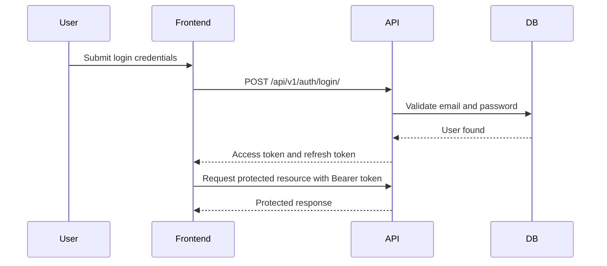

# DueNest API Specification

**Version:** v0.1  
**Status:** Planning  
**API Style:** REST  
**Backend Framework:** Django REST Framework  
**Authentication:** JWT-based authentication  
**Primary Client:** Next.js frontend  
**Base Path:** `/api/v1/`

---

## 1. API Specification Summary

This document defines the planned REST API for DueNest.

DueNest APIs will support:

- user authentication
- user profile management
- document vault operations
- renewal and subscription tracking
- reminders
- notifications
- dashboard summaries
- application document packs
- future AI document extraction

The API should be secure, predictable, versioned, well-documented, and designed around user-owned resources.

---

## 2. API Design Goals

| Goal | Description |
| --- | --- |
| Security-first | Every protected resource must be scoped to the authenticated user |
| Consistency | Endpoints, responses, errors, and pagination should follow predictable patterns |
| Versioning | APIs should use `/api/v1/` from the beginning |
| Maintainability | API endpoints should map cleanly to product modules |
| Frontend readiness | Responses should be easy for the Next.js frontend to consume |
| Extensibility | Future AI, sharing, workspace, and billing features should fit without redesign |
| Clear validation | Invalid input should return useful validation errors |
| Production awareness | API behavior should support testing, CI/CD, monitoring, and deployment |

---

## 3. API Base URL

### Local Development

```txt
http://localhost:8000/api/v1/
```

### Production

```txt
https://api.duenest.com/api/v1/
```

The production domain is a placeholder and may change.

---

## 4. API Versioning Strategy

All v0.1 endpoints should use:

```txt
/api/v1/
```

Example:

```txt
/api/v1/documents/
```

Versioning from the beginning prevents future breaking changes from affecting old clients.

Future versions may use:

```txt
/api/v2/
```

---

## 5. Content Types

### JSON Requests

Most endpoints should accept and return JSON:

```http
Content-Type: application/json
Accept: application/json
```

### File Upload Requests

Document upload endpoints should use multipart form data:

```http
Content-Type: multipart/form-data
```

---

## 6. Authentication Strategy

DueNest will use JWT-based authentication.

### Token Types

| Token | Purpose |
| --- | --- |
| Access token | Used for authenticated API requests |
| Refresh token | Used to obtain a new access token |

### Authorization Header

Protected endpoints require:

```http
Authorization: Bearer <access_token>
```

### Authentication Flow



---

## 7. Standard Response Format

### Success Response

For single-resource responses:

```json
{
  "data": {
    "id": "uuid",
    "title": "Passport"
  }
}
```

For list responses:

```json
{
  "count": 25,
  "next": "http://localhost:8000/api/v1/documents/?page=2",
  "previous": null,
  "results": []
}
```

### Error Response

All error responses should follow a consistent shape:

```json
{
  "error": {
    "code": "DOCUMENT_NOT_FOUND",
    "message": "The requested document was not found.",
    "details": {}
  }
}
```

### Validation Error Response

```json
{
  "error": {
    "code": "VALIDATION_ERROR",
    "message": "Invalid request data.",
    "details": {
      "title": ["This field is required."],
      "expiry_date": ["Date has wrong format. Use YYYY-MM-DD."]
    }
  }
}
```

---

## 8. HTTP Status Code Strategy

| Status Code | Meaning |
| --- | --- |
| `200 OK` | Request succeeded |
| `201 Created` | Resource created successfully |
| `204 No Content` | Resource deleted successfully |
| `400 Bad Request` | Invalid request data |
| `401 Unauthorized` | Missing or invalid authentication |
| `403 Forbidden` | Authenticated but not allowed |
| `404 Not Found` | Resource does not exist or does not belong to user |
| `409 Conflict` | Request conflicts with existing data |
| `413 Payload Too Large` | Uploaded file is too large |
| `415 Unsupported Media Type` | Uploaded file type is not supported |
| `429 Too Many Requests` | Rate limit exceeded |
| `500 Internal Server Error` | Unexpected server error |

Important security note:

> For user-owned resources, if a resource exists but belongs to another user, the API should usually return `404 Not Found`, not `403 Forbidden`, to avoid leaking resource existence.

---

## 9. Pagination Strategy

List endpoints should use pagination.

Example request:

```http
GET /api/v1/documents/?page=1&page_size=20
```

Example response:

```json
{
  "count": 42,
  "next": "http://localhost:8000/api/v1/documents/?page=2&page_size=20",
  "previous": null,
  "results": []
}
```

### Recommended Defaults

| Parameter | Default | Notes |
| --- | --- | --- |
| `page` | `1` | Current page |
| `page_size` | `20` | Default page size |
| `max_page_size` | `100` | Prevent excessive responses |

---

## 10. Filtering, Searching, and Sorting

APIs should support useful filtering from the beginning where needed.

### Common Query Parameters

| Parameter | Purpose |
| --- | --- |
| `search` | Search by title, provider, or name |
| `category` | Filter by category |
| `status` | Filter by status |
| `ordering` | Sort results |
| `created_after` | Filter by creation date |
| `created_before` | Filter by creation date |

### Example

```http
GET /api/v1/documents/?category=immigration&status=expiring_soon&ordering=expiry_date
```

---

## 11. Resource Ownership Rules

Every protected resource must be scoped to the authenticated user.

Unsafe example:

```python
Document.objects.get(id=document_id)
```

Safe example:

```python
Document.objects.get(id=document_id, user=request.user)
```

### Ownership Table

| Resource | Ownership Rule |
| --- | --- |
| Document | `document.user == request.user` |
| Renewal | `renewal.user == request.user` |
| Reminder | `reminder.user == request.user` |
| Notification | `notification.user == request.user` |
| ApplicationPack | `application_pack.user == request.user` |
| ApplicationPackDocument | pack and document must belong to same user |
| AIExtractionResult | linked document must belong to request user |

---

# 12. Authentication API

## 12.1 Register User

```http
POST /api/v1/auth/register/
```

### Request

```json
{
  "full_name": "Nouhan Doumbouya",
  "email": "nouhan@example.com",
  "password": "StrongPassword123!",
  "password_confirm": "StrongPassword123!"
}
```

### Response: `201 Created`

```json
{
  "data": {
    "id": "7b9c0c30-12e2-4f5a-a7ab-62e9f4fd7c11",
    "full_name": "Nouhan Doumbouya",
    "email": "nouhan@example.com",
    "date_joined": "2026-06-05T10:30:00Z"
  }
}
```

### Validation Rules

- Email must be unique.
- Password must meet minimum security requirements.
- `password` and `password_confirm` must match.

---

## 12.2 Login User

```http
POST /api/v1/auth/login/
```

### Request

```json
{
  "email": "nouhan@example.com",
  "password": "StrongPassword123!"
}
```

### Response: `200 OK`

```json
{
  "data": {
    "access": "access_token_here",
    "refresh": "refresh_token_here",
    "user": {
      "id": "7b9c0c30-12e2-4f5a-a7ab-62e9f4fd7c11",
      "full_name": "Nouhan Doumbouya",
      "email": "nouhan@example.com"
    }
  }
}
```

---

## 12.3 Refresh Token

```http
POST /api/v1/auth/refresh/
```

### Request

```json
{
  "refresh": "refresh_token_here"
}
```

### Response: `200 OK`

```json
{
  "data": {
    "access": "new_access_token_here"
  }
}
```

---

## 12.4 Logout User

```http
POST /api/v1/auth/logout/
```

### Authentication

Required.

### Request

```json
{
  "refresh": "refresh_token_here"
}
```

### Response: `204 No Content`

This endpoint may blacklist the refresh token if token blacklisting is enabled.

---

## 12.5 Google Sign-In

```http
POST /api/v1/auth/google/
```

Exchanges a Google ID token (obtained by the frontend via Google Sign-In) for
DueNest Simple JWT tokens. This sits alongside username/password login and does
not replace it.

The backend verifies the ID token against `GOOGLE_OAUTH_CLIENT_ID`, then either
finds the matching user (by Google id, then by email) or creates a new one, and
returns DueNest tokens.

### Request

```json
{
  "id_token": "GOOGLE_ID_TOKEN_HERE"
}
```

### Response: `200 OK`

```json
{
  "refresh": "refresh_token_here",
  "access": "access_token_here",
  "user": {
    "id": 1,
    "username": "example",
    "email": "example@gmail.com",
    "first_name": "Example",
    "last_name": "User"
  }
}
```

### Behavior & Errors

- A new local user is created on first Google sign-in (with an unusable password).
- If a password account already uses the token's email, that account is linked to the Google id.
- `400 Bad Request` if the token's email is not verified or the payload is incomplete.
- `401 Unauthorized` if the ID token is missing, invalid, or issued for another application.

---

# 13. User API

## 13.1 Get Current User

```http
GET /api/v1/users/me/
```

### Authentication

Required.

### Response: `200 OK`

```json
{
  "data": {
    "id": "7b9c0c30-12e2-4f5a-a7ab-62e9f4fd7c11",
    "full_name": "Nouhan Doumbouya",
    "email": "nouhan@example.com",
    "date_joined": "2026-06-05T10:30:00Z"
  }
}
```

---

## 13.2 Update Current User

```http
PATCH /api/v1/users/me/
```

### Authentication

Required.

### Request

```json
{
  "full_name": "Nouhan D."
}
```

### Response: `200 OK`

```json
{
  "data": {
    "id": "7b9c0c30-12e2-4f5a-a7ab-62e9f4fd7c11",
    "full_name": "Nouhan D.",
    "email": "nouhan@example.com",
    "updated_at": "2026-06-05T11:00:00Z"
  }
}
```

---

# 14. Dashboard API

## 14.1 Get Dashboard Summary

```http
GET /api/v1/dashboard/summary/
```

### Authentication

Required.

### Response: `200 OK`

```json
{
  "data": {
    "documents": {
      "total": 18,
      "valid": 12,
      "expiring_soon": 3,
      "expired": 1,
      "no_expiry": 2
    },
    "renewals": {
      "total": 7,
      "due_soon": 2,
      "active": 6,
      "cancelled": 1,
      "monthly_cost": "49.99",
      "yearly_cost": "599.88",
      "currency": "USD"
    },
    "reminders": {
      "upcoming": 5,
      "overdue": 1
    },
    "notifications": {
      "unread": 4
    },
    "application_packs": {
      "total": 3
    }
  }
}
```

---

## 14.2 Get Upcoming Deadlines

```http
GET /api/v1/dashboard/upcoming-deadlines/
```

### Authentication

Required.

### Optional Query Parameters

| Parameter | Description |
| --- | --- |
| `days` | Number of future days to include. Default: `30` |
| `type` | `document`, `renewal`, or `all` |

### Response: `200 OK`

```json
{
  "data": [
    {
      "id": "doc_uuid",
      "type": "document",
      "title": "Passport",
      "date": "2026-07-01",
      "status": "expiring_soon"
    },
    {
      "id": "renewal_uuid",
      "type": "renewal",
      "title": "Domain Renewal",
      "date": "2026-07-10",
      "status": "due_soon"
    }
  ]
}
```

---

# 15. Document API

## 15.1 List Documents

```http
GET /api/v1/documents/
```

### Authentication

Required.

### Query Parameters

| Parameter | Description |
| --- | --- |
| `search` | Search by title or file name |
| `category` | Filter by category |
| `document_type` | Filter by document type |
| `status` | Filter by status |
| `expires_before` | Filter documents expiring before date |
| `expires_after` | Filter documents expiring after date |
| `ordering` | Sort by `created_at`, `expiry_date`, `title` |

### Response: `200 OK`

```json
{
  "count": 2,
  "next": null,
  "previous": null,
  "results": [
    {
      "id": "document_uuid",
      "title": "Passport",
      "document_type": "passport",
      "category": "immigration",
      "file_name": "passport.pdf",
      "mime_type": "application/pdf",
      "file_size": 245000,
      "issue_date": "2023-09-14",
      "expiry_date": "2028-09-14",
      "status": "valid",
      "created_at": "2026-06-05T10:30:00Z",
      "updated_at": "2026-06-05T10:30:00Z"
    }
  ]
}
```

---

## 15.2 Create Document

```http
POST /api/v1/documents/
```

### Authentication

Required.

### Content Type

```http
multipart/form-data
```

### Request Fields

| Field | Type | Required |
| --- | --- | --- |
| `file` | File | Yes |
| `title` | String | Yes |
| `document_type` | String | Yes |
| `category` | String | Yes |
| `issue_date` | Date | No |
| `expiry_date` | Date | No |
| `notes` | String | No |

### Example Form Data

```txt
file=@passport.pdf
title=Passport
document_type=passport
category=immigration
issue_date=2023-09-14
expiry_date=2028-09-14
notes=Primary passport document
```

### Response: `201 Created`

```json
{
  "data": {
    "id": "document_uuid",
    "title": "Passport",
    "document_type": "passport",
    "category": "immigration",
    "file_name": "passport.pdf",
    "mime_type": "application/pdf",
    "file_size": 245000,
    "issue_date": "2023-09-14",
    "expiry_date": "2028-09-14",
    "status": "valid",
    "notes": "Primary passport document",
    "created_at": "2026-06-05T10:30:00Z",
    "updated_at": "2026-06-05T10:30:00Z"
  }
}
```

---

## 15.3 Retrieve Document

```http
GET /api/v1/documents/{document_id}/
```

### Authentication

Required.

### Response: `200 OK`

```json
{
  "data": {
    "id": "document_uuid",
    "title": "Passport",
    "document_type": "passport",
    "category": "immigration",
    "file_name": "passport.pdf",
    "mime_type": "application/pdf",
    "file_size": 245000,
    "issue_date": "2023-09-14",
    "expiry_date": "2028-09-14",
    "status": "valid",
    "notes": "Primary passport document",
    "created_at": "2026-06-05T10:30:00Z",
    "updated_at": "2026-06-05T10:30:00Z"
  }
}
```

---

## 15.4 Update Document

```http
PATCH /api/v1/documents/{document_id}/
```

### Authentication

Required.

### Request

```json
{
  "title": "Updated Passport",
  "expiry_date": "2028-10-01",
  "notes": "Updated after verification"
}
```

### Response: `200 OK`

```json
{
  "data": {
    "id": "document_uuid",
    "title": "Updated Passport",
    "expiry_date": "2028-10-01",
    "status": "valid",
    "notes": "Updated after verification",
    "updated_at": "2026-06-05T11:00:00Z"
  }
}
```

---

## 15.5 Delete Document

```http
DELETE /api/v1/documents/{document_id}/
```

### Authentication

Required.

### Response: `204 No Content`

Deleting a document should remove metadata and the associated file from storage.

---

## 15.6 Download Document

```http
GET /api/v1/documents/{document_id}/download/
```

### Authentication

Required.

### Response

Returns the file if the user owns the document.

Security rule:

> A user must never be able to download another user’s file.

---

# 16. Renewal API

## 16.1 List Renewals

```http
GET /api/v1/renewals/
```

### Authentication

Required.

### Query Parameters

| Parameter | Description |
| --- | --- |
| `search` | Search by title or provider |
| `category` | Filter by category |
| `status` | Filter by status |
| `due_before` | Filter renewals due before date |
| `due_after` | Filter renewals due after date |
| `ordering` | Sort by `renewal_date`, `amount`, `created_at` |

### Response: `200 OK`

```json
{
  "count": 1,
  "next": null,
  "previous": null,
  "results": [
    {
      "id": "renewal_uuid",
      "title": "GitHub Pro",
      "provider": "GitHub",
      "category": "software",
      "amount": "4.00",
      "currency": "USD",
      "renewal_date": "2026-07-01",
      "frequency": "monthly",
      "status": "active",
      "cancellation_url": "https://github.com/settings/billing",
      "created_at": "2026-06-05T10:30:00Z",
      "updated_at": "2026-06-05T10:30:00Z"
    }
  ]
}
```

---

## 16.2 Create Renewal

```http
POST /api/v1/renewals/
```

### Authentication

Required.

### Request

```json
{
  "title": "GitHub Pro",
  "provider": "GitHub",
  "category": "software",
  "amount": "4.00",
  "currency": "USD",
  "renewal_date": "2026-07-01",
  "frequency": "monthly",
  "cancellation_url": "https://github.com/settings/billing",
  "notes": "Developer subscription"
}
```

### Response: `201 Created`

```json
{
  "data": {
    "id": "renewal_uuid",
    "title": "GitHub Pro",
    "provider": "GitHub",
    "category": "software",
    "amount": "4.00",
    "currency": "USD",
    "renewal_date": "2026-07-01",
    "frequency": "monthly",
    "status": "active",
    "cancellation_url": "https://github.com/settings/billing",
    "notes": "Developer subscription",
    "created_at": "2026-06-05T10:30:00Z",
    "updated_at": "2026-06-05T10:30:00Z"
  }
}
```

---

## 16.3 Retrieve Renewal

```http
GET /api/v1/renewals/{renewal_id}/
```

### Authentication

Required.

---

## 16.4 Update Renewal

```http
PATCH /api/v1/renewals/{renewal_id}/
```

### Authentication

Required.

### Request

```json
{
  "renewal_date": "2026-08-01",
  "status": "active"
}
```

---

## 16.5 Delete Renewal

```http
DELETE /api/v1/renewals/{renewal_id}/
```

### Authentication

Required.

### Response: `204 No Content`

---

# 17. Reminder API

## 17.1 List Reminders

```http
GET /api/v1/reminders/
```

### Authentication

Required.

### Query Parameters

| Parameter | Description |
| --- | --- |
| `status` | Filter by pending, sent, failed, cancelled |
| `reminder_type` | Filter by type |
| `before` | Reminders before datetime |
| `after` | Reminders after datetime |

---

## 17.2 Create Reminder

```http
POST /api/v1/reminders/
```

### Authentication

Required.

### Request

```json
{
  "document": "document_uuid",
  "renewal": null,
  "reminder_type": "document_expiry",
  "remind_at": "2026-08-01T09:00:00Z"
}
```

### Response: `201 Created`

```json
{
  "data": {
    "id": "reminder_uuid",
    "document": "document_uuid",
    "renewal": null,
    "reminder_type": "document_expiry",
    "remind_at": "2026-08-01T09:00:00Z",
    "status": "pending",
    "sent_at": null,
    "created_at": "2026-06-05T10:30:00Z"
  }
}
```

### Validation Rule

A reminder must be linked to at least one target:

```txt
document OR renewal
```

---

## 17.3 Update Reminder

```http
PATCH /api/v1/reminders/{reminder_id}/
```

---

## 17.4 Delete Reminder

```http
DELETE /api/v1/reminders/{reminder_id}/
```

### Response: `204 No Content`

---

# 18. Notification API

## 18.1 List Notifications

```http
GET /api/v1/notifications/
```

### Authentication

Required.

### Query Parameters

| Parameter | Description |
| --- | --- |
| `is_read` | Filter read/unread notifications |
| `notification_type` | Filter by notification type |

---

## 18.2 Mark Notification as Read

```http
PATCH /api/v1/notifications/{notification_id}/read/
```

### Authentication

Required.

### Response: `200 OK`

```json
{
  "data": {
    "id": "notification_uuid",
    "is_read": true,
    "read_at": "2026-06-05T11:00:00Z"
  }
}
```

---

## 18.3 Mark All Notifications as Read

```http
POST /api/v1/notifications/mark-all-read/
```

### Authentication

Required.

### Response: `200 OK`

```json
{
  "data": {
    "updated_count": 5
  }
}
```

---

# 19. Application Pack API

## 19.1 List Application Packs

```http
GET /api/v1/application-packs/
```

### Authentication

Required.

---

## 19.2 Create Application Pack

```http
POST /api/v1/application-packs/
```

### Authentication

Required.

### Request

```json
{
  "name": "Scholarship Application Pack",
  "purpose": "scholarship",
  "description": "Documents commonly needed for scholarship applications."
}
```

### Response: `201 Created`

```json
{
  "data": {
    "id": "pack_uuid",
    "name": "Scholarship Application Pack",
    "purpose": "scholarship",
    "description": "Documents commonly needed for scholarship applications.",
    "documents": [],
    "created_at": "2026-06-05T10:30:00Z",
    "updated_at": "2026-06-05T10:30:00Z"
  }
}
```

---

## 19.3 Retrieve Application Pack

```http
GET /api/v1/application-packs/{pack_id}/
```

### Authentication

Required.

### Response: `200 OK`

```json
{
  "data": {
    "id": "pack_uuid",
    "name": "Scholarship Application Pack",
    "purpose": "scholarship",
    "description": "Documents commonly needed for scholarship applications.",
    "documents": [
      {
        "id": "document_uuid",
        "title": "Transcript",
        "document_type": "transcript",
        "category": "academic",
        "file_name": "transcript.pdf"
      }
    ],
    "created_at": "2026-06-05T10:30:00Z",
    "updated_at": "2026-06-05T10:30:00Z"
  }
}
```

---

## 19.4 Update Application Pack

```http
PATCH /api/v1/application-packs/{pack_id}/
```

---

## 19.5 Delete Application Pack

```http
DELETE /api/v1/application-packs/{pack_id}/
```

### Response: `204 No Content`

Deleting a pack should delete the pack and join records, but not the original documents.

---

## 19.6 Add Document to Pack

```http
POST /api/v1/application-packs/{pack_id}/documents/
```

### Authentication

Required.

### Request

```json
{
  "document_id": "document_uuid",
  "sort_order": 1
}
```

### Response: `201 Created`

```json
{
  "data": {
    "id": "pack_document_uuid",
    "pack": "pack_uuid",
    "document": "document_uuid",
    "sort_order": 1,
    "created_at": "2026-06-05T10:30:00Z"
  }
}
```

### Security Rule

The document must belong to the same authenticated user who owns the application pack.

---

## 19.7 Remove Document from Pack

```http
DELETE /api/v1/application-packs/{pack_id}/documents/{document_id}/
```

### Response: `204 No Content`

---

## 19.8 Export Application Pack

```http
GET /api/v1/application-packs/{pack_id}/export/
```

### Authentication

Required.

### Response

Returns a ZIP file containing selected documents.

Security rules:

- User must own the pack.
- User must own every document inside the pack.
- Temporary ZIP files should not be permanently stored.

---

# 20. Future AI Extraction API

AI extraction should not be implemented in v0.1, but the API direction is documented for future planning.

## 20.1 Start AI Extraction

```http
POST /api/v1/documents/{document_id}/ai-extractions/
```

### Authentication

Required.

### Response: `202 Accepted`

```json
{
  "data": {
    "id": "extraction_uuid",
    "document": "document_uuid",
    "status": "pending",
    "message": "AI extraction has been queued."
  }
}
```

---

## 20.2 Retrieve AI Extraction Result

```http
GET /api/v1/ai-extractions/{extraction_id}/
```

### Response: `200 OK`

```json
{
  "data": {
    "id": "extraction_uuid",
    "document": "document_uuid",
    "extraction_type": "full_extraction",
    "status": "completed",
    "confidence_score": "0.91",
    "user_confirmed": false,
    "extracted_data": {
      "document_type": "passport",
      "expiry_date": "2028-09-14",
      "recommended_action": "Set a renewal preparation reminder 6 months before expiry."
    }
  }
}
```

---

## 20.3 Confirm AI Extraction Result

```http
POST /api/v1/ai-extractions/{extraction_id}/confirm/
```

### Request

```json
{
  "confirmed_data": {
    "document_type": "passport",
    "expiry_date": "2028-09-14"
  }
}
```

### Response: `200 OK`

```json
{
  "data": {
    "id": "extraction_uuid",
    "status": "confirmed",
    "user_confirmed": true
  }
}
```

---

# 21. File Upload Rules

## Allowed File Types for v0.1

```txt
application/pdf
image/png
image/jpeg
image/webp
```

## Recommended File Size Limit

```txt
10 MB per file for v0.1
```

This can be increased later after storage and security controls are stronger.

## File Upload Security

The API should:

- validate MIME type
- validate file extension
- validate file size
- rename stored files safely
- avoid trusting original file names
- prevent public file URLs by default
- avoid logging file contents

---

# 22. Rate Limiting Strategy

Rate limiting should be considered for:

- login attempts
- registration attempts
- file uploads
- AI extraction requests later
- share link access later

Suggested early strategy:

| Endpoint Type | Suggested Limit |
| --- | --- |
| Login | Strict |
| Registration | Moderate |
| File uploads | Moderate |
| Normal authenticated API | Standard |
| AI extraction later | Strict |

---

# 23. API Security Checklist

Before v0.1 is considered complete:

- [ ] All protected endpoints require authentication.
- [ ] All user-owned data is filtered by `request.user`.
- [ ] Documents cannot be accessed by other users.
- [ ] Renewals cannot be accessed by other users.
- [ ] Application packs cannot include another user’s documents.
- [ ] File downloads verify ownership.
- [ ] File uploads validate type and size.
- [ ] Secrets are not hardcoded.
- [ ] Error messages do not expose sensitive information.
- [ ] Sensitive file contents are not logged.
- [ ] API responses are consistent.

---

# 24. API Acceptance Criteria for v0.1

The v0.1 API is acceptable when:

- users can register
- users can log in
- users can refresh access tokens
- users can retrieve their profile
- users can create documents
- users can list their documents
- users can update their documents
- users can delete their documents
- users can download only their own documents
- users can create renewals
- users can list their renewals
- users can update their renewals
- users can delete their renewals
- users can create reminders
- users can receive in-app notifications
- users can create application packs
- users can add documents to application packs
- users can export an application pack
- dashboard summary endpoint works
- ownership protection is enforced
- list endpoints are paginated
- validation errors are clear
- API behavior matches this specification

---

# 25. Summary

The DueNest API should be secure, consistent, and product-focused.

The first version should prioritize:

- authentication
- user-owned resources
- document vault APIs
- renewal APIs
- reminder APIs
- notification APIs
- application pack APIs
- dashboard summary APIs
- strong ownership checks
- predictable response formats

Advanced APIs such as AI extraction, secure sharing, team workspaces, and billing should be added only after the core MVP is working correctly.