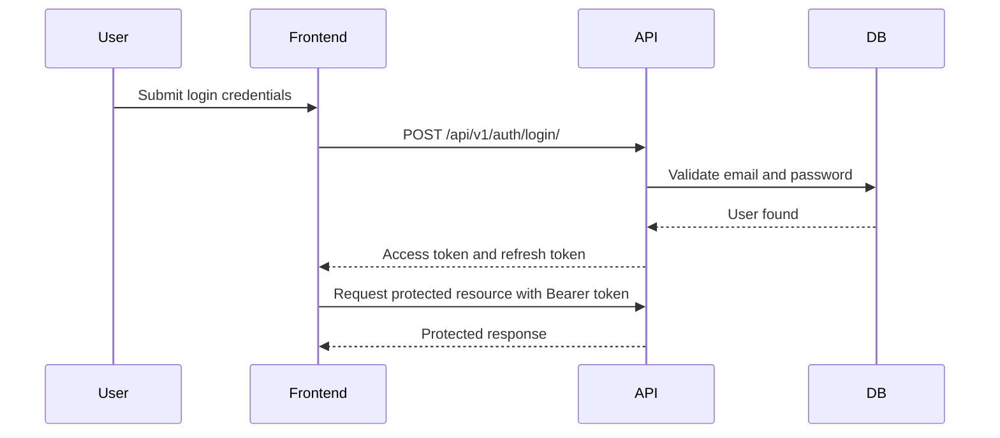

# DueNest API Specification

**Version:** v0.1  
**Status:** Planning  
**API Style:** REST  
**Backend Framework:** Django REST Framework  
**Authentication:** JWT-based authentication  
**Primary Client:** Next.js frontend  
**Base Path:** `/api/v1/`

---

## 1. API Specification Summary

This document defines the planned REST API for DueNest.

DueNest APIs will support:

- user authentication
- user profile management
- document vault operations
- renewal and subscription tracking
- reminders
- notifications
- dashboard summaries
- application document packs
- future AI document extraction

The API should be secure, predictable, versioned, well-documented, and designed around user-owned resources.

---

## 2. API Design Goals

| Goal | Description |
| --- | --- |
| Security-first | Every protected resource must be scoped to the authenticated user |
| Consistency | Endpoints, responses, errors, and pagination should follow predictable patterns |
| Versioning | APIs should use `/api/v1/` from the beginning |
| Maintainability | API endpoints should map cleanly to product modules |
| Frontend readiness | Responses should be easy for the Next.js frontend to consume |
| Extensibility | Future AI, sharing, workspace, and billing features should fit without redesign |
| Clear validation | Invalid input should return useful validation errors |
| Production awareness | API behavior should support testing, CI/CD, monitoring, and deployment |

---

## 3. API Base URL

### Local Development

```txt
http://localhost:8000/api/v1/
```

### Production

```txt
https://api.duenest.com/api/v1/
```

The production domain is a placeholder and may change.

---

## 4. API Versioning Strategy

All v0.1 endpoints should use:

```txt
/api/v1/
```

Example:

```txt
/api/v1/documents/
```

Versioning from the beginning prevents future breaking changes from affecting old clients.

Future versions may use:

```txt
/api/v2/
```

---

## 5. Content Types

### JSON Requests

Most endpoints should accept and return JSON:

```http
Content-Type: application/json
Accept: application/json
```

### File Upload Requests

Document upload endpoints should use multipart form data:

```http
Content-Type: multipart/form-data
```

---

## 6. Authentication Strategy

DueNest will use JWT-based authentication.

### Token Types

| Token | Purpose |
| --- | --- |
| Access token | Used for authenticated API requests |
| Refresh token | Used to obtain a new access token |

### Authorization Header

Protected endpoints require:

```http
Authorization: Bearer <access_token>
```

### Authentication Flow



---

## 7. Standard Response Format

### Success Response

For single-resource responses:

```json
{
  "data": {
    "id": "uuid",
    "title": "Passport"
  }
}
```

For list responses:

```json
{
  "count": 25,
  "next": "http://localhost:8000/api/v1/documents/?page=2",
  "previous": null,
  "results": []
}
```

### Error Response

All error responses should follow a consistent shape:

```json
{
  "error": {
    "code": "DOCUMENT_NOT_FOUND",
    "message": "The requested document was not found.",
    "details": {}
  }
}
```

### Validation Error Response

```json
{
  "error": {
    "code": "VALIDATION_ERROR",
    "message": "Invalid request data.",
    "details": {
      "title": ["This field is required."],
      "expiry_date": ["Date has wrong format. Use YYYY-MM-DD."]
    }
  }
}
```

---

## 8. HTTP Status Code Strategy

| Status Code | Meaning |
| --- | --- |
| `200 OK` | Request succeeded |
| `201 Created` | Resource created successfully |
| `204 No Content` | Resource deleted successfully |
| `400 Bad Request` | Invalid request data |
| `401 Unauthorized` | Missing or invalid authentication |
| `403 Forbidden` | Authenticated but not allowed |
| `404 Not Found` | Resource does not exist or does not belong to user |
| `409 Conflict` | Request conflicts with existing data |
| `413 Payload Too Large` | Uploaded file is too large |
| `415 Unsupported Media Type` | Uploaded file type is not supported |
| `429 Too Many Requests` | Rate limit exceeded |
| `500 Internal Server Error` | Unexpected server error |

Important security note:

> For user-owned resources, if a resource exists but belongs to another user, the API should usually return `404 Not Found`, not `403 Forbidden`, to avoid leaking resource existence.

Scoped rate limits apply to abuse-prone public endpoints. Current limits include
login/Google login (`10/min`), registration (`10/hour`), file-share/emergency
pack/secure-room/Quick Share access-code verification (`10/min`), Quick Share
"Receive code" lookups (`quick_share_receive`, `10/min`), feedback (`20/hour`),
waitlist (`5/hour`), and invite validation (`20/hour`). Exceeding a scope returns
`429 Too Many Requests`.

---

## 9. Pagination Strategy

List endpoints use page-number pagination (`apps.core.pagination.StandardResultsSetPagination`).
The default page size is `20`. Clients may request a smaller or larger page
with `?page_size=` (capped at `max_page_size = 100`); the paginated `count` is
always the full total regardless of page size, so count-only callers can pass
`page_size=1` to avoid serializing a full page. A few endpoints opt out of
pagination (`pagination_class = None`) because they return small, finite,
curated sets (e.g. feature-completion and launch-checklist items).

Example request:

```http
GET /api/v1/documents/?page=1&page_size=20
```

Example response:

```json
{
  "count": 42,
  "next": "http://localhost:8000/api/v1/documents/?page=2&page_size=20",
  "previous": null,
  "results": []
}
```

### Recommended Defaults

| Parameter | Default | Notes |
| --- | --- | --- |
| `page` | `1` | Current page |
| `page_size` | `20` | Default page size |
| `max_page_size` | `100` | Prevent excessive responses |

---

## 10. Filtering, Searching, and Sorting

APIs should support useful filtering from the beginning where needed.

### Common Query Parameters

| Parameter | Purpose |
| --- | --- |
| `search` | Search by title, provider, or name |
| `category` | Filter by category |
| `status` | Filter by status |
| `ordering` | Sort results |
| `created_after` | Filter by creation date |
| `created_before` | Filter by creation date |

### Example

```http
GET /api/v1/documents/?category=immigration&status=expiring_soon&ordering=expiry_date
```

---

## 11. Resource Ownership Rules

Every protected resource must be scoped to the authenticated user.

Unsafe example:

```python
Document.objects.get(id=document_id)
```

Safe example:

```python
Document.objects.get(id=document_id, user=request.user)
```

### Ownership Table

| Resource | Ownership Rule |
| --- | --- |
| Document | `document.user == request.user` |
| Renewal | `renewal.user == request.user` |
| Reminder | `reminder.user == request.user` |
| Notification | `notification.user == request.user` |
| ApplicationPack | `application_pack.user == request.user` |
| ApplicationPackDocument | pack and document must belong to same user |
| AIExtractionResult | linked document must belong to request user |

---

# 12. Authentication API

## 12.1 Register User

```http
POST /api/v1/auth/register/
```

### Request

```json
{
  "username": "nouhan",
  "email": "nouhan@example.com",
  "first_name": "Nouhan",
  "last_name": "Doumbouya",
  "password": "StrongPassword123!",
  "invite_code": "DN-ABCDE-12345"
}
```

### Response: `201 Created`

```json
{
  "id": 12,
  "username": "nouhan",
  "email": "nouhan@example.com",
  "first_name": "Nouhan",
  "last_name": "Doumbouya",
  "plan": "free"
}
```

### Validation Rules

- Username and email must be unique enough for Django user creation.
- Password must meet minimum security requirements.
- When `PRIVATE_BETA_ENABLED=true`, `invite_code` is required.
- Invite codes must be active, unexpired, and below their max-use limit.
- Existing users are not blocked from logging in when private beta mode is enabled.

---

## 12.2 Login User

```http
POST /api/v1/auth/login/
```

### Request

```json
{
  "email": "nouhan@example.com",
  "password": "StrongPassword123!"
}
```

### Response: `200 OK`

```json
{
  "data": {
    "access": "access_token_here",
    "refresh": "refresh_token_here",
    "user": {
      "id": "7b9c0c30-12e2-4f5a-a7ab-62e9f4fd7c11",
      "full_name": "Nouhan Doumbouya",
      "email": "nouhan@example.com"
    }
  }
}
```

---

## 12.3 Refresh Token

```http
POST /api/v1/auth/refresh/
```

### Request

```json
{
  "refresh": "refresh_token_here"
}
```

### Response: `200 OK`

```json
{
  "data": {
    "access": "new_access_token_here"
  }
}
```

---

## 12.4 Logout User

```http
POST /api/v1/auth/logout/
```

### Authentication

Required.

### Request

```json
{
  "refresh": "refresh_token_here"
}
```

### Response: `204 No Content`

This endpoint may blacklist the refresh token if token blacklisting is enabled.

---

## 12.5 Google Sign-In

```http
POST /api/v1/auth/google/
```

Exchanges a Google ID token (obtained by the frontend via Google Sign-In) for
DueNest Simple JWT tokens. This sits alongside username/password login and does
not replace it.

The backend verifies the ID token against `GOOGLE_OAUTH_CLIENT_ID`, then either
finds the matching user (by Google id, then by email) or creates a new one, and
returns DueNest tokens.

### Request

```json
{
  "id_token": "GOOGLE_ID_TOKEN_HERE"
}
```

### Response: `200 OK`

```json
{
  "refresh": "refresh_token_here",
  "access": "access_token_here",
  "user": {
    "id": 1,
    "username": "example",
    "email": "example@gmail.com",
    "first_name": "Example",
    "last_name": "User"
  }
}
```

### Behavior & Errors

- A new local user is created on first Google sign-in (with an unusable password).
- If a password account already uses the token's email, that account is linked to the Google id.
- `400 Bad Request` if the token's email is not verified or the payload is incomplete.
- `401 Unauthorized` if the ID token is missing, invalid, or issued for another application.

---

# 13. User API

## 13.1 Get Current User

```http
GET /api/v1/users/me/
```

### Authentication

Required.

### Response: `200 OK`

```json
{
  "data": {
    "id": "7b9c0c30-12e2-4f5a-a7ab-62e9f4fd7c11",
    "full_name": "Nouhan Doumbouya",
    "email": "nouhan@example.com",
    "plan": "free",
    "date_joined": "2026-06-05T10:30:00Z"
  }
}
```

The read-only `plan` field is `free` or `pro_placeholder` and drives the usage
limits described in section 13C.6.

---

## 13.2 Update Current User

```http
PATCH /api/v1/users/me/
```

### Authentication

Required.

### Request

```json
{
  "full_name": "Nouhan D."
}
```

### Response: `200 OK`

```json
{
  "data": {
    "id": "7b9c0c30-12e2-4f5a-a7ab-62e9f4fd7c11",
    "full_name": "Nouhan D.",
    "email": "nouhan@example.com",
    "updated_at": "2026-06-05T11:00:00Z"
  }
}
```

---

# 13.3 Onboarding, Trust, Demo, and Account Controls API (implemented)

These endpoints are user-owned support surfaces for the document module. They
do not expose another user's records and all protected routes require
`Authorization: Bearer <access_token>`.

## 13.3.1 Document onboarding state

`UserOnboardingState` is a one-to-one record for the authenticated user. It
stores durable setup timestamps and lightweight metadata used by the frontend
onboarding experience.

| Method | Path | Description |
| --- | --- | --- |
| `GET` | `/api/v1/onboarding/state/` | Retrieve or create the user's onboarding state |
| `PATCH` | `/api/v1/onboarding/state/` | Update allowed state fields (`has_completed_document_onboarding`, `metadata`) |
| `POST` | `/api/v1/onboarding/complete/` | Mark document onboarding complete |
| `POST` | `/api/v1/onboarding/dismiss/` | Dismiss onboarding from the dashboard |
| `POST` | `/api/v1/onboarding/attention-reviewed/` | Record that Attention Needed was reviewed |
| `POST` | `/api/v1/onboarding/trust-reviewed/` | Record that the Trust Center was reviewed |

Read-only progress fields include:

```txt
first_document_created_at
first_file_uploaded_at
first_expiry_date_added_at
first_reminder_created_at
first_share_link_created_at
first_checklist_created_at
checklist_completed_at
dismissed_onboarding_at
```

Document, file, expiry, reminder, checklist, share-link, and checklist-complete
events are marked from the real document workflows where practical. The state
endpoint also backfills progress from existing owner-scoped data.

## 13.3.2 Guided document setup checklist

```http
GET /api/v1/onboarding/document-setup-checklist/
```

Returns computed progress from real user data:

- create first document
- upload first file
- add expiry or renewal date
- review Attention Needed
- create reminder rule
- create renewal checklist
- try secure sharing
- review Trust Center

Response shape:

```json
{
  "is_complete": false,
  "percent": 50,
  "required_percent": 67,
  "counts": {
    "documents": 1,
    "files": 1,
    "attention_needed": 0,
    "reminders": 1,
    "checklists": 0,
    "share_links": 0
  },
  "steps": [
    {
      "key": "create_first_document",
      "title": "Create your first document",
      "completed": true,
      "status": "completed",
      "is_required": true,
      "href": "/dashboard/documents/new"
    }
  ]
}
```

Step statuses are `completed`, `current`, `pending`, or `optional`.

## 13.3.3 Demo document data

Demo data is always fake, owner-scoped, and labeled with `[Demo]` plus the
internal marker `DUENEST_DEMO_DATA`.

| Method | Path | Description |
| --- | --- | --- |
| `POST` | `/api/v1/demo/create-document-demo-data/` | Create sample passport, visa, insurance, bundle, checklist, reminder, file, and share-link data for the caller |
| `DELETE` | `/api/v1/demo/clear-document-demo-data/` | Remove only the caller's labeled demo document data |

The create endpoint clears existing demo data for that user first, making it
safe to run repeatedly.

## 13.3.4 Trust summary

```http
GET /api/v1/trust/security-summary/
```

Returns safe capability flags and beta limitations for the signed-in user. It
must not include secrets, raw credentials, access-code hashes, internal storage
paths, or environment values.

## 13.3.5 Account data controls

| Method | Path | Description |
| --- | --- | --- |
| `GET` | `/api/v1/account/data-summary/` | Owner-scoped counts for documents, files, shares, reminders, checklists, bundles, proof records, emergency packs, exports, and active deletion request status |
| `POST` | `/api/v1/account/request-data-export/` | Create a full-vault metadata export through the same export generator as `/document-exports/` |
| `POST` | `/api/v1/account/request-account-deletion/` | Create or return the user's active deletion request |
| `POST` | `/api/v1/account/cancel-account-deletion/` | Cancel a pending deletion request |

Account deletion is request-based. The API does **not** delete accounts
synchronously; a pending request can be cancelled while its status is
`requested`.

---

# 13.5 Documents API (implemented)

Manages user-owned document metadata and returns computed document intelligence
fields. File upload/preview/sharing is handled by nested file endpoints below.
Notification generation/delivery is handled by the separate notifications app
and management command. Every endpoint requires
authentication, and all access is scoped to the authenticated user: a document
that belongs to another user returns `404 Not Found`.

Base path:

```http
/api/v1/documents/
```

| Method   | Path                      | Description                          |
| -------- | ------------------------- | ------------------------------------ |
| `GET`    | `/api/v1/documents/`      | List the current user's documents    |
| `POST`   | `/api/v1/documents/`      | Create a document for the current user |
| `GET`    | `/api/v1/documents/:id/`  | Retrieve one of the user's documents |
| `PATCH`  | `/api/v1/documents/:id/`  | Update one of the user's documents   |
| `DELETE` | `/api/v1/documents/:id/`  | Move one of the user's documents to trash |
| `GET`    | `/api/v1/documents/attention-needed/` | Documents requiring action |
| `GET`    | `/api/v1/documents/trash/` | List trashed documents |
| `POST`   | `/api/v1/documents/:id/trash/` | Move a document to trash with optional reason |
| `POST`   | `/api/v1/documents/:id/restore/` | Restore a trashed document |
| `DELETE` | `/api/v1/documents/:id/permanent-delete/` | Permanently delete a trashed document |
| `GET`    | `/api/v1/document-categories/` | List system categories + the user's own private categories |
| `POST`   | `/api/v1/document-categories/` | Create a private category for the current user |
| `PATCH`/`DELETE` | `/api/v1/document-categories/:id/` | Rename/restyle or delete one of the user's **own** categories |

`document-categories` responses include `is_system` (true for the shared system
vocabulary, false for the user's own), plus optional `icon`/`color`. `POST`
accepts `{ "name", "description?", "icon?", "color?" }` and always assigns
`owner` to the requester; names must be unique within scope (system vs. the
user's own), returning `400` on a clash. The detail endpoint (`PATCH`/`DELETE`)
only operates on the user's **own** categories — system categories return `404`
there and are never editable. Deleting a category leaves its documents
(`category` FK is `SET_NULL`). The documents list accepts `?category=none`
(or `uncategorized`) to return documents with no category. The list never
exposes another user's categories.

Document responses include read-only, owner-scoped usage indicators:
`is_shared_externally` (an active external share exists), `in_bundle` (linked by
a bundle requirement), and `in_emergency` (included in an emergency access pack).
The documents list can filter on these: `?shared=true` and
`?in_bundle=true|false` (e.g. `in_bundle=false` for "not in a bundle").

Documents have a writable `is_pinned` flag (set via `PATCH /documents/:id/`);
pinned documents always sort first, and `?pinned=true` filters to them.

Trashed documents and files include `days_until_permanent_deletion` (null when
not trashed or auto-purge is disabled). The `purge_expired_trash` management
command permanently removes items older than `TRASH_RETENTION_DAYS` (default 30;
run it on a schedule).

### Authentication

Required (`Authorization: Bearer <access_token>`).

### Create Request

```json
{
  "title": "My Passport",
  "document_type": "passport",
  "category": 1,
  "issuer": "Immigration Department",
  "country": "Guinea",
  "reference_number": "X1234567",
  "issue_date": "2020-01-01",
  "expiry_date": "2030-01-01",
  "renewal_date": "2029-10-01",
  "notes": "Renew before travel.",
  "physical_location_label": "Home safe",
  "physical_location_details": "Folder A, top shelf",
  "original_available": "yes",
  "certified_copy_available": "unknown",
  "translation_available": "no",
  "notes_about_original": "Original should not leave the house.",
  "status": "active"
}
```

Only `title` is required. `owner` is **never** accepted from the client — it is
set from the authenticated user. `category` is optional and references a
`DocumentCategory` id.

### Response: `201 Created`

```json
{
  "id": 1,
  "owner": 7,
  "category": 1,
  "category_name": "Passport",
  "title": "My Passport",
  "document_type": "passport",
  "issuer": "Immigration Department",
  "country": "Guinea",
  "reference_number": "X1234567",
  "issue_date": "2020-01-01",
  "expiry_date": "2030-01-01",
  "renewal_date": "2029-10-01",
  "notes": "Renew before travel.",
  "physical_location_label": "Home safe",
  "physical_location_details": "Folder A, top shelf",
  "original_available": "yes",
  "certified_copy_available": "unknown",
  "translation_available": "no",
  "notes_about_original": "Original should not leave the house.",
  "status": "active",
  "is_trashed": false,
  "trashed_at": null,
  "computed_status": "active",
  "status_label": "Active",
  "status_reason": "This document looks up to date.",
  "urgency_level": "none",
  "days_until_expiry": 1297,
  "days_until_renewal": 1205,
  "is_expired": false,
  "is_expiring_soon": false,
  "is_renewal_due": false,
  "has_file": true,
  "missing_expiry_date": false,
  "missing_file": false,
  "needs_attention": false,
  "created_at": "2026-06-12T10:30:00Z",
  "updated_at": "2026-06-12T10:30:00Z"
}
```

### Status values

```txt
active | expired | renewal_due | archived
```

Manual `status` remains writable for compatibility and archiving. The backend
also returns read-only intelligence fields without overwriting user-entered
status unless the user updates it.

### Computed status values

```txt
active | expiring_soon | renewal_due | expired | missing_file |
missing_expiry_date | archived
```

`needs_attention` is returned as a boolean so the API can preserve the most
specific `computed_status` while still supporting a focused attention inbox.

### Computed document health fields

| Field | Type | Notes |
| --- | --- | --- |
| `computed_status` | string | Derived from manual archive state, expiry date, renewal date, and file presence |
| `status_label` | string | Human-readable label for `computed_status` |
| `status_reason` | string | Short user-facing explanation |
| `urgency_level` | string | `none`, `low`, `medium`, `high`, or `critical` |
| `days_until_expiry` | integer/null | Negative when expired |
| `days_until_renewal` | integer/null | Negative when renewal date is in the past |
| `is_expired` | boolean | `expiry_date < today` |
| `is_expiring_soon` | boolean | Expiry is within 90 days and not expired |
| `is_renewal_due` | boolean | Renewal date is today/past and the document is not expired |
| `has_file` | boolean | At least one attached file exists |
| `missing_expiry_date` | boolean | No expiry date is present |
| `missing_file` | boolean | No attached files exist |
| `needs_attention` | boolean | Expired, renewal due, expiring soon, missing file, or missing expiry date |

Archived documents keep `computed_status = "archived"` and do not appear in
Attention Needed results.

Active document list responses exclude trashed documents. Trashed documents
remain owner-owned and recoverable through `/api/v1/documents/trash/` until the
owner calls `permanent-delete`.

### List search, filters, and ordering

`GET /api/v1/documents/` accepts:

| Parameter | Description |
| --- | --- |
| `search` | Searches `title`, `document_type`, `issuer`, `country`, `reference_number`, and `notes` |
| `status` | Manual stored status: `active`, `expired`, `renewal_due`, `archived` |
| `computed_status` | Computed status value such as `expiring_soon`, `expired`, `missing_file`, `missing_expiry_date`, `archived` |
| `category` | Category id or category slug |
| `document_type` | Case-insensitive partial match |
| `country` | Case-insensitive partial match |
| `issuer` | Case-insensitive partial match |
| `has_file` | Boolean (`true`, `false`, `1`, `0`, `yes`, `no`) |
| `missing_file` | Boolean |
| `missing_expiry_date` | Boolean |
| `needs_attention` | Boolean |
| `expiry_from` | `YYYY-MM-DD`, filters `expiry_date >= value` |
| `expiry_to` | `YYYY-MM-DD`, filters `expiry_date <= value` |
| `expiring_within_days` | Integer; includes non-expired documents expiring within that many days |
| `ordering` | One of `expiry_date`, `-expiry_date`, `created_at`, `-created_at`, `updated_at`, `-updated_at`, `title`, `-title` |

Invalid `ordering` values fall back to `-created_at`. Invalid dates and invalid
`expiring_within_days` values are ignored. All search and filter results remain
scoped to `request.user`.

### Attention Needed

```http
GET /api/v1/documents/attention-needed/
```

Returns the authenticated user's non-archived documents where
`needs_attention = true`, sorted by urgency and relevant dates.

```json
{
  "count": 1,
  "items": [
    {
      "id": 1,
      "title": "Passport",
      "computed_status": "expiring_soon",
      "urgency_level": "medium",
      "status_reason": "Expires in 58 days.",
      "expiry_date": "2026-08-10",
      "days_until_expiry": 58,
      "needs_attention": true
    }
  ]
}
```

Items use the same document serializer shape as `GET /api/v1/documents/`.
Attention Needed never exposes another user's documents and does not include
public/shared-link documents.

### Validation rules

- `title` is required.
- `expiry_date` cannot be earlier than `issue_date` (when both are set).
- `renewal_date` cannot be later than `expiry_date` (when both are set).
- `owner`, `id`, `is_trashed`, `trashed_at`, computed health fields,
  `created_at`, and `updated_at` are read-only.

List responses are paginated using the standard pagination envelope
(`count`, `next`, `previous`, `results`).

---

# 13.6 Document Files API (implemented)

Files attached to a document. Nested under the parent document and scoped to
its owner: a user can only reach files for documents they own. All endpoints
require authentication.

| Method   | Path                                                | Description                       |
| -------- | --------------------------------------------------- | --------------------------------- |
| `GET`    | `/api/v1/documents/:id/files/`                      | List files for the document       |
| `POST`   | `/api/v1/documents/:id/files/`                      | Upload a file (multipart)         |
| `GET`    | `/api/v1/documents/:id/files/:file_id/`             | Retrieve file metadata            |
| `DELETE` | `/api/v1/documents/:id/files/:file_id/`             | Move the file to trash            |
| `GET`    | `/api/v1/documents/:id/files/:file_id/download/`    | Controlled download (owner only)  |
| `GET`    | `/api/v1/documents/:id/files/:file_id/preview/`     | Inline preview for PDF/JPEG/PNG   |
| `GET`    | `/api/v1/documents/:id/files/trash/`                | List trashed files for a document |
| `POST`   | `/api/v1/documents/:id/files/:file_id/trash/`       | Move a file to trash              |
| `POST`   | `/api/v1/documents/:id/files/:file_id/restore/`     | Restore a trashed file            |
| `DELETE` | `/api/v1/documents/:id/files/:file_id/permanent-delete/` | Permanently delete a trashed file |
| `POST`   | `/api/v1/documents/:id/files/:file_id/versions/`    | Upload a replacement file and record a version |

### File Inbox API

Standalone files can be uploaded before the user chooses or creates the right
document. Inbox files are scoped by `uploaded_by=request.user`; once attached,
they behave like document files.

| Method   | Path                                      | Description |
| -------- | ----------------------------------------- | ----------- |
| `GET`    | `/api/v1/files/`                          | List active standalone inbox files |
| `POST`   | `/api/v1/files/`                          | Upload a standalone file (multipart) |
| `GET`    | `/api/v1/files/:file_id/`                 | Retrieve inbox file metadata |
| `DELETE` | `/api/v1/files/:file_id/`                 | Move inbox file to trash |
| `GET`    | `/api/v1/files/:file_id/download/`        | Controlled owner-only download |
| `GET`    | `/api/v1/files/:file_id/preview/`         | Owner-only inline preview for PDF/JPEG/PNG |
| `GET`    | `/api/v1/files/trash/`                    | List trashed standalone files |
| `POST`   | `/api/v1/files/:file_id/restore/`         | Restore a trashed standalone file |
| `DELETE` | `/api/v1/files/:file_id/permanent-delete/` | Permanently delete a trashed standalone file |
| `POST`   | `/api/v1/files/:file_id/attach-document/` | Attach inbox file to an existing owned document |
| `POST`   | `/api/v1/files/:file_id/create-document/` | Create a new document from the inbox file |
| `GET`    | `/api/v1/files/check-duplicate/?filename=` | Whether the user already has a non-trashed file with this name (owner-scoped), to warn before duplicate uploads |

`create-document/` accepts optional `title`, `document_type`, `notes`,
`expiry_date`, `issue_date`, `category` (a system or the caller's own category
id — others are ignored), `country`, and `reference_number`, so metadata can be
captured during the post-upload flow.

### Upload Request

`multipart/form-data` with a single `file` field:

```http
POST /api/v1/documents/12/files/
Content-Type: multipart/form-data

file: <binary>
```

### Response: `201 Created`

```json
{
  "id": 1,
  "document": 12,
  "document_title": "Passport",
  "assignment_status": "attached",
  "uploaded_by": 7,
  "original_filename": "passport.pdf",
  "content_type": "application/pdf",
  "file_size": 184213,
  "checksum": "9f86d0818988…",
  "download_url": "http://localhost:8000/api/v1/documents/12/files/1/download/",
  "preview_url": "http://localhost:8000/api/v1/documents/12/files/1/preview/",
  "is_previewable": true,
  "is_trashed": false,
  "trashed_at": null,
  "created_at": "2026-06-12T10:30:00Z",
  "updated_at": "2026-06-12T10:30:00Z"
}
```

### Validation rules

- Max size **10 MB**.
- Allowed types: PDF, JPEG, PNG, DOC, DOCX (checked by extension **and** the
  client-reported content type).
- Previewable types: PDF, JPEG, PNG only. DOC/DOCX remain download-only.
- The parent document must belong to the authenticated user (otherwise `404`).
- For File Inbox uploads, `document` is `null`, `assignment_status` is
  `inbox`, and `download_url`/`preview_url` point to `/api/v1/files/...`.

### Security notes

- `uploaded_by` is set from the request user, never the client.
- The internal storage path is **never** exposed; clients use `download_url`,
  which is itself authenticated and ownership-checked.
- `preview_url` is authenticated and ownership-checked exactly like download.
- Accessing another user's file (list, retrieve, download, delete) returns
  `404 Not Found`.
- Active file lists, preview, download, share-link creation, and bundle-linking
  exclude trashed files. Existing public share links to a trashed file or
  trashed parent document return `410 Gone`.
- Permanent file deletion is guarded: the file must already be in trash.
- Standalone inbox files use the same validation, plan-limit counting, storage
  privacy, owner-only preview/download, trash, restore, and permanent-delete
  rules as document-attached files.

---

# 13.7 Secure File Sharing and Activity API (implemented)

Share links grant controlled access to **one specific document file**, not the
owner's full vault. Owner management endpoints require authentication and verify
that the parent document belongs to `request.user`.

## Owner share-link endpoints

| Method   | Path                                                                           | Description                  |
| -------- | ------------------------------------------------------------------------------ | ---------------------------- |
| `GET`    | `/api/v1/documents/:id/files/:file_id/share-links/`                            | List share links for a file  |
| `POST`   | `/api/v1/documents/:id/files/:file_id/share-links/`                            | Create a file share link     |
| `GET`    | `/api/v1/documents/:id/files/:file_id/share-links/:share_id/`                  | Retrieve one share link      |
| `POST`   | `/api/v1/documents/:id/files/:file_id/share-links/:share_id/revoke/`           | Revoke a link immediately    |
| `DELETE` | `/api/v1/documents/:id/files/:file_id/share-links/:share_id/`                  | Delete a share link record   |
| `GET`    | `/api/v1/documents/:id/files/:file_id/activity/`                               | Owner-only file activity log |

### Create share link request

```json
{
  "permission": "view_only",
  "expires_at": "2026-06-20T10:30:00Z",
  "access_code_required": true,
  "access_code": "482913",
  "label": "University visa office",
  "recipient_email": "visaoffice@example.edu",
  "purpose": "Student pass renewal submission"
}
```

`permission` is either `view_only` or `download_allowed`. If
`access_code_required` is true and no code is provided, the backend generates a
6-digit code and returns it only in the initial creation response. Access codes
are stored hashed, never in plain text.

### Owner response fields

```json
{
  "id": 24,
  "token": "unguessable-token",
  "permission": "view_only",
  "download_allowed": false,
  "status": "active",
  "expires_at": "2026-06-20T10:30:00Z",
  "revoked_at": null,
  "access_code_required": true,
  "label": "University visa office",
  "recipient_email": "visaoffice@example.edu",
  "purpose": "Student pass renewal submission",
  "created_at": "2026-06-12T10:30:00Z",
  "last_accessed_at": null,
  "access_code": "482913"
}
```

Owner-facing labels, recipient email, and purpose notes are not exposed through
public share endpoints.

## Public share endpoints

| Method | Path                                      | Description                             |
| ------ | ----------------------------------------- | --------------------------------------- |
| `GET`  | `/api/v1/share/files/:token/`             | Safe shared-file metadata               |
| `POST` | `/api/v1/share/files/:token/verify-code/` | Verify an access-code protected link    |
| `GET`  | `/api/v1/share/files/:token/preview/`     | Public inline preview for PDF/JPEG/PNG  |
| `GET`  | `/api/v1/share/files/:token/download/`    | Public download when permission allows  |

Access-code protected metadata, preview, and download requests must include:

```http
X-Access-Code: 482913
```

Public metadata returns only safe fields:

```json
{
  "file_name": "passport.pdf",
  "content_type": "application/pdf",
  "file_size": 184213,
  "permission": "view_only",
  "expires_at": "2026-06-20T10:30:00Z",
  "is_previewable": true,
  "download_allowed": false,
  "access_code_required": true
}
```

Invalid links return `404`. Expired, revoked, trashed-file, and trashed-document
links return `410`. View-only links can preview supported files but cannot
download. Correct access codes do not bypass expiry, revocation, trash state, or
permission checks.

## Activity log

`GET /api/v1/documents/:id/files/:file_id/activity/` returns owner-only entries
for upload, preview, download, share creation, public opens, shared preview,
shared download, revocation, and access-code verification/failure. Public share
viewers cannot access this log.

---

# 13.8 Document Reminder Rules API (implemented)

Reminder rules let users define when DueNest should remind them before a
document expires or reaches its renewal date. The document reminder API still
returns calculated upcoming rule dates synchronously. Actual in-app/email
delivery is handled separately by the notification worker command documented in
`docs/NOTIFICATIONS.md` and `docs/EMAIL_REMINDERS.md`.

All endpoints require authentication. Rules are resolved through an
owner-owned parent document, so another user's document or rule returns
`404 Not Found`.

| Method | Path | Description |
| --- | --- | --- |
| `GET` | `/api/v1/documents/:document_id/reminder-rules/` | List reminder rules for a document |
| `POST` | `/api/v1/documents/:document_id/reminder-rules/` | Create a reminder rule |
| `GET` | `/api/v1/documents/:document_id/reminder-rules/:rule_id/` | Retrieve one rule |
| `PATCH` | `/api/v1/documents/:document_id/reminder-rules/:rule_id/` | Update one rule |
| `DELETE` | `/api/v1/documents/:document_id/reminder-rules/:rule_id/` | Delete one rule |
| `GET` | `/api/v1/documents/reminders/upcoming/` | List enabled future calculated reminders |

### Trigger types

```txt
before_expiry
before_renewal_date
on_expiry
```

### Create request

```json
{
  "trigger_type": "before_expiry",
  "days_before": 30,
  "is_enabled": true
}
```

`on_expiry` always uses `days_before = 0`. `days_before` cannot be negative.

### Response

```json
{
  "id": 4,
  "owner": 7,
  "document": 12,
  "trigger_type": "before_expiry",
  "days_before": 30,
  "is_enabled": true,
  "upcoming_reminder_date": "2026-07-11",
  "date_source": "expiry_date",
  "created_at": "2026-06-13T00:13:00Z",
  "updated_at": "2026-06-13T00:13:00Z"
}
```

### Validation rules

- `before_expiry` and `on_expiry` require the document to have `expiry_date`.
- `before_renewal_date` requires the document to have `renewal_date`.
- Users cannot create or manage rules for another user's document.
- `owner` and `document` are read-only and set from the authenticated request
  plus URL-scoped parent document.

### Upcoming reminders

```http
GET /api/v1/documents/reminders/upcoming/
```

Returns enabled rules for the authenticated user whose calculated reminder date
is today or in the future, sorted by reminder date and document title.

```json
{
  "count": 1,
  "items": [
    {
      "id": 4,
      "document": 12,
      "trigger_type": "before_expiry",
      "days_before": 30,
      "is_enabled": true,
      "upcoming_reminder_date": "2026-07-11",
      "date_source": "expiry_date"
    }
  ]
}
```

---

# 13B. Document Renewal Workspace API (implemented)

The Renewal Workspace moves DueNest from *"something is expiring"* to *"here is
what you need to prepare."* It adds preparation checklists, application/renewal
bundles, an aggregated timeline, and an OCR-assisted extraction foundation.

All endpoints require authentication. Every resource is strictly owner-scoped:
a user can only ever see or change their own checklists, bundles, requirements,
and extractions. Cross-user access returns `404 Not Found` (the resource is
simply not in the caller's queryset), never `403`.

## 13B.1 Checklist templates (shared, read-only)

System templates are seeded with the `seed_checklist_templates` management
command and are shared across all users. They are read-only through the API.

| Method | Path | Description |
| --- | --- | --- |
| `GET` | `/api/v1/documents/checklist-templates/` | List active checklist templates |
| `GET` | `/api/v1/documents/checklist-templates/:id/` | Retrieve one template + its items |

Seeded templates: passport renewal, visa renewal, student pass renewal,
insurance renewal, scholarship application, travel document readiness.

## 13B.2 User checklists (nested under a document)

| Method | Path | Description |
| --- | --- | --- |
| `GET` | `/api/v1/documents/:document_id/checklists/` | List a document's checklists |
| `POST` | `/api/v1/documents/:document_id/checklists/` | Create a blank checklist |
| `POST` | `/api/v1/documents/:document_id/checklists/from-template/` | Create a checklist + items from a template |
| `GET` | `/api/v1/documents/:document_id/checklists/:checklist_id/` | Retrieve one checklist |
| `PATCH` | `/api/v1/documents/:document_id/checklists/:checklist_id/` | Update a checklist |
| `DELETE` | `/api/v1/documents/:document_id/checklists/:checklist_id/` | Delete a checklist |
| `POST` | `/api/v1/documents/:document_id/checklists/:checklist_id/items/` | Add an item |
| `PATCH` | `/api/v1/documents/:document_id/checklists/:checklist_id/items/:item_id/` | Update an item |
| `DELETE` | `/api/v1/documents/:document_id/checklists/:checklist_id/items/:item_id/` | Delete an item |

- Checklist `progress_percent` and `status` are recalculated from the items
  whenever an item is created, updated, or deleted. Completed and skipped items
  both count as resolved; a checklist is `completed` only when every item is
  resolved.
- `from-template` request body: `{ "template": <id>, "title?": str,
  "due_date?": date, "bundle?": <id> }`. When a `due_date` is supplied, item
  `suggested_due_offset_days` is used to compute each item's `due_date`.
- A checklist item may link an owner-owned `linked_document` / `linked_file`;
  linking another user's resource returns `400`.

Checklist response includes a derived `progress` object:

```json
{
  "id": 5,
  "owner": 7,
  "document": 12,
  "title": "Passport renewal checklist",
  "status": "in_progress",
  "progress_percent": 50,
  "progress": {
    "percent": 50,
    "status": "in_progress",
    "total_items": 6,
    "completed_items": 3,
    "required_incomplete": 2
  },
  "items": [ /* DocumentChecklistItem objects */ ]
}
```

## 13B.3 Application / renewal bundles (top-level)

| Method | Path | Description |
| --- | --- | --- |
| `GET` | `/api/v1/document-bundles/` | List the user's bundles |
| `POST` | `/api/v1/document-bundles/` | Create a bundle |
| `GET` | `/api/v1/document-bundles/:bundle_id/` | Retrieve a bundle + requirements + readiness |
| `PATCH` | `/api/v1/document-bundles/:bundle_id/` | Update a bundle |
| `DELETE` | `/api/v1/document-bundles/:bundle_id/` | Delete a bundle |
| `GET` | `/api/v1/document-bundles/:bundle_id/readiness/` | Fresh readiness breakdown |
| `POST` | `/api/v1/document-bundles/:bundle_id/requirements/` | Add a requirement |
| `PATCH` | `/api/v1/document-bundles/:bundle_id/requirements/:requirement_id/` | Update a requirement |
| `DELETE` | `/api/v1/document-bundles/:bundle_id/requirements/:requirement_id/` | Delete a requirement |
| `POST` | `/api/v1/document-bundles/:bundle_id/requirements/:requirement_id/link-document/` | Link an owner-owned document |
| `POST` | `/api/v1/document-bundles/:bundle_id/requirements/:requirement_id/link-file/` | Link an owner-owned file |

- **Readiness** (`readiness_score`, 0–100) is derived from required, non-skipped
  requirements: a bundle is "ready" only when every required requirement is
  `attached` or `completed`. Missing required requirements reduce the score
  proportionally. When there are no required requirements, readiness falls back
  to optional ones. The score is recalculated whenever a requirement changes.
- `link-document` / `link-file` accept `{ "document": <id> }` / `{ "file": <id> }`,
  verify ownership (`404` otherwise), set the link, and flip a `missing`
  requirement to `attached`.
- Requirement `status`: `missing`, `attached`, `completed`, `skipped`.

Bundle response includes a `readiness` object:

```json
{
  "id": 3,
  "title": "UK visa renewal 2026",
  "bundle_type": "renewal",
  "status": "in_progress",
  "readiness_score": 50,
  "missing_required_count": 1,
  "readiness": {
    "score": 50,
    "is_ready": false,
    "required_total": 2,
    "required_satisfied": 1,
    "required_missing": 1,
    "missing_required_titles": ["Passport photo"]
  },
  "requirements": [ /* DocumentBundleRequirement objects */ ]
}
```

## 13B.4 Timeline

```http
GET /api/v1/documents/timeline/
```

Aggregates the authenticated user's upcoming dates into one ordered feed. Only
the caller's own events are ever returned.

Query parameters (all optional): `start_date`, `end_date`, `event_type`,
`document_id`, `bundle_id`.

Event types: `document_expiry`, `document_renewal`, `reminder`,
`checklist_item_due`, `bundle_target_date`, `bundle_requirement_due`.

```json
{
  "count": 2,
  "items": [
    {
      "id": "document_expiry:12",
      "event_type": "document_expiry",
      "title": "Passport expires",
      "description": "Passport expires on this date.",
      "date": "2026-07-01",
      "urgency_level": "high",
      "related_document": 12,
      "related_bundle": null,
      "related_checklist": null,
      "metadata": { "document_type": "passport" }
    }
  ]
}
```

`urgency_level` is derived from how soon the date is: overdue → `critical`,
≤7 days → `high`, ≤30 days → `medium`, else `low`.

## 13B.5 OCR-assisted extraction foundation (nested under a file)

| Method | Path | Description |
| --- | --- | --- |
| `GET` | `/api/v1/documents/:document_id/files/:file_id/extractions/` | List a file's extractions |
| `POST` | `/api/v1/documents/:document_id/files/:file_id/extractions/` | Run a new extraction attempt |
| `GET` | `/api/v1/documents/:document_id/files/:file_id/extractions/:extraction_id/` | Retrieve one extraction |
| `PATCH` | `/api/v1/documents/:document_id/files/:file_id/extractions/:extraction_id/` | Stage reviewed fields |
| `POST` | `/api/v1/documents/:document_id/files/:file_id/extractions/:extraction_id/apply/` | Apply chosen reviewed fields to the document |

This is a safe, **local** extraction pipeline — not an automatic AI service:

- Extraction uses a pluggable provider abstraction with two real providers:
  - `local_text` — reads a PDF **text layer** with `pypdf` (fast, exact).
  - `local_ocr` — runs **Tesseract OCR** (`pytesseract`) on images, and on
    scanned PDFs with no text layer (rasterized locally via `pdf2image` +
    poppler). OCR only runs when the `tesseract` binary is installed; otherwise
    the result degrades gracefully to `needs_review`.
- **Files are never sent to a third-party OCR service** — all processing is on
  the server, on local storage.
- The provider parses labelled values where it can (e.g. `Date of expiry: …`,
  `Passport No: …`), normalizes dates to ISO `YYYY-MM-DD` (day-first for
  ambiguous numeric dates), and reports a `confidence_score`.
- Extracted values are always *suggestions*. The owner reviews/edits them
  (`PATCH extracted_fields`), then explicitly applies a chosen subset
  (`POST .../apply/` with `{ "fields": ["issuer", ...] }`). A document field is
  never overwritten automatically.
- Only these fields may be staged/applied: `title`, `document_type`, `issuer`,
  `country`, `reference_number`, `issue_date`, `expiry_date`, `renewal_date`.
- `raw_text` is owner-only and is **never** returned by the API; responses
  expose only a `has_raw_text` boolean.

**Dependencies.** PDF text extraction works out of the box (`pypdf`). Image /
scanned-PDF OCR additionally requires the system `tesseract` binary (and
`poppler` for scanned PDFs); without it, image extraction returns
`needs_review`. See the project `README.md` ("Optional: document OCR") for
install notes.

```json
{
  "id": 9,
  "owner": 7,
  "document": 12,
  "file": 4,
  "extraction_status": "needs_review",
  "extracted_fields": { "issuer": "HM Passport Office" },
  "confidence_score": 0.4,
  "provider": "local_text",
  "has_raw_text": true,
  "reviewed_at": null,
  "applied_at": null
}
```

---

# 13C. Document Vault Maturity API (implemented)

These endpoints add recoverable deletion, version history, structured exports,
emergency access packs, proof records, and a document-wide activity timeline.
All owner endpoints require authentication and follow the same owner-scoped
`404` behavior as the rest of the document vault.

## 13C.1 Version history

Versions are metadata snapshots for a document. They do **not** duplicate file
blobs or expose internal file paths.

| Method | Path | Description |
| --- | --- | --- |
| `GET` | `/api/v1/documents/:document_id/versions/` | List version snapshots |
| `GET` | `/api/v1/documents/:document_id/versions/:version_id/` | Retrieve one version |
| `POST` | `/api/v1/documents/:document_id/versions/:version_id/restore-metadata/` | Restore metadata from a version |

Versions are recorded when a document is created, important metadata changes,
a file is uploaded/replaced, extraction suggestions are applied, or metadata is
restored from a version. Restoring metadata creates a new version so the action
is itself reversible.

## 13C.2 Exports

Exports are generated synchronously for structured metadata only. They never
include raw uploaded files, raw OCR text, share tokens, access-code hashes, or
internal storage paths.

| Method | Path | Description |
| --- | --- | --- |
| `GET` | `/api/v1/document-exports/` | List the user's export requests |
| `POST` | `/api/v1/document-exports/` | Generate a metadata export |
| `GET` | `/api/v1/document-exports/:export_id/` | Retrieve export metadata |
| `GET` | `/api/v1/document-exports/:export_id/download/` | Download a completed, unexpired export |

Supported `export_type` values:

```txt
documents_json | documents_csv | full_vault_metadata
```

`future_full_archive` is intentionally rejected until full file archives are
implemented safely. Generated files expire after 7 days.

`POST /api/v1/account/request-data-export/` uses the same generator with
`full_vault_metadata` and returns the same export serializer shape.

Bundle exports are generated from the bundle endpoint so the scope is explicit.
They include bundle metadata, readiness, requirements, linked document/file
summaries, checklist progress, and proof-record summaries. They do not include
raw uploaded files, raw OCR text, share tokens, access-code hashes, access
codes, or internal storage paths.

| Method | Path | Description |
| --- | --- | --- |
| `GET` | `/api/v1/document-bundles/:bundle_id/exports/` | List export requests for one owner-owned bundle |
| `POST` | `/api/v1/document-bundles/:bundle_id/exports/` | Generate a bundle metadata export |
| `GET` | `/api/v1/document-bundles/:bundle_id/exports/:export_id/` | Retrieve bundle export metadata |
| `GET` | `/api/v1/document-bundles/:bundle_id/exports/:export_id/download/` | Download a completed, unexpired bundle export |

Supported bundle `export_type` values:

```txt
bundle_metadata_json | bundle_requirements_csv
```

Bundle export types are rejected by `/api/v1/document-exports/`; vault-wide
export types are rejected by the bundle export endpoint.

## 13C.3 Emergency access packs

Emergency packs are owner-selected document/file collections. A pack never
grants access to the whole vault, and public responses expose only safe item
metadata plus preview/download routes for selected files.

| Method | Path | Description |
| --- | --- | --- |
| `GET` | `/api/v1/emergency-packs/` | List the user's packs |
| `POST` | `/api/v1/emergency-packs/` | Create a pack |
| `GET` | `/api/v1/emergency-packs/:pack_id/` | Retrieve a pack |
| `PATCH` | `/api/v1/emergency-packs/:pack_id/` | Update a pack |
| `DELETE` | `/api/v1/emergency-packs/:pack_id/` | Delete a pack |
| `POST` | `/api/v1/emergency-packs/:pack_id/items/` | Add an owner-owned document/file |
| `DELETE` | `/api/v1/emergency-packs/:pack_id/items/:item_id/` | Remove an item |
| `POST` | `/api/v1/emergency-packs/:pack_id/enable/` | Activate the pack |
| `POST` | `/api/v1/emergency-packs/:pack_id/disable/` | Disable public access |
| `POST` | `/api/v1/emergency-packs/:pack_id/regenerate-link/` | Rotate the public token |

If `access_code_required` is true, `access_code` must be supplied. The code is
write-only and stored hashed; it is never returned by the API.

While a pack is shareable, the owner serializer returns two relative paths:
`share_url_path` (the public JSON API path) and `public_url_path`
(`/emergency/:token/`, the frontend viewer page the owner shares with trusted
people). Both are `null` when the pack is not currently shareable.

Public emergency-pack endpoints:

| Method | Path | Description |
| --- | --- | --- |
| `GET` | `/api/v1/share/emergency-packs/:token/` | Public pack metadata after code check |
| `POST` | `/api/v1/share/emergency-packs/:token/verify-code/` | Verify a pack access code |
| `GET` | `/api/v1/share/emergency-packs/:token/items/:item_id/preview/` | Preview a selected file |
| `GET` | `/api/v1/share/emergency-packs/:token/items/:item_id/download/` | Download a selected file |

Access-code protected public requests use the same header as file share links:

```http
X-Access-Code: 246810
```

Expired, disabled, non-share-link, or trashed-item packs return unavailable
responses and do not expose file contents.

## 13C.4 Proof records

Proof records capture submission confirmations, payment receipts, tracking
numbers, approval/rejection notices, or related evidence. They are owner-only
and may link to a document, bundle, checklist, or file owned by the same user.

| Method | Path | Description |
| --- | --- | --- |
| `GET` | `/api/v1/proof-records/` | List the user's proof records |
| `POST` | `/api/v1/proof-records/` | Create a proof record |
| `GET` | `/api/v1/proof-records/:proof_id/` | Retrieve one proof record |
| `PATCH` | `/api/v1/proof-records/:proof_id/` | Update one proof record |
| `DELETE` | `/api/v1/proof-records/:proof_id/` | Delete one proof record |
| `GET` | `/api/v1/documents/:document_id/proof-records/` | List proof records for a document |
| `GET` | `/api/v1/document-bundles/:bundle_id/proof-records/` | List proof records for a bundle |

## 13C.5 Document activity

```http
GET /api/v1/documents/:document_id/activity/
```

Returns a merged owner-only activity timeline for document-level events and
file/share events. Raw IP addresses, user agents, internal file paths, tokens,
and access-code data are not exposed.

## 13C.6 Plan limits & usage

A small internal plan foundation. Each user has a `plan` (`free` or
`pro_placeholder`) exposed read-only on `GET /api/v1/users/me/`. There is **no
real billing yet** — the plan only drives usage limits. Limits are defined in
`apps/users/plans.py` and enforced on the relevant create endpoints.

| Method | Path | Description |
| --- | --- | --- |
| `GET` | `/api/v1/plan/usage/` | Read-only plan + per-resource usage snapshot |

### Response: `200 OK`

```json
{
  "plan": "free",
  "plan_label": "Free",
  "is_free": true,
  "resources": {
    "documents": { "resource": "documents", "label": "documents", "used": 3, "limit": 25, "remaining": 22, "at_limit": false, "unlimited": false },
    "files": { "...": "..." },
    "bundles": { "...": "..." },
    "reminders": { "...": "..." },
    "active_share_links": { "...": "..." },
    "emergency_packs": { "...": "..." }
  },
  "storage": { "used_bytes": 10240, "limit_bytes": 104857600, "remaining_bytes": 104847360, "unlimited": false }
}
```

### Limit enforcement

Creating a document, file, bundle, reminder rule, active share link, or
emergency pack while at the free-tier limit returns:

```http
403 Forbidden
```

```json
{
  "detail": "You've reached the Free plan limit of 25 documents. Remove some or upgrade to add more.",
  "code": "plan_limit_exceeded",
  "resource": "documents",
  "limit": 25,
  "plan": "free"
}
```

The `pro_placeholder` plan treats every resource as unlimited. Counts are
strictly owner-scoped; one user's usage never affects another's limits.

---

## 13C.7 Document intelligence polish

Intelligence fields are computed read-only on every document (`GET/LIST
/api/v1/documents/`):

| Field | Notes |
| --- | --- |
| `confidence_score` / `confidence_label` / `confidence_reasons` | 0–100 readiness derived from file, expiry, reminder, location, status, and (when relevant) proof. Reasons list each factor with `met`/`weight`/`hint`. |
| `last_safe_action_date` | Effective last date to act. Uses `last_safe_action_override` if set, else renewal date, else expiry minus a 30-day buffer. |
| `days_until_last_safe_action` / `last_safe_action_status` | `unknown` / `ok` / `approaching` / `passed`. |
| `is_shared_externally` | Whether the document has an active file share link. |

Writable additions on create/update: `lifecycle_status` (owner-managed, separate
from `computed_status`), `custom_fields` (flat object of string values),
`tag_ids` (owner's tag ids), and `last_safe_action_override`.

New list filters: `?tag=<id|slug>` and `?lifecycle_status=<value>`.

### Scanners

| Method | Path | Description |
| --- | --- | --- |
| `GET` | `/api/v1/documents/missing-summary/` | Grouped missing/risky items: missing files, missing expiry, no reminders, low confidence, bundles missing required items |
| `GET` | `/api/v1/documents/health-overview/` | Documents grouped into health sections (expired, expiring soon, missing info, needs review, healthy, shared externally, low confidence) |

### Tags

| Method | Path | Description |
| --- | --- | --- |
| `GET` / `POST` | `/api/v1/document-tags/` | List / create owner tags |
| `GET` / `PATCH` / `DELETE` | `/api/v1/document-tags/:tag_id/` | Retrieve / update / delete a tag |

### Renewal history (nested under a document)

| Method | Path | Description |
| --- | --- | --- |
| `GET` / `POST` | `/api/v1/documents/:document_id/renewal-events/` | List / add renewal events |
| `GET` / `PATCH` / `DELETE` | `/api/v1/documents/:document_id/renewal-events/:event_id/` | Retrieve / update / delete one |

### Appointments

| Method | Path | Description |
| --- | --- | --- |
| `GET` / `POST` | `/api/v1/appointments/` | List (filter `?document=` / `?bundle=` / `?status=`) / create |
| `GET` / `PATCH` / `DELETE` | `/api/v1/appointments/:appointment_id/` | Retrieve / update / delete |

An appointment must link to a document and/or bundle the caller owns.

### Renewal / application costs

| Method | Path | Description |
| --- | --- | --- |
| `GET` / `POST` | `/api/v1/payments/` | List (filter `?document=` / `?bundle=` / `?payment_status=`) / create |
| `GET` / `PATCH` / `DELETE` | `/api/v1/payments/:payment_id/` | Retrieve / update / delete |

All intelligence resources are strictly owner-scoped: linked documents, bundles,
and proof records must belong to the requesting user.

---

# 14. Dashboard API

## 14.1 Get Dashboard Summary

```http
GET /api/v1/dashboard/summary/
```

### Authentication

Required.

### Response: `200 OK`

```json
{
  "data": {
    "documents": {
      "total": 18,
      "valid": 12,
      "expiring_soon": 3,
      "expired": 1,
      "no_expiry": 2
    },
    "renewals": {
      "total": 7,
      "due_soon": 2,
      "active": 6,
      "cancelled": 1,
      "monthly_cost": "49.99",
      "yearly_cost": "599.88",
      "currency": "USD"
    },
    "reminders": {
      "upcoming": 5,
      "overdue": 1
    },
    "notifications": {
      "unread": 4
    },
    "application_packs": {
      "total": 3
    }
  }
}
```

---

## 14.2 Get Upcoming Deadlines

```http
GET /api/v1/dashboard/upcoming-deadlines/
```

### Authentication

Required.

### Optional Query Parameters

| Parameter | Description |
| --- | --- |
| `days` | Number of future days to include. Default: `30` |
| `type` | `document`, `renewal`, or `all` |

### Response: `200 OK`

```json
{
  "data": [
    {
      "id": "doc_uuid",
      "type": "document",
      "title": "Passport",
      "date": "2026-07-01",
      "status": "expiring_soon"
    },
    {
      "id": "renewal_uuid",
      "type": "renewal",
      "title": "Domain Renewal",
      "date": "2026-07-10",
      "status": "due_soon"
    }
  ]
}
```

---

# 15. Document API (older planning reference)

> Current implementation lives in sections **13.5 Documents API**, **13.6
> Document Files API**, **13.7 Secure File Sharing and Activity API**, and
> **13.8 Document Reminder Rules API** above. The examples in this section are
> retained as an older planning reference and should not be treated as the
> current API contract.

## 15.1 List Documents

```http
GET /api/v1/documents/
```

### Authentication

Required.

### Query Parameters

| Parameter | Description |
| --- | --- |
| `search` | Search by title or file name |
| `category` | Filter by category |
| `document_type` | Filter by document type |
| `status` | Filter by status |
| `expires_before` | Filter documents expiring before date |
| `expires_after` | Filter documents expiring after date |
| `ordering` | Sort by `created_at`, `expiry_date`, `title` |

### Response: `200 OK`

```json
{
  "count": 2,
  "next": null,
  "previous": null,
  "results": [
    {
      "id": "document_uuid",
      "title": "Passport",
      "document_type": "passport",
      "category": "immigration",
      "file_name": "passport.pdf",
      "mime_type": "application/pdf",
      "file_size": 245000,
      "issue_date": "2023-09-14",
      "expiry_date": "2028-09-14",
      "status": "valid",
      "created_at": "2026-06-05T10:30:00Z",
      "updated_at": "2026-06-05T10:30:00Z"
    }
  ]
}
```

---

## 15.2 Create Document

```http
POST /api/v1/documents/
```

### Authentication

Required.

### Content Type

```http
multipart/form-data
```

### Request Fields

| Field | Type | Required |
| --- | --- | --- |
| `file` | File | Yes |
| `title` | String | Yes |
| `document_type` | String | Yes |
| `category` | String | Yes |
| `issue_date` | Date | No |
| `expiry_date` | Date | No |
| `notes` | String | No |

### Example Form Data

```txt
file=@passport.pdf
title=Passport
document_type=passport
category=immigration
issue_date=2023-09-14
expiry_date=2028-09-14
notes=Primary passport document
```

### Response: `201 Created`

```json
{
  "data": {
    "id": "document_uuid",
    "title": "Passport",
    "document_type": "passport",
    "category": "immigration",
    "file_name": "passport.pdf",
    "mime_type": "application/pdf",
    "file_size": 245000,
    "issue_date": "2023-09-14",
    "expiry_date": "2028-09-14",
    "status": "valid",
    "notes": "Primary passport document",
    "created_at": "2026-06-05T10:30:00Z",
    "updated_at": "2026-06-05T10:30:00Z"
  }
}
```

---

## 15.3 Retrieve Document

```http
GET /api/v1/documents/{document_id}/
```

### Authentication

Required.

### Response: `200 OK`

```json
{
  "data": {
    "id": "document_uuid",
    "title": "Passport",
    "document_type": "passport",
    "category": "immigration",
    "file_name": "passport.pdf",
    "mime_type": "application/pdf",
    "file_size": 245000,
    "issue_date": "2023-09-14",
    "expiry_date": "2028-09-14",
    "status": "valid",
    "notes": "Primary passport document",
    "created_at": "2026-06-05T10:30:00Z",
    "updated_at": "2026-06-05T10:30:00Z"
  }
}
```

---

## 15.4 Update Document

```http
PATCH /api/v1/documents/{document_id}/
```

### Authentication

Required.

### Request

```json
{
  "title": "Updated Passport",
  "expiry_date": "2028-10-01",
  "notes": "Updated after verification"
}
```

### Response: `200 OK`

```json
{
  "data": {
    "id": "document_uuid",
    "title": "Updated Passport",
    "expiry_date": "2028-10-01",
    "status": "valid",
    "notes": "Updated after verification",
    "updated_at": "2026-06-05T11:00:00Z"
  }
}
```

---

## 15.5 Delete Document

```http
DELETE /api/v1/documents/{document_id}/
```

### Authentication

Required.

### Response: `204 No Content`

Deleting a document should remove metadata and the associated file from storage.

---

## 15.6 Download Document

```http
GET /api/v1/documents/{document_id}/download/
```

### Authentication

Required.

### Response

Returns the file if the user owns the document.

Security rule:

> A user must never be able to download another user’s file.

---

# 16. Renewal API

## 16.1 List Renewals

```http
GET /api/v1/renewals/
```

### Authentication

Required.

### Query Parameters

| Parameter | Description |
| --- | --- |
| `search` | Search by title or provider |
| `category` | Filter by category |
| `status` | Filter by status |
| `due_before` | Filter renewals due before date |
| `due_after` | Filter renewals due after date |
| `ordering` | Sort by `renewal_date`, `amount`, `created_at` |

### Response: `200 OK`

```json
{
  "count": 1,
  "next": null,
  "previous": null,
  "results": [
    {
      "id": "renewal_uuid",
      "title": "GitHub Pro",
      "provider": "GitHub",
      "category": "software",
      "amount": "4.00",
      "currency": "USD",
      "renewal_date": "2026-07-01",
      "frequency": "monthly",
      "status": "active",
      "cancellation_url": "https://github.com/settings/billing",
      "created_at": "2026-06-05T10:30:00Z",
      "updated_at": "2026-06-05T10:30:00Z"
    }
  ]
}
```

---

## 16.2 Create Renewal

```http
POST /api/v1/renewals/
```

### Authentication

Required.

### Request

```json
{
  "title": "GitHub Pro",
  "provider": "GitHub",
  "category": "software",
  "amount": "4.00",
  "currency": "USD",
  "renewal_date": "2026-07-01",
  "frequency": "monthly",
  "cancellation_url": "https://github.com/settings/billing",
  "notes": "Developer subscription"
}
```

### Response: `201 Created`

```json
{
  "data": {
    "id": "renewal_uuid",
    "title": "GitHub Pro",
    "provider": "GitHub",
    "category": "software",
    "amount": "4.00",
    "currency": "USD",
    "renewal_date": "2026-07-01",
    "frequency": "monthly",
    "status": "active",
    "cancellation_url": "https://github.com/settings/billing",
    "notes": "Developer subscription",
    "created_at": "2026-06-05T10:30:00Z",
    "updated_at": "2026-06-05T10:30:00Z"
  }
}
```

---

## 16.3 Retrieve Renewal

```http
GET /api/v1/renewals/{renewal_id}/
```

### Authentication

Required.

---

## 16.4 Update Renewal

```http
PATCH /api/v1/renewals/{renewal_id}/
```

### Authentication

Required.

### Request

```json
{
  "renewal_date": "2026-08-01",
  "status": "active"
}
```

---

## 16.5 Delete Renewal

```http
DELETE /api/v1/renewals/{renewal_id}/
```

### Authentication

Required.

### Response: `204 No Content`

---

# 17. Reminder API (planned generic reminders)

> Document-specific reminder rules are implemented in section **13.8 Document
> Reminder Rules API**. The generic reminder endpoints below are still planned
> for a later notification/reminder module.

## 17.1 List Reminders

```http
GET /api/v1/reminders/
```

### Authentication

Required.

### Query Parameters

| Parameter | Description |
| --- | --- |
| `status` | Filter by pending, sent, failed, cancelled |
| `reminder_type` | Filter by type |
| `before` | Reminders before datetime |
| `after` | Reminders after datetime |

---

## 17.2 Create Reminder

```http
POST /api/v1/reminders/
```

### Authentication

Required.

### Request

```json
{
  "document": "document_uuid",
  "renewal": null,
  "reminder_type": "document_expiry",
  "remind_at": "2026-08-01T09:00:00Z"
}
```

### Response: `201 Created`

```json
{
  "data": {
    "id": "reminder_uuid",
    "document": "document_uuid",
    "renewal": null,
    "reminder_type": "document_expiry",
    "remind_at": "2026-08-01T09:00:00Z",
    "status": "pending",
    "sent_at": null,
    "created_at": "2026-06-05T10:30:00Z"
  }
}
```

### Validation Rule

A reminder must be linked to at least one target:

```txt
document OR renewal
```

---

## 17.3 Update Reminder

```http
PATCH /api/v1/reminders/{reminder_id}/
```

---

## 17.4 Delete Reminder

```http
DELETE /api/v1/reminders/{reminder_id}/
```

### Response: `204 No Content`

---

# 18. Notification API

Notifications are owner-scoped in-app records created by the
`process_due_notifications` management command or future account/security event
hooks. Email delivery is tracked on the same record but email bodies use
privacy-safe summaries only.

All endpoints require authentication and only return notifications for the
requesting user.

## 18.1 List Notifications

```http
GET /api/v1/notifications/
```

### Query Parameters

| Parameter | Description |
| --- | --- |
| `unread` | `1`/`true` to return unread, non-dismissed notifications |
| `status` | Filter by `pending`, `delivered`, `read`, `dismissed`, `failed`, or `cancelled` |
| `type` | Filter by notification type, e.g. `document_expiry` |
| `severity` | Filter by `info`, `warning`, `urgent`, `security`, or `success` |
| `search` | Case-insensitive search across safe title/message text |
| `include_dismissed` | `1`/`true` to include dismissed notifications when no status filter is provided |

### Response: `200 OK`

Paginated DRF response:

```json
{
  "count": 1,
  "next": null,
  "previous": null,
  "results": [
    {
      "id": 12,
      "type": "document_expiry",
      "title": "Passport expiry is coming up",
      "message": "Open the document and plan the next step.",
      "severity": "warning",
      "status": "delivered",
      "source_type": "document",
      "source_id": "42",
      "action_url": "/dashboard/documents/42?tab=renewal",
      "scheduled_for": "2026-06-14T09:00:00Z",
      "delivered_in_app_at": "2026-06-14T09:01:00Z",
      "delivered_email_at": "2026-06-14T09:01:01Z",
      "read_at": null,
      "dismissed_at": null,
      "metadata": {
        "target_date": "2026-06-21",
        "reminder_date": "2026-06-14",
        "lead_days": 7
      },
      "created_at": "2026-06-14T09:01:00Z",
      "updated_at": "2026-06-14T09:01:01Z",
      "is_unread": true
    }
  ]
}
```

## 18.2 Summary

```http
GET /api/v1/notifications/summary/
```

Returns unread counts and the five latest unread notifications:

```json
{
  "unread_count": 3,
  "urgent_count": 1,
  "latest": []
}
```

## 18.3 Mark One Notification as Read

```http
POST /api/v1/notifications/{notification_id}/mark-read/
```

Returns the updated notification record.

## 18.4 Mark All Notifications as Read

```http
POST /api/v1/notifications/mark-all-read/
```

```json
{
  "updated": 5
}
```

## 18.5 Dismiss Notification

```http
POST /api/v1/notifications/{notification_id}/dismiss/
```

Marks the notification read and dismissed. Dismissed notifications are hidden
from the default list unless `include_dismissed=1` or `status=dismissed` is
provided.

## 18.6 Preferences

```http
GET /api/v1/notifications/preferences/
PATCH /api/v1/notifications/preferences/
```

Preference fields:

```json
{
  "in_app_enabled": true,
  "email_enabled": true,
  "document_reminders_enabled": true,
  "subscription_reminders_enabled": true,
  "checklist_bundle_reminders_enabled": true,
  "organization_reminders_enabled": true,
  "emergency_reminders_enabled": true,
  "security_alerts_enabled": true,
  "activity_notifications_enabled": false,
  "reminder_digest_enabled": false,
  "default_reminder_lead_days": [90, 30, 7, 1],
  "timezone": "UTC",
  "created_at": "2026-06-14T09:00:00Z",
  "updated_at": "2026-06-14T09:00:00Z"
}
```

---

# 19. Application Pack API

## 19.1 List Application Packs

```http
GET /api/v1/application-packs/
```

### Authentication

Required.

---

## 19.2 Create Application Pack

```http
POST /api/v1/application-packs/
```

### Authentication

Required.

### Request

```json
{
  "name": "Scholarship Application Pack",
  "purpose": "scholarship",
  "description": "Documents commonly needed for scholarship applications."
}
```

### Response: `201 Created`

```json
{
  "data": {
    "id": "pack_uuid",
    "name": "Scholarship Application Pack",
    "purpose": "scholarship",
    "description": "Documents commonly needed for scholarship applications.",
    "documents": [],
    "created_at": "2026-06-05T10:30:00Z",
    "updated_at": "2026-06-05T10:30:00Z"
  }
}
```

---

## 19.3 Retrieve Application Pack

```http
GET /api/v1/application-packs/{pack_id}/
```

### Authentication

Required.

### Response: `200 OK`

```json
{
  "data": {
    "id": "pack_uuid",
    "name": "Scholarship Application Pack",
    "purpose": "scholarship",
    "description": "Documents commonly needed for scholarship applications.",
    "documents": [
      {
        "id": "document_uuid",
        "title": "Transcript",
        "document_type": "transcript",
        "category": "academic",
        "file_name": "transcript.pdf"
      }
    ],
    "created_at": "2026-06-05T10:30:00Z",
    "updated_at": "2026-06-05T10:30:00Z"
  }
}
```

---

## 19.4 Update Application Pack

```http
PATCH /api/v1/application-packs/{pack_id}/
```

---

## 19.5 Delete Application Pack

```http
DELETE /api/v1/application-packs/{pack_id}/
```

### Response: `204 No Content`

Deleting a pack should delete the pack and join records, but not the original documents.

---

## 19.6 Add Document to Pack

```http
POST /api/v1/application-packs/{pack_id}/documents/
```

### Authentication

Required.

### Request

```json
{
  "document_id": "document_uuid",
  "sort_order": 1
}
```

### Response: `201 Created`

```json
{
  "data": {
    "id": "pack_document_uuid",
    "pack": "pack_uuid",
    "document": "document_uuid",
    "sort_order": 1,
    "created_at": "2026-06-05T10:30:00Z"
  }
}
```

### Security Rule

The document must belong to the same authenticated user who owns the application pack.

---

## 19.7 Remove Document from Pack

```http
DELETE /api/v1/application-packs/{pack_id}/documents/{document_id}/
```

### Response: `204 No Content`

---

## 19.8 Export Application Pack

```http
GET /api/v1/application-packs/{pack_id}/export/
```

### Authentication

Required.

### Response

Returns a ZIP file containing selected documents.

Security rules:

- User must own the pack.
- User must own every document inside the pack.
- Temporary ZIP files should not be permanently stored.

---

# 20. Future AI Extraction API

AI extraction should not be implemented in v0.1, but the API direction is documented for future planning.

## 20.1 Start AI Extraction

```http
POST /api/v1/documents/{document_id}/ai-extractions/
```

### Authentication

Required.

### Response: `202 Accepted`

```json
{
  "data": {
    "id": "extraction_uuid",
    "document": "document_uuid",
    "status": "pending",
    "message": "AI extraction has been queued."
  }
}
```

---

## 20.2 Retrieve AI Extraction Result

```http
GET /api/v1/ai-extractions/{extraction_id}/
```

### Response: `200 OK`

```json
{
  "data": {
    "id": "extraction_uuid",
    "document": "document_uuid",
    "extraction_type": "full_extraction",
    "status": "completed",
    "confidence_score": "0.91",
    "user_confirmed": false,
    "extracted_data": {
      "document_type": "passport",
      "expiry_date": "2028-09-14",
      "recommended_action": "Set a renewal preparation reminder 6 months before expiry."
    }
  }
}
```

---

## 20.3 Confirm AI Extraction Result

```http
POST /api/v1/ai-extractions/{extraction_id}/confirm/
```

### Request

```json
{
  "confirmed_data": {
    "document_type": "passport",
    "expiry_date": "2028-09-14"
  }
}
```

### Response: `200 OK`

```json
{
  "data": {
    "id": "extraction_uuid",
    "status": "confirmed",
    "user_confirmed": true
  }
}
```

---

# 21. File Upload Rules

## Allowed File Types for v0.1

```txt
application/pdf
image/png
image/jpeg
image/webp
```

## Recommended File Size Limit

```txt
10 MB per file for v0.1
```

This can be increased later after storage and security controls are stronger.

## File Upload Security

The API should:

- validate MIME type
- validate file extension
- validate file size
- rename stored files safely
- avoid trusting original file names
- prevent public file URLs by default
- avoid logging file contents

---

# 21.5 Document Vault API Plan

Planned endpoint groups for the documents-first roadmap (see
[`document-vault-roadmap.md`](document-vault-roadmap.md)). Status:
**Implemented** · **Planned MVP** · **Future**. All require authentication and
are scoped to the authenticated owner; cross-user access returns `404`.

### Documents — Implemented
```txt
GET    /api/v1/documents/
POST   /api/v1/documents/
GET    /api/v1/documents/:id/
PATCH  /api/v1/documents/:id/
DELETE /api/v1/documents/:id/
```

### Document files — Implemented
```txt
GET    /api/v1/documents/:id/files/
POST   /api/v1/documents/:id/files/
GET    /api/v1/documents/:id/files/:file_id/
DELETE /api/v1/documents/:id/files/:file_id/
GET    /api/v1/documents/:id/files/:file_id/download/   # controlled, owner-only
GET    /api/v1/documents/:id/files/:file_id/preview/    # controlled, owner-only inline preview
```

Preview is authorized exactly like download (owner-only, no public path).

### Search, filter, sort, and attention — Implemented
```txt
GET    /api/v1/documents/                    # ?search=&status=&computed_status=&needs_attention=&ordering=
GET    /api/v1/documents/attention-needed/   # expired / expiring-soon / renewal-due / missing-info
```

### Calendar — Future
```txt
GET    /api/v1/documents/calendar/      # ?from=&to= expiry/renewal events
```

### Reminder rules — Implemented
```txt
GET    /api/v1/documents/:id/reminder-rules/
POST   /api/v1/documents/:id/reminder-rules/
GET    /api/v1/documents/:id/reminder-rules/:rule_id/
PATCH  /api/v1/documents/:id/reminder-rules/:rule_id/
DELETE /api/v1/documents/:id/reminder-rules/:rule_id/
GET    /api/v1/documents/reminders/upcoming/
```

Reminder rules are stored and upcoming dates are calculated. Due delivery is
performed by `python manage.py process_due_notifications`.

### Checklists — Planned MVP
```txt
GET    /api/v1/documents/:id/checklist/
PATCH  /api/v1/documents/:id/checklist/:item_id/
```

### Share links — Implemented
```txt
GET    /api/v1/documents/:id/files/:file_id/share-links/
POST   /api/v1/documents/:id/files/:file_id/share-links/
GET    /api/v1/documents/:id/files/:file_id/share-links/:share_id/
POST   /api/v1/documents/:id/files/:file_id/share-links/:share_id/revoke/
DELETE /api/v1/documents/:id/files/:file_id/share-links/:share_id/
GET    /api/v1/documents/:id/files/:file_id/activity/
GET    /api/v1/share/files/:token/
POST   /api/v1/share/files/:token/verify-code/
GET    /api/v1/share/files/:token/preview/
GET    /api/v1/share/files/:token/download/
```

### OCR extraction — Future (Phase 4)
```txt
POST   /api/v1/documents/:id/files/:file_id/ocr/        # start extraction (async)
GET    /api/v1/documents/:id/files/:file_id/ocr/        # extraction result + confidence
POST   /api/v1/documents/:id/apply-ocr-suggestions/     # review-gated; never auto-applies
```

### Bundles — Future (Phase 5)
```txt
GET    /api/v1/document-bundles/
POST   /api/v1/document-bundles/
GET    /api/v1/document-bundles/:id/
PATCH  /api/v1/document-bundles/:id/
DELETE /api/v1/document-bundles/:id/
```

### Activity / version history / exports — Future (Phase 5)
```txt
GET    /api/v1/documents/:id/activity/
GET    /api/v1/documents/:id/files/:file_id/versions/
GET    /api/v1/documents/export/?format=pdf|csv         # vault summary
GET    /api/v1/documents/:id/files/export-zip/          # all files as ZIP
```

> Endpoint shapes are indicative and may change during implementation. Each
> group ships in its roadmap phase, behind the same ownership and validation
> rules as the implemented endpoints above.

---

# 22. Rate Limiting Strategy

Rate limiting should be considered for:

- login attempts
- registration attempts
- file uploads
- AI extraction requests later
- share link access later

Suggested early strategy:

| Endpoint Type | Suggested Limit |
| --- | --- |
| Login | Strict |
| Registration | Moderate |
| File uploads | Moderate |
| Normal authenticated API | Standard |
| AI extraction later | Strict |

---

# 23. API Security Checklist

Before v0.1 is considered complete:

- [ ] All protected endpoints require authentication.
- [ ] All user-owned data is filtered by `request.user`.
- [ ] Documents cannot be accessed by other users.
- [ ] Renewals cannot be accessed by other users.
- [ ] Application packs cannot include another user’s documents.
- [ ] File downloads verify ownership.
- [ ] File uploads validate type and size.
- [ ] Secrets are not hardcoded.
- [ ] Error messages do not expose sensitive information.
- [ ] Sensitive file contents are not logged.
- [ ] API responses are consistent.

---

# 24. API Acceptance Criteria for v0.1

The v0.1 API is acceptable when:

- users can register
- users can log in
- users can refresh access tokens
- users can retrieve their profile
- users can create documents
- users can list their documents
- users can update their documents
- users can delete their documents
- users can download only their own documents
- users can create renewals
- users can list their renewals
- users can update their renewals
- users can delete their renewals
- users can create reminders
- users can receive in-app notifications
- users can create application packs
- users can add documents to application packs
- users can export an application pack
- dashboard summary endpoint works
- ownership protection is enforced
- list endpoints are paginated
- validation errors are clear
- API behavior matches this specification

---

# 25. Summary

The DueNest API should be secure, consistent, and product-focused.

The first version should prioritize:

- authentication
- user-owned resources
- document vault APIs
- renewal APIs
- reminder APIs
- notification APIs
- application pack APIs
- dashboard summary APIs
- strong ownership checks
- predictable response formats

Advanced APIs such as AI extraction, secure sharing, team workspaces, and billing should be added only after the core MVP is working correctly.

---

# 26. Private Beta Waitlist and Invites API

Public endpoints:

```txt
GET  /api/v1/private-beta/status/
POST /api/v1/waitlist/
POST /api/v1/invites/validate/
```

`POST /api/v1/waitlist/` accepts:

```json
{
  "full_name": "Amina Yusuf",
  "email": "amina@example.com",
  "persona": "international_student",
  "country": "Malaysia",
  "message": "I need help tracking visa renewals.",
  "referral_source": "campus"
}
```

Waitlist entries are public-create only. Listing, searching, notes, and status
changes are founder-only.

Founder endpoints:

```txt
GET   /api/v1/founder/private-beta/
GET   /api/v1/founder/waitlist/
GET   /api/v1/founder/waitlist/:entry_id/
PATCH /api/v1/founder/waitlist/:entry_id/
POST  /api/v1/founder/waitlist/:entry_id/create-invite/
GET   /api/v1/founder/invites/
POST  /api/v1/founder/invites/
GET   /api/v1/founder/invites/:invite_id/
PATCH /api/v1/founder/invites/:invite_id/
POST  /api/v1/founder/invites/:invite_id/disable/
```

Invite codes have `code`, `label`, `created_by`, `max_uses`, `used_count`,
`expires_at`, `is_active`, optional `persona_target`, notes, and timestamps.
The backend enforces inactive, expired, and max-use limits during signup.
Successful private-beta signup creates an invite-use log and increments
`used_count`.

When private beta mode is enabled, password registration and first-time Google
account creation require a valid invite code. Existing users can still log in,
and existing accounts can still be linked to Google without a new invite.

---

# 27. Founder Console V1 API

Founder Console V1 is implemented under `/api/v1/founder/` and is restricted
to authenticated staff/superuser accounts. Normal authenticated users receive
`403 Forbidden`.

Public/user-facing operational endpoints:

```txt
POST /api/v1/feedback/
POST /api/v1/errors/client/
POST /api/v1/events/client/
POST /api/v1/waitlist/
POST /api/v1/invites/validate/
```

`POST /api/v1/events/client/` records a small allowlist of UI interaction
events for product analytics. It is **authenticated** (returns `401` when the
caller is not logged in) and rate limited (`client_events` throttle scope). The
body is:

```json
{
  "event_type": "dashboard_viewed",
  "object_type": "document",
  "object_id": "optional-id",
  "metadata": { "card": "needs_attention" }
}
```

`event_type` must be one of the client allowlist
(`dashboard_viewed`, `vault_viewed`, `vault_card_clicked`, `quick_action_used`,
`empty_state_cta_used`, `forgetting_check_used`, `dashboard_load_failed`);
any other value returns `400`. Events are stored as `ProductEvent` rows with
`event_source = "frontend"`. `metadata` is sanitized server-side and must never
carry document titles, access codes, tokens, or other sensitive content. On
success the endpoint returns `204 No Content`. Clients send these
fire-and-forget; analytics failures never affect the UI.

Founder endpoints:

```txt
GET   /api/v1/founder/me/
GET   /api/v1/founder/dashboard/?range=7d|30d|90d|all
GET   /api/v1/founder/analytics/?range=7d|30d|90d|all
GET   /api/v1/founder/private-beta/
GET   /api/v1/founder/waitlist/
PATCH /api/v1/founder/waitlist/:entry_id/
POST  /api/v1/founder/waitlist/:entry_id/create-invite/
GET   /api/v1/founder/invites/
POST  /api/v1/founder/invites/
PATCH /api/v1/founder/invites/:invite_id/
POST  /api/v1/founder/invites/:invite_id/disable/
GET   /api/v1/founder/activation-funnel/
GET   /api/v1/founder/feature-adoption/
GET   /api/v1/founder/feature-completion/
POST  /api/v1/founder/feature-completion/
PATCH /api/v1/founder/feature-completion/:item_id/
GET   /api/v1/founder/feedback/
GET   /api/v1/founder/feedback/:feedback_id/
PATCH /api/v1/founder/feedback/:feedback_id/
GET   /api/v1/founder/templates/checklists/
POST  /api/v1/founder/templates/checklists/
GET   /api/v1/founder/templates/checklists/:template_id/
PATCH /api/v1/founder/templates/checklists/:template_id/
DELETE /api/v1/founder/templates/checklists/:template_id/
GET   /api/v1/founder/errors/
GET   /api/v1/founder/errors/:error_id/
PATCH /api/v1/founder/errors/:error_id/
POST  /api/v1/founder/errors/:error_id/resolve/
GET   /api/v1/founder/security-overview/
GET   /api/v1/founder/security-events/
GET   /api/v1/founder/audit-logs/
GET   /api/v1/founder/users/
GET   /api/v1/founder/users/:user_id/summary/
GET   /api/v1/founder/beta-users/
PATCH /api/v1/founder/beta-users/:profile_id/
GET   /api/v1/founder/launch-readiness/
PATCH /api/v1/founder/launch-readiness/:item_id/
GET   /api/v1/founder/country-activity/?range=7d|30d|90d|all
```

Privacy rule: founder endpoints return aggregate metrics and safe account
metadata only. They must not expose document contents, raw OCR text, access
codes, share tokens, internal file paths, private notes, or physical locations.

Founder analytics and country activity are aggregate-first. Product events use
server-side dedupe keys (`client_event_id` when provided, otherwise a short
time-bucketed identity key) to reduce double-counting repeated client events.
Country activity uses approximate country metadata and waitlist country fields
only and does not return raw IP addresses, GPS data, street-level location, or
city-level drilldowns. Country rows include product-event counts plus
`waitlist_entries` and accepted `beta_users`.

Feedback submissions support `urgency` and `contact_preference`; founder
updates support private `founder_notes` and a separate user-visible
`founder_response` with `responded_at`.

Launch readiness responses include manual checklist summary fields plus
generated feature blockers derived from high/critical Feature Completion rows.

Country source: product events store a 2-letter ISO country code read from a
CDN/edge country header (`CF-IPCountry`, `X-Vercel-IP-Country`, or
`X-Country-Code`) — never derived from raw IP geolocation by the app. When the
app runs without such an edge (e.g. local development), no country is recorded
and the Global Map shows its empty state; set `DEV_DEFAULT_EVENT_COUNTRY` to a
2-letter code to exercise the map locally.

See `docs/founder-console.md` for response intent and operational boundaries.

---

# 28. Premium Sharing, Bundles, Secure Rooms & Calendar V1

This section documents the sharing, export, secure-room, and calendar
endpoints added in the `premium-sharing-bundle-rooms-calendar` work. All
authenticated endpoints are strictly owner-scoped. Public (token-gated)
endpoints expose only the single shared resource and never the rest of the
vault, tokens, access-code hashes, or internal storage paths.

## 28.1 Access-code share flow (grant-based)

A share link or room with `access_code_required` is unlocked as follows:

1. `GET /share/files/:token/` (or `/public/rooms/:token/`) returns
   `403 {state: "requires_code"}` until verified.
2. `POST /share/files/:token/verify-code/` with `{access_code}` returns
   `{detail, grant, grant_expires_in}` on success. The grant is a short-lived
   (30 min) signed token bound to that single share token.
3. The viewer passes `?grant=<grant>` on metadata/preview/download. The raw
   code is never stored in the browser and a grant for one token can never
   unlock another. The legacy `X-Access-Code` header is still accepted.

## 28.2 Bundle files & ZIP export

```
GET  /api/v1/document-bundles/:id/files/                  # safe file metadata + missing items
POST /api/v1/document-bundles/:id/export-files/           # ZIP of all files
POST /api/v1/document-bundles/:id/export-selected-files/  # body: {file_ids:[…]}
POST /api/v1/documents/files/export-selected/             # body: {file_ids:[…]} (normal bulk)
```

ZIPs are organised `Pack/Requirement/file.pdf` with a `bundle_manifest.json`
(name, type, deadline, readiness, included documents/files, missing required
items, proof/checklist summaries, warnings for expired docs / skipped missing
files). Trashed/unavailable files and other users' files are never included;
no internal paths, tokens, or access-code hashes appear in the manifest.

## 28.3 Share link access limits, view-only & watermarking

Share-link create (`POST …/share-links/`) accepts, in addition to
`permission` and `expires_at`:

```
access_limit_type   unlimited | one_time | limited_count
max_views           required when limited_count
max_downloads       optional (download_allowed links only)
watermark_enabled   bool
privacy_screen_enabled bool
access_code_required / access_code
```

Enforcement is server-side: one-time links are consumed by the first successful
preview or download; limited links count each preview (and each download);
counters increment atomically. Exhausted links return
`410 {state: "limit_reached"}`. View-only links block download server-side.
Public file metadata exposes
`watermark_enabled`, `privacy_screen_enabled`, `short_id`, and `watermark_text`
(only when watermarking is enabled). Screenshot deterrence is **deterrence, not
prevention** — browsers cannot block OS-level screenshots.

## 28.4 Secure Rooms

Owner (auth):

```
GET/POST          /api/v1/share-rooms/
GET/PATCH/DELETE  /api/v1/share-rooms/:id/
POST              /api/v1/share-rooms/:id/items/         # {document|file|proof}
DELETE            /api/v1/share-rooms/:id/items/:item_id/
POST              /api/v1/share-rooms/:id/revoke/
GET               /api/v1/share-rooms/:id/activity/
```

Public (token-gated):

```
GET  /api/v1/public/rooms/:token/                         # metadata + included files only
POST /api/v1/public/rooms/:token/verify-code/             # → grant
GET  /api/v1/public/rooms/:token/files/:file_id/preview/
GET  /api/v1/public/rooms/:token/files/:file_id/download/
GET  /api/v1/public/rooms/:token/download-zip/            # download_allowed rooms only
```

A room exposes only its explicit items (documents/files/proofs), never the
whole vault. Expiry, revocation, access codes (grant flow), view-only download
blocking, and one-time/limited access limits are all enforced server-side.
One-time rooms are consumed by the first successful file preview, file download,
or room ZIP download; later metadata/file access returns
`410 {state: "limit_reached"}`.

## 28.5 Calendar V1

```
GET /api/v1/calendar/events/   ?start&end&type&urgency&search   # events + summary
GET /api/v1/calendar/summary/                                   # counts + next key dates
GET /api/v1/calendar/export.ics                                 # one-way .ics
```

`type` groups: `documents,reminders,bundles,appointments,proofs,shares,rooms,emergency,subscriptions`.
`urgency`: `overdue,critical,soon,upcoming,normal`. Events are aggregated from
existing models (no duplicate table), owner-scoped, and carry a
`linked_resource_url` back to the right workspace page. The `.ics` export is
one-way and uses safe `DueNest: ...` titles only - no tokens, access codes,
internal paths, or sensitive numbers. **No Google/Outlook/two-way sync exists.**

# 29. Subscription / Recurring Renewal Tracker V1

A user-facing tracker for the user's **own** recurring payments and renewals
(streaming, software, domains, hosting, insurance, telecom, gym, memberships,
etc.). This is **not** DueNest SaaS billing: there is no Stripe, no payment
checkout, no bank/card integration, and no DueNest paid-plan subscription here.

All endpoints are authenticated and strictly owner-scoped. `owner` is always set
from the request and never trusted from the client; another user's subscriptions
are simply never in the queryset (so cross-user access returns `404`).

## 29.1 Endpoints

```
GET    /api/v1/subscription-categories/                     # system categories (read-only)

GET    /api/v1/subscriptions/                               # list (paginated, filters below)
POST   /api/v1/subscriptions/                               # create
GET    /api/v1/subscriptions/{id}/                          # retrieve
PATCH  /api/v1/subscriptions/{id}/                          # update
DELETE /api/v1/subscriptions/{id}/                          # delete (hard)

POST   /api/v1/subscriptions/{id}/archive/                  # soft archive
POST   /api/v1/subscriptions/{id}/restore/                  # restore archived
POST   /api/v1/subscriptions/{id}/mark-cancelled/           # status -> cancelled, auto_renew off
POST   /api/v1/subscriptions/{id}/mark-paid/                # log a payment + roll next_billing_date
POST   /api/v1/subscriptions/{id}/skip-next-renewal/        # roll next_billing_date by one cycle

GET    /api/v1/subscriptions/summary/                       # owner roll-up (costs, windows, top renewals)
GET    /api/v1/subscriptions/attention/                     # subscriptions needing attention + reasons

GET    /api/v1/subscriptions/{id}/payments/                 # list payment records
POST   /api/v1/subscriptions/{id}/payments/                 # create a payment record
GET    /api/v1/subscriptions/{id}/payments/{payment_id}/    # retrieve
PATCH  /api/v1/subscriptions/{id}/payments/{payment_id}/    # update
DELETE /api/v1/subscriptions/{id}/payments/{payment_id}/    # delete
```

## 29.2 List filters & ordering

`status`, `category` (id or slug), `billing_cycle`, `auto_renew` (bool),
`currency`, `renews_within_days` (int), `search` (name/provider/plan/notes),
`archived` (bool — show archived instead of active). `ordering`:
`next_billing_date | -next_billing_date | amount | -amount | name | -name |
created_at | -created_at`. Lists are paginated.

## 29.3 Cost & recurrence logic

Monthly equivalent = `amount / cycle_months`, where one cycle spans:
weekly `12/52`, monthly `1`, quarterly `3`, yearly `12` months; custom uses
`count * unit_months` (days `1/30`, weeks `1/4.345`, months `1`, years `12`).
Yearly equivalent = monthly * 12. **No live currency conversion** - summary
totals are grouped by currency. A custom cycle without a count/unit is excluded
from cost totals and reported under `cost_unestimable_count`.

Urgency: `overdue` (past, active/trial), `renews_today`, `renews_soon` (<=7d),
`upcoming` (<=30d), else `normal`. Plus `cancellation_deadline_soon` (<=7d)
and `trial_ending_soon` (trial + <=7d).

## 29.4 Rule-based review intelligence

Each subscription response includes a read-only `state` object. V1 keys remain
available (`urgency`, `days_until_renewal`, `monthly_equivalent`,
`yearly_equivalent`, etc.). Renewal-intelligence keys added in V1.1:

```
urgency_status
days_until_next_billing
monthly_equivalent_amount
yearly_equivalent_amount
is_high_yearly_cost
is_rarely_used
review_status
review_reasons
next_best_action
```

`review_status` is one of `healthy`, `review`, `urgent`,
`trial_attention`, or `cancel_candidate`. These are transparent rule-based
signals only. They use owner-entered fields such as billing dates,
cancellation deadlines, auto-renew, amount/currency, importance, and last-used
date. There is no AI classification, bank inspection, real usage telemetry, or
external cancellation automation.

`GET /api/v1/subscriptions/summary/` also returns review and value roll-ups:
`trial_count`, `cancelled_count`, `paused_count`, `auto_renewing_soon`,
`high_yearly_cost_count`, `rarely_used_count`, `review_recommended_count`,
`by_importance`, and `spend_by_category`.

`GET /api/v1/subscriptions/attention/` includes `review_status` and
`next_best_action` on each item. Attention reasons are the same transparent
rules, plus near-term manual renewals.

## 29.5 Calendar & Timeline integration

Subscriptions appear in the existing Calendar and Timeline aggregators
(owner-scoped, no sensitive payment data). New event types:
`subscription_renewal`, `subscription_cancellation_deadline`,
`subscription_trial_ending`. The calendar groups these under a new
`subscriptions` category; timeline events carry `related_subscription` and link
to `/dashboard/subscriptions/{id}`.

## 29.6 Plan/usage

Subscriptions are a tracked resource: Free plan caps at **10** subscriptions
(Pro placeholder: unlimited), enforced on create via the shared plan-limit
helper and reported through the existing plan usage endpoint.

## 29.7 Privacy & limitations

* No full card numbers, CVV, or banking credentials are stored.
  `payment_method_label` is a human label only (e.g. "Visa ending 1234") and a
  validator rejects values that look like a full card number.
* Founder-console subscription adoption is aggregate only (`users_count` style
  metrics); names, providers, account emails, payment labels, exact per-user
  amounts, and notes are not exposed.
* **Deferred in V1:** receipt *file* uploads (payment records are metadata-only),
  automatic cancellation, live FX, and email/push reminder delivery (reminders
  are in-app via Calendar/Timeline only).

## 30. Organization Workspace V1

Organization Workspace V1 adds a separate organization-scoped document
operations module. It does not retrofit personal vault rows into shared rows.
Personal documents remain owner-scoped and are not visible inside an
organization unless a future explicit copy/attach flow is implemented.

### 30.1 Organizations

Protected endpoints:

```txt
GET    /api/v1/organizations/
POST   /api/v1/organizations/
GET    /api/v1/organizations/:id/
PATCH  /api/v1/organizations/:id/
DELETE /api/v1/organizations/:id/
```

`POST` creates the organization and an active owner membership for the
authenticated user. `DELETE` archives the organization and is owner-only.
Lists are paginated by DRF.

### 30.2 Members and invites

```txt
GET    /api/v1/organizations/:id/members/
PATCH  /api/v1/organizations/:id/members/:membership_id/
DELETE /api/v1/organizations/:id/members/:membership_id/
GET    /api/v1/organizations/:id/invites/
POST   /api/v1/organizations/:id/invites/
POST   /api/v1/organizations/:id/invites/bulk/
POST   /api/v1/organizations/:id/invites/:invite_id/revoke/
GET    /api/v1/organization-invites/:token/
POST   /api/v1/organization-invites/:token/accept/
```

Roles are `owner`, `admin`, `member`, and `viewer`. Admins cannot remove or
change owners. The last active owner cannot be removed or demoted. Invite
tokens are unguessable, expire, can be revoked, and can only be accepted by the
matching authenticated email when an email is present.

### 30.3 Organization documents and files

```txt
GET  /api/v1/organizations/:id/documents/
POST /api/v1/organizations/:id/documents/
GET  /api/v1/organizations/:id/documents/:document_id/
PATCH /api/v1/organizations/:id/documents/:document_id/
DELETE /api/v1/organizations/:id/documents/:document_id/
GET  /api/v1/organizations/:id/documents/:document_id/files/
POST /api/v1/organizations/:id/documents/:document_id/files/
```

Files use multipart upload and the same V1 size/type rules as personal
document files. File responses expose safe metadata only, not internal paths.
Organization file preview/download endpoints are deferred in V1.

### 30.4 Document requests and public upload

```txt
GET    /api/v1/organizations/:id/document-requests/
POST   /api/v1/organizations/:id/document-requests/
GET    /api/v1/organizations/:id/document-requests/:request_id/
PATCH  /api/v1/organizations/:id/document-requests/:request_id/
DELETE /api/v1/organizations/:id/document-requests/:request_id/
POST   /api/v1/organizations/:id/document-requests/:request_id/submit/
POST   /api/v1/organizations/:id/document-requests/:request_id/approve/
POST   /api/v1/organizations/:id/document-requests/:request_id/reject/
POST   /api/v1/organizations/:id/document-requests/:request_id/request-changes/
POST   /api/v1/organizations/:id/document-requests/:request_id/remind/
GET    /api/v1/public/document-requests/:token/
POST   /api/v1/public/document-requests/:token/upload/
```

Internal members submit with authentication. Public upload links submit only to
one request and expose no workspace data. Upload tokens are unguessable and
expire. The manual V1 remind endpoint records a safe activity entry and
timestamp; scheduled organization request/campaign notifications are generated
by `process_due_notifications`.

### 30.5 Campaigns, bundles, rooms, templates, and reports

```txt
GET    /api/v1/organizations/:id/campaigns/
POST   /api/v1/organizations/:id/campaigns/
GET    /api/v1/organizations/:id/campaigns/:campaign_id/
PATCH  /api/v1/organizations/:id/campaigns/:campaign_id/
DELETE /api/v1/organizations/:id/campaigns/:campaign_id/
POST   /api/v1/organizations/:id/campaigns/:campaign_id/activate/
POST   /api/v1/organizations/:id/campaigns/:campaign_id/cancel/
GET    /api/v1/organizations/:id/bundles/
POST   /api/v1/organizations/:id/bundles/
GET    /api/v1/organizations/:id/secure-rooms/
POST   /api/v1/organizations/:id/secure-rooms/
POST   /api/v1/organizations/:id/secure-rooms/:room_id/revoke/
GET    /api/v1/public/organization-secure-rooms/:token/
GET    /api/v1/organizations/:id/request-templates/
POST   /api/v1/organizations/:id/request-templates/
GET    /api/v1/organizations/:id/readiness-report/
```

Campaigns support requirements, target members, and aggregate progress.
Organization bundles are a V1 readiness foundation. Organization secure rooms
can expose selected organization document metadata publicly when active, not
personal vault data. Public organization room file download/ZIP export is
deferred in V1.

### 30.6 Summary, tasks, calendar, and activity

```txt
GET /api/v1/organizations/:id/summary/
GET /api/v1/organizations/:id/my-tasks/
GET /api/v1/organizations/:id/calendar/
GET /api/v1/organizations/:id/timeline/
GET /api/v1/organizations/:id/activity/
```

The summary returns member/document/request/campaign/bundle/room counts,
readiness score/status, recent activity, upcoming deadline count, and a
rule-based next recommended action. Calendar and timeline are organization
scoped and include safe summaries only.

### 30.7 Plan usage and limitations

Plan usage now reports `organizations`, `organization_documents`,
`organization_members`, `organization_document_requests`,
`organization_campaigns`, and `organization_secure_rooms`. Free limits are
enforced through the existing plan-limit helper. There is no Stripe, checkout,
or billing flow.

Deferred V1 items: personal-to-organization copy/attach, organization file
preview/download, secure room downloads, room access codes, email delivery,
CSV/PDF exports, full template/playbook generation, and unified organization
search.

# 31. Quick Share QR V1

Quick Share is a fast, secure, QR-based document exchange built on the same
token-gated model as Secure Rooms. A session exposes only the files the owner
explicitly selects — never the whole vault. The QR/claim URL carries **only the
random session token**: no file ids, storage paths, access codes, or permission
payloads. All access is validated server-side on every request.

## 31.1 Modes and permissions

Modes: `account_to_account`, `public_secure_qr`, `emergency_qr` (model support;
dedicated emergency-card UI deferred — see Emergency Access Packs), and
`organization_collection` (deferred — see Organization Workspace).

Permissions: `view_only`, `download_allowed`, `save_copy_allowed`. View-only
download is blocked server-side. Save-copy is only honoured when explicitly set;
the saved copy becomes fully receiver-owned and cannot be revoked afterwards.

Default ("Recommended protection"): view only, 10-minute expiry, watermark on,
no download, no save copy. Access code, one-time, limited claims, and sender
approval are optional.

## 31.2 Owner (sender) endpoints — auth required

```txt
POST   /api/v1/quick-share/sessions/
GET    /api/v1/quick-share/sessions/
GET    /api/v1/quick-share/sessions/:id/
DELETE /api/v1/quick-share/sessions/:id/
POST   /api/v1/quick-share/sessions/:id/revoke/
POST   /api/v1/quick-share/sessions/:id/extend/          { expires_at }
POST   /api/v1/quick-share/sessions/:id/approve-claim/   { claim_id }
POST   /api/v1/quick-share/sessions/:id/deny-claim/      { claim_id }
GET    /api/v1/quick-share/sessions/:id/activity/
```

Create body: `mode`, `share_method` (`qr` | `link` | `code`, default `qr` —
presentation only; every share supports all three), `title?`, `purpose?`,
`recipient_label?` (optional sender note about who the share is for; echoed back
to the recipient for trust context), `permission`, `expires_at`,
`access_code_required`, `access_code?` (write-only; auto-generated when required
but blank), `one_time`, `max_claims?`, `require_sender_approval`,
`watermark_enabled`, `file_ids[]`, and `bundle_ids[]` (both must be owned by the
requester; others are skipped, and a session with no valid files/bundles is
rejected). A bundle is attached as a single item that exposes all of its
currently available files (the same file-set as `document-bundles/:id/files/`),
so the share reflects the bundle's contents over time; an empty bundle is
skipped. The create response
includes the one-time plain `access_code` (when generated), the session `token`
for the owner to build the QR, and the `dn_code` — a short, human-typable DueNest
code (e.g. `DN-4KQ7-PXMR`) the owner can read out for the "Receive code" flow.
`dn_code` is independent of the secret token (never derived from it); the legacy
`fallback_code` field is kept as an alias of `dn_code`. The `access_code_hash` is
never returned. Creating a session counts toward the existing `active_share_links`
plan limit.

`extend` (owner only) moves a share's `expires_at` forward — and can re-open a
share that has already expired — by posting a future `expires_at`. It rejects a
past time, and a revoked or consumed share (returns `state: "revoked"` /
`"consumed"`); the action is recorded in the activity log as `session_extended`.
The owner list rows now also include `dn_code` and `claim_path` so list cards can
offer copy-link and quick actions without re-fetching each session.

## 31.2b Receive by DueNest code — public

```txt
POST /api/v1/quick-share/receive/   { code }
```

Resolves a typed DueNest code (case-insensitive; dashes/spaces and an optional
`DN` prefix are tolerated) to its share. On success returns `{ ok, token,
claim_path, mode }` so the caller hands off to the normal, fully guarded claim
flow (login, access code, accept, permission checks all still apply). Unknown
codes return `404 { state: "not_found" }`; malformed input returns `400 { state:
"invalid" }`; expired/revoked/consumed/limit-reached shares return `410` with the
matching state. The endpoint is throttled (`quick_share_receive`, 10/min) to make
code enumeration infeasible, and never returns the access-code hash or storage
paths.

## 31.3 Claim endpoints — token-gated

```txt
GET  /api/v1/quick-share/claim/:token/
POST /api/v1/quick-share/claim/:token/verify-code/   { access_code }
POST /api/v1/quick-share/claim/:token/accept/        (auth)
POST /api/v1/quick-share/claim/:token/decline/       (auth)
POST /api/v1/quick-share/claim/:token/request-extension/   (public, throttled)
GET  /api/v1/quick-share/claim/:token/files/:file_id/preview/
GET  /api/v1/quick-share/claim/:token/files/:file_id/download/
POST /api/v1/quick-share/claim/:token/files/:file_id/save-copy/   (auth)
```

`request-extension` lets a recipient ping the owner for more time; it records an
`extension_requested` entry on the share's activity trail (which the owner sees
on the share detail page) and works on an already-expired share, but not a
revoked one. It is rate-limited (`quick_share_extension_request`, 5/min) so it
cannot be used to spam the owner.

The claim metadata response exposes only safe data: mode, title, purpose,
recipient_label, permission flags, watermark, sender display name/initials,
expiry, and the selected files (id, name, source document title, size, type,
previewable). It never returns the token, hash, storage paths, or unrelated
vault data.

Access codes are supplied via the `X-Access-Code` request header and
re-validated on every request. Failed attempts are logged safely and throttled
(`quick_share_code`, 10/min). Errors are generic (`wrong_code`,
`requires_code`).

For `account_to_account`, file access requires the authenticated receiver to
hold an accepted (and, if required, approved) claim; the owner may preview their
own share ("view as recipient"). For `public_secure_qr`, access is anonymous,
subject to expiry/revoke/access-code/limits.

## 31.4 Shared with me — auth required (receiver)

```txt
GET  /api/v1/shared-with-me/
GET  /api/v1/shared-with-me/:claim_id/
POST /api/v1/shared-with-me/:claim_id/remove/
```

Accepted account-to-account shares appear here. `remove` hides a share from the
receiver's list without revoking it (only the owner can revoke). Detail includes
the selected files for inline preview/download/save-copy per the permission.

## 31.5 Security, activity, and limitations

State guards block expired, revoked, consumed, and claim-limit-reached sessions.
One-time sessions are consumed on the first accepted claim. Activity logs record
safe events only (created, opened, claim started/accepted/declined, approved/
denied, previewed, downloaded, copy saved, revoked, expired, code verified/
failed) and never store raw IPs, tokens, access codes, or file paths — only a
coarse user-agent summary.

Known limitations: QR does not prevent screenshots (watermark is deterrence
only); saved copies cannot be revoked after the receiver saves them; in-browser
camera scanning is not implemented (native camera + copy-link/fallback-code are
provided); emergency-card and organization-collection QR UIs are deferred.
