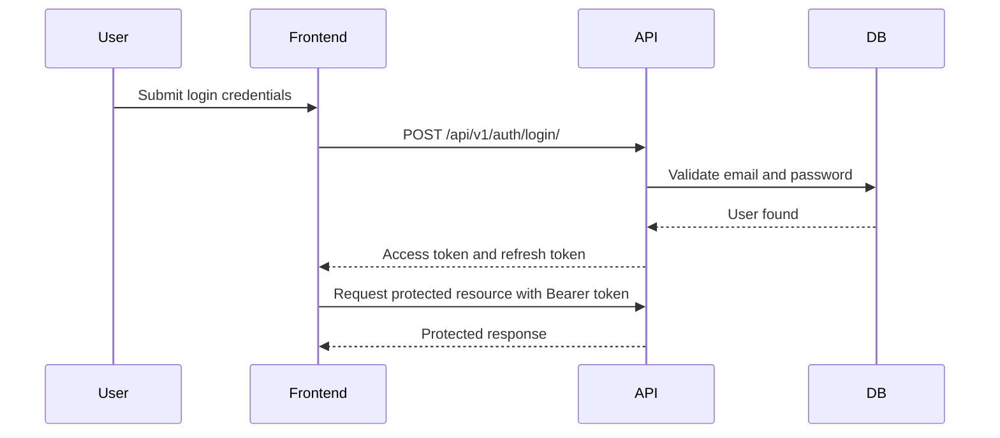

# DueNest API Specification

**Version:** v0.1  
**Status:** Planning  
**API Style:** REST  
**Backend Framework:** Django REST Framework  
**Authentication:** JWT-based authentication  
**Primary Client:** Next.js frontend  
**Base Path:** `/api/v1/`

---

## 1. API Specification Summary

This document defines the planned REST API for DueNest.

DueNest APIs will support:

- user authentication
- user profile management
- document vault operations
- renewal and subscription tracking
- reminders
- notifications
- dashboard summaries
- application document packs
- future AI document extraction

The API should be secure, predictable, versioned, well-documented, and designed around user-owned resources.

---

## 2. API Design Goals

| Goal | Description |
| --- | --- |
| Security-first | Every protected resource must be scoped to the authenticated user |
| Consistency | Endpoints, responses, errors, and pagination should follow predictable patterns |
| Versioning | APIs should use `/api/v1/` from the beginning |
| Maintainability | API endpoints should map cleanly to product modules |
| Frontend readiness | Responses should be easy for the Next.js frontend to consume |
| Extensibility | Future AI, sharing, workspace, and billing features should fit without redesign |
| Clear validation | Invalid input should return useful validation errors |
| Production awareness | API behavior should support testing, CI/CD, monitoring, and deployment |

---

## 3. API Base URL

### Local Development

```txt
http://localhost:8000/api/v1/
```

### Production

```txt
https://api.duenest.com/api/v1/
```

The production domain is a placeholder and may change.

---

## 4. API Versioning Strategy

All v0.1 endpoints should use:

```txt
/api/v1/
```

Example:

```txt
/api/v1/documents/
```

Versioning from the beginning prevents future breaking changes from affecting old clients.

Future versions may use:

```txt
/api/v2/
```

---

## 5. Content Types

### JSON Requests

Most endpoints should accept and return JSON:

```http
Content-Type: application/json
Accept: application/json
```

### File Upload Requests

Document upload endpoints should use multipart form data:

```http
Content-Type: multipart/form-data
```

---

## 6. Authentication Strategy

DueNest will use JWT-based authentication.

### Token Types

| Token | Purpose |
| --- | --- |
| Access token | Used for authenticated API requests |
| Refresh token | Used to obtain a new access token |

### Authorization Header

Protected endpoints require:

```http
Authorization: Bearer <access_token>
```

### Authentication Flow



---

## 7. Standard Response Format

### Success Response

For single-resource responses:

```json
{
  "data": {
    "id": "uuid",
    "title": "Passport"
  }
}
```

For list responses:

```json
{
  "count": 25,
  "next": "http://localhost:8000/api/v1/documents/?page=2",
  "previous": null,
  "results": []
}
```

### Error Response

All error responses should follow a consistent shape:

```json
{
  "error": {
    "code": "DOCUMENT_NOT_FOUND",
    "message": "The requested document was not found.",
    "details": {}
  }
}
```

### Validation Error Response

```json
{
  "error": {
    "code": "VALIDATION_ERROR",
    "message": "Invalid request data.",
    "details": {
      "title": ["This field is required."],
      "expiry_date": ["Date has wrong format. Use YYYY-MM-DD."]
    }
  }
}
```

---

## 8. HTTP Status Code Strategy

| Status Code | Meaning |
| --- | --- |
| `200 OK` | Request succeeded |
| `201 Created` | Resource created successfully |
| `204 No Content` | Resource deleted successfully |
| `400 Bad Request` | Invalid request data |
| `401 Unauthorized` | Missing or invalid authentication |
| `403 Forbidden` | Authenticated but not allowed |
| `404 Not Found` | Resource does not exist or does not belong to user |
| `409 Conflict` | Request conflicts with existing data |
| `413 Payload Too Large` | Uploaded file is too large |
| `415 Unsupported Media Type` | Uploaded file type is not supported |
| `429 Too Many Requests` | Rate limit exceeded |
| `500 Internal Server Error` | Unexpected server error |

Important security note:

> For user-owned resources, if a resource exists but belongs to another user, the API should usually return `404 Not Found`, not `403 Forbidden`, to avoid leaking resource existence.

---

## 9. Pagination Strategy

List endpoints should use pagination.

Example request:

```http
GET /api/v1/documents/?page=1&page_size=20
```

Example response:

```json
{
  "count": 42,
  "next": "http://localhost:8000/api/v1/documents/?page=2&page_size=20",
  "previous": null,
  "results": []
}
```

### Recommended Defaults

| Parameter | Default | Notes |
| --- | --- | --- |
| `page` | `1` | Current page |
| `page_size` | `20` | Default page size |
| `max_page_size` | `100` | Prevent excessive responses |

---

## 10. Filtering, Searching, and Sorting

APIs should support useful filtering from the beginning where needed.

### Common Query Parameters

| Parameter | Purpose |
| --- | --- |
| `search` | Search by title, provider, or name |
| `category` | Filter by category |
| `status` | Filter by status |
| `ordering` | Sort results |
| `created_after` | Filter by creation date |
| `created_before` | Filter by creation date |

### Example

```http
GET /api/v1/documents/?category=immigration&status=expiring_soon&ordering=expiry_date
```

---

## 11. Resource Ownership Rules

Every protected resource must be scoped to the authenticated user.

Unsafe example:

```python
Document.objects.get(id=document_id)
```

Safe example:

```python
Document.objects.get(id=document_id, user=request.user)
```

### Ownership Table

| Resource | Ownership Rule |
| --- | --- |
| Document | `document.user == request.user` |
| Renewal | `renewal.user == request.user` |
| Reminder | `reminder.user == request.user` |
| Notification | `notification.user == request.user` |
| ApplicationPack | `application_pack.user == request.user` |
| ApplicationPackDocument | pack and document must belong to same user |
| AIExtractionResult | linked document must belong to request user |

---

# 12. Authentication API

## 12.1 Register User

```http
POST /api/v1/auth/register/
```

### Request

```json
{
  "full_name": "Nouhan Doumbouya",
  "email": "nouhan@example.com",
  "password": "StrongPassword123!",
  "password_confirm": "StrongPassword123!"
}
```

### Response: `201 Created`

```json
{
  "data": {
    "id": "7b9c0c30-12e2-4f5a-a7ab-62e9f4fd7c11",
    "full_name": "Nouhan Doumbouya",
    "email": "nouhan@example.com",
    "date_joined": "2026-06-05T10:30:00Z"
  }
}
```

### Validation Rules

- Email must be unique.
- Password must meet minimum security requirements.
- `password` and `password_confirm` must match.

---

## 12.2 Login User

```http
POST /api/v1/auth/login/
```

### Request

```json
{
  "email": "nouhan@example.com",
  "password": "StrongPassword123!"
}
```

### Response: `200 OK`

```json
{
  "data": {
    "access": "access_token_here",
    "refresh": "refresh_token_here",
    "user": {
      "id": "7b9c0c30-12e2-4f5a-a7ab-62e9f4fd7c11",
      "full_name": "Nouhan Doumbouya",
      "email": "nouhan@example.com"
    }
  }
}
```

---

## 12.3 Refresh Token

```http
POST /api/v1/auth/refresh/
```

### Request

```json
{
  "refresh": "refresh_token_here"
}
```

### Response: `200 OK`

```json
{
  "data": {
    "access": "new_access_token_here"
  }
}
```

---

## 12.4 Logout User

```http
POST /api/v1/auth/logout/
```

### Authentication

Required.

### Request

```json
{
  "refresh": "refresh_token_here"
}
```

### Response: `204 No Content`

This endpoint may blacklist the refresh token if token blacklisting is enabled.

---

## 12.5 Google Sign-In

```http
POST /api/v1/auth/google/
```

Exchanges a Google ID token (obtained by the frontend via Google Sign-In) for
DueNest Simple JWT tokens. This sits alongside username/password login and does
not replace it.

The backend verifies the ID token against `GOOGLE_OAUTH_CLIENT_ID`, then either
finds the matching user (by Google id, then by email) or creates a new one, and
returns DueNest tokens.

### Request

```json
{
  "id_token": "GOOGLE_ID_TOKEN_HERE"
}
```

### Response: `200 OK`

```json
{
  "refresh": "refresh_token_here",
  "access": "access_token_here",
  "user": {
    "id": 1,
    "username": "example",
    "email": "example@gmail.com",
    "first_name": "Example",
    "last_name": "User"
  }
}
```

### Behavior & Errors

- A new local user is created on first Google sign-in (with an unusable password).
- If a password account already uses the token's email, that account is linked to the Google id.
- `400 Bad Request` if the token's email is not verified or the payload is incomplete.
- `401 Unauthorized` if the ID token is missing, invalid, or issued for another application.

---

# 13. User API

## 13.1 Get Current User

```http
GET /api/v1/users/me/
```

### Authentication

Required.

### Response: `200 OK`

```json
{
  "data": {
    "id": "7b9c0c30-12e2-4f5a-a7ab-62e9f4fd7c11",
    "full_name": "Nouhan Doumbouya",
    "email": "nouhan@example.com",
    "date_joined": "2026-06-05T10:30:00Z"
  }
}
```

---

## 13.2 Update Current User

```http
PATCH /api/v1/users/me/
```

### Authentication

Required.

### Request

```json
{
  "full_name": "Nouhan D."
}
```

### Response: `200 OK`

```json
{
  "data": {
    "id": "7b9c0c30-12e2-4f5a-a7ab-62e9f4fd7c11",
    "full_name": "Nouhan D.",
    "email": "nouhan@example.com",
    "updated_at": "2026-06-05T11:00:00Z"
  }
}
```

---

# 13.5 Documents API (implemented)

Manages user-owned document metadata and returns computed document intelligence
fields. File upload/preview/sharing is handled by nested file endpoints below.
OCR and notification sending are not implemented. Every endpoint requires
authentication, and all access is scoped to the authenticated user: a document
that belongs to another user returns `404 Not Found`.

Base path:

```http
/api/v1/documents/
```

| Method   | Path                      | Description                          |
| -------- | ------------------------- | ------------------------------------ |
| `GET`    | `/api/v1/documents/`      | List the current user's documents    |
| `POST`   | `/api/v1/documents/`      | Create a document for the current user |
| `GET`    | `/api/v1/documents/:id/`  | Retrieve one of the user's documents |
| `PATCH`  | `/api/v1/documents/:id/`  | Update one of the user's documents   |
| `DELETE` | `/api/v1/documents/:id/`  | Delete one of the user's documents   |
| `GET`    | `/api/v1/documents/attention-needed/` | Documents requiring action |

### Authentication

Required (`Authorization: Bearer <access_token>`).

### Create Request

```json
{
  "title": "My Passport",
  "document_type": "passport",
  "category": 1,
  "issuer": "Immigration Department",
  "country": "Guinea",
  "reference_number": "X1234567",
  "issue_date": "2020-01-01",
  "expiry_date": "2030-01-01",
  "renewal_date": "2029-10-01",
  "notes": "Renew before travel.",
  "status": "active"
}
```

Only `title` is required. `owner` is **never** accepted from the client — it is
set from the authenticated user. `category` is optional and references a
`DocumentCategory` id.

### Response: `201 Created`

```json
{
  "id": 1,
  "owner": 7,
  "category": 1,
  "category_name": "Passport",
  "title": "My Passport",
  "document_type": "passport",
  "issuer": "Immigration Department",
  "country": "Guinea",
  "reference_number": "X1234567",
  "issue_date": "2020-01-01",
  "expiry_date": "2030-01-01",
  "renewal_date": "2029-10-01",
  "notes": "Renew before travel.",
  "status": "active",
  "computed_status": "active",
  "status_label": "Active",
  "status_reason": "This document looks up to date.",
  "urgency_level": "none",
  "days_until_expiry": 1297,
  "days_until_renewal": 1205,
  "is_expired": false,
  "is_expiring_soon": false,
  "is_renewal_due": false,
  "has_file": true,
  "missing_expiry_date": false,
  "missing_file": false,
  "needs_attention": false,
  "created_at": "2026-06-12T10:30:00Z",
  "updated_at": "2026-06-12T10:30:00Z"
}
```

### Status values

```txt
active | expired | renewal_due | archived
```

Manual `status` remains writable for compatibility and archiving. The backend
also returns read-only intelligence fields without overwriting user-entered
status unless the user updates it.

### Computed status values

```txt
active | expiring_soon | renewal_due | expired | missing_file |
missing_expiry_date | archived
```

`needs_attention` is returned as a boolean so the API can preserve the most
specific `computed_status` while still supporting a focused attention inbox.

### Computed document health fields

| Field | Type | Notes |
| --- | --- | --- |
| `computed_status` | string | Derived from manual archive state, expiry date, renewal date, and file presence |
| `status_label` | string | Human-readable label for `computed_status` |
| `status_reason` | string | Short user-facing explanation |
| `urgency_level` | string | `none`, `low`, `medium`, `high`, or `critical` |
| `days_until_expiry` | integer/null | Negative when expired |
| `days_until_renewal` | integer/null | Negative when renewal date is in the past |
| `is_expired` | boolean | `expiry_date < today` |
| `is_expiring_soon` | boolean | Expiry is within 90 days and not expired |
| `is_renewal_due` | boolean | Renewal date is today/past and the document is not expired |
| `has_file` | boolean | At least one attached file exists |
| `missing_expiry_date` | boolean | No expiry date is present |
| `missing_file` | boolean | No attached files exist |
| `needs_attention` | boolean | Expired, renewal due, expiring soon, missing file, or missing expiry date |

Archived documents keep `computed_status = "archived"` and do not appear in
Attention Needed results.

### List search, filters, and ordering

`GET /api/v1/documents/` accepts:

| Parameter | Description |
| --- | --- |
| `search` | Searches `title`, `document_type`, `issuer`, `country`, `reference_number`, and `notes` |
| `status` | Manual stored status: `active`, `expired`, `renewal_due`, `archived` |
| `computed_status` | Computed status value such as `expiring_soon`, `expired`, `missing_file`, `missing_expiry_date`, `archived` |
| `category` | Category id or category slug |
| `document_type` | Case-insensitive partial match |
| `country` | Case-insensitive partial match |
| `issuer` | Case-insensitive partial match |
| `has_file` | Boolean (`true`, `false`, `1`, `0`, `yes`, `no`) |
| `missing_file` | Boolean |
| `missing_expiry_date` | Boolean |
| `needs_attention` | Boolean |
| `expiry_from` | `YYYY-MM-DD`, filters `expiry_date >= value` |
| `expiry_to` | `YYYY-MM-DD`, filters `expiry_date <= value` |
| `expiring_within_days` | Integer; includes non-expired documents expiring within that many days |
| `ordering` | One of `expiry_date`, `-expiry_date`, `created_at`, `-created_at`, `updated_at`, `-updated_at`, `title`, `-title` |

Invalid `ordering` values fall back to `-created_at`. Invalid dates and invalid
`expiring_within_days` values are ignored. All search and filter results remain
scoped to `request.user`.

### Attention Needed

```http
GET /api/v1/documents/attention-needed/
```

Returns the authenticated user's non-archived documents where
`needs_attention = true`, sorted by urgency and relevant dates.

```json
{
  "count": 1,
  "items": [
    {
      "id": 1,
      "title": "Passport",
      "computed_status": "expiring_soon",
      "urgency_level": "medium",
      "status_reason": "Expires in 58 days.",
      "expiry_date": "2026-08-10",
      "days_until_expiry": 58,
      "needs_attention": true
    }
  ]
}
```

Items use the same document serializer shape as `GET /api/v1/documents/`.
Attention Needed never exposes another user's documents and does not include
public/shared-link documents.

### Validation rules

- `title` is required.
- `expiry_date` cannot be earlier than `issue_date` (when both are set).
- `renewal_date` cannot be later than `expiry_date` (when both are set).
- `owner`, `id`, computed health fields, `created_at`, and `updated_at` are read-only.

List responses are paginated using the standard pagination envelope
(`count`, `next`, `previous`, `results`).

---

# 13.6 Document Files API (implemented)

Files attached to a document. Nested under the parent document and scoped to
its owner: a user can only reach files for documents they own. All endpoints
require authentication.

| Method   | Path                                                | Description                       |
| -------- | --------------------------------------------------- | --------------------------------- |
| `GET`    | `/api/v1/documents/:id/files/`                      | List files for the document       |
| `POST`   | `/api/v1/documents/:id/files/`                      | Upload a file (multipart)         |
| `GET`    | `/api/v1/documents/:id/files/:file_id/`             | Retrieve file metadata            |
| `DELETE` | `/api/v1/documents/:id/files/:file_id/`             | Delete the file (record + blob)   |
| `GET`    | `/api/v1/documents/:id/files/:file_id/download/`    | Controlled download (owner only)  |
| `GET`    | `/api/v1/documents/:id/files/:file_id/preview/`     | Inline preview for PDF/JPEG/PNG   |

### Upload Request

`multipart/form-data` with a single `file` field:

```http
POST /api/v1/documents/12/files/
Content-Type: multipart/form-data

file: <binary>
```

### Response: `201 Created`

```json
{
  "id": 1,
  "document": 12,
  "uploaded_by": 7,
  "original_filename": "passport.pdf",
  "content_type": "application/pdf",
  "file_size": 184213,
  "checksum": "9f86d0818988…",
  "download_url": "http://localhost:8000/api/v1/documents/12/files/1/download/",
  "preview_url": "http://localhost:8000/api/v1/documents/12/files/1/preview/",
  "is_previewable": true,
  "created_at": "2026-06-12T10:30:00Z",
  "updated_at": "2026-06-12T10:30:00Z"
}
```

### Validation rules

- Max size **10 MB**.
- Allowed types: PDF, JPEG, PNG, DOC, DOCX (checked by extension **and** the
  client-reported content type).
- Previewable types: PDF, JPEG, PNG only. DOC/DOCX remain download-only.
- The parent document must belong to the authenticated user (otherwise `404`).

### Security notes

- `uploaded_by` is set from the request user, never the client.
- The internal storage path is **never** exposed; clients use `download_url`,
  which is itself authenticated and ownership-checked.
- `preview_url` is authenticated and ownership-checked exactly like download.
- Accessing another user's file (list, retrieve, download, delete) returns
  `404 Not Found`.

---

# 13.7 Secure File Sharing and Activity API (implemented)

Share links grant controlled access to **one specific document file**, not the
owner's full vault. Owner management endpoints require authentication and verify
that the parent document belongs to `request.user`.

## Owner share-link endpoints

| Method   | Path                                                                           | Description                  |
| -------- | ------------------------------------------------------------------------------ | ---------------------------- |
| `GET`    | `/api/v1/documents/:id/files/:file_id/share-links/`                            | List share links for a file  |
| `POST`   | `/api/v1/documents/:id/files/:file_id/share-links/`                            | Create a file share link     |
| `GET`    | `/api/v1/documents/:id/files/:file_id/share-links/:share_id/`                  | Retrieve one share link      |
| `POST`   | `/api/v1/documents/:id/files/:file_id/share-links/:share_id/revoke/`           | Revoke a link immediately    |
| `DELETE` | `/api/v1/documents/:id/files/:file_id/share-links/:share_id/`                  | Delete a share link record   |
| `GET`    | `/api/v1/documents/:id/files/:file_id/activity/`                               | Owner-only file activity log |

### Create share link request

```json
{
  "permission": "view_only",
  "expires_at": "2026-06-20T10:30:00Z",
  "access_code_required": true,
  "access_code": "482913",
  "label": "University visa office",
  "recipient_email": "visaoffice@example.edu",
  "purpose": "Student pass renewal submission"
}
```

`permission` is either `view_only` or `download_allowed`. If
`access_code_required` is true and no code is provided, the backend generates a
6-digit code and returns it only in the initial creation response. Access codes
are stored hashed, never in plain text.

### Owner response fields

```json
{
  "id": 24,
  "token": "unguessable-token",
  "permission": "view_only",
  "download_allowed": false,
  "status": "active",
  "expires_at": "2026-06-20T10:30:00Z",
  "revoked_at": null,
  "access_code_required": true,
  "label": "University visa office",
  "recipient_email": "visaoffice@example.edu",
  "purpose": "Student pass renewal submission",
  "created_at": "2026-06-12T10:30:00Z",
  "last_accessed_at": null,
  "access_code": "482913"
}
```

Owner-facing labels, recipient email, and purpose notes are not exposed through
public share endpoints.

## Public share endpoints

| Method | Path                                      | Description                             |
| ------ | ----------------------------------------- | --------------------------------------- |
| `GET`  | `/api/v1/share/files/:token/`             | Safe shared-file metadata               |
| `POST` | `/api/v1/share/files/:token/verify-code/` | Verify an access-code protected link    |
| `GET`  | `/api/v1/share/files/:token/preview/`     | Public inline preview for PDF/JPEG/PNG  |
| `GET`  | `/api/v1/share/files/:token/download/`    | Public download when permission allows  |

Access-code protected metadata, preview, and download requests must include:

```http
X-Access-Code: 482913
```

Public metadata returns only safe fields:

```json
{
  "file_name": "passport.pdf",
  "content_type": "application/pdf",
  "file_size": 184213,
  "permission": "view_only",
  "expires_at": "2026-06-20T10:30:00Z",
  "is_previewable": true,
  "download_allowed": false,
  "access_code_required": true
}
```

Invalid links return `404`. Expired and revoked links return `410`. View-only
links can preview supported files but cannot download. Correct access codes do
not bypass expiry, revocation, or permission checks.

## Activity log

`GET /api/v1/documents/:id/files/:file_id/activity/` returns owner-only entries
for upload, preview, download, share creation, public opens, shared preview,
shared download, revocation, and access-code verification/failure. Public share
viewers cannot access this log.

---

# 13.8 Document Reminder Rules API (implemented)

Reminder rules let users define when DueNest should remind them before a
document expires or reaches its renewal date. This foundation stores rules and
calculates upcoming reminder dates only; it does **not** send emails, push
notifications, WhatsApp, Telegram, SMS, or background notification jobs yet.

All endpoints require authentication. Rules are resolved through an
owner-owned parent document, so another user's document or rule returns
`404 Not Found`.

| Method | Path | Description |
| --- | --- | --- |
| `GET` | `/api/v1/documents/:document_id/reminder-rules/` | List reminder rules for a document |
| `POST` | `/api/v1/documents/:document_id/reminder-rules/` | Create a reminder rule |
| `GET` | `/api/v1/documents/:document_id/reminder-rules/:rule_id/` | Retrieve one rule |
| `PATCH` | `/api/v1/documents/:document_id/reminder-rules/:rule_id/` | Update one rule |
| `DELETE` | `/api/v1/documents/:document_id/reminder-rules/:rule_id/` | Delete one rule |
| `GET` | `/api/v1/documents/reminders/upcoming/` | List enabled future calculated reminders |

### Trigger types

```txt
before_expiry
before_renewal_date
on_expiry
```

### Create request

```json
{
  "trigger_type": "before_expiry",
  "days_before": 30,
  "is_enabled": true
}
```

`on_expiry` always uses `days_before = 0`. `days_before` cannot be negative.

### Response

```json
{
  "id": 4,
  "owner": 7,
  "document": 12,
  "trigger_type": "before_expiry",
  "days_before": 30,
  "is_enabled": true,
  "upcoming_reminder_date": "2026-07-11",
  "date_source": "expiry_date",
  "created_at": "2026-06-13T00:13:00Z",
  "updated_at": "2026-06-13T00:13:00Z"
}
```

### Validation rules

- `before_expiry` and `on_expiry` require the document to have `expiry_date`.
- `before_renewal_date` requires the document to have `renewal_date`.
- Users cannot create or manage rules for another user's document.
- `owner` and `document` are read-only and set from the authenticated request
  plus URL-scoped parent document.

### Upcoming reminders

```http
GET /api/v1/documents/reminders/upcoming/
```

Returns enabled rules for the authenticated user whose calculated reminder date
is today or in the future, sorted by reminder date and document title.

```json
{
  "count": 1,
  "items": [
    {
      "id": 4,
      "document": 12,
      "trigger_type": "before_expiry",
      "days_before": 30,
      "is_enabled": true,
      "upcoming_reminder_date": "2026-07-11",
      "date_source": "expiry_date"
    }
  ]
}
```

---

# 13B. Document Renewal Workspace API (implemented)

The Renewal Workspace moves DueNest from *"something is expiring"* to *"here is
what you need to prepare."* It adds preparation checklists, application/renewal
bundles, an aggregated timeline, and an OCR-assisted extraction foundation.

All endpoints require authentication. Every resource is strictly owner-scoped:
a user can only ever see or change their own checklists, bundles, requirements,
and extractions. Cross-user access returns `404 Not Found` (the resource is
simply not in the caller's queryset), never `403`.

## 13B.1 Checklist templates (shared, read-only)

System templates are seeded with the `seed_checklist_templates` management
command and are shared across all users. They are read-only through the API.

| Method | Path | Description |
| --- | --- | --- |
| `GET` | `/api/v1/documents/checklist-templates/` | List active checklist templates |
| `GET` | `/api/v1/documents/checklist-templates/:id/` | Retrieve one template + its items |

Seeded templates: passport renewal, visa renewal, student pass renewal,
insurance renewal, scholarship application, travel document readiness.

## 13B.2 User checklists (nested under a document)

| Method | Path | Description |
| --- | --- | --- |
| `GET` | `/api/v1/documents/:document_id/checklists/` | List a document's checklists |
| `POST` | `/api/v1/documents/:document_id/checklists/` | Create a blank checklist |
| `POST` | `/api/v1/documents/:document_id/checklists/from-template/` | Create a checklist + items from a template |
| `GET` | `/api/v1/documents/:document_id/checklists/:checklist_id/` | Retrieve one checklist |
| `PATCH` | `/api/v1/documents/:document_id/checklists/:checklist_id/` | Update a checklist |
| `DELETE` | `/api/v1/documents/:document_id/checklists/:checklist_id/` | Delete a checklist |
| `POST` | `/api/v1/documents/:document_id/checklists/:checklist_id/items/` | Add an item |
| `PATCH` | `/api/v1/documents/:document_id/checklists/:checklist_id/items/:item_id/` | Update an item |
| `DELETE` | `/api/v1/documents/:document_id/checklists/:checklist_id/items/:item_id/` | Delete an item |

- Checklist `progress_percent` and `status` are recalculated from the items
  whenever an item is created, updated, or deleted. Completed and skipped items
  both count as resolved; a checklist is `completed` only when every item is
  resolved.
- `from-template` request body: `{ "template": <id>, "title?": str,
  "due_date?": date, "bundle?": <id> }`. When a `due_date` is supplied, item
  `suggested_due_offset_days` is used to compute each item's `due_date`.
- A checklist item may link an owner-owned `linked_document` / `linked_file`;
  linking another user's resource returns `400`.

Checklist response includes a derived `progress` object:

```json
{
  "id": 5,
  "owner": 7,
  "document": 12,
  "title": "Passport renewal checklist",
  "status": "in_progress",
  "progress_percent": 50,
  "progress": {
    "percent": 50,
    "status": "in_progress",
    "total_items": 6,
    "completed_items": 3,
    "required_incomplete": 2
  },
  "items": [ /* DocumentChecklistItem objects */ ]
}
```

## 13B.3 Application / renewal bundles (top-level)

| Method | Path | Description |
| --- | --- | --- |
| `GET` | `/api/v1/document-bundles/` | List the user's bundles |
| `POST` | `/api/v1/document-bundles/` | Create a bundle |
| `GET` | `/api/v1/document-bundles/:bundle_id/` | Retrieve a bundle + requirements + readiness |
| `PATCH` | `/api/v1/document-bundles/:bundle_id/` | Update a bundle |
| `DELETE` | `/api/v1/document-bundles/:bundle_id/` | Delete a bundle |
| `GET` | `/api/v1/document-bundles/:bundle_id/readiness/` | Fresh readiness breakdown |
| `POST` | `/api/v1/document-bundles/:bundle_id/requirements/` | Add a requirement |
| `PATCH` | `/api/v1/document-bundles/:bundle_id/requirements/:requirement_id/` | Update a requirement |
| `DELETE` | `/api/v1/document-bundles/:bundle_id/requirements/:requirement_id/` | Delete a requirement |
| `POST` | `/api/v1/document-bundles/:bundle_id/requirements/:requirement_id/link-document/` | Link an owner-owned document |
| `POST` | `/api/v1/document-bundles/:bundle_id/requirements/:requirement_id/link-file/` | Link an owner-owned file |

- **Readiness** (`readiness_score`, 0–100) is derived from required, non-skipped
  requirements: a bundle is "ready" only when every required requirement is
  `attached` or `completed`. Missing required requirements reduce the score
  proportionally. When there are no required requirements, readiness falls back
  to optional ones. The score is recalculated whenever a requirement changes.
- `link-document` / `link-file` accept `{ "document": <id> }` / `{ "file": <id> }`,
  verify ownership (`404` otherwise), set the link, and flip a `missing`
  requirement to `attached`.
- Requirement `status`: `missing`, `attached`, `completed`, `skipped`.

Bundle response includes a `readiness` object:

```json
{
  "id": 3,
  "title": "UK visa renewal 2026",
  "bundle_type": "renewal",
  "status": "in_progress",
  "readiness_score": 50,
  "missing_required_count": 1,
  "readiness": {
    "score": 50,
    "is_ready": false,
    "required_total": 2,
    "required_satisfied": 1,
    "required_missing": 1,
    "missing_required_titles": ["Passport photo"]
  },
  "requirements": [ /* DocumentBundleRequirement objects */ ]
}
```

## 13B.4 Timeline

```http
GET /api/v1/documents/timeline/
```

Aggregates the authenticated user's upcoming dates into one ordered feed. Only
the caller's own events are ever returned.

Query parameters (all optional): `start_date`, `end_date`, `event_type`,
`document_id`, `bundle_id`.

Event types: `document_expiry`, `document_renewal`, `reminder`,
`checklist_item_due`, `bundle_target_date`, `bundle_requirement_due`.

```json
{
  "count": 2,
  "items": [
    {
      "id": "document_expiry:12",
      "event_type": "document_expiry",
      "title": "Passport expires",
      "description": "Passport expires on this date.",
      "date": "2026-07-01",
      "urgency_level": "high",
      "related_document": 12,
      "related_bundle": null,
      "related_checklist": null,
      "metadata": { "document_type": "passport" }
    }
  ]
}
```

`urgency_level` is derived from how soon the date is: overdue → `critical`,
≤7 days → `high`, ≤30 days → `medium`, else `low`.

## 13B.5 OCR-assisted extraction foundation (nested under a file)

| Method | Path | Description |
| --- | --- | --- |
| `GET` | `/api/v1/documents/:document_id/files/:file_id/extractions/` | List a file's extractions |
| `POST` | `/api/v1/documents/:document_id/files/:file_id/extractions/` | Run a new extraction attempt |
| `GET` | `/api/v1/documents/:document_id/files/:file_id/extractions/:extraction_id/` | Retrieve one extraction |
| `PATCH` | `/api/v1/documents/:document_id/files/:file_id/extractions/:extraction_id/` | Stage reviewed fields |
| `POST` | `/api/v1/documents/:document_id/files/:file_id/extractions/:extraction_id/apply/` | Apply chosen reviewed fields to the document |

This is a safe, **local** extraction pipeline — not an automatic AI service:

- Extraction uses a pluggable provider abstraction with two real providers:
  - `local_text` — reads a PDF **text layer** with `pypdf` (fast, exact).
  - `local_ocr` — runs **Tesseract OCR** (`pytesseract`) on images, and on
    scanned PDFs with no text layer (rasterized locally via `pdf2image` +
    poppler). OCR only runs when the `tesseract` binary is installed; otherwise
    the result degrades gracefully to `needs_review`.
- **Files are never sent to a third-party OCR service** — all processing is on
  the server, on local storage.
- The provider parses labelled values where it can (e.g. `Date of expiry: …`,
  `Passport No: …`), normalizes dates to ISO `YYYY-MM-DD` (day-first for
  ambiguous numeric dates), and reports a `confidence_score`.
- Extracted values are always *suggestions*. The owner reviews/edits them
  (`PATCH extracted_fields`), then explicitly applies a chosen subset
  (`POST .../apply/` with `{ "fields": ["issuer", ...] }`). A document field is
  never overwritten automatically.
- Only these fields may be staged/applied: `title`, `document_type`, `issuer`,
  `country`, `reference_number`, `issue_date`, `expiry_date`, `renewal_date`.
- `raw_text` is owner-only and is **never** returned by the API; responses
  expose only a `has_raw_text` boolean.

**Dependencies.** PDF text extraction works out of the box (`pypdf`). Image /
scanned-PDF OCR additionally requires the system `tesseract` binary (and
`poppler` for scanned PDFs); without it, image extraction returns
`needs_review`. See the project `README.md` ("Optional: document OCR") for
install notes.

```json
{
  "id": 9,
  "owner": 7,
  "document": 12,
  "file": 4,
  "extraction_status": "needs_review",
  "extracted_fields": { "issuer": "HM Passport Office" },
  "confidence_score": 0.4,
  "provider": "local_text",
  "has_raw_text": true,
  "reviewed_at": null,
  "applied_at": null
}
```

---

# 14. Dashboard API

## 14.1 Get Dashboard Summary

```http
GET /api/v1/dashboard/summary/
```

### Authentication

Required.

### Response: `200 OK`

```json
{
  "data": {
    "documents": {
      "total": 18,
      "valid": 12,
      "expiring_soon": 3,
      "expired": 1,
      "no_expiry": 2
    },
    "renewals": {
      "total": 7,
      "due_soon": 2,
      "active": 6,
      "cancelled": 1,
      "monthly_cost": "49.99",
      "yearly_cost": "599.88",
      "currency": "USD"
    },
    "reminders": {
      "upcoming": 5,
      "overdue": 1
    },
    "notifications": {
      "unread": 4
    },
    "application_packs": {
      "total": 3
    }
  }
}
```

---

## 14.2 Get Upcoming Deadlines

```http
GET /api/v1/dashboard/upcoming-deadlines/
```

### Authentication

Required.

### Optional Query Parameters

| Parameter | Description |
| --- | --- |
| `days` | Number of future days to include. Default: `30` |
| `type` | `document`, `renewal`, or `all` |

### Response: `200 OK`

```json
{
  "data": [
    {
      "id": "doc_uuid",
      "type": "document",
      "title": "Passport",
      "date": "2026-07-01",
      "status": "expiring_soon"
    },
    {
      "id": "renewal_uuid",
      "type": "renewal",
      "title": "Domain Renewal",
      "date": "2026-07-10",
      "status": "due_soon"
    }
  ]
}
```

---

# 15. Document API (older planning reference)

> Current implementation lives in sections **13.5 Documents API**, **13.6
> Document Files API**, **13.7 Secure File Sharing and Activity API**, and
> **13.8 Document Reminder Rules API** above. The examples in this section are
> retained as an older planning reference and should not be treated as the
> current API contract.

## 15.1 List Documents

```http
GET /api/v1/documents/
```

### Authentication

Required.

### Query Parameters

| Parameter | Description |
| --- | --- |
| `search` | Search by title or file name |
| `category` | Filter by category |
| `document_type` | Filter by document type |
| `status` | Filter by status |
| `expires_before` | Filter documents expiring before date |
| `expires_after` | Filter documents expiring after date |
| `ordering` | Sort by `created_at`, `expiry_date`, `title` |

### Response: `200 OK`

```json
{
  "count": 2,
  "next": null,
  "previous": null,
  "results": [
    {
      "id": "document_uuid",
      "title": "Passport",
      "document_type": "passport",
      "category": "immigration",
      "file_name": "passport.pdf",
      "mime_type": "application/pdf",
      "file_size": 245000,
      "issue_date": "2023-09-14",
      "expiry_date": "2028-09-14",
      "status": "valid",
      "created_at": "2026-06-05T10:30:00Z",
      "updated_at": "2026-06-05T10:30:00Z"
    }
  ]
}
```

---

## 15.2 Create Document

```http
POST /api/v1/documents/
```

### Authentication

Required.

### Content Type

```http
multipart/form-data
```

### Request Fields

| Field | Type | Required |
| --- | --- | --- |
| `file` | File | Yes |
| `title` | String | Yes |
| `document_type` | String | Yes |
| `category` | String | Yes |
| `issue_date` | Date | No |
| `expiry_date` | Date | No |
| `notes` | String | No |

### Example Form Data

```txt
file=@passport.pdf
title=Passport
document_type=passport
category=immigration
issue_date=2023-09-14
expiry_date=2028-09-14
notes=Primary passport document
```

### Response: `201 Created`

```json
{
  "data": {
    "id": "document_uuid",
    "title": "Passport",
    "document_type": "passport",
    "category": "immigration",
    "file_name": "passport.pdf",
    "mime_type": "application/pdf",
    "file_size": 245000,
    "issue_date": "2023-09-14",
    "expiry_date": "2028-09-14",
    "status": "valid",
    "notes": "Primary passport document",
    "created_at": "2026-06-05T10:30:00Z",
    "updated_at": "2026-06-05T10:30:00Z"
  }
}
```

---

## 15.3 Retrieve Document

```http
GET /api/v1/documents/{document_id}/
```

### Authentication

Required.

### Response: `200 OK`

```json
{
  "data": {
    "id": "document_uuid",
    "title": "Passport",
    "document_type": "passport",
    "category": "immigration",
    "file_name": "passport.pdf",
    "mime_type": "application/pdf",
    "file_size": 245000,
    "issue_date": "2023-09-14",
    "expiry_date": "2028-09-14",
    "status": "valid",
    "notes": "Primary passport document",
    "created_at": "2026-06-05T10:30:00Z",
    "updated_at": "2026-06-05T10:30:00Z"
  }
}
```

---

## 15.4 Update Document

```http
PATCH /api/v1/documents/{document_id}/
```

### Authentication

Required.

### Request

```json
{
  "title": "Updated Passport",
  "expiry_date": "2028-10-01",
  "notes": "Updated after verification"
}
```

### Response: `200 OK`

```json
{
  "data": {
    "id": "document_uuid",
    "title": "Updated Passport",
    "expiry_date": "2028-10-01",
    "status": "valid",
    "notes": "Updated after verification",
    "updated_at": "2026-06-05T11:00:00Z"
  }
}
```

---

## 15.5 Delete Document

```http
DELETE /api/v1/documents/{document_id}/
```

### Authentication

Required.

### Response: `204 No Content`

Deleting a document should remove metadata and the associated file from storage.

---

## 15.6 Download Document

```http
GET /api/v1/documents/{document_id}/download/
```

### Authentication

Required.

### Response

Returns the file if the user owns the document.

Security rule:

> A user must never be able to download another user’s file.

---

# 16. Renewal API

## 16.1 List Renewals

```http
GET /api/v1/renewals/
```

### Authentication

Required.

### Query Parameters

| Parameter | Description |
| --- | --- |
| `search` | Search by title or provider |
| `category` | Filter by category |
| `status` | Filter by status |
| `due_before` | Filter renewals due before date |
| `due_after` | Filter renewals due after date |
| `ordering` | Sort by `renewal_date`, `amount`, `created_at` |

### Response: `200 OK`

```json
{
  "count": 1,
  "next": null,
  "previous": null,
  "results": [
    {
      "id": "renewal_uuid",
      "title": "GitHub Pro",
      "provider": "GitHub",
      "category": "software",
      "amount": "4.00",
      "currency": "USD",
      "renewal_date": "2026-07-01",
      "frequency": "monthly",
      "status": "active",
      "cancellation_url": "https://github.com/settings/billing",
      "created_at": "2026-06-05T10:30:00Z",
      "updated_at": "2026-06-05T10:30:00Z"
    }
  ]
}
```

---

## 16.2 Create Renewal

```http
POST /api/v1/renewals/
```

### Authentication

Required.

### Request

```json
{
  "title": "GitHub Pro",
  "provider": "GitHub",
  "category": "software",
  "amount": "4.00",
  "currency": "USD",
  "renewal_date": "2026-07-01",
  "frequency": "monthly",
  "cancellation_url": "https://github.com/settings/billing",
  "notes": "Developer subscription"
}
```

### Response: `201 Created`

```json
{
  "data": {
    "id": "renewal_uuid",
    "title": "GitHub Pro",
    "provider": "GitHub",
    "category": "software",
    "amount": "4.00",
    "currency": "USD",
    "renewal_date": "2026-07-01",
    "frequency": "monthly",
    "status": "active",
    "cancellation_url": "https://github.com/settings/billing",
    "notes": "Developer subscription",
    "created_at": "2026-06-05T10:30:00Z",
    "updated_at": "2026-06-05T10:30:00Z"
  }
}
```

---

## 16.3 Retrieve Renewal

```http
GET /api/v1/renewals/{renewal_id}/
```

### Authentication

Required.

---

## 16.4 Update Renewal

```http
PATCH /api/v1/renewals/{renewal_id}/
```

### Authentication

Required.

### Request

```json
{
  "renewal_date": "2026-08-01",
  "status": "active"
}
```

---

## 16.5 Delete Renewal

```http
DELETE /api/v1/renewals/{renewal_id}/
```

### Authentication

Required.

### Response: `204 No Content`

---

# 17. Reminder API (planned generic reminders)

> Document-specific reminder rules are implemented in section **13.8 Document
> Reminder Rules API**. The generic reminder endpoints below are still planned
> for a later notification/reminder module.

## 17.1 List Reminders

```http
GET /api/v1/reminders/
```

### Authentication

Required.

### Query Parameters

| Parameter | Description |
| --- | --- |
| `status` | Filter by pending, sent, failed, cancelled |
| `reminder_type` | Filter by type |
| `before` | Reminders before datetime |
| `after` | Reminders after datetime |

---

## 17.2 Create Reminder

```http
POST /api/v1/reminders/
```

### Authentication

Required.

### Request

```json
{
  "document": "document_uuid",
  "renewal": null,
  "reminder_type": "document_expiry",
  "remind_at": "2026-08-01T09:00:00Z"
}
```

### Response: `201 Created`

```json
{
  "data": {
    "id": "reminder_uuid",
    "document": "document_uuid",
    "renewal": null,
    "reminder_type": "document_expiry",
    "remind_at": "2026-08-01T09:00:00Z",
    "status": "pending",
    "sent_at": null,
    "created_at": "2026-06-05T10:30:00Z"
  }
}
```

### Validation Rule

A reminder must be linked to at least one target:

```txt
document OR renewal
```

---

## 17.3 Update Reminder

```http
PATCH /api/v1/reminders/{reminder_id}/
```

---

## 17.4 Delete Reminder

```http
DELETE /api/v1/reminders/{reminder_id}/
```

### Response: `204 No Content`

---

# 18. Notification API

## 18.1 List Notifications

```http
GET /api/v1/notifications/
```

### Authentication

Required.

### Query Parameters

| Parameter | Description |
| --- | --- |
| `is_read` | Filter read/unread notifications |
| `notification_type` | Filter by notification type |

---

## 18.2 Mark Notification as Read

```http
PATCH /api/v1/notifications/{notification_id}/read/
```

### Authentication

Required.

### Response: `200 OK`

```json
{
  "data": {
    "id": "notification_uuid",
    "is_read": true,
    "read_at": "2026-06-05T11:00:00Z"
  }
}
```

---

## 18.3 Mark All Notifications as Read

```http
POST /api/v1/notifications/mark-all-read/
```

### Authentication

Required.

### Response: `200 OK`

```json
{
  "data": {
    "updated_count": 5
  }
}
```

---

# 19. Application Pack API

## 19.1 List Application Packs

```http
GET /api/v1/application-packs/
```

### Authentication

Required.

---

## 19.2 Create Application Pack

```http
POST /api/v1/application-packs/
```

### Authentication

Required.

### Request

```json
{
  "name": "Scholarship Application Pack",
  "purpose": "scholarship",
  "description": "Documents commonly needed for scholarship applications."
}
```

### Response: `201 Created`

```json
{
  "data": {
    "id": "pack_uuid",
    "name": "Scholarship Application Pack",
    "purpose": "scholarship",
    "description": "Documents commonly needed for scholarship applications.",
    "documents": [],
    "created_at": "2026-06-05T10:30:00Z",
    "updated_at": "2026-06-05T10:30:00Z"
  }
}
```

---

## 19.3 Retrieve Application Pack

```http
GET /api/v1/application-packs/{pack_id}/
```

### Authentication

Required.

### Response: `200 OK`

```json
{
  "data": {
    "id": "pack_uuid",
    "name": "Scholarship Application Pack",
    "purpose": "scholarship",
    "description": "Documents commonly needed for scholarship applications.",
    "documents": [
      {
        "id": "document_uuid",
        "title": "Transcript",
        "document_type": "transcript",
        "category": "academic",
        "file_name": "transcript.pdf"
      }
    ],
    "created_at": "2026-06-05T10:30:00Z",
    "updated_at": "2026-06-05T10:30:00Z"
  }
}
```

---

## 19.4 Update Application Pack

```http
PATCH /api/v1/application-packs/{pack_id}/
```

---

## 19.5 Delete Application Pack

```http
DELETE /api/v1/application-packs/{pack_id}/
```

### Response: `204 No Content`

Deleting a pack should delete the pack and join records, but not the original documents.

---

## 19.6 Add Document to Pack

```http
POST /api/v1/application-packs/{pack_id}/documents/
```

### Authentication

Required.

### Request

```json
{
  "document_id": "document_uuid",
  "sort_order": 1
}
```

### Response: `201 Created`

```json
{
  "data": {
    "id": "pack_document_uuid",
    "pack": "pack_uuid",
    "document": "document_uuid",
    "sort_order": 1,
    "created_at": "2026-06-05T10:30:00Z"
  }
}
```

### Security Rule

The document must belong to the same authenticated user who owns the application pack.

---

## 19.7 Remove Document from Pack

```http
DELETE /api/v1/application-packs/{pack_id}/documents/{document_id}/
```

### Response: `204 No Content`

---

## 19.8 Export Application Pack

```http
GET /api/v1/application-packs/{pack_id}/export/
```

### Authentication

Required.

### Response

Returns a ZIP file containing selected documents.

Security rules:

- User must own the pack.
- User must own every document inside the pack.
- Temporary ZIP files should not be permanently stored.

---

# 20. Future AI Extraction API

AI extraction should not be implemented in v0.1, but the API direction is documented for future planning.

## 20.1 Start AI Extraction

```http
POST /api/v1/documents/{document_id}/ai-extractions/
```

### Authentication

Required.

### Response: `202 Accepted`

```json
{
  "data": {
    "id": "extraction_uuid",
    "document": "document_uuid",
    "status": "pending",
    "message": "AI extraction has been queued."
  }
}
```

---

## 20.2 Retrieve AI Extraction Result

```http
GET /api/v1/ai-extractions/{extraction_id}/
```

### Response: `200 OK`

```json
{
  "data": {
    "id": "extraction_uuid",
    "document": "document_uuid",
    "extraction_type": "full_extraction",
    "status": "completed",
    "confidence_score": "0.91",
    "user_confirmed": false,
    "extracted_data": {
      "document_type": "passport",
      "expiry_date": "2028-09-14",
      "recommended_action": "Set a renewal preparation reminder 6 months before expiry."
    }
  }
}
```

---

## 20.3 Confirm AI Extraction Result

```http
POST /api/v1/ai-extractions/{extraction_id}/confirm/
```

### Request

```json
{
  "confirmed_data": {
    "document_type": "passport",
    "expiry_date": "2028-09-14"
  }
}
```

### Response: `200 OK`

```json
{
  "data": {
    "id": "extraction_uuid",
    "status": "confirmed",
    "user_confirmed": true
  }
}
```

---

# 21. File Upload Rules

## Allowed File Types for v0.1

```txt
application/pdf
image/png
image/jpeg
image/webp
```

## Recommended File Size Limit

```txt
10 MB per file for v0.1
```

This can be increased later after storage and security controls are stronger.

## File Upload Security

The API should:

- validate MIME type
- validate file extension
- validate file size
- rename stored files safely
- avoid trusting original file names
- prevent public file URLs by default
- avoid logging file contents

---

# 21.5 Document Vault API Plan

Planned endpoint groups for the documents-first roadmap (see
[`document-vault-roadmap.md`](document-vault-roadmap.md)). Status:
**Implemented** · **Planned MVP** · **Future**. All require authentication and
are scoped to the authenticated owner; cross-user access returns `404`.

### Documents — Implemented
```txt
GET    /api/v1/documents/
POST   /api/v1/documents/
GET    /api/v1/documents/:id/
PATCH  /api/v1/documents/:id/
DELETE /api/v1/documents/:id/
```

### Document files — Implemented
```txt
GET    /api/v1/documents/:id/files/
POST   /api/v1/documents/:id/files/
GET    /api/v1/documents/:id/files/:file_id/
DELETE /api/v1/documents/:id/files/:file_id/
GET    /api/v1/documents/:id/files/:file_id/download/   # controlled, owner-only
GET    /api/v1/documents/:id/files/:file_id/preview/    # controlled, owner-only inline preview
```

Preview is authorized exactly like download (owner-only, no public path).

### Search, filter, sort, and attention — Implemented
```txt
GET    /api/v1/documents/                    # ?search=&status=&computed_status=&needs_attention=&ordering=
GET    /api/v1/documents/attention-needed/   # expired / expiring-soon / renewal-due / missing-info
```

### Calendar — Future
```txt
GET    /api/v1/documents/calendar/      # ?from=&to= expiry/renewal events
```

### Reminder rules — Implemented
```txt
GET    /api/v1/documents/:id/reminder-rules/
POST   /api/v1/documents/:id/reminder-rules/
GET    /api/v1/documents/:id/reminder-rules/:rule_id/
PATCH  /api/v1/documents/:id/reminder-rules/:rule_id/
DELETE /api/v1/documents/:id/reminder-rules/:rule_id/
GET    /api/v1/documents/reminders/upcoming/
```

Reminder rules are stored and upcoming dates are calculated, but real
notification sending is not implemented yet.

### Checklists — Planned MVP
```txt
GET    /api/v1/documents/:id/checklist/
PATCH  /api/v1/documents/:id/checklist/:item_id/
```

### Share links — Implemented
```txt
GET    /api/v1/documents/:id/files/:file_id/share-links/
POST   /api/v1/documents/:id/files/:file_id/share-links/
GET    /api/v1/documents/:id/files/:file_id/share-links/:share_id/
POST   /api/v1/documents/:id/files/:file_id/share-links/:share_id/revoke/
DELETE /api/v1/documents/:id/files/:file_id/share-links/:share_id/
GET    /api/v1/documents/:id/files/:file_id/activity/
GET    /api/v1/share/files/:token/
POST   /api/v1/share/files/:token/verify-code/
GET    /api/v1/share/files/:token/preview/
GET    /api/v1/share/files/:token/download/
```

### OCR extraction — Future (Phase 4)
```txt
POST   /api/v1/documents/:id/files/:file_id/ocr/        # start extraction (async)
GET    /api/v1/documents/:id/files/:file_id/ocr/        # extraction result + confidence
POST   /api/v1/documents/:id/apply-ocr-suggestions/     # review-gated; never auto-applies
```

### Bundles — Future (Phase 5)
```txt
GET    /api/v1/document-bundles/
POST   /api/v1/document-bundles/
GET    /api/v1/document-bundles/:id/
PATCH  /api/v1/document-bundles/:id/
DELETE /api/v1/document-bundles/:id/
```

### Activity / version history / exports — Future (Phase 5)
```txt
GET    /api/v1/documents/:id/activity/
GET    /api/v1/documents/:id/files/:file_id/versions/
GET    /api/v1/documents/export/?format=pdf|csv         # vault summary
GET    /api/v1/documents/:id/files/export-zip/          # all files as ZIP
```

> Endpoint shapes are indicative and may change during implementation. Each
> group ships in its roadmap phase, behind the same ownership and validation
> rules as the implemented endpoints above.

---

# 22. Rate Limiting Strategy

Rate limiting should be considered for:

- login attempts
- registration attempts
- file uploads
- AI extraction requests later
- share link access later

Suggested early strategy:

| Endpoint Type | Suggested Limit |
| --- | --- |
| Login | Strict |
| Registration | Moderate |
| File uploads | Moderate |
| Normal authenticated API | Standard |
| AI extraction later | Strict |

---

# 23. API Security Checklist

Before v0.1 is considered complete:

- [ ] All protected endpoints require authentication.
- [ ] All user-owned data is filtered by `request.user`.
- [ ] Documents cannot be accessed by other users.
- [ ] Renewals cannot be accessed by other users.
- [ ] Application packs cannot include another user’s documents.
- [ ] File downloads verify ownership.
- [ ] File uploads validate type and size.
- [ ] Secrets are not hardcoded.
- [ ] Error messages do not expose sensitive information.
- [ ] Sensitive file contents are not logged.
- [ ] API responses are consistent.

---

# 24. API Acceptance Criteria for v0.1

The v0.1 API is acceptable when:

- users can register
- users can log in
- users can refresh access tokens
- users can retrieve their profile
- users can create documents
- users can list their documents
- users can update their documents
- users can delete their documents
- users can download only their own documents
- users can create renewals
- users can list their renewals
- users can update their renewals
- users can delete their renewals
- users can create reminders
- users can receive in-app notifications
- users can create application packs
- users can add documents to application packs
- users can export an application pack
- dashboard summary endpoint works
- ownership protection is enforced
- list endpoints are paginated
- validation errors are clear
- API behavior matches this specification

---

# 25. Summary

The DueNest API should be secure, consistent, and product-focused.

The first version should prioritize:

- authentication
- user-owned resources
- document vault APIs
- renewal APIs
- reminder APIs
- notification APIs
- application pack APIs
- dashboard summary APIs
- strong ownership checks
- predictable response formats

Advanced APIs such as AI extraction, secure sharing, team workspaces, and billing should be added only after the core MVP is working correctly.
