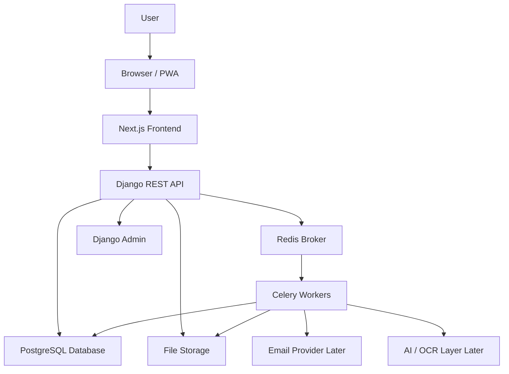
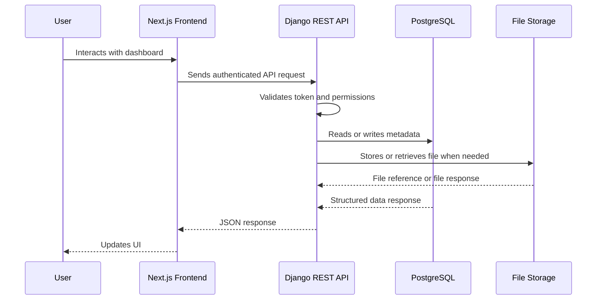
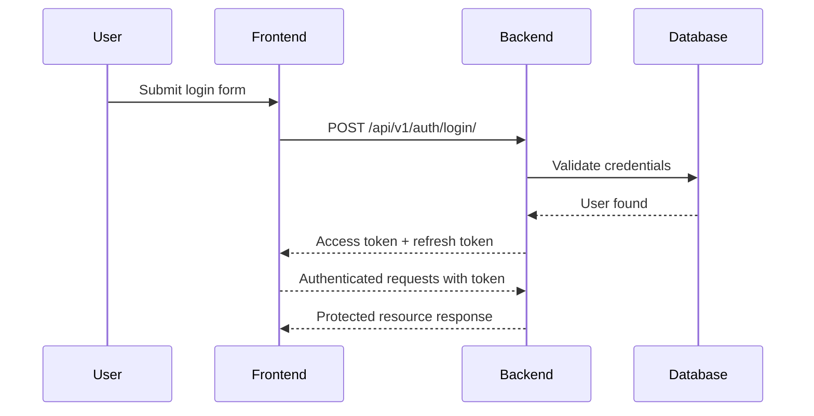
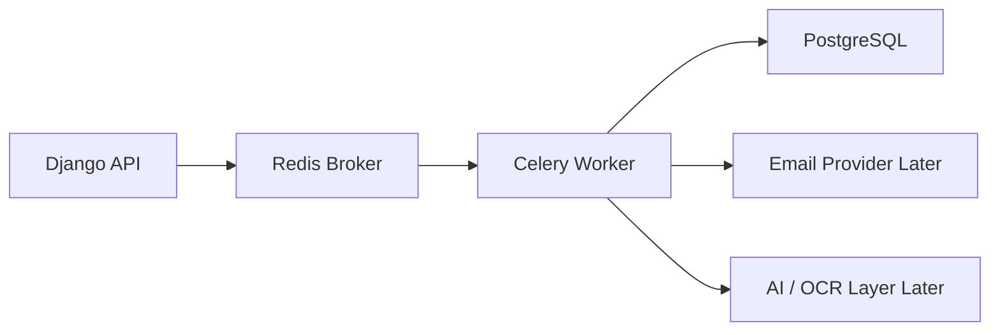
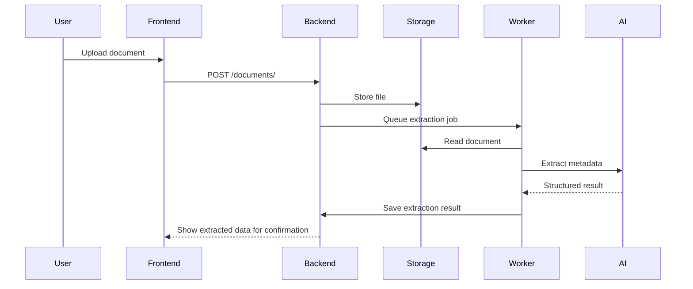

# CertaNest System Architecture

**Version:** v0.1  
**Status:** Planning  
**Architecture Style:** SaaS-ready modular monolith  
**Primary Platform:** Responsive web app  
**Backend:** Django + Django REST Framework  
**Frontend:** Next.js + TypeScript  
**Database:** PostgreSQL  
**Background Processing:** Celery + Redis  
**Storage:** Local development storage, S3-compatible production storage later  

---

## 1. Architecture Summary

CertaNest will be built as a **SaaS-ready modular monolith** using a modern full-stack architecture.

The system will use:

- **Next.js** for the web frontend
- **Django REST Framework** for the backend API
- **PostgreSQL** as the primary relational database
- **Celery + Redis** for background jobs and scheduled reminders
- **S3-compatible object storage** for production file storage
- **Docker Compose** for local development orchestration
- **GitHub Actions** for continuous integration
- **Vercel** for frontend deployment
- **Render, Railway, Fly.io, or similar** for backend deployment

The first version will avoid microservices because the product is still in early development, has one primary development team, and requires rapid iteration. Instead, the backend will be organized into clear domain modules so that the system remains maintainable and can evolve into distributed services later if justified.

---

## 2. Architectural Goals

CertaNest architecture is designed around the following goals:

| Goal | Description |
| --- | --- |
| Product velocity | Build and iterate quickly without unnecessary infrastructure complexity |
| Maintainability | Keep backend and frontend code modular, readable, and testable |
| Security | Protect sensitive documents, user data, authentication flows, and file access |
| Scalability | Start simple but design boundaries that allow future growth |
| Reliability | Support reminders, background jobs, and document workflows predictably |
| Extensibility | Allow future AI extraction, integrations, sharing, billing, and team workspaces |
| Developer experience | Keep local setup, testing, and deployment understandable for a solo or small-team workflow |
| Recruiter-readiness | Demonstrate real-world engineering decisions, not only feature implementation |

---

## 3. High-Level Architecture



### Description

The user interacts with the Next.js frontend through a browser or future PWA. The frontend communicates with the Django REST API. The backend owns authentication, authorization, business logic, database operations, file metadata, reminders, and application pack workflows.

Files are stored outside the database. PostgreSQL stores file metadata, ownership, expiry dates, renewal records, and relationships. Celery workers handle asynchronous work such as reminders, notifications, document processing, and future AI extraction.

---

## 4. Key Architectural Decisions

### 4.1 Modular Monolith Instead of Microservices

CertaNest will start as a **modular monolith**.

This means the backend runs as one Django application, but the codebase is separated into clear domain modules:

- `users`
- `documents`
- `renewals`
- `reminders`
- `notifications`
- `application_packs`
- `ai_extraction`

Each module owns its models, serializers, views, services, permissions, and tests.

#### Why not microservices now?

Microservices are not appropriate for v0.1 because:

- The product is not yet validated.
- The team is small.
- Distributed infrastructure would slow development.
- Cross-service authentication, networking, logging, deployment, and debugging would add unnecessary complexity.
- Most domain operations are still tightly connected.
- PostgreSQL relational integrity is valuable at this stage.

Microservices may be considered later only if CertaNest reaches clear scaling or organizational pressure, such as:

- heavy AI extraction workload
- high-volume document ingestion
- separate engineering teams
- independent scaling requirements
- enterprise integrations
- separate release cycles for major services

The correct strategy for this stage is:

> Build a clean modular monolith first. Extract services later only when there is evidence.

### 4.1.1 Organization Workspace V1 boundary

Organization Workspace V1 is implemented as a dedicated `organizations` backend
app plus typed Next.js frontend routes under `/dashboard/organizations`.

The branch intentionally uses separate organization-owned models for documents,
files, requests, campaigns, bundles, secure rooms, templates, activity, and
readiness reports. It does not retrofit the personal vault `Document`,
`DocumentBundle`, or `ShareRoom` rows with nullable organization ownership.
That keeps the personal vault and organization workspace clearly separated
while still delivering a usable team document operations foundation.

Public organization upload and room pages are token-scoped and lightweight:
`/org-request/:token` submits to one request, and `/org-room/:token` displays
active selected room metadata. Organization room file byte-serving, ZIP export,
room access codes, and personal-to-organization copy/attach are deferred until
they can reuse hardened sharing rules safely.

---

### 4.2 Django REST Framework for the Backend

Django REST Framework is selected because CertaNest requires:

- authentication
- secure user-owned data
- relational data modeling
- file uploads
- admin management
- permissions
- serializers and validation
- background jobs
- mature security defaults
- fast development speed

CertaNest is a document-heavy, workflow-driven SaaS product. Django provides a strong foundation for this type of system.

---

### 4.3 Next.js for the Frontend

Next.js is selected because CertaNest needs:

- a polished SaaS landing page
- responsive dashboard
- reusable UI components
- strong routing structure
- TypeScript support
- future PWA support
- flexible deployment on Vercel
- clean separation between marketing pages and app pages

The product will start as a web app because document vaults, dashboards, application packs, file uploads, settings, and tables are easier to build and manage on web first.

---

### 4.4 PostgreSQL as the Primary Database

PostgreSQL is selected because CertaNest requires structured relational data:

- users
- documents
- renewals
- reminders
- notifications
- application packs
- document-pack relationships
- AI extraction results later
- audit logs later

PostgreSQL provides relational integrity, indexing, transactions, constraints, and future support for advanced extensions if needed.

---

### 4.5 Celery + Redis for Background Jobs

CertaNest will need background jobs for:

- reminder scheduling
- notification processing
- future email reminders
- future AI extraction tasks
- future OCR processing
- cleanup jobs
- future expiring share-link checks

Celery is a mature Python background job system, and Redis is a lightweight broker/cache suitable for early-stage development.

---

## 5. Repository Architecture

CertaNest will use a monorepo structure.

```txt
duenest/
│
├── backend/
│   ├── config/
│   ├── apps/
│   │   ├── users/
│   │   ├── documents/
│   │   ├── renewals/
│   │   ├── reminders/
│   │   ├── notifications/
│   │   ├── application_packs/
│   │   └── ai_extraction/
│   ├── common/
│   ├── tests/
│   ├── requirements/
│   ├── manage.py
│   └── README.md
│
├── frontend/
│   ├── app/
│   ├── components/
│   ├── features/
│   ├── lib/
│   ├── hooks/
│   ├── types/
│   ├── public/
│   └── README.md
│
├── docs/
│   ├── product-blueprint.md
│   ├── architecture.md
│   ├── database-design.md
│   ├── api-spec.md
│   ├── roadmap.md
│   └── security-plan.md
│
├── brand/
│   ├── logo/
│   ├── icons/
│   ├── colors/
│   ├── social/
│   ├── guidelines/
│   └── messaging/
│
├── .github/
│   ├── workflows/
│   └── ISSUE_TEMPLATE/
│
├── docker-compose.yml
├── README.md
└── .gitignore
```

### Why Monorepo?

A monorepo is appropriate because:

- the frontend and backend are tightly connected
- the project is currently developed by one person or a small team
- documentation and branding stay close to implementation
- pull requests can describe full product changes
- deployment and CI can be managed centrally
- recruiters can inspect the whole system from one place

The repo may be split later only if the project grows into separate teams, services, or deployment pipelines.

---

## 6. Backend Architecture

The backend will be organized around Django apps that map to product domains.

```txt
backend/
│
├── config/
│   ├── settings/
│   │   ├── base.py
│   │   ├── development.py
│   │   ├── production.py
│   │   └── testing.py
│   ├── urls.py
│   ├── asgi.py
│   ├── wsgi.py
│   └── celery.py
│
├── apps/
│   ├── users/
│   ├── documents/
│   ├── renewals/
│   ├── reminders/
│   ├── notifications/
│   ├── application_packs/
│   └── ai_extraction/
│
├── common/
│   ├── permissions.py
│   ├── pagination.py
│   ├── exceptions.py
│   ├── responses.py
│   ├── validators.py
│   └── utils.py
│
└── tests/
```

---

## 7. Backend App Responsibilities

| App | Responsibility |
| --- | --- |
| `users` | Custom user model, authentication, onboarding state, account settings, data/deletion request controls |
| `documents` | Document metadata, upload handling, categories, expiry status |
| `renewals` | Subscription and renewal tracking, costs, providers, recurring dates |
| `reminders` | Reminder records, reminder scheduling, reminder rules |
| `notifications` | In-app notification records and future email notification logic |
| `application_packs` | Document bundles for applications, ZIP export, pack metadata |
| `ai_extraction` | Future AI/OCR extraction jobs, extraction results, confidence scoring |
| `common` | Shared utilities, validators, response helpers, permissions, pagination |

---

## 8. Backend Layering Strategy

Each Django app should follow a layered structure when the domain logic is more than basic CRUD.

```txt
apps/documents/
│
├── models.py
├── serializers.py
├── views.py
├── urls.py
├── permissions.py
├── selectors.py
├── services.py
├── validators.py
├── tasks.py
└── tests/
```

### Layer Responsibilities

| Layer | Responsibility |
| --- | --- |
| `models.py` | Database structure and model-level constraints |
| `serializers.py` | Request/response validation and transformation |
| `views.py` | API endpoints and HTTP-level behavior |
| `permissions.py` | Access control rules |
| `selectors.py` | Read/query logic |
| `services.py` | Business operations and write workflows |
| `validators.py` | Domain-specific validation |
| `tasks.py` | Celery background jobs |
| `tests/` | Unit and API tests |

### Why Use Services and Selectors?

For simple CRUD endpoints, DRF views and serializers may be enough. However, CertaNest will eventually include workflows such as reminders, AI extraction, application pack exports, secure sharing, file lifecycle management, and audit logs.

Using `services.py` and `selectors.py` helps keep complex business logic out of views and serializers.

Current example: `apps.users.services` owns onboarding state synchronization,
guided setup checklist computation, demo data creation/cleanup, trust summary,
and account-control orchestration. It reuses `apps.documents.services` for the
actual metadata export generation instead of duplicating export logic.

---

## 9. Frontend Architecture

The frontend will use Next.js with a feature-oriented structure.

```txt
frontend/
│
├── app/
│   ├── page.tsx
│   ├── layout.tsx
│   ├── auth/
│   ├── dashboard/
│   ├── documents/
│   ├── renewals/
│   ├── application-packs/
│   └── settings/
│
├── components/
│   ├── ui/
│   ├── layout/
│   ├── forms/
│   ├── charts/
│   └── shared/
│
├── features/
│   ├── auth/
│   ├── documents/
│   ├── renewals/
│   ├── reminders/
│   ├── notifications/
│   └── application-packs/
│
├── lib/
│   ├── api.ts
│   ├── auth.ts
│   ├── constants.ts
│   ├── utils.ts
│   └── validators.ts
│
├── hooks/
│
├── types/
│
└── public/
```

---

## 10. Frontend Responsibilities

The frontend should handle:

- routing
- responsive layouts
- forms
- client-side validation
- API communication
- dashboard visualization
- document upload UI
- authentication screens
- protected pages
- loading states
- empty states
- error states

The frontend should not contain sensitive business rules that must be enforced securely. All critical permissions and ownership checks must be enforced on the backend.

---

## 11. Runtime Request Flow



---

## 12. API Communication Strategy

The frontend will communicate with the backend through REST APIs.

Example API base path:

```txt
/api/v1/
```

Example endpoints:

```txt
/api/v1/auth/register/
/api/v1/auth/login/
/api/v1/auth/refresh/
/api/v1/users/me/

/api/v1/documents/
/api/v1/documents/{id}/
/api/v1/documents/attention-needed/
/api/v1/documents/{id}/reminder-rules/
/api/v1/documents/{id}/reminder-rules/{rule_id}/
/api/v1/documents/reminders/upcoming/

/api/v1/renewals/
/api/v1/renewals/{id}/

/api/v1/reminders/
/api/v1/notifications/

/api/v1/application-packs/
/api/v1/application-packs/{id}/
/api/v1/application-packs/{id}/export/
```

### API Design Principles

APIs should be:

- versioned
- consistent
- authenticated by default
- paginated for list endpoints
- validated with serializers
- documented in `docs/api-spec.md`
- tested with API tests
- explicit about error responses

---

## 13. Authentication Architecture

CertaNest will use token-based authentication for the API.

Initial approach:

- User registers with email and password.
- User logs in and receives access and refresh tokens.
- Access token is used for authenticated API requests.
- Refresh token is used to obtain a new access token.
- Backend enforces user ownership on every protected resource.

Potential tools:

- Django REST Framework
- Django Simple JWT

### Authentication Flow



### Security Notes

The backend must never trust the frontend for authorization. Every resource query must be scoped to the authenticated user.

Example rule:

```txt
A user can only access documents where document.user_id == request.user.id
```

---

## 14. Authorization Model

v0.1 will use simple ownership-based authorization.

### v0.1 Authorization

| Resource | Access Rule |
| --- | --- |
| Document | Only the owner can access |
| Renewal | Only the owner can access |
| Reminder | Only the owner can access |
| Notification | Only the owner can access |
| Application Pack | Only the owner can access |

### Future Authorization

Later versions may introduce:

- family workspace roles
- team workspace roles
- owner/admin/member/viewer permissions
- secure sharing links
- access logs
- document-level permissions

Role-based access control should not be implemented in v0.1 unless necessary.

---

## 15. Data Architecture

CertaNest will use PostgreSQL as the source of truth for structured data.

Core entities:

- User
- Document
- Renewal
- Reminder
- Notification
- ApplicationPack
- ApplicationPackDocument
- AIExtractionResult later
- AuditLog later

The database stores metadata and relationships. Actual document files should be stored in the file storage layer.

### File Metadata vs File Content

| Type | Storage Location |
| --- | --- |
| Document metadata | PostgreSQL |
| File path / storage key | PostgreSQL |
| Actual uploaded file | Local storage in development, S3-compatible object storage in production |

The database should not store large binary document files directly.

### Implemented: local media storage (development)

The `DocumentFile` model stores uploaded blobs on local disk under
`MEDIA_ROOT` (`backend/media/`, git-ignored) using a structured, UUID-based
path: `media/documents/user_<id>/document_<id>/<uuid><ext>`. The database keeps
only metadata (original filename, content type, size, SHA-256 checksum) and the
storage reference.

Files are **not** served as public static media. They are returned only through
an authenticated, ownership-checked download endpoint
(`GET /api/v1/documents/:id/files/:file_id/download/`).

**TODO (production):** replace local disk with a private object-storage backend
(S3-compatible) and serve files via signed, time-limited URLs.

### Implemented: document intelligence and reminder rules

The documents app now derives smart document health in `apps.documents.services`
and exposes it through `DocumentSerializer` fields such as
`computed_status`, `status_reason`, `urgency_level`, `days_until_expiry`,
`has_file`, and `needs_attention`. This keeps intelligence read-only and avoids
storing duplicated status columns that could drift from source data.

`GET /api/v1/documents/` supports owner-scoped search, filtering, and sorting.
Some filters are database-backed (`search`, `status`, category/date fields);
computed-health filters are applied after calculating health for the
authenticated user's queryset.

`GET /api/v1/documents/attention-needed/` returns non-archived documents that
need action, sorted by urgency and dates.

`DocumentReminderRule` stores user-owned reminder preferences and calculates
upcoming reminder dates from `expiry_date` or `renewal_date`. Due reminder
delivery is handled by the notifications app through a cron-compatible Django
management command rather than Celery.

### Implemented: virtual document organization (folders, tags, collections)

`DocumentFolder`, `DocumentTag`, and `DocumentCollection` (with
`OrganizationDocumentStructurePreference` / `OrganizationTemplateFolderBlueprint` for
the org portal) are **virtual metadata layered over the `Document` model** —
`Document.primary_folder` and the `Document.collections` M2M are additive references.
Organizing a document **never changes the underlying file's storage (R2) object key**,
never moves or copies the stored blob, and is **never** access control (sharing stays
governed by `SharingRoom` / `DocumentRequestLink`). Organization happens at the
**Document** level (the logical owner-scoped vault unit), not the `DocumentFile` level.
The shared service is `apps.documents.folders`; scope is either a personal owner or an
organization. **Deterministic — no AI.** See `docs/api-spec.md` §44.

---

## 16. File Storage Architecture

### Development

In development, files may be stored locally under Django media storage.

Example:

```txt
backend/media/documents/
```

### Production

In production, files should be stored in S3-compatible object storage.

Possible providers:

- AWS S3
- Cloudflare R2
- Supabase Storage
- DigitalOcean Spaces

### File Access Principles

Uploaded documents should be:

- private by default
- accessible only to the owner
- validated before storage
- referenced by storage key
- served through controlled backend routes or signed URLs
- protected from direct public listing

---

## 17. Background Job Architecture

CertaNest does not currently ship Celery/Redis. Scheduled reminder delivery uses
the Django management command foundation below, which can be run by cron or a
platform scheduler:

```bash
python manage.py process_due_notifications --limit 100
python manage.py process_due_notifications --dry-run
```

The command creates missing notification records, sends email when enabled and
configured, records in-app delivery, and uses stable `dedupe_key` values so
repeated runs are idempotent.

CertaNest may later use Celery workers for asynchronous tasks.



### Background Jobs in v0.1

- Implemented: cron-compatible notification generation/delivery command.
- Implemented: document reminder rules and upcoming reminder dates are still
  calculated synchronously by authenticated API endpoints.
- Deferred: Celery beat/worker, Redis broker, push, SMS, WhatsApp, Telegram,
  daily digests, bounce handling, and production email monitoring.

### Future Background Jobs

- Move email reminders to a queue when volume requires it
- Process uploaded PDFs
- Run OCR extraction
- Call AI extraction service
- Generate application pack ZIP files
- Expire secure sharing links
- Clean temporary files

---

## 18. Notification Architecture

v0.1 includes owner-scoped in-app notifications plus email reminder delivery
through Django's email backend.

Implemented pieces:

- `apps.notifications.Notification`
- `apps.notifications.NotificationPreference`
- `/api/v1/notifications/` inbox endpoints
- `/dashboard/notifications` notification center
- `/dashboard/notifications/settings` preferences page
- `process_due_notifications` management command
- privacy-safe text/HTML email templates

Future notification channels:

- push notifications
- WhatsApp
- Telegram
- calendar reminders

The notification system should be channel-agnostic over time.

---

## 19. AI Extraction Architecture

AI extraction is planned for v0.2 or later.

The AI layer should not be part of the first MVP because users should first validate the core manual workflow.

### Future AI Flow



### AI Extraction Principles

- AI output must not be blindly trusted.
- Extraction results should include confidence scores.
- Users must confirm or correct extracted data.
- Original extracted text and metadata should be auditable where appropriate.
- AI failures should not block core document upload.
- AI tasks should run asynchronously.

### AI surface (all via `apps.ai.generate`, all assistive + flag-gated)

Every Claude feature goes through the single `apps.ai.client.generate` wrapper
(structured JSON, never raises — degrades to `not_configured` with no key) and is
gated by the `ai_features` master flag plus a per-feature flag:

- **Document extraction** (`ai_document_extraction`) — suggest fields from a
  document's text for review.
- **Ask your documents** (`ai_document_qa`) — grounded Q&A over the owner's docs.
- **Share readiness** (`ai_share_readiness`) — `apps/documents/ai_readiness.py`
  reviews an application pack against its purpose before sharing and flags
  likely-rejection issues. **Deterministic facts** (missing required items, expired
  docs from `bundle_readiness`) are returned regardless; the AI layer adds
  purpose-aware findings, falls back on any failure, and never claims "ready" while
  a required item is missing. Endpoint `POST /document-bundles/:id/share-readiness/`.

All AI surfaces are **assistive** — the UI labels AI output and the user confirms.

### AI plan credits vs infrastructure budget guard

Two independent layers control AI spend:

1. **Infrastructure budget guard** (`AI_DAILY_TOKEN_CAP_USER`, `AI_DAILY_TOKEN_CAP_GLOBAL`,
   `AI_MONTHLY_COST_LIMIT_USD`): server-level hard caps on token/cost spend. Fails closed
   — a cap breach blocks the call regardless of plan. Internal cap values are never
   exposed to users.

2. **Plan credits** (product limits): monthly AI credits tracked via `FeatureUsageCounter`
   (key `"ai_credits"`, monthly period). Free: 10/month; Pro: 200/month. Feature flags
   additionally gate premium features per plan. Credits are spent only on successful calls.
   New blocked reasons: `ai_feature_not_in_plan`, `ai_credits_exhausted`,
   `ai_index_limit_exceeded`.

Both layers are checked at the `apps.ai.client.generate` chokepoint. Either can block a
call independently.

### Model routing (`apps/ai/routing.py`)

Model selection is enforced at `resolve_allowed_ai_model`, called from the
`apps.ai.client.generate` chokepoint — never taken from client input:

- **Free:** Haiku only (`AI_MODEL_HAIKU`).
- **Pro:** Haiku by default; Sonnet (`AI_MODEL_SONNET`) for heavier features when
  `AI_PRO_SONNET_ENABLED=true` (default off).
- **Opus:** founder/admin or explicit `AI_MODEL` operator override only, and for
  system (user=None) calls. Opus is **not** the default.

The default model (`DEFAULT_MODEL`) is now a Haiku-class model.

---

## 20. Security Architecture

CertaNest may eventually handle sensitive documents such as passports, visas, certificates, insurance policies, contracts, and IDs.

Security must be treated as a core architecture concern.

### Security Principles

- Private by default
- Least privilege
- Explicit ownership checks
- Secure authentication
- Environment-based secrets
- Validated file uploads
- No public document URLs by default
- No real sensitive files during development
- Clear separation between metadata and file storage
- Auditability for future sharing features

### Critical Security Controls

| Area | Control |
| --- | --- |
| Authentication | JWT-based API authentication |
| Authorization | User ownership checks |
| File access | Private storage and controlled access |
| Secrets | Environment variables |
| Uploads | MIME type and size validation |
| Sharing | Expiring links in later versions |
| Logs | Avoid logging sensitive file contents |
| AI | User confirmation required for extracted data |

---

## 21. Error Handling Strategy

The backend should return consistent error responses.

Example error format:

```json
{
  "error": {
    "code": "DOCUMENT_NOT_FOUND",
    "message": "The requested document was not found.",
    "details": {}
  }
}
```

Common error types:

- validation errors
- authentication errors
- permission errors
- not found errors
- file upload errors
- background job errors
- AI extraction errors later

Frontend should display errors clearly and avoid exposing technical stack traces to users.

---

## 22. Logging and Observability

In early development, basic logging is enough.

Later, production should include:

- structured backend logs
- request logging
- error tracking
- background job monitoring
- failed task alerts
- API performance metrics
- frontend error tracking

Possible tools later:

- Sentry
- Django logging
- Celery task monitoring
- platform logs from Render, Railway, Fly.io, or Vercel

Sensitive document content should never be logged.

---

## 23. Testing Strategy

Testing should be introduced progressively.

### Backend Tests

- model tests
- serializer validation tests
- permission tests
- API endpoint tests
- service tests
- Celery task tests later

### Frontend Tests

- component tests later
- form validation tests
- integration tests for critical flows
- end-to-end tests later

### Critical Test Cases

- users cannot access another user’s documents
- users cannot access another user’s renewals
- document expiry status calculates correctly
- renewal due dates calculate correctly
- application packs only include user-owned documents
- file upload validation works
- authentication protects private endpoints

---

## 24. Deployment Architecture

### Development

Local development will use:

- Django backend
- Next.js frontend
- PostgreSQL
- Redis
- Docker Compose later

### Production Candidate

| Layer | Candidate |
| --- | --- |
| Frontend | Vercel |
| Backend | Render, Railway, Fly.io |
| Database | Supabase PostgreSQL, Neon, Railway PostgreSQL |
| Redis | Upstash Redis, Railway Redis |
| File Storage | AWS S3, Cloudflare R2, Supabase Storage |
| Monitoring | Sentry |

### Deployment Principle

The production system should be simple enough to maintain but realistic enough to demonstrate production awareness.

---

## 25. Environment Configuration

The system should use environment variables for configuration.

Example variables:

```txt
DJANGO_SECRET_KEY=
DJANGO_DEBUG=
DATABASE_URL=
REDIS_URL=
ALLOWED_HOSTS=
CORS_ALLOWED_ORIGINS=
JWT_ACCESS_TOKEN_LIFETIME=
JWT_REFRESH_TOKEN_LIFETIME=
PRIVATE_BETA_ENABLED=
MEDIA_STORAGE_BACKEND=
S3_BUCKET_NAME=
S3_ACCESS_KEY_ID=
S3_SECRET_ACCESS_KEY=
EMAIL_HOST=
EMAIL_PORT=
EMAIL_HOST_USER=
EMAIL_HOST_PASSWORD=
OPENAI_API_KEY=
```

No secrets should be committed to Git.

---

## 26. Performance Considerations

v0.1 does not require complex performance engineering, but the architecture should avoid obvious bottlenecks.

### Early Performance Practices

- paginate list endpoints
- index foreign keys
- index date fields used in dashboard queries
- avoid loading full file contents unnecessarily
- use background jobs for slow tasks
- optimize dashboard queries
- avoid N+1 queries using `select_related` and `prefetch_related`

### Future Performance Improvements

- caching dashboard summaries
- async document processing
- queue-based AI extraction
- CDN for static assets
- signed URL file delivery
- database query profiling

---

## 27. Scalability Strategy

CertaNest should scale in stages.

### Stage 1: Local MVP

- PostgreSQL locally
- local file storage
- manual reminders
- minimal background jobs

### Stage 2: Production MVP

- hosted PostgreSQL
- hosted backend
- Vercel frontend
- object storage
- basic Celery worker
- email reminders

### Stage 3: SaaS-Ready Product

- background job monitoring
- production logging
- secure file access
- AI extraction workers
- billing system
- PWA support

### Stage 4: Advanced Scale

- separate AI worker service
- queue isolation
- object storage lifecycle rules
- team workspaces
- audit logs
- role-based access control
- advanced observability

---

## 28. Architecture Non-Goals

The following are intentionally not part of the first architecture:

- microservices
- Kubernetes
- complex event-driven infrastructure
- real-time collaboration
- bank transaction import
- native mobile app
- enterprise SSO
- multi-region deployment
- advanced analytics pipeline
- custom AI model training

These may be considered later only if the product need becomes clear.

---

## 29. Engineering Principles

CertaNest should be built with the following engineering principles:

- Build useful core workflows before advanced automation.
- Keep architecture simple but not careless.
- Prefer clear domain boundaries over premature service splitting.
- Treat security as a product feature.
- Avoid storing sensitive data unnecessarily.
- Document decisions before implementation.
- Add tests around critical user-owned data flows.
- Use background jobs for slow or scheduled work.
- Make every major feature demoable.
- Optimize for long-term maintainability.

---

## 29.5 Document Vault Architecture Evolution

How the document vault evolves under the documents-first roadmap (see
[`document-vault-roadmap.md`](document-vault-roadmap.md)). The modular monolith
stays; capabilities are added as clear layers, not new services, until volume
justifies extraction.

### Current (implemented)

- **Frontend document UI** (Next.js): vault list, create/edit workspace, upload.
- **Backend document API** (DRF): documents + files CRUD, preview, share links,
  and activity logs, owner-scoped where private.
- **Private file storage:** local `MEDIA_ROOT` (dev), never served as public
  static media.
- **Controlled preview/download endpoints:** authenticated, ownership-checked
  streaming for owner access. Preview supports PDF/JPEG/PNG inline; DOC/DOCX
  remain download-only.
- **Share-link access layer:** token-gated public route for one file only, with
  server-side expiry, revocation, view-only/download permissions, optional
  hashed access codes, and owner-only share notes.
- **Owner-only activity log:** records upload, preview, download, share access,
  revocation, and access-code events without exposing logs to public viewers.
- **Vault lifecycle layer:** soft trash/restore for documents and files,
  metadata version snapshots, metadata restore, owner-only proof records,
  structured metadata exports, emergency access packs, and a document-wide
  activity timeline. These are implemented inside the existing documents app
  and storage layer; no separate service or worker is introduced.
- **Document onboarding and trust layer:** user-owned onboarding state,
  computed setup checklist, labeled demo data, Trust Center summary, public
  beta security/privacy/terms pages, and account data controls. Onboarding and
  account-control orchestration live in `apps.users`; document-derived progress
  is marked from document workflows and exports reuse the existing document
  export service.

### Implemented intelligence layers

- **Status & expiry intelligence:** server-side derivation of status, expiry
  urgency, and missing-information flags (pure functions over existing data —
  no new infrastructure).
- **Search/filter layer:** query params + indexing on the documents table.
- **Attention inbox:** a focused query endpoint composed from status intel.
- **Reminder rules and notifications:** owner-owned reminder rules plus
  synchronous upcoming date calculation, with due delivery through the
  `process_due_notifications` management command. The command creates in-app
  notification records, sends privacy-safe email when enabled/configured, and
  prevents duplicate delivery with stable `dedupe_key` values.
- **Renewal workspace:** preparation checklists (with shared system templates),
  application/renewal bundles, and an aggregated timeline. Progress, readiness
  scoring, and timeline aggregation are all pure functions in the documents
  `services` layer — no new services or infrastructure. Checklist progress and
  bundle readiness are cached on the row and recalculated synchronously whenever
  a child item/requirement changes.
- **OCR-assisted extraction:** a synchronous, *review-gated* extraction built on
  a pluggable provider abstraction (`services.extract_file_details`). Two real
  providers run locally: `local_text` (PDF text layer via `pypdf`) and
  `local_ocr` (Tesseract via `pytesseract` for images and scanned PDFs, the
  latter rasterized with `pdf2image` + poppler). OCR is gated on the `tesseract`
  binary being installed and degrades to a graceful `needs_review` when it is
  not. Files are never sent to a third-party service, and document fields are
  only written after explicit owner review/apply. This deliberately reuses the
  existing request/response cycle so no queue or worker is introduced yet — the
  same provider seam can later be swapped for an async worker.
- **AI foundation (optional, key-gated):** `apps.ai` is a thin, honest wrapper
  around Claude (`apps.ai.client.generate`) with a pure settings resolver
  (`apps.ai.config.resolve_ai_settings`). It mirrors the email pattern: a single
  `ANTHROPIC_API_KEY` drives `settings.AI_CONFIGURED`, and with **no key set**
  every AI feature is built but dark — calls return a structured "not configured"
  result instead of crashing. The `anthropic` SDK is imported lazily, so lean
  installs that omit it still run. Per-feature visibility is governed by the
  `ai_features` / `ai_document_*` flags in `apps.features` (default
  `founder_only`). **Privacy note:** unlike the local-only OCR path above, when a
  key *is* configured the relevant document text/fields are sent to Anthropic's
  API to produce a result; AI is therefore off by default and opt-in per feature.
  Outputs are review-gated suggestions — never auto-saved or auto-sent.

### Mid-term (Phase 3–4)

- **OCR worker/service:** the synchronous extraction foundation above can later
  be swapped for an async worker (queue) behind the same provider abstraction;
  it must remain *review-gated* and never write document fields directly.

### Later (Phase 5–6)

- **Notification service:** current in-app/email command foundation → queued
  workers, digest delivery, optional push.
- **Full archive export service:** file ZIP/full-archive generation, likely
  async when file volume grows.
- **Production storage:** S3-compatible private object storage with signed URLs.

### Current vs future at a glance

| Capability | Today | Future |
| --- | --- | --- |
| Document + file CRUD | ✅ Implemented | — |
| Private storage + controlled download | ✅ Implemented (local) | Object storage + signed URLs |
| In-app preview | ✅ Implemented for PDF/JPEG/PNG | More file types later |
| Status/expiry intelligence | ✅ Implemented | More document-type-specific rules later |
| Search/filter/sort | ✅ Implemented | Saved views / pagination UX later |
| Attention Needed | ✅ Implemented | Dedicated inbox/timeline later |
| Reminder rules | ✅ Implemented (calculated dates) | Notification service + scheduled jobs |
| Renewal checklists + templates | ✅ Implemented | More system templates, sharing later |
| Application/renewal bundles | ✅ Implemented (readiness score) | Auto-suggested requirements later |
| Timeline / calendar view | ✅ Implemented (aggregated list) | Full calendar component later |
| Sharing | ✅ Implemented file-level links | Email delivery, watermarking, redaction later |
| OCR-assisted extraction | ✅ Implemented (local PDF text + Tesseract OCR, sync, review-gated) | Async worker for large volumes |
| Audit / export | ✅ Document activity + metadata exports | Full archive/ZIP export later |
| Trash / restore | ✅ Implemented for documents/files | Retention windows and purge jobs later |
| Emergency packs / proof records | ✅ Implemented backend foundation | Trusted contacts and richer audit later |
| Onboarding / trust / data controls | ✅ Implemented | Legal review, retention automation, richer account settings later |

---

## 30. Future Evolution Path

The architecture should allow CertaNest to evolve without a rewrite.

| Future Need | Possible Evolution |
| --- | --- |
| Heavy AI processing | Extract AI worker service |
| Large file volume | Move fully to S3-compatible storage with signed URLs |
| Team collaboration | Add workspace and RBAC modules |
| Secure sharing | Add share-token and audit-log modules |
| Billing | Add subscription and payment module |
| Mobile usage | Add PWA first, React Native later |
| Enterprise clients | Add organization, roles, audit logs, and compliance controls |

---

## 31. Architecture Acceptance Criteria

The architecture is acceptable for v0.1 if:

- frontend and backend run locally
- backend exposes versioned APIs
- users can authenticate securely
- user-owned resources are protected
- documents can be uploaded and stored safely
- metadata is stored in PostgreSQL
- file content is not stored directly in the database
- dashboard queries are possible
- background reminders can be introduced without redesign
- future AI extraction can be added asynchronously
- repository structure remains understandable
- documentation matches implementation decisions

---

## 32. Summary

CertaNest will start as a modular monolith because that is the most practical and professional architecture for an early-stage SaaS product.

The system is designed to be:

- secure enough for sensitive workflows
- simple enough to build consistently
- modular enough to maintain
- extensible enough for AI, reminders, sharing, and integrations
- realistic enough to demonstrate senior-level product engineering judgment

The first goal is not to build a complex distributed system. The first goal is to build a clean, secure, reliable, and useful core product that can evolve into a serious SaaS platform.

---

## 33. Founder Console Architecture

Founder Console V1 is implemented as part of the modular monolith:

- Backend app: `apps.founder`
- Frontend routes: `/founder/*`, compatibility routes under
  `/dashboard/founder/*`, and `/dashboard/feedback`
- API prefix: `/api/v1/founder/`

The module owns internal operations models (`ProductEvent`, `FeedbackItem`,
`AppErrorLog`, `WaitlistEntry`, `InviteCode`, `InviteCodeUse`,
`FeatureCompletionItem`, `LaunchChecklistItem`, `BetaUserProfile`,
`FounderAuditLog`), the founder permission class, aggregate service functions,
serializers, views, URLs, admin registration, and tests.

It deliberately reuses existing document/user data instead of duplicating
private records. Metrics are built from aggregate queries over users,
documents, files, shares, reminders, checklists, bundles, exports, emergency
packs, proof records, product events, feedback, waitlist entries, invite-code
uses, beta metadata, launch checklist items, feature completion rows,
country-level product-event metadata, and error logs.

Charts use lightweight first-party SVG/CSS components. No background worker,
billing system, analytics vendor, heavy map dependency, or support-data access
service is introduced for Founder Console V1.

## 34. Private Beta Waitlist and Invite Architecture

Private beta access is implemented inside the existing modular monolith.

- Public routes: `/waitlist` and `/invite/:code`
- Registration route: `/register?invite=:code`
- Founder routes: `/founder/waitlist` and `/founder/invites`
- Public API: `/api/v1/waitlist/`, `/api/v1/invites/validate/`,
  `/api/v1/private-beta/status/`
- Founder API: `/api/v1/founder/waitlist/`, `/api/v1/founder/invites/`,
  and `/api/v1/founder/private-beta/`

`PRIVATE_BETA_ENABLED` controls whether new password registration and first-time
Google account creation require a valid invite code. Existing users can still
log in, and existing accounts can still be linked to Google.

Invite code enforcement happens on the backend. The frontend invite field is a
UX affordance only; the backend checks active status, expiry, and max-use limits
before creating the user account.

## 35. Anatomy of Sharing

CertaNest grew three overlapping ways to share documents: Quick Share
(`apps/quick_share` — `QuickShareSession`), the single-file share link
(`DocumentFileShareLink`, app `documents`), and Share Rooms (`ShareRoom`, app
`documents`). All three reused `generate_share_token` and the same permission /
expiry / revoke / access-code / watermark / limit shape, but each had its own
model, public token page, and frontend, so sharing one file felt different
depending on where you started.

**Quick Share is now the single sharing engine.** It is already a superset
(multi-item sessions, claims, QR, DN-code, access codes, limits, sender
approval), so the other two fold into it rather than the reverse:

- The engine gained the only capabilities it lacked — `privacy_screen_enabled`
  on the session and a `proof` item type — plus `document_ids` / `proof_ids`
  create inputs (see `docs/database-design.md`).
- New shares are created as Quick Share sessions. A "Share" action anywhere
  (e.g. a document file) seeds the one creation wizard
  (`/dashboard/quick-share/new`) via an in-memory prefill handoff
  (`frontend/src/lib/quick-share-prefill.ts`) and opens it, so the experience is
  identical regardless of entry point.
- **Backward compatibility:** `DocumentFileShareLink` and `ShareRoom` models and
  their public endpoints (`/share/files/:token`, `/rooms/:token`) are kept so
  links already in the wild keep resolving. No data migration.

**Verifiable Shares (differentiator).** An opt-in, feature-flagged
(`verified_shares`) layer on the engine: a verified share carries an
Ed25519-signed manifest of its files' SHA-256 hashes (`apps/quick_share/verification.py`),
and a public **`/verify/<token>`** page recomputes the served files' hashes,
compares them to the manifest, and checks the signature. It proves **provenance +
integrity** ("these exact files are an unaltered copy shared from a CertaNest
account"), not the document's real-world authenticity — UI copy says so
explicitly. The private signing key is server-only (`SHARE_SIGNING_PRIVATE_KEY`);
only the public key is published (`/api/v1/verify/key/`), so independent/offline
verification can follow later without rework.

**Share Requests (inbound fulfilment, differentiator).** Sharing inverted: a
requester lists the documents they need (`apps/share_requests` — `ShareRequest` +
`ShareRequestItem`, modelled on `DocumentBundleRequirement`) and sends a link; a
logged-in responder fulfils the checklist from their own vault. Crucially there is
**no new delivery machinery** — the response is a `QuickShareSession` owned by the
responder with a pre-accepted `QuickShareClaim` for the requester, so it lands in
the requester's existing "Shared with me" with a notification. Founder-flagged
(`share_requests`); the public respond page is open so non-founder responders can
use it. v1 is CertaNest-user-to-CertaNest-user; anonymous responders / non-account
requesters layer on later because the delivery path is already the engine.

**Minimal-disclosure shares (differentiator).** Share only what's needed: from a
file's **Tools**, redact a copy and — on the result step — **Share this copy**,
which saves the prepared copy to the Inbox and opens the Quick Share wizard with it
preselected (`src/components/documents/file-tools-dialog.tsx` `onShare` →
`quick-share-prefill`). The original is never shared. Purely client-side
composition of the existing redaction pipeline + share engine — no new backend.
The same result-step action also enables compress→share / export-pages→share.
Founder-flagged (`private_share`); v1 is manual redaction.

**Smart redaction (assistive).** Extends the redaction editor: an **Auto-find**
control OCRs the current page on-device (`tesseract.js` via `recognizeWords` in
`src/lib/scanner/ocr.ts`) and pre-draws redaction boxes over sensitive data —
bank/card numbers, sort codes, IBANs, emails, phones, or a custom term — using pure
pattern matchers (`src/lib/scanner/smart-redaction.ts`, unit-tested). Word boxes map
straight onto the normalized `RedactionRect` space, and the boxes are ordinary
editable rects, so the user reviews/adjusts before creating the copy. It is
**assistive only** — patterns miss and over-match; the UI says "review before
sharing" and never auto-applies. Client-side, no backend; founder-flagged
(`smart_redaction`). True document-layout understanding remains future work.

**Deliberately NOT unified — `OrganizationSecureRoom` and `EmergencyAccessPack`.**
These look superficially similar (token-gated, access codes, expiry) but are
different paradigms, so folding them into the personal share engine would damage
them. `OrganizationSecureRoom` is **organization-owned** with member
co-management (`organization` + `created_by`); a `QuickShareSession` is owned by a
single user, so routing it through the wizard would strip org co-ownership.
`EmergencyAccessPack` is a **break-glass** mechanism — trusted contacts, unlock
modes (instant code / owner approval / delayed unlock with `unlock_delay_hours`),
unlock requests, access duration, optional location capture — none of which the
share engine models. Both remain separate by design (reaffirmed 2026-06). Any
future convergence should be a shared *backend plumbing* refactor
(token/access-code/watermark/limit helpers), not a merge of the user flows.
