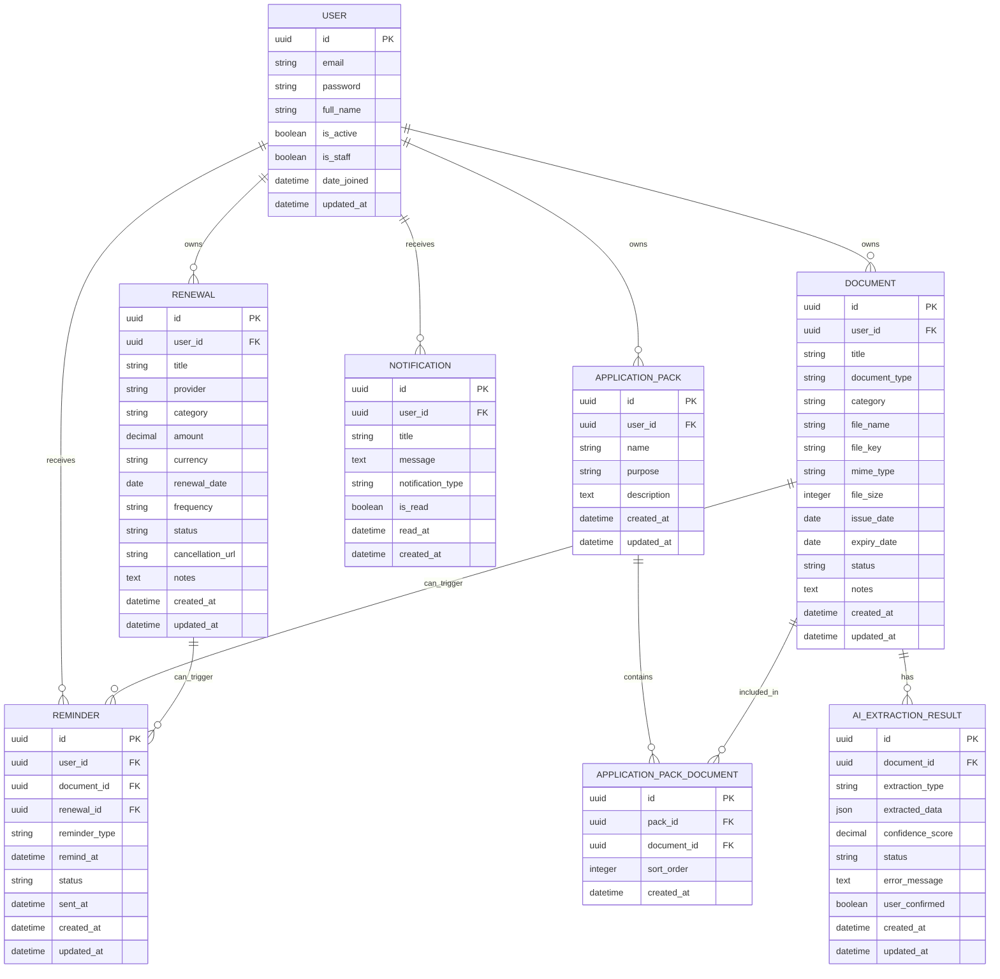

# DueNest Database Design

**Version:** v0.1  
**Status:** Planning  
**Database:** PostgreSQL  
**Backend ORM:** Django ORM  
**Architecture Style:** SaaS-ready modular monolith  
**Primary Goal:** Design a secure, scalable, and maintainable relational data model for documents, deadlines, renewals, reminders, notifications, and application packs.

---

## 1. Database Design Summary

DueNest will use **PostgreSQL** as the primary database because the product depends on structured, relational, user-owned data.

The database will store:

- users
- document metadata
- renewal records
- reminder records
- in-app notifications
- application packs
- document-pack relationships
- AI extraction results later
- audit and sharing records later

The database will **not** store actual document file contents directly. Uploaded files will be stored in local storage during development and S3-compatible object storage in production. PostgreSQL will store only metadata, ownership, file references, dates, statuses, and relationships.

---

## 2. Database Design Goals

| Goal | Description |
| --- | --- |
| Security | Ensure every user-owned record is properly isolated |
| Data integrity | Use foreign keys, constraints, and clear relationships |
| Query performance | Support fast dashboard, deadline, and renewal queries |
| Extensibility | Allow future AI extraction, sharing, workspaces, and audit logs |
| Maintainability | Keep models simple, readable, and aligned with product modules |
| SaaS readiness | Prepare for multi-user, future workspace, and production deployment |
| File safety | Store file metadata in the database and files outside the database |

---

## 3. Core Entity Overview

| Entity | Purpose |
| --- | --- |
| `User` | Represents an authenticated DueNest user |
| `Document` | Stores metadata for uploaded documents |
| `Renewal` | Tracks subscriptions, contracts, warranties, domains, licenses, and recurring obligations |
| `Reminder` | Stores upcoming reminder events linked to documents or renewals |
| `Notification` | Stores in-app notifications for users |
| `ApplicationPack` | Represents a reusable bundle of documents for applications |
| `ApplicationPackDocument` | Join table between application packs and documents |
| `AIExtractionResult` | Stores future AI extraction output and confidence scores |
| `Workspace` | Future entity for family/team collaboration |
| `ShareLink` | Future entity for secure expiring document sharing |
| `AuditLog` | Future entity for tracking sensitive actions |

---

## 4. High-Level ERD



---

## 5. Entity Relationship Summary

| Relationship | Type | Description |
| --- | --- | --- |
| User → Document | One-to-many | One user can own many documents |
| User → Renewal | One-to-many | One user can create many renewal records |
| User → Reminder | One-to-many | One user can receive many reminders |
| User → Notification | One-to-many | One user can receive many notifications |
| User → ApplicationPack | One-to-many | One user can create many application packs |
| Document → Reminder | One-to-many | One document can trigger multiple reminders |
| Renewal → Reminder | One-to-many | One renewal can trigger multiple reminders |
| ApplicationPack → Document | Many-to-many | A pack can contain many documents, and one document can appear in many packs |
| Document → AIExtractionResult | One-to-many | One document may have multiple extraction attempts |

---

## 6. Naming Conventions

### Django App Names

```txt
users
documents
renewals
reminders
notifications
application_packs
ai_extraction
```

### Model Names

```txt
User
Document
Renewal
Reminder
Notification
ApplicationPack
ApplicationPackDocument
AIExtractionResult
```

### Table Names

Django can generate table names automatically, but explicit names may be used for clarity:

```txt
users_user
documents_document
renewals_renewal
reminders_reminder
notifications_notification
application_packs_applicationpack
application_packs_applicationpackdocument
ai_extraction_aiextractionresult
```

### Primary Keys

All main tables should use UUID primary keys.

Reason:

- safer for public-facing APIs
- harder to enumerate than sequential IDs
- better for future distributed systems
- commonly used in SaaS products

---

## 7. User Model

### Purpose

Represents a registered user of DueNest.

DueNest should use a custom user model from the beginning because changing the user model later in Django can be difficult.

### Model: `User`

| Field | Type | Required | Notes |
| --- | --- | --- | --- |
| `id` | UUID | Yes | Primary key |
| `email` | EmailField | Yes | Unique login identifier |
| `password` | String | Yes | Managed by Django auth |
| `full_name` | CharField | Yes | User display name |
| `is_active` | Boolean | Yes | Default `True` |
| `is_staff` | Boolean | Yes | Admin access flag |
| `date_joined` | DateTime | Yes | Account creation time |
| `updated_at` | DateTime | Yes | Last profile update |

### Constraints

| Constraint | Purpose |
| --- | --- |
| Unique `email` | Prevent duplicate accounts |
| Non-null `full_name` | Ensure profile completeness |

### Indexes

| Index | Purpose |
| --- | --- |
| `email` | Fast login lookup |
| `date_joined` | Admin/user analytics later |

---

## 8. Document Model

### Purpose

Stores metadata for uploaded user documents.

The actual file is stored outside the database. The database stores file reference information and metadata.

### Implemented (v1 — metadata only)

The first shipped version of this model (`apps.documents`) intentionally stores
**metadata only**: there are no file fields, OCR, AI, or reminders yet. It also
differs from the longer-term plan below in a few ways:

- Primary keys are auto-increment integers (consistent with the existing
  `users.User` model), not UUIDs — UUIDs can be revisited later.
- The owner field is named `owner` (ForeignKey to `users.User`,
  `related_name="documents"`).
- `category` is a nullable ForeignKey to a new shared `DocumentCategory` model
  (see below) rather than a free-text field.
- Status choices are `active`, `expired`, `renewal_due`, `archived`.

Implemented `Document` fields:

| Field | Type | Required | Notes |
| --- | --- | --- | --- |
| `id` | BigAutoField | Yes | Primary key |
| `owner` | ForeignKey(User) | Yes | Owner; set from `request.user`, read-only via API |
| `category` | ForeignKey(DocumentCategory) | No | Nullable; `SET_NULL` on delete |
| `title` | CharField | Yes | User-defined title |
| `document_type` | CharField | No | Passport, visa, contract, etc. (free text) |
| `issuer` | CharField | No | Issuing authority |
| `country` | CharField | No | Issuing country |
| `reference_number` | CharField | No | Nullable document/reference number |
| `issue_date` | DateField | No | Optional |
| `expiry_date` | DateField | No | Optional; not before `issue_date` |
| `renewal_date` | DateField | No | Optional; not after `expiry_date` |
| `notes` | TextField | No | User notes |
| `status` | CharField | Yes | `active`, `expired`, `renewal_due`, `archived` (default `active`) |
| `created_at` | DateTime | Yes | Record creation time |
| `updated_at` | DateTime | Yes | Last update time |

Implemented `DocumentCategory` fields: `id`, `name` (unique), `slug` (unique,
auto-derived from name), `description`, `created_at`, `updated_at`. Categories
are a shared controlled vocabulary, not user-owned.

Implemented indexes: `(owner, status)` and `(owner, expiry_date)`; default
ordering is `-created_at`.

#### Implemented `DocumentFile` (file attachments)

Files attached to a `Document` (metadata + a stored blob). Ownership is
enforced through the parent document (`file.document.owner`).

| Field | Type | Notes |
| --- | --- | --- |
| `id` | BigAutoField | Primary key |
| `document` | ForeignKey(Document) | `related_name="files"`, `CASCADE` |
| `uploaded_by` | ForeignKey(User) | Set from `request.user`, read-only via API |
| `file` | FileField | Stored at `media/documents/user_<id>/document_<id>/<uuid><ext>` |
| `original_filename` | CharField | Display only — never used to build the path |
| `content_type` | CharField | Client-reported MIME type |
| `file_size` | PositiveIntegerField | Bytes |
| `checksum` | CharField(64) | SHA-256 hex of the uploaded bytes |
| `created_at` / `updated_at` | DateTime | Timestamps |

- Storage path uses a UUID filename (user-supplied names are not trusted for
  paths). Index on `(document, created_at)`; ordering `-created_at`.
- Local files live under `MEDIA_ROOT` (`backend/media/`, git-ignored). They are
  served only through the authenticated download endpoint, never as public
  static media.
- **TODO (production):** move blobs to private object storage (S3-compatible)
  with signed, time-limited access.

> The table below is the **longer-term planned** design (file storage, UUIDs,
> richer status calculation). It is kept for reference and will be folded into
> the implemented model as file upload and related features land.

### Model: `Document` (planned)

| Field | Type | Required | Notes |
| --- | --- | --- | --- |
| `id` | UUID | Yes | Primary key |
| `user` | ForeignKey(User) | Yes | Owner of the document |
| `title` | CharField | Yes | User-defined title |
| `document_type` | CharField | Yes | Passport, visa, transcript, CV, contract, etc. |
| `category` | CharField | Yes | Personal, academic, finance, legal, work, etc. |
| `file_name` | CharField | Yes | Original file name |
| `file_key` | CharField | Yes | Local path or object storage key |
| `mime_type` | CharField | Yes | File MIME type |
| `file_size` | PositiveIntegerField | Yes | File size in bytes |
| `issue_date` | DateField | No | Optional issue date |
| `expiry_date` | DateField | No | Optional expiry date |
| `status` | CharField | Yes | Valid, expiring soon, expired, no expiry |
| `notes` | TextField | No | User notes |
| `created_at` | DateTime | Yes | Record creation time |
| `updated_at` | DateTime | Yes | Last update time |

### Suggested Document Types

```txt
passport
visa
student_pass
national_id
driver_license
insurance
certificate
transcript
cv_resume
recommendation_letter
contract
invoice
receipt
warranty
domain
business_license
other
```

### Suggested Categories

```txt
personal
academic
immigration
finance
legal
work
business
subscription
health
travel
other
```

### Suggested Status Values

```txt
valid
expiring_soon
expired
no_expiry
archived
```

### Status Calculation Rules

| Condition | Status |
| --- | --- |
| `expiry_date` is null | `no_expiry` |
| `expiry_date` < today | `expired` |
| `expiry_date` within next 30 days | `expiring_soon` |
| `expiry_date` greater than 30 days away | `valid` |
| User archives document | `archived` |

### Indexes

| Index | Purpose |
| --- | --- |
| `(user, expiry_date)` | Fast dashboard queries for upcoming expiries |
| `(user, status)` | Fast filtering by status |
| `(user, category)` | Fast filtering by category |
| `(user, document_type)` | Fast filtering by document type |
| `created_at` | Sorting recent uploads |

### Security Rules

- A user can only access documents where `document.user_id == request.user.id`.
- Uploaded files must not be publicly accessible by default.
- File access must be controlled by backend permission checks or signed URLs later.
- File contents must not be logged.

---

## 9. Renewal Model

### Purpose

Tracks subscriptions, contracts, warranties, insurance, licenses, domains, hosting, and other recurring obligations.

### Model: `Renewal`

| Field | Type | Required | Notes |
| --- | --- | --- | --- |
| `id` | UUID | Yes | Primary key |
| `user` | ForeignKey(User) | Yes | Owner of renewal |
| `title` | CharField | Yes | Renewal name |
| `provider` | CharField | No | Provider/vendor name |
| `category` | CharField | Yes | Software, insurance, domain, legal, etc. |
| `amount` | DecimalField | No | Renewal cost |
| `currency` | CharField | No | ISO-style currency code |
| `renewal_date` | DateField | Yes | Next renewal date |
| `frequency` | CharField | Yes | Monthly, yearly, custom, etc. |
| `status` | CharField | Yes | Active, due soon, expired, cancelled, archived |
| `cancellation_url` | URLField | No | Link to cancel or manage service |
| `notes` | TextField | No | User notes |
| `created_at` | DateTime | Yes | Record creation time |
| `updated_at` | DateTime | Yes | Last update time |

### Suggested Categories

```txt
software
streaming
education
hosting
domain
insurance
legal
business
membership
utilities
finance
other
```

### Suggested Frequency Values

```txt
one_time
weekly
monthly
quarterly
semi_annual
annual
custom
```

### Suggested Status Values

```txt
active
due_soon
overdue
cancelled
archived
```

### Indexes

| Index | Purpose |
| --- | --- |
| `(user, renewal_date)` | Fast dashboard query for upcoming renewals |
| `(user, status)` | Fast filtering by status |
| `(user, category)` | Fast category filtering |
| `(user, provider)` | Provider search/filtering |
| `created_at` | Sorting by created date |

### Business Rules

- `renewal_date` is required.
- `amount` can be null because not all renewals have a known cost.
- `currency` should default to a user preference later.
- Cancelled renewals should remain stored for history unless deleted by user.

---

## 10. Reminder Model

### Purpose

Stores scheduled reminders for documents, renewals, and future application pack deadlines.

A reminder can be linked to either a document or a renewal. In future versions, reminders may also be linked to application packs, share links, or custom tasks.

### Model: `Reminder`

| Field | Type | Required | Notes |
| --- | --- | --- | --- |
| `id` | UUID | Yes | Primary key |
| `user` | ForeignKey(User) | Yes | Reminder owner |
| `document` | ForeignKey(Document) | No | Optional linked document |
| `renewal` | ForeignKey(Renewal) | No | Optional linked renewal |
| `reminder_type` | CharField | Yes | Document expiry, renewal, custom, etc. |
| `remind_at` | DateTime | Yes | When reminder should trigger |
| `status` | CharField | Yes | Pending, sent, failed, cancelled |
| `sent_at` | DateTime | No | When reminder was sent |
| `created_at` | DateTime | Yes | Record creation time |
| `updated_at` | DateTime | Yes | Last update time |

### Suggested Reminder Types

```txt
document_expiry
renewal_due
application_deadline
custom
```

### Suggested Status Values

```txt
pending
sent
failed
cancelled
```

### Integrity Rule

At least one linked target should exist:

```txt
document_id is not null OR renewal_id is not null
```

In Django, this can be enforced through model validation and optionally database constraints.

### Indexes

| Index | Purpose |
| --- | --- |
| `(user, remind_at)` | Fast reminder lookup |
| `(status, remind_at)` | Worker query for pending reminders |
| `(user, status)` | User filtering |
| `(document)` | Linked document reminders |
| `(renewal)` | Linked renewal reminders |

---

## 11. Notification Model

### Purpose

Stores in-app notifications for the user.

Notifications are different from reminders. A reminder is a scheduled event. A notification is what the user sees after something is triggered or generated.

### Model: `Notification`

| Field | Type | Required | Notes |
| --- | --- | --- | --- |
| `id` | UUID | Yes | Primary key |
| `user` | ForeignKey(User) | Yes | Notification recipient |
| `title` | CharField | Yes | Short notification title |
| `message` | TextField | Yes | Notification body |
| `notification_type` | CharField | Yes | Expiry, renewal, system, etc. |
| `is_read` | Boolean | Yes | Default `False` |
| `read_at` | DateTime | No | When user read it |
| `created_at` | DateTime | Yes | Notification creation time |

### Suggested Notification Types

```txt
document_expiring
document_expired
renewal_due
reminder
system
ai_extraction_ready
application_pack_ready
```

### Indexes

| Index | Purpose |
| --- | --- |
| `(user, is_read)` | Fast unread notification query |
| `(user, created_at)` | Recent notifications |
| `notification_type` | Filtering by type |

---

## 12. Application Pack Model

### Purpose

Represents a reusable group of documents prepared for a specific purpose such as a scholarship, job, visa, internship, university application, grant, or business submission.

### Model: `ApplicationPack`

| Field | Type | Required | Notes |
| --- | --- | --- | --- |
| `id` | UUID | Yes | Primary key |
| `user` | ForeignKey(User) | Yes | Owner of the pack |
| `name` | CharField | Yes | Pack name |
| `purpose` | CharField | Yes | Scholarship, job, visa, etc. |
| `description` | TextField | No | Optional description |
| `created_at` | DateTime | Yes | Record creation time |
| `updated_at` | DateTime | Yes | Last update time |

### Suggested Purpose Values

```txt
job
scholarship
visa
internship
university
grant
business
custom
```

### Indexes

| Index | Purpose |
| --- | --- |
| `(user, purpose)` | Filter packs by purpose |
| `(user, created_at)` | Show recent packs |
| `(user, name)` | Search by pack name |

---

## 13. Application Pack Document Model

### Purpose

Join table between `ApplicationPack` and `Document`.

A document can appear in many packs, and a pack can contain many documents.

### Model: `ApplicationPackDocument`

| Field | Type | Required | Notes |
| --- | --- | --- | --- |
| `id` | UUID | Yes | Primary key |
| `pack` | ForeignKey(ApplicationPack) | Yes | Parent application pack |
| `document` | ForeignKey(Document) | Yes | Linked document |
| `sort_order` | PositiveIntegerField | No | Optional order in the pack |
| `created_at` | DateTime | Yes | Record creation time |

### Constraints

| Constraint | Purpose |
| --- | --- |
| Unique `(pack, document)` | Prevent duplicate documents in the same pack |

### Security Rule

A pack can only include documents owned by the same user who owns the pack.

This must be enforced at the service/API layer.

---

## 14. AI Extraction Result Model

### Purpose

Stores future AI extraction attempts for uploaded documents.

This should not be required for v0.1, but designing for it now helps avoid major refactoring later.

### Model: `AIExtractionResult`

| Field | Type | Required | Notes |
| --- | --- | --- | --- |
| `id` | UUID | Yes | Primary key |
| `document` | ForeignKey(Document) | Yes | Related document |
| `extraction_type` | CharField | Yes | Metadata, expiry, renewal, classification, etc. |
| `extracted_data` | JSONField | Yes | Structured AI output |
| `confidence_score` | DecimalField | No | AI confidence score |
| `status` | CharField | Yes | Pending, completed, failed, confirmed |
| `error_message` | TextField | No | Error details if failed |
| `user_confirmed` | Boolean | Yes | Default `False` |
| `created_at` | DateTime | Yes | Extraction creation time |
| `updated_at` | DateTime | Yes | Last update time |

### Suggested Extraction Types

```txt
metadata
document_classification
expiry_date
renewal_date
provider
amount
full_extraction
```

### Suggested Status Values

```txt
pending
processing
completed
failed
confirmed
rejected
```

### Example `extracted_data`

```json
{
  "document_type": "passport",
  "expiry_date": "2028-09-14",
  "country": "Guinea",
  "confidence": 0.91,
  "recommended_action": "Set a renewal preparation reminder 6 months before expiry."
}
```

### AI Safety Rules

- AI extracted data should not automatically overwrite user-confirmed data.
- Users must confirm or edit extracted values.
- Confidence scores should be visible to the user.
- Failed extractions should not block file upload.
- Sensitive document contents should not be logged.

---

## 15. Future Workspace Model

### Purpose

A future version may support family or team workspaces.

This should not be built in v0.1.

### Future Model: `Workspace`

| Field | Type | Notes |
| --- | --- |
| `id` | UUID | Primary key |
| `name` | CharField | Workspace name |
| `owner` | ForeignKey(User) | Workspace creator |
| `workspace_type` | CharField | Family, team, business |
| `created_at` | DateTime | Creation time |
| `updated_at` | DateTime | Update time |

### Future Model: `WorkspaceMember`

| Field | Type | Notes |
| --- | --- |
| `id` | UUID | Primary key |
| `workspace` | ForeignKey(Workspace) | Related workspace |
| `user` | ForeignKey(User) | Member user |
| `role` | CharField | Owner, admin, member, viewer |
| `created_at` | DateTime | Creation time |

This will support shared documents, team renewals, business licenses, and family document management later.

---

## 16. Future Share Link Model

### Purpose

A future version may allow users to share application packs through secure expiring links.

This should not be built in v0.1.

### Future Model: `ShareLink`

| Field | Type | Notes |
| --- | --- |
| `id` | UUID | Primary key |
| `user` | ForeignKey(User) | Link creator |
| `application_pack` | ForeignKey(ApplicationPack) | Shared pack |
| `token_hash` | CharField | Hashed token |
| `expires_at` | DateTime | Link expiration time |
| `revoked_at` | DateTime | Revocation time |
| `access_count` | Integer | Number of views/downloads |
| `created_at` | DateTime | Creation time |

### Security Rules

- Store only hashed share tokens.
- Links must expire.
- Users must be able to revoke links.
- Access should be logged.
- Sensitive files should not be permanently public.

---

## 17. Future Audit Log Model

### Purpose

Audit logs may be added later to track sensitive actions.

### Future Model: `AuditLog`

| Field | Type | Notes |
| --- | --- |
| `id` | UUID | Primary key |
| `user` | ForeignKey(User) | Actor |
| `action` | CharField | Upload, delete, share, download, etc. |
| `resource_type` | CharField | Document, renewal, pack, etc. |
| `resource_id` | UUID | Target resource |
| `metadata` | JSONField | Extra event data |
| `ip_address` | GenericIPAddressField | Optional |
| `user_agent` | TextField | Optional |
| `created_at` | DateTime | Event time |

Audit logs are valuable for security, trust, and future team/business features.

---

## 18. Data Ownership Rules

Every user-owned table must enforce ownership through foreign keys and API-level filtering.

### Ownership Rules

| Entity | Owner Field |
| --- | --- |
| Document | `user` |
| Renewal | `user` |
| Reminder | `user` |
| Notification | `user` |
| ApplicationPack | `user` |
| AIExtractionResult | indirectly through `document.user` |

### Critical Rule

All protected queries must be scoped to the authenticated user.

Example:

```python
Document.objects.filter(user=request.user)
```

Never allow direct lookup by ID without ownership filtering.

Unsafe:

```python
Document.objects.get(id=document_id)
```

Safe:

```python
Document.objects.get(id=document_id, user=request.user)
```

---

## 19. Deletion Strategy

Deletion must be handled carefully because DueNest may store sensitive documents.

### v0.1 Deletion Approach

| Entity | Strategy |
| --- | --- |
| Document | Hard delete metadata and remove file from storage |
| Renewal | Hard delete or archive depending on UI decision |
| Reminder | Delete when parent is deleted |
| Notification | Keep or delete based on user action |
| ApplicationPack | Delete pack and join records, not documents |
| ApplicationPackDocument | Delete join record only |

### Future Deletion Improvements

- soft delete for recovery
- trash system
- permanent delete after retention period
- audit log for deletion
- storage cleanup jobs
- user data export and account deletion

---

## 20. Data Retention Strategy

v0.1 can keep retention simple.

### Initial Retention Rules

- User documents remain until deleted by the user.
- Deleted documents should remove both metadata and file.
- Notifications may remain until deleted or marked read.
- Reminder history may remain for user reference.
- Failed AI extraction results may be retained for debugging but must not expose sensitive content.

### Future Retention Rules

- allow account data export
- allow full account deletion
- define retention windows for audit logs
- define retention windows for temporary ZIP exports
- automatically delete expired share-link temporary files

---

## 21. Indexing Strategy

Indexes should support the most important queries.

### Dashboard Queries

The dashboard needs:

- documents expiring soon
- expired documents
- renewals due soon
- unread notifications
- upcoming reminders

Recommended indexes:

```txt
Document(user, expiry_date)
Document(user, status)
Renewal(user, renewal_date)
Renewal(user, status)
Reminder(status, remind_at)
Reminder(user, remind_at)
Notification(user, is_read)
ApplicationPack(user, created_at)
```

### Search and Filtering

Later search may require:

- title search
- provider search
- category filtering
- document type filtering

PostgreSQL full-text search can be considered later if needed.

---

## 22. Constraints Strategy

Database constraints should protect important invariants.

### Recommended Constraints

| Model | Constraint |
| --- | --- |
| User | Unique email |
| ApplicationPackDocument | Unique pack-document pair |
| Reminder | At least one target: document or renewal |
| Renewal | Amount must be greater than or equal to zero if present |
| Document | File size must be greater than zero |
| AIExtractionResult | Confidence score between 0 and 1 if present |

Some constraints may be implemented in Django validation first and migrated to database constraints later.

---

## 23. Status and Enum Strategy

Django `TextChoices` should be used for status-like fields.

Example:

```python
class DocumentStatus(models.TextChoices):
    VALID = "valid", "Valid"
    EXPIRING_SOON = "expiring_soon", "Expiring Soon"
    EXPIRED = "expired", "Expired"
    NO_EXPIRY = "no_expiry", "No Expiry"
    ARCHIVED = "archived", "Archived"
```

Using `TextChoices` improves:

- readability
- validation
- API consistency
- frontend mapping
- documentation

---

## 24. File Metadata Strategy

Document files should be represented by metadata records.

### Metadata Fields

| Field | Purpose |
| --- | --- |
| `file_name` | Original uploaded file name |
| `file_key` | Storage path or object storage key |
| `mime_type` | File type validation |
| `file_size` | Size validation and UI display |
| `created_at` | Upload time |
| `updated_at` | Last metadata update |

### Why Store Metadata Separately?

This allows DueNest to:

- display files without loading them
- validate file ownership
- support future S3 storage
- support signed URLs
- support document preview later
- track file lifecycle events

---

## 25. Dashboard Query Requirements

The dashboard should be supported by efficient database queries.

### Dashboard Cards

| Card | Query |
| --- | --- |
| Expiring Documents | Documents where `expiry_date` is within the next 30 days |
| Expired Documents | Documents where `expiry_date` is before today |
| Upcoming Renewals | Renewals where `renewal_date` is within the next 30 days |
| Monthly Cost | Sum active monthly renewals |
| Yearly Cost | Sum annualized active renewals |
| Unread Notifications | Notifications where `is_read = False` |
| Upcoming Reminders | Reminders where `remind_at` is upcoming |

### Performance Notes

- Use indexes on date fields.
- Use ownership filtering first.
- Use aggregation carefully.
- Avoid loading full document records when only counts are needed.

---

## 26. Application Pack Export Strategy

Application pack export may produce ZIP files.

### v0.1 Approach

- User selects documents.
- Backend verifies ownership of all selected documents.
- Backend generates ZIP on demand.
- ZIP may be returned directly or temporarily stored.
- Temporary ZIP files should not be kept permanently.

### Future Approach

- Generate ZIP asynchronously for large packs.
- Store temporary ZIP in object storage.
- Expire temporary ZIP after a defined period.
- Log download events.
- Use secure share links for external access.

---

## 27. Security Considerations

DueNest may handle sensitive data, so database design must support security.

### Security Requirements

- All user-owned records must include ownership.
- All queries must enforce ownership.
- Sensitive file content must not be stored directly in the database.
- Sensitive file content must not be logged.
- AI extracted content should be handled carefully.
- Share links must be secure and expiring in future versions.
- Audit logs should be added before advanced sharing or team features.

### Avoid

- Public file URLs by default
- Direct object storage exposure
- Sequential public IDs
- Unscoped object lookups
- Logging uploaded document contents
- Storing raw share tokens

---

## 28. Migration Strategy

Django migrations should be created incrementally.

### Recommended Migration Order

1. Create custom user model
2. Create document model
3. Create renewal model
4. Create reminder model
5. Create notification model
6. Create application pack model
7. Create application pack document model
8. Add AI extraction model later

### Important Rule

The custom user model must be created before the first production migration is finalized.

Changing the user model later is difficult in Django.

---

## 29. Future Database Evolution

DueNest may later add:

- workspace tables
- workspace member roles
- share links
- audit logs
- billing tables
- subscription plan tables
- document versioning
- document tags
- external integrations
- OAuth connection records
- AI prompt/extraction versioning
- user preferences
- notification channel preferences

These should be added only when product needs justify them.

---

## 30. Database Non-Goals for v0.1

The following are intentionally not part of the first database implementation:

- team workspaces
- role-based access control
- billing plans
- payment records
- bank transactions
- full-text document content indexing
- vector embeddings
- document version history
- external OAuth connections
- public sharing tables
- audit log table
- enterprise organization model

These can be added later without blocking the first MVP.

---

## 31. v0.1 Database Acceptance Criteria

The v0.1 database design is acceptable if:

- users can register and authenticate
- users can own documents
- users can own renewal records
- users can own reminders
- users can receive notifications
- users can create application packs
- users can add documents to application packs
- documents can track expiry status
- renewals can track due dates and cost
- dashboard queries can be supported efficiently
- user-owned data is isolated
- uploaded file content is not stored directly in PostgreSQL
- future AI extraction can be added without redesign

---

## 32. Summary

The DueNest database is designed to support a secure, SaaS-ready life admin platform.

The first version should prioritize:

- user ownership
- document metadata
- renewal tracking
- reminder records
- notification records
- application packs
- clean relationships
- strong indexing for dashboard queries
- safe file metadata handling

The design intentionally avoids unnecessary complexity in v0.1 while leaving clear paths for AI extraction, secure sharing, team workspaces, audit logs, and SaaS billing later.