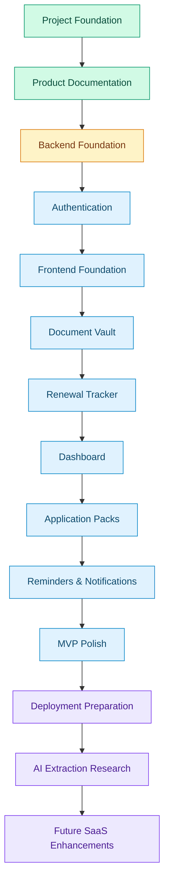
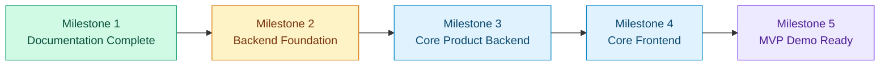

# DueNest Roadmap

**Version:** v0.1  
**Status:** Planning  
**Product Type:** SaaS-ready life admin platform  
**Execution Style:** Small, consistent weekly progress  
**Timeline Start:** Monday, June 8, 2026  
**Target MVP Date:** Sunday, October 11, 2026  
**Backup MVP Date:** Sunday, October 25, 2026  
**Primary Constraint:** Built as a side project while balancing studies, BaraLink, and other responsibilities  

---

## 1. Roadmap Summary

This roadmap defines how DueNest will move from a well-documented product concept to a working MVP.

DueNest will be built gradually through focused sprints. Each sprint should produce a clear deliverable that can be committed, reviewed, tested, and demonstrated.

The goal is not to build everything at once. The goal is to build the right foundation first, then progressively add useful and technically impressive features.

---

## 2. Execution Philosophy

DueNest should be built with the following execution principles:

- Build consistently, even if progress is small.
- Prioritize working features over perfect plans.
- Avoid overengineering in the early stage.
- Keep every sprint focused.
- Use branches and pull requests for clean progress.
- Document decisions before implementation.
- Build the manual product before AI automation.
- Treat security as a core product requirement.
- Make every major feature demoable.
- Keep the project impressive, but realistic.

---

## 3. Roadmap Visualization



---

## 4. Product Build Order

DueNest will be built in this order:

1. Project foundation
2. Product documentation
3. Backend foundation
4. Authentication
5. Frontend foundation
6. Document vault
7. Renewal tracker
8. Dashboard
9. Application packs
10. Reminders and notifications
11. MVP polish
12. Deployment preparation
13. AI extraction research
14. Secure sharing
15. Integrations
16. SaaS polish

---

## 5. Current Development Stage

| Area | Status |
| --- | --- |
| Branding | Completed |
| Repository setup | Completed |
| README | Completed |
| Product blueprint | Completed |
| Architecture document | Completed |
| Database design | Completed |
| API specification | Completed |
| Security plan | Completed |
| Roadmap | In Progress |
| Backend setup | Not Started |
| Frontend setup | Not Started |
| MVP implementation | Not Started |
| Documents module gaps (trash/restore, bundles, proof of submission, physical location, emergency access packs, plan limits foundation) | Completed |
| Document intelligence polish (confidence score, what-is-missing scanner, health overview, last safe action date, tags, custom fields, lifecycle status, renewal history, appointments, cost tracking) | Completed |
| Organization / Team Workspace V1 | Completed |

---

## 6. Version Roadmap


---

## 7. Version Details

### v0.1 — Core MVP

Focus: manual but useful product.

v0.1 should allow a user to:

- register and log in
- access a protected dashboard
- upload documents
- add document metadata
- track document expiry dates
- create renewal records
- view upcoming deadlines
- create application packs
- select documents for a pack
- export or prepare document bundles
- receive basic in-app reminders or notifications

### v0.2 — Smart Automation

Focus: AI-assisted document processing.

Planned features:

- PDF text extraction
- OCR foundation
- AI document classification
- expiry date extraction
- renewal date extraction
- provider and amount extraction
- confidence score
- user confirmation flow

### v0.3 — Secure Sharing and Application Packs

Focus: making application packs more powerful.

Planned features:

- application pack templates
- secure share links
- expiring links
- access logs
- revoke access
- ZIP export improvements
- application-specific checklists

**Sharing consolidation (complete):** the three parallel share systems (Quick
Share, single-file links, Share Rooms) are unified onto Quick Share as the single
engine, so sharing is identical wherever you start. The engine covers all three
systems' capabilities — privacy screen, document/proof items, and per-access
view/download caps (`max_views`/`max_downloads`, enforced server-side) — and every
entry point (document files, the File Inbox, the document Sharing tab, and Share
Rooms creation) opens the one Quick Share wizard, which surfaces privacy-screen
and access-limit controls. Existing `DocumentFileShareLink` / `ShareRoom` links
keep working (no migration); their public endpoints and the Share Rooms list
remain for back-compat. See `docs/architecture.md` §35 "Anatomy of Sharing".

### v0.4 — Integrations

Focus: connecting DueNest with user workflows.

Planned features:

- Gmail renewal scanning
- Google Calendar reminders
- email reminders
- cloud storage integration
- optional WhatsApp or Telegram reminders

### v0.5 — Family and Team Workspace

Focus: collaboration.

Planned features:

- family workspace
- team workspace
- shared documents
- role-based access control
- shared renewals
- member invitations

Status note: Organization / Team Workspace V1 is now implemented as a safe
foundation for small teams and community organizations. It includes
organization roles, invites, organization documents/files, document requests,
public upload links, collection campaigns, bundles, secure room metadata,
calendar/timeline/activity summaries, readiness reports, plan usage, founder
aggregate metrics, and frontend routes. Deferred items include family
workspaces, shared renewals, personal-to-organization copy/attach, organization
file preview/download, secure room downloads/ZIP export, email delivery,
advanced templates, and billing.

### v1.0 — SaaS-Ready Release

Focus: public demo or launch readiness.

Planned features:

- polished landing page
- demo account
- deployment
- CI/CD
- automated tests
- monitoring
- production security hardening
- pricing page
- billing foundation
- case study and demo video

---

## 8. Dated Execution Timeline with Buffers

This execution timeline starts from **Monday, June 8, 2026**.

The plan is intentionally realistic because DueNest is being built as a side project while balancing studies, BaraLink, and other responsibilities.

The timeline includes:

- focused build weeks
- buffer weeks
- review and polish time
- flexible weekend execution
- room for delays without breaking the whole roadmap


> Dates are planning targets, not strict deadlines. If a week becomes busy, move unfinished work into the nearest buffer week.

---

## 9. Week-by-Week Execution Plan

| Week | Date Range | Focus | Expected Output | Buffer Strategy |
| --- | --- | --- | --- | --- |
| Week 1 | Jun 8 – Jun 14, 2026 | Backend foundation | Django project created inside `backend/` | Keep scope small: project setup only |
| Week 2 | Jun 15 – Jun 21, 2026 | Backend configuration | Settings, environment variables, database setup | Use weekend to fix setup issues |
| Week 3 | Jun 22 – Jun 28, 2026 | Authentication API | Register, login, refresh token, current user endpoint | Focus only on backend auth |
| Week 4 | Jun 29 – Jul 5, 2026 | Buffer and auth cleanup | Auth tests, cleanup, documentation updates | Dedicated buffer week |
| Week 5 | Jul 6 – Jul 12, 2026 | Frontend foundation | Next.js project, Tailwind, shadcn/ui setup | Keep UI simple first |
| Week 6 | Jul 13 – Jul 19, 2026 | Frontend auth pages | Landing page, login, register, dashboard shell | Connect only basic API calls |
| Week 7 | Jul 20 – Jul 26, 2026 | Integration buffer | Fix frontend-backend issues | Dedicated buffer week |
| Week 8 | Jul 27 – Aug 2, 2026 | Document backend | Document model, serializer, endpoints | Backend first, UI later |
| Week 9 | Aug 3 – Aug 9, 2026 | File upload and access | Upload, list, download, delete documents | Prioritize security checks |
| Week 10 | Aug 10 – Aug 16, 2026 | Document vault buffer/UI | Document vault page and cleanup | Dedicated buffer week |
| Week 11 | Aug 17 – Aug 23, 2026 | Renewal tracker backend | Renewal model and API endpoints | Keep it CRUD + status logic |
| Week 12 | Aug 24 – Aug 30, 2026 | Renewal UI and dashboard backend | Renewal page and dashboard summary endpoint | Avoid overbuilding charts |
| Week 13 | Aug 31 – Sep 6, 2026 | Dashboard buffer | Dashboard polish, empty states, summary cards | Dedicated buffer week |
| Week 14 | Sep 7 – Sep 13, 2026 | Application pack backend | Pack model, pack-document relationship, endpoints | Backend first |
| Week 15 | Sep 14 – Sep 20, 2026 | Application pack UI and ZIP export | Pack creation, document selector, ZIP export | Keep secure sharing out of v0.1 |
| Week 16 | Sep 21 – Sep 27, 2026 | Buffer, tests, docs | Fix bugs, add tests, update documentation | Dedicated buffer week |
| Week 17 | Sep 28 – Oct 4, 2026 | Reminders and notifications | Reminder model, notification model, basic in-app alerts | Email reminders can wait |
| Week 18 | Oct 5 – Oct 11, 2026 | MVP polish and demo prep | Clean UI, screenshots, README updates, demo flow | Prepare portfolio presentation |
| Week 19 | Oct 12 – Oct 18, 2026 | Optional deployment prep | Prepare deployment configs | Optional/stretch |
| Week 20 | Oct 19 – Oct 25, 2026 | Optional AI research | Small AI extraction prototype | Optional/stretch |

---

## 10. Buffer Strategy

DueNest is not planned as a full-time project, so buffer time is part of the roadmap by design.

### Weekly Buffer

Each week should leave room for:

- unexpected school work
- BaraLink responsibilities
- debugging
- documentation updates
- unfinished tasks from the previous week

### Dedicated Buffer Weeks

The roadmap includes dedicated buffer weeks:

| Buffer Week | Date Range | Purpose |
| --- | --- | --- |
| Week 4 | Jun 29 – Jul 5, 2026 | Authentication cleanup and tests |
| Week 7 | Jul 20 – Jul 26, 2026 | Frontend-backend integration cleanup |
| Week 10 | Aug 10 – Aug 16, 2026 | Document vault cleanup and UI |
| Week 13 | Aug 31 – Sep 6, 2026 | Dashboard cleanup and polish |
| Week 16 | Sep 21 – Sep 27, 2026 | Application pack tests, docs, and bug fixes |

### Minimum Progress Rule

If a week becomes too busy, the minimum acceptable progress is:

- complete one small task
- make one clean commit
- update one checklist item
- avoid breaking the project

Small progress still counts.

---

## 11. Sprint Roadmap

## Sprint 0 — Project Foundation

**Status:** Completed / In Progress  
**Goal:** Prepare the project foundation before implementation.

### Tasks

- [x] Create GitHub repository
- [x] Clone repository with SSH
- [x] Create monorepo structure
- [x] Add README
- [x] Add brand assets
- [x] Add product blueprint
- [x] Add architecture document
- [x] Add database design
- [x] Add API specification
- [x] Add security plan
- [ ] Add roadmap document

### Deliverable

A clean, professional project foundation ready for backend implementation.

---

## Sprint 1 — Backend Foundation

**Status:** Not Started  
**Target Date:** Jun 8 – Jun 21, 2026  
**Goal:** Set up the Django REST Framework backend.

### Tasks

- [ ] Create Django project inside `backend/`
- [ ] Configure virtual environment
- [ ] Install Django and Django REST Framework
- [ ] Configure project settings
- [ ] Set up environment variables
- [ ] Configure PostgreSQL connection
- [ ] Create modular app structure
- [ ] Add custom user model
- [ ] Configure Django admin
- [ ] Add initial backend README
- [ ] Add basic health check endpoint

### Deliverable

A working Django backend that runs locally and is ready for authentication implementation.

### Definition of Done

- Backend runs locally.
- Django admin works.
- Database connection works.
- Environment variables are used.
- No secrets are committed.
- Basic project structure follows the architecture document.

---

## Sprint 2 — Authentication

**Status:** Not Started  
**Target Date:** Jun 22 – Jul 5, 2026  
**Goal:** Implement secure user registration and login.

### Tasks

- [ ] Create custom user model
- [ ] Create user serializer
- [ ] Create registration endpoint
- [ ] Configure JWT authentication
- [ ] Create login endpoint
- [ ] Create token refresh endpoint
- [ ] Create current user endpoint
- [ ] Add password validation
- [ ] Add authentication tests
- [ ] Update API documentation if needed

### Deliverable

Users can register, log in, refresh tokens, and access a protected profile endpoint.

### Definition of Done

- User can register.
- User can log in.
- Protected endpoint rejects unauthenticated requests.
- Passwords are hashed.
- Duplicate email registration is rejected.
- Tests cover basic authentication flows.

---

## Sprint 3 — Frontend Foundation

**Status:** Not Started  
**Target Date:** Jul 6 – Jul 26, 2026  
**Goal:** Set up the Next.js frontend.

### Tasks

- [ ] Create Next.js app inside `frontend/`
- [ ] Configure TypeScript
- [ ] Configure Tailwind CSS
- [ ] Install shadcn/ui
- [ ] Add global layout
- [ ] Add landing page
- [ ] Add login page
- [ ] Add register page
- [ ] Add dashboard shell
- [ ] Add API client
- [ ] Add environment variable setup

### Deliverable

A working frontend with landing page, auth pages, and dashboard shell.

### Definition of Done

- Frontend runs locally.
- Landing page displays correctly.
- Login and register pages exist.
- Dashboard layout exists.
- Frontend can call backend health check or auth endpoint.

---

## Sprint 4 — Document Vault

**Status:** In Progress (document intelligence foundation complete)
**Target Date:** Jul 27 – Aug 16, 2026  
**Goal:** Build the core document management module.

### Tasks

- [x] Create Document model + DocumentCategory model
- [x] Create document serializer
- [x] Create document endpoints (list/create/retrieve/update/delete)
- [x] Add file upload support (backend `DocumentFile` foundation)
- [x] Add file validation (type + 10 MB size limit)
- [x] Add document listing
- [x] Add document detail endpoint
- [x] Add document update endpoint
- [x] Add document delete endpoint
- [x] Add document download endpoint (controlled, owner-only)
- [x] Add expiry status logic (auto-calculated)
- [x] Add computed document health fields
- [x] Add search, filter, and sort
- [x] Add missing-file and missing-expiry detection
- [x] Add Attention Needed endpoint and dashboard/list UI
- [x] Add document reminder rule model, API, and workspace UI
- [x] Add ownership tests
- [x] Build document vault frontend page (metadata UI)
- [x] Build document file upload frontend UI

### Deliverable

Users can upload, view, edit, delete, download, search, filter, and understand
the urgency of their own documents.

### Definition of Done

- User can upload a document.
- User can see only their documents.
- User cannot access another user’s document.
- File upload validates type and size.
- Expiry status is calculated.
- Attention Needed is scoped to the authenticated user.
- Reminder rules can be created and upcoming dates can be calculated.
- Frontend document vault displays uploaded files.

---

## Sprint 5 — Renewal Tracker

**Status:** Not Started  
**Target Date:** Aug 17 – Aug 30, 2026  
**Goal:** Build subscription and renewal tracking.

### Tasks

- [ ] Create Renewal model
- [ ] Create renewal serializer
- [ ] Create renewal endpoints
- [ ] Add renewal date logic
- [ ] Add status calculation
- [ ] Add cost fields
- [ ] Add category and provider fields
- [ ] Add renewal list page
- [ ] Add create renewal form
- [ ] Add update and delete actions
- [ ] Add ownership tests

### Deliverable

Users can track subscriptions, renewals, costs, providers, and renewal dates.

### Definition of Done

- User can create a renewal.
- User can list renewals.
- User can update renewals.
- User can delete renewals.
- User can see only their own renewals.
- Renewal status is calculated correctly.

---

## Sprint 6 — Dashboard

**Status:** Not Started  
**Target Date:** Aug 24 – Sep 6, 2026  
**Goal:** Build the central overview dashboard.

### Tasks

- [ ] Create dashboard summary endpoint
- [ ] Add document count summary
- [ ] Add expiring documents summary
- [ ] Add expired documents summary
- [ ] Add renewal summary
- [ ] Add upcoming deadlines endpoint
- [ ] Add dashboard cards
- [ ] Add simple charts
- [ ] Add timeline or upcoming actions section
- [ ] Add empty states

### Deliverable

Users can see upcoming deadlines, expiring documents, renewals, and action summaries in one place.

### Definition of Done

- Dashboard loads user-specific data.
- Upcoming documents are shown.
- Upcoming renewals are shown.
- Summary cards work.
- Empty states are clear.
- Queries are scoped to the authenticated user.

---

## Sprint 7 — Application Packs

**Status:** Not Started  
**Target Date:** Sep 7 – Sep 27, 2026  
**Goal:** Allow users to create reusable document packs.

### Tasks

- [ ] Create ApplicationPack model
- [ ] Create ApplicationPackDocument model
- [ ] Create pack endpoints
- [ ] Add document-to-pack endpoint
- [ ] Add remove-document-from-pack endpoint
- [ ] Add pack detail endpoint
- [ ] Add ZIP export endpoint
- [ ] Build application packs frontend page
- [ ] Add pack creation form
- [ ] Add document selector
- [ ] Add ownership validation

### Deliverable

Users can create application packs and add selected documents to them.

### Definition of Done

- User can create a pack.
- User can add documents to a pack.
- User can remove documents from a pack.
- User can export pack documents.
- User cannot add another user’s document to a pack.

---

## Sprint 8 — Reminders and Notifications

**Status:** Not Started  
**Target Date:** Sep 28 – Oct 4, 2026  
**Goal:** Add reminder and notification foundation.

### Tasks

- [ ] Create Reminder model
- [ ] Create Notification model
- [ ] Create reminder endpoints
- [ ] Create notification endpoints
- [ ] Add reminder creation logic
- [ ] Add in-app notification logic
- [ ] Configure Celery
- [ ] Configure Redis
- [ ] Add scheduled reminder task
- [ ] Add notification UI
- [ ] Add security tests

### Deliverable

Users can create reminders and receive in-app notifications for important dates.

### Definition of Done

- Reminder records can be created.
- Upcoming reminders can be listed.
- Notifications can be created.
- Users only see their notifications.
- Celery worker can process reminder tasks locally.

---

## Sprint 9 — MVP Polish

**Status:** Not Started  
**Target Date:** Oct 5 – Oct 11, 2026  
**Goal:** Prepare a presentable MVP demo.

### Tasks

- [ ] Polish landing page
- [ ] Polish dashboard UI
- [ ] Add empty states
- [ ] Add sample demo data
- [ ] Update README
- [ ] Add screenshots
- [ ] Write demo flow
- [ ] Fix known bugs
- [ ] Review security checklist
- [ ] Prepare portfolio case study outline

### Deliverable

A presentable DueNest v0.1 MVP ready for recruiter/demo use.

### Definition of Done

- MVP can be demonstrated end-to-end.
- UI is clean and responsive.
- Core workflows work locally.
- README reflects actual progress.
- Security warnings and demo data are clear.

---

## Sprint 10 — Optional Deployment Preparation

**Status:** Optional / Stretch  
**Target Date:** Oct 12 – Oct 18, 2026  
**Goal:** Prepare deployment configuration.

### Tasks

- [ ] Review backend deployment options
- [ ] Review frontend deployment options
- [ ] Prepare production environment variables
- [ ] Prepare database hosting plan
- [ ] Prepare Redis hosting plan
- [ ] Prepare file storage strategy
- [ ] Add deployment notes

### Deliverable

DueNest is ready for deployment planning.

---

## Sprint 11 — Optional AI Research Prototype

**Status:** Optional / Stretch  
**Target Date:** Oct 19 – Oct 25, 2026  
**Goal:** Explore AI extraction after MVP stability.

### Tasks

- [ ] Test PDF text extraction
- [ ] Test OCR options
- [ ] Test structured metadata extraction
- [ ] Define extraction confidence logic
- [ ] Define user confirmation workflow
- [ ] Update AI extraction plan

### Deliverable

A small research prototype or documented plan for v0.2 AI extraction.

---

## 11.5 Documents-First Build Sequence

DueNest is now sequenced **documents-first**: make the Documents module a
pay-worthy product before expanding into subscriptions, application packs, an AI
assistant, and broader life-admin tasks. The full plan, paid-MVP definition,
prioritization, and data/API/security planning live in
[`document-vault-roadmap.md`](document-vault-roadmap.md).

### Paid MVP (Documents module)

A beautiful, mobile-friendly vault that **thinks for the user**: document
records + type templates, file upload, in-app preview, secure download, smart
expiry/status intelligence, missing-information detection, an "Attention Needed"
inbox, search/filter/sort, a polished detail page, reminder rules, and renewal
checklists — all behind strong ownership checks. Users pay because DueNest helps
them **avoid expiry mistakes, lost-document chaos, and last-minute renewal
stress**.

### Recommended order

```txt
1. Premium authenticated app UI polish            (done)
2. Backend file upload foundation                 (done)
3. Frontend document upload UI                     (done)
4. Backend secure preview/download access          (done)
5. Frontend in-app document preview                (done)
6. Smart status and expiry intelligence            (done)
7. Search, filter, and sort                        (done)
8. Missing-information detection                   (done)
9. Attention Needed inbox                          (done)
10. Renewal reminder rules                         (done: no sending yet)
11. Renewal preparation checklists                  (done)
12. Document detail page upgrade                    (done)
13. Calendar/timeline view                          (done)
14. Secure share links                             (done)
15. OCR-assisted extraction                         (done)
16. Application/renewal bundles                     (done)
17. File/document activity timeline and audit log   (backend foundation done)
18. Version history                                (backend foundation done)
19. Emergency access pack / Emergency Protocol      (done — unlock rules, trusted contacts, locked QR + printable card, off-by-default location, activity log)
20. Export and backup features                      (backend metadata export done)
21. Document onboarding + trust launch polish       (done)
```

Sharing (14) was implemented early as file-level sharing for the document vault.
OCR, bundles, checklists, and the timeline now have working foundations. The
newer vault-maturity items (17–20) have backend foundations. The onboarding and
trust branch adds the private-beta setup checklist, demo data, Trust Center,
public security/privacy/terms drafts, and account data controls needed to make
the Documents module demoable.

### Upcoming branches

```txt
backend/document-status-intelligence   frontend/document-status-polish        (done)
backend/document-search-filter         frontend/document-search-filter        (done)
backend/document-attention-inbox       frontend/document-attention-inbox      (done)
backend/document-reminder-rules        frontend/document-reminder-experience  (done)
backend/document-checklists            frontend/document-checklists            (done)
backend/document-ocr-foundation        frontend/document-ocr-review-ui         (done)
backend/document-vault-maturity        frontend/document-vault-maturity        (backend foundation done)
feature/document-onboarding-trust      onboarding/trust/data launch polish     (done)
```

The **next implementation branch** should polish the frontend for vault maturity
features: trash/restore, versions, exports, emergency packs, proof records, and
document-wide activity.

---

## 12. What Not to Build Too Early

The following should not be built in the first MVP:

- Gmail scanning
- bank transaction import
- native mobile app
- browser extension
- team workspaces
- billing system
- real-time collaboration
- enterprise admin panel
- complex analytics
- custom AI model training
- Kubernetes
- microservices
- advanced sharing links
- end-to-end encryption

These are future improvements, not first-version requirements.

---

## 13. MVP Completion Criteria

DueNest v0.1 is considered complete when:

- users can register and log in
- users can access a protected dashboard
- users can upload documents
- users can manage document metadata
- users can track document expiry dates
- users can create renewal records
- users can see upcoming renewals
- users can see dashboard summaries
- users can create application packs
- users can add documents to packs
- users can export selected documents
- basic reminders or notifications exist
- security checks prevent cross-user access
- backend and frontend run locally
- project has useful documentation
- app has a clean responsive UI

---

## 14. Technical Definition of Done

A feature is considered done when:

- backend model/API is implemented
- frontend UI is implemented if needed
- validation is handled
- ownership/security checks are included
- errors are handled cleanly
- basic tests are added for critical logic
- documentation is updated if needed
- code is committed through a focused branch
- feature can be demonstrated locally

---

## 15. Pull Request Standards

Each PR should be focused and easy to review.

### Good PR Examples

```txt
docs: add DueNest roadmap
backend: set up Django project
backend: add custom user model
feat: add document upload API
feat: build document vault page
test: add document ownership tests
```

### PR Description Template

```md
## Summary

Briefly describe what this PR adds or changes.

## Added

- Item 1
- Item 2
- Item 3

## Notes

Mention important implementation decisions, trade-offs, or follow-up tasks.
```

---

## 16. Release Milestones



### Milestone 1 — Documentation Complete

Includes:

- README
- brand assets
- product blueprint
- architecture document
- database design
- API specification
- security plan
- roadmap

### Milestone 2 — Backend Foundation Complete

Includes:

- Django setup
- custom user model
- PostgreSQL connection
- DRF setup
- JWT authentication
- health check endpoint

### Milestone 3 — Core Product Backend Complete

Includes:

- document APIs
- renewal APIs
- reminder APIs
- notification APIs
- application pack APIs
- dashboard APIs

### Milestone 4 — Core Frontend Complete

Includes:

- landing page
- authentication pages
- dashboard
- document vault
- renewal tracker
- application packs

### Milestone 5 — MVP Demo Ready

Includes:

- deployed frontend
- deployed backend
- demo account
- sample documents
- screenshots
- demo video
- polished README

---

## 17. Learning Priorities

The most important learning areas for implementation are:

### Django and DRF

- custom user model
- serializers
- viewsets
- permissions
- authentication
- file uploads
- testing

### PostgreSQL

- relationships
- indexes
- constraints
- date queries
- aggregation queries

### Next.js

- app router
- layouts
- forms
- protected routes
- API client
- dashboard UI

### Security

- ownership checks
- file validation
- environment variables
- safe error handling
- private storage

### Background Jobs

- Celery setup
- Redis broker
- scheduled tasks
- notification processing

### AI Later

- PDF extraction
- OCR
- structured extraction
- confidence scoring
- user confirmation workflow

---

## 18. Timeline Management Rules

The dated roadmap is a planning tool, not a pressure system.

### If a Task Takes Longer Than Expected

Move unfinished work to the closest buffer week.

### If a Week Is Very Busy

Complete only one small task and make one clean commit.

### If a Sprint Becomes Too Large

Split it into smaller branches and PRs.

### If Implementation Reveals a Better Approach

Update the relevant documentation before changing the architecture or data model.

### If the Project Starts Feeling Too Big

Return to the v0.1 scope and remove non-essential features.

---

## 19. Summary

DueNest should be built slowly but professionally.

The immediate priority is not to build every advanced feature. The immediate priority is to create a stable, secure, and useful MVP that demonstrates strong engineering judgment.

The roadmap is intentionally staged so the project can grow from:

```txt
well-documented idea
→ working MVP
→ AI-powered product
→ SaaS-ready platform
```

The most important rule is:

> Build the useful core first. Add intelligence and scale later.

---

## 20. Founder Console V1

Founder Console V1 is implemented as the first solo-founder operations layer.

Delivered:

- founder-only dashboard metrics
- standalone `/founder` console shell and route group
- date-ranged analytics charts for users, documents, files, errors, and security activity
- activation funnel
- feature adoption dashboard
- editable feature completion tracker
- feedback submission and founder feedback board
- checklist template management foundation
- beta user tracking
- launch readiness checklist
- privacy-safe country activity map/table
- lightweight error monitoring
- security/audit overview
- privacy-safe user support metadata
- founder audit logs
- Founder Console documentation

Deferred:

- billing dashboard
- advanced segmentation
- consent-based sensitive support access
- AI analytics assistant
- retention/churn analytics
- full incident response center

---

## 21. Waitlist and Invite System

Private beta access control is implemented.

Delivered:

- public `/waitlist` page and waitlist submission API
- public `/invite/:code` page and invite validation API
- `PRIVATE_BETA_ENABLED` backend setting
- invite-code enforcement for password registration when private beta is enabled
- invite-code enforcement for first-time Google account creation when private beta is enabled
- founder `/founder/waitlist` review workflow
- founder `/founder/invites` invite-code management workflow
- invite code limits, expiry, disabled status, use logging, and accepted-user tracking
- private beta metrics in Founder Console
- backend tests for access control, invite enforcement, waitlist submission, and invite lifecycle

Deferred:

- transactional email provider integration
- production-grade public abuse detection beyond DRF scoped throttles
- cohort segmentation beyond simple persona/status filters

---

## Shipped: premium sharing, bundles, Secure Rooms & Calendar V1

Now implemented on `feature/premium-sharing-bundle-rooms-calendar`:

- Access-code shared files fixed via a short-lived signed grant (raw code never
  stored client-side).
- Bundle file listing/preview/download, and real ZIP export (all + selected,
  plus normal bulk file export) with a safe `bundle_manifest.json`.
- One-time / limited-access share links, strong view-only enforcement, and
  watermarking / privacy-screen screenshot **deterrence** (server-side download
  blocking; no false "screenshots blocked" claims).
- **Secure Rooms / Shared Packs** — controlled collection sharing with owner UI
  (`/dashboard/share-rooms`) and a polished public page (`/rooms/:token`).
- **DueNest Calendar V1** — internal, owner-scoped aggregation across documents,
  reminders, bundles, appointments, proofs, shares, and rooms, with Month +
  Upcoming views, a dashboard widget, and one-way `.ics` export.

Still explicitly out of scope: Google/Outlook/two-way calendar sync, billing,
AI agents, native mobile.

### Subscription / Recurring Renewal Tracker V1 (shipped)

Users can track their own recurring payments and renewals (streaming, software,
domains, hosting, insurance, telecom, gym, memberships, etc.): owner-scoped CRUD
with search/filter/sort, monthly/yearly cost summaries grouped by currency,
rule-based renewal review signals, quick-add templates, mark-paid/
mark-cancelled/archive/skip actions, metadata-only payment records, a detail
workspace, and an "Add subscription" form. Renewals, cancellation deadlines, and
trial endings flow into Calendar, Timeline, Attention Needed, and a dashboard
"Upcoming renewals" widget. Free plan caps subscriptions at 10. Founder
subscription adoption metrics are aggregate only.

Explicitly out of scope (this is **not** DueNest billing): Stripe / paid-plan
checkout, bank/card integrations, storing card or banking details, live currency
conversion, automatic cancellation, AI, and email/push reminder delivery
(reminders are in-app via Calendar/Timeline). Deferred: receipt file uploads and
provider-side cancellation automation.

## Shipped: Quick Share QR Masterpiece V1

A premium, secure QR-based document exchange layered on the existing secure
document system (new `apps.quick_share` Django app + Next.js routes).

Delivered:

* Account-to-account Quick Share: select files → generate QR → receiver scans,
  signs in, accepts/declines → files appear in **Shared with me**; owner can
  revoke anytime. Claim is preserved across login via `?next=`.
* Public secure QR mode (anonymous, code/expiry protected).
* Permission modes: view only, allow download, allow save copy (with explicit
  warnings), plus access code, one-time, limited claims, sender approval,
  watermark, and a "Recommended protection" preset.
* Save-copy-to-vault producing a receiver-owned copy.
* Sender QR hero screen with live status polling, expiry countdown, permission
  chips, copy-link, fallback code, pending-approval management, and revoke.
* Backend security tests (27) covering selected-files-only, expiry/revoke,
  one-time/limited claims, access-code gating, view-only/save-copy enforcement,
  cross-account isolation, and sender approval. Frontend lint + build clean.

The Emergency Protocol now ships a dedicated emergency QR + printable card UI
(wallet/passport/A6/A5/full-sheet formats, privacy options, print + PNG export),
locked unlock rules (owner approval / delayed unlock), trusted contacts, an
off-by-default emergency location, and a full activity log.

Deferred (documented honestly): organization-collection QR integration, advanced
founder metrics, and SMS/email delivery of emergency setup notices (in-app
notifications are implemented).

## Quick Share 2.0 (in progress)

Quick Share 2.0 presents multiple **distinct** sharing methods rather than QR
alone:

1. Share by secure link — shipped (the session token is the secure link)
2. Share by DueNest code — **shipped (Phase 1)**
3. Share by QR — shipped (V1)
   _(explicit method picker across all three — **shipped, Phase 3**)_
4. Shared by Me / Shared with Me management — shipped (V1)
5. Bundle sharing — **shipped (Phase 2)**
6. Premium secure viewer — **shipped (Phase 4: watermark overlay)**
7. Watermark / view-only / download control — shipped (V1)
8. Expiry / revocation / activity logs — shipped (V1; activity now surfaced in
   the sender UI, Phase 4)

### Shipped: Phase 1 — real DueNest code + Receive flow

Each session now carries a dedicated, unique, human-typable `dn_code` (e.g.
`DN-4KQ7-PXMR`) generated independently of the secret token (never derived from
it, so reading the code aloud never weakens the token). A new public endpoint
`POST /api/v1/quick-share/receive/` resolves a typed code to its share and hands
off to the existing guarded claim flow; it is rate-limited (`quick_share_receive`,
10/min) against enumeration. The frontend adds a **Receive a code** page
(`/dashboard/quick-share/receive`) and surfaces the real code on the sender's
share screen. This replaces the previous cosmetic "fallback code" (which was
derived from the token and had no resolve path); `fallback_code` is retained as a
serializer alias of `dn_code` for backward compatibility.

### Shipped: Phase 2 — bundle sharing

`QuickShareItem` gains an optional `bundle` FK, so a whole bundle can be shared
as one item that expands to the bundle's currently available files (via the
canonical `collect_bundle_files`), keeping the share in sync with the bundle over
time. The create endpoint accepts `bundle_ids[]` alongside `file_ids[]`
(owner-validated; empty bundles skipped). The owner list/detail `file_count` now
reflects the real expanded file count. The Quick Share wizard's picker gains a
**Bundles** section, and the selected-summary/review steps show bundles
distinctly from individual files.

### Shipped: Phase 3 — explicit sharing-method picker

`QuickShareSession.share_method` (`qr` | `link` | `code`, default `qr`) records
how the sender chose to hand off the share. It is presentation-only: all three
methods resolve to the same session token server-side and remain available, so
nothing is overpromised. The create wizard becomes a four-step flow
(Select → Method → Protection → Review) with an explicit method choice, and the
sender's result screen leads with the chosen method (primary "Copy secure link"
for `link`, an emphasized DueNest code for `code`, the QR hero for `qr`).

### Shipped: Phase 4 — secure-viewer polish + activity surfacing

Two reuse-only frontend additions (no new backend):

* **Activity log surfacing** — the sender's Quick Share detail screen now renders
  the owner activity trail from the existing
  `GET /quick-share/sessions/:id/activity/` endpoint (opens, accepts, previews,
  downloads, approvals, revokes), with a skeleton/empty state and a reminder that
  codes and file contents are never recorded. The fetch is non-blocking so it
  never holds up the page.
* **Premium secure viewer** — the shared `FilePreviewDialog` gains an optional,
  backward-compatible tiled diagonal **watermark overlay** (`pointer-events-none`,
  so the preview stays interactive). The Quick Share viewer passes
  `watermark_text`/sender + `short_id` when `watermark_enabled`, delivering on the
  watermark promise visibly (previously only a "Watermarked" chip was shown).

This completes the planned Quick Share 2.0 phases (1–4).

### Guardrail: no fake "Nearby Share"

**Nearby Share must NOT be shipped as a user-facing mode while it is only
QR/code-powered.** QR already solves in-person sharing, the DueNest code already
solves account-to-account claiming, and secure links already solve remote
sharing. A "Nearby Share" tab/card/route that merely re-wraps QR or code sharing
would be misleading UX and fake product complexity, and would make the product
look less trustworthy.

Do not introduce any of the following copy unless a real nearby
discovery/pairing mechanism exists: "Nearby Share", "Find nearby DueNest users",
"Share with nearby devices", "Nearby devices around you", "Bluetooth-style
sharing", or "Tap to share".

A genuine Nearby Share could be revisited only with a real mechanism that is
properly implemented, secured, tested, and clearly differentiated from QR/code —
for example WebRTC-based nearby session pairing, Bluetooth/NFC pairing where
platform support allows, OS-level share-sheet integration, or verified
same-room/session-based pairing. Until then it stays here as a roadmap note
only.
