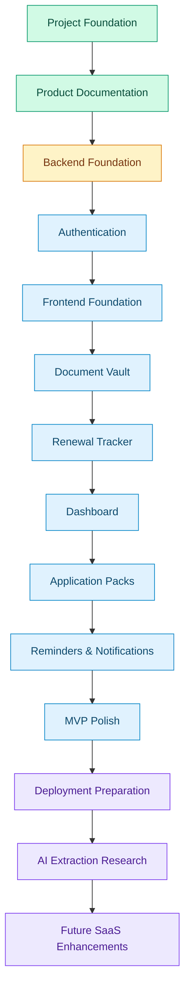
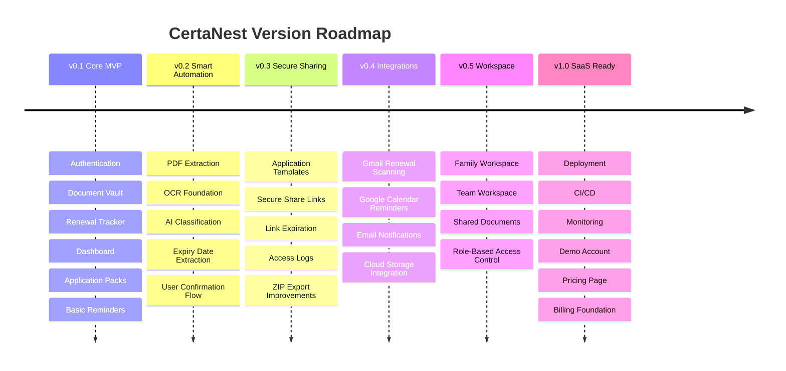
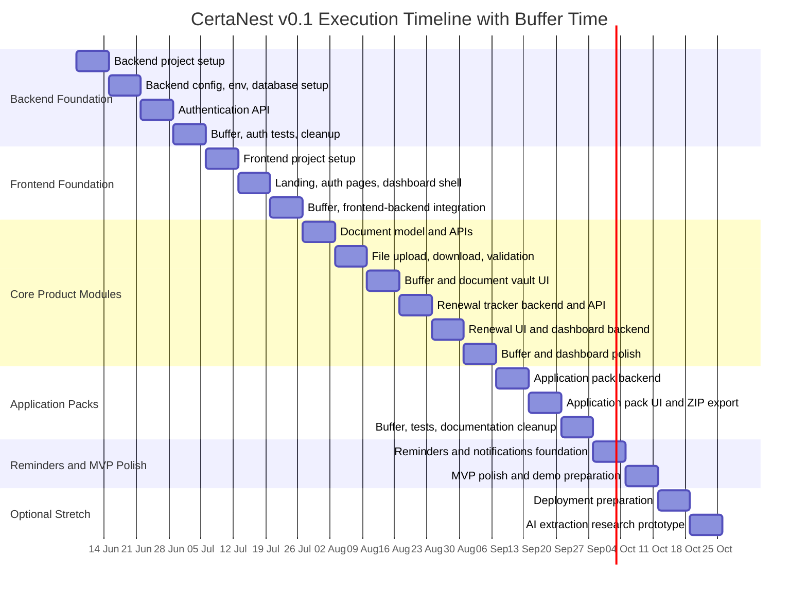
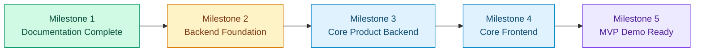

# CertaNest Roadmap

**Version:** v0.1  
**Status:** Planning  
**Product Type:** SaaS-ready life admin platform  
**Execution Style:** Small, consistent weekly progress  
**Timeline Start:** Monday, June 8, 2026  
**Target MVP Date:** Sunday, October 11, 2026  
**Backup MVP Date:** Sunday, October 25, 2026  
**Primary Constraint:** Built as a side project while balancing studies, BaraLink, and other responsibilities  

---

## 0. Product refocus — life-document readiness platform (2026-06-21)

CertaNest is now focused as a **private life-document readiness platform**: store,
scan, organize, prepare, track, generate, understand, and safely share important
documents before deadlines, applications, renewals, and emergencies.

It is **not** a subscription tracker, finance, budgeting, or bank/card-connected
app. The legacy **Subscription Radar** is **deprecated**:

- The `subscriptions` feature flag now defaults to `disabled`; the subscriptions
  API returns a controlled 503 by default (tables are retained, not dropped, so
  no beta data is lost — a founder can re-enable to inspect legacy data).
- Subscription Radar is removed from navigation, the dashboard, command palette,
  quick search, and public/marketing/legal copy.
- Generic recurring reminders and renewal tracking are **preserved** and now live
  under **Deadlines & Renewals** (`/dashboard/reminders`).
- CertaNest's own paid plans (Stripe `billing` app) are unchanged.

Items below that describe subscription/finance tracking as a product feature are
superseded by this refocus and Deadlines & Renewals.

## 1. Roadmap Summary

This roadmap defines how CertaNest will move from a well-documented product concept to a working MVP.

CertaNest will be built gradually through focused sprints. Each sprint should produce a clear deliverable that can be committed, reviewed, tested, and demonstrated.

The goal is not to build everything at once. The goal is to build the right foundation first, then progressively add useful and technically impressive features.

---

## 2. Execution Philosophy

CertaNest should be built with the following execution principles:

- Build consistently, even if progress is small.
- Prioritize working features over perfect plans.
- Avoid overengineering in the early stage.
- Keep every sprint focused.
- Use branches and pull requests for clean progress.
- Document decisions before implementation.
- Build the manual product before AI automation.
- Treat security as a core product requirement.
- Make every major feature demoable.
- Keep the project impressive, but realistic.

---

## 3. Roadmap Visualization



---

## 4. Product Build Order

CertaNest will be built in this order:

1. Project foundation
2. Product documentation
3. Backend foundation
4. Authentication
5. Frontend foundation
6. Document vault
7. Renewal tracker
8. Dashboard
9. Application packs
10. Reminders and notifications
11. MVP polish
12. Deployment preparation
13. AI extraction research
14. Secure sharing
15. Integrations
16. SaaS polish

---

## 5. Current Development Stage

| Area | Status |
| --- | --- |
| Branding | Completed |
| Repository setup | Completed |
| README | Completed |
| Product blueprint | Completed |
| Architecture document | Completed |
| Database design | Completed |
| API specification | Completed |
| Security plan | Completed |
| Roadmap | In Progress |
| Backend setup | Completed |
| Frontend setup | Completed |
| MVP implementation | In Progress |
| Documents module gaps (trash/restore, bundles, proof of submission, physical location, emergency access packs, plan limits foundation) | Completed |
| Document intelligence polish (confidence score, what-is-missing scanner, health overview, last safe action date, tags, custom fields, lifecycle status, renewal history, appointments, cost tracking) | Completed |
| Organization / Team Workspace V1 | Completed |

---

## 6. Version Roadmap



---

## 7. Version Details

### v0.1 — Core MVP

Focus: manual but useful product.

v0.1 should allow a user to:

- register and log in
- access a protected dashboard
- upload documents
- add document metadata
- track document expiry dates
- create renewal records
- view upcoming deadlines
- create application packs
- select documents for a pack
- export or prepare document bundles
- receive basic in-app reminders or notifications

### v0.2 — Smart Automation

Focus: AI-assisted document processing.

Planned features:

- PDF text extraction
- OCR foundation
- AI document classification
- expiry date extraction
- renewal date extraction
- provider and amount extraction
- confidence score
- user confirmation flow

### v0.3 — Secure Sharing and Application Packs

Focus: making application packs more powerful.

Planned features:

- application pack templates
- secure share links
- expiring links
- access logs
- revoke access
- ZIP export improvements
- application-specific checklists

**Sharing consolidation (complete):** the three parallel share systems (Quick
Share, single-file links, Share Rooms) are unified onto Quick Share as the single
engine, so sharing is identical wherever you start. The engine covers all three
systems' capabilities — privacy screen, document/proof items, and per-access
view/download caps (`max_views`/`max_downloads`, enforced server-side) — and every
entry point (document files, the File Inbox, the document Sharing tab, and Share
Rooms creation) opens the one Quick Share wizard, which surfaces privacy-screen
and access-limit controls. Existing `DocumentFileShareLink` / `ShareRoom` links
keep working (no migration); their public endpoints and the Share Rooms list
remain for back-compat. See `docs/architecture.md` §35 "Anatomy of Sharing".

**Verifiable Shares (differentiator, behind `verified_shares`):** an opt-in,
CertaNest-signed tamper-evident share. The recipient gets a public `/verify/<token>`
page confirming the files are an unaltered copy shared from a CertaNest account
(provenance + integrity — not real-world document authenticity). Ed25519; the
public key is published so independent/offline verification can follow.

**Share Requests (differentiator, behind `share_requests`):** sharing inverted into
fulfilment — a requester lists the documents they need; a logged-in recipient fills
the checklist from their vault in a few taps, delivered through the Quick Share
engine into the requester's "Shared with me". v1 is CertaNest-user-to-CertaNest-user; a
growth loop and a showcase for application packs.

**Minimal-disclosure shares (differentiator, behind `private_share`):** redact a
copy of a document and share *that* in one flow — original never exposed —
reusing the redaction tool + the share engine (client-side; no new backend). v1 is
manual redaction one tap from sharing.

**Smart redaction (assistive, behind `smart_redaction`):** the redaction editor's
**Auto-find** OCRs the page on-device and pre-draws boxes over bank/card numbers,
emails, phones, or a custom term — the user reviews before applying. Pattern-based
and assistive (not layout AI); client-side, no backend.

**AI share-readiness (assistive, behind `ai_share_readiness`):** before sharing an
application pack, Claude reviews it against its purpose and flags likely-rejection
issues (missing items, expiring/wrong documents). Built on the `apps.ai` wrapper;
deterministic facts shown regardless, graceful with no API key. Remaining
sharing/AI-vision items: layout-aware redaction, anonymous responders for Share
Requests, raw-text-grounded readiness, then verifiable-credential / offline
verification.

### v0.4 — Integrations

Focus: connecting CertaNest with user workflows.

Planned features:

- Gmail renewal scanning
- Google Calendar reminders
- email reminders
- cloud storage integration
- optional WhatsApp or Telegram reminders

### v0.5 — Family and Team Workspace

Focus: collaboration.

Planned features:

- family workspace
- team workspace
- shared documents
- role-based access control
- shared renewals
- member invitations

Status note: Organization / Team Workspace V1 is now implemented as a safe
foundation for small teams and community organizations. It includes
organization roles, invites, organization documents/files, document requests,
public upload links, collection campaigns, bundles, secure room metadata,
calendar/timeline/activity summaries, readiness reports, plan usage, founder
aggregate metrics, and frontend routes. Deferred items include family
workspaces, shared renewals, personal-to-organization copy/attach, organization
file preview/download, secure room downloads/ZIP export, email delivery,
advanced templates, and billing.

### v1.0 — SaaS-Ready Release

Focus: public demo or launch readiness.

Planned features:

- polished landing page
- demo account
- deployment
- CI/CD
- automated tests
- monitoring
- production security hardening
- optional opt-in TOTP two-factor authentication (authenticator app) before public launch; reuse existing field-level encryption to store the TOTP secret at rest; stays within Simple JWT (login gains a second verification step) and ships with hashed backup recovery codes
- pricing page
- billing foundation
- case study and demo video

---

## 8. Dated Execution Timeline with Buffers

This execution timeline starts from **Monday, June 8, 2026**.

The plan is intentionally realistic because CertaNest is being built as a side project while balancing studies, BaraLink, and other responsibilities.

The timeline includes:

- focused build weeks
- buffer weeks
- review and polish time
- flexible weekend execution
- room for delays without breaking the whole roadmap



> Dates are planning targets, not strict deadlines. If a week becomes busy, move unfinished work into the nearest buffer week.

---

## 9. Week-by-Week Execution Plan

| Week | Date Range | Focus | Expected Output | Buffer Strategy |
| --- | --- | --- | --- | --- |
| Week 1 | Jun 8 – Jun 14, 2026 | Backend foundation | Django project created inside `backend/` | Keep scope small: project setup only |
| Week 2 | Jun 15 – Jun 21, 2026 | Backend configuration | Settings, environment variables, database setup | Use weekend to fix setup issues |
| Week 3 | Jun 22 – Jun 28, 2026 | Authentication API | Register, login, refresh token, current user endpoint | Focus only on backend auth |
| Week 4 | Jun 29 – Jul 5, 2026 | Buffer and auth cleanup | Auth tests, cleanup, documentation updates | Dedicated buffer week |
| Week 5 | Jul 6 – Jul 12, 2026 | Frontend foundation | Next.js project, Tailwind, shadcn/ui setup | Keep UI simple first |
| Week 6 | Jul 13 – Jul 19, 2026 | Frontend auth pages | Landing page, login, register, dashboard shell | Connect only basic API calls |
| Week 7 | Jul 20 – Jul 26, 2026 | Integration buffer | Fix frontend-backend issues | Dedicated buffer week |
| Week 8 | Jul 27 – Aug 2, 2026 | Document backend | Document model, serializer, endpoints | Backend first, UI later |
| Week 9 | Aug 3 – Aug 9, 2026 | File upload and access | Upload, list, download, delete documents | Prioritize security checks |
| Week 10 | Aug 10 – Aug 16, 2026 | Document vault buffer/UI | Document vault page and cleanup | Dedicated buffer week |
| Week 11 | Aug 17 – Aug 23, 2026 | Renewal tracker backend | Renewal model and API endpoints | Keep it CRUD + status logic |
| Week 12 | Aug 24 – Aug 30, 2026 | Renewal UI and dashboard backend | Renewal page and dashboard summary endpoint | Avoid overbuilding charts |
| Week 13 | Aug 31 – Sep 6, 2026 | Dashboard buffer | Dashboard polish, empty states, summary cards | Dedicated buffer week |
| Week 14 | Sep 7 – Sep 13, 2026 | Application pack backend | Pack model, pack-document relationship, endpoints | Backend first |
| Week 15 | Sep 14 – Sep 20, 2026 | Application pack UI and ZIP export | Pack creation, document selector, ZIP export | Keep secure sharing out of v0.1 |
| Week 16 | Sep 21 – Sep 27, 2026 | Buffer, tests, docs | Fix bugs, add tests, update documentation | Dedicated buffer week |
| Week 17 | Sep 28 – Oct 4, 2026 | Reminders and notifications | Reminder model, notification model, basic in-app alerts | Email reminders can wait |
| Week 18 | Oct 5 – Oct 11, 2026 | MVP polish and demo prep | Clean UI, screenshots, README updates, demo flow | Prepare portfolio presentation |
| Week 19 | Oct 12 – Oct 18, 2026 | Optional deployment prep | Prepare deployment configs | Optional/stretch |
| Week 20 | Oct 19 – Oct 25, 2026 | Optional AI research | Small AI extraction prototype | Optional/stretch |

---

## 10. Buffer Strategy

CertaNest is not planned as a full-time project, so buffer time is part of the roadmap by design.

### Weekly Buffer

Each week should leave room for:

- unexpected school work
- BaraLink responsibilities
- debugging
- documentation updates
- unfinished tasks from the previous week

### Dedicated Buffer Weeks

The roadmap includes dedicated buffer weeks:

| Buffer Week | Date Range | Purpose |
| --- | --- | --- |
| Week 4 | Jun 29 – Jul 5, 2026 | Authentication cleanup and tests |
| Week 7 | Jul 20 – Jul 26, 2026 | Frontend-backend integration cleanup |
| Week 10 | Aug 10 – Aug 16, 2026 | Document vault cleanup and UI |
| Week 13 | Aug 31 – Sep 6, 2026 | Dashboard cleanup and polish |
| Week 16 | Sep 21 – Sep 27, 2026 | Application pack tests, docs, and bug fixes |

### Minimum Progress Rule

If a week becomes too busy, the minimum acceptable progress is:

- complete one small task
- make one clean commit
- update one checklist item
- avoid breaking the project

Small progress still counts.

---

## 11. Sprint Roadmap

## Sprint 0 — Project Foundation

**Status:** Completed / In Progress  
**Goal:** Prepare the project foundation before implementation.

### Tasks

- [x] Create GitHub repository
- [x] Clone repository with SSH
- [x] Create monorepo structure
- [x] Add README
- [x] Add brand assets
- [x] Add product blueprint
- [x] Add architecture document
- [x] Add database design
- [x] Add API specification
- [x] Add security plan
- [ ] Add roadmap document

### Deliverable

A clean, professional project foundation ready for backend implementation.

---

## Sprint 1 — Backend Foundation

**Status:** Not Started  
**Target Date:** Jun 8 – Jun 21, 2026  
**Goal:** Set up the Django REST Framework backend.

### Tasks

- [ ] Create Django project inside `backend/`
- [ ] Configure virtual environment
- [ ] Install Django and Django REST Framework
- [ ] Configure project settings
- [ ] Set up environment variables
- [ ] Configure PostgreSQL connection
- [ ] Create modular app structure
- [ ] Add custom user model
- [ ] Configure Django admin
- [ ] Add initial backend README
- [ ] Add basic health check endpoint

### Deliverable

A working Django backend that runs locally and is ready for authentication implementation.

### Definition of Done

- Backend runs locally.
- Django admin works.
- Database connection works.
- Environment variables are used.
- No secrets are committed.
- Basic project structure follows the architecture document.

---

## Sprint 2 — Authentication

**Status:** Not Started  
**Target Date:** Jun 22 – Jul 5, 2026  
**Goal:** Implement secure user registration and login.

### Tasks

- [ ] Create custom user model
- [ ] Create user serializer
- [ ] Create registration endpoint
- [ ] Configure JWT authentication
- [ ] Create login endpoint
- [ ] Create token refresh endpoint
- [ ] Create current user endpoint
- [ ] Add password validation
- [ ] Add authentication tests
- [ ] Update API documentation if needed

### Deliverable

Users can register, log in, refresh tokens, and access a protected profile endpoint.

### Definition of Done

- User can register.
- User can log in.
- Protected endpoint rejects unauthenticated requests.
- Passwords are hashed.
- Duplicate email registration is rejected.
- Tests cover basic authentication flows.

---

## Sprint 3 — Frontend Foundation

**Status:** Not Started  
**Target Date:** Jul 6 – Jul 26, 2026  
**Goal:** Set up the Next.js frontend.

### Tasks

- [ ] Create Next.js app inside `frontend/`
- [ ] Configure TypeScript
- [ ] Configure Tailwind CSS
- [ ] Install shadcn/ui
- [ ] Add global layout
- [ ] Add landing page
- [ ] Add login page
- [ ] Add register page
- [ ] Add dashboard shell
- [ ] Add API client
- [ ] Add environment variable setup

### Deliverable

A working frontend with landing page, auth pages, and dashboard shell.

### Definition of Done

- Frontend runs locally.
- Landing page displays correctly.
- Login and register pages exist.
- Dashboard layout exists.
- Frontend can call backend health check or auth endpoint.

---

## Sprint 4 — Document Vault

**Status:** In Progress (document intelligence foundation complete)
**Target Date:** Jul 27 – Aug 16, 2026  
**Goal:** Build the core document management module.

### Tasks

- [x] Create Document model + DocumentCategory model
- [x] Create document serializer
- [x] Create document endpoints (list/create/retrieve/update/delete)
- [x] Add file upload support (backend `DocumentFile` foundation)
- [x] Add file validation (type + 10 MB size limit)
- [x] Add document listing
- [x] Add document detail endpoint
- [x] Add document update endpoint
- [x] Add document delete endpoint
- [x] Add document download endpoint (controlled, owner-only)
- [x] Add expiry status logic (auto-calculated)
- [x] Add computed document health fields
- [x] Add search, filter, and sort
- [x] Add missing-file and missing-expiry detection
- [x] Add Attention Needed endpoint and dashboard/list UI
- [x] Add document reminder rule model, API, and workspace UI
- [x] Add ownership tests
- [x] Build document vault frontend page (metadata UI)
- [x] Build document file upload frontend UI

### Deliverable

Users can upload, view, edit, delete, download, search, filter, and understand
the urgency of their own documents.

### Definition of Done

- User can upload a document.
- User can see only their documents.
- User cannot access another user’s document.
- File upload validates type and size.
- Expiry status is calculated.
- Attention Needed is scoped to the authenticated user.
- Reminder rules can be created and upcoming dates can be calculated.
- Frontend document vault displays uploaded files.

---

## Sprint 5 — Renewal Tracker

**Status:** Not Started  
**Target Date:** Aug 17 – Aug 30, 2026  
**Goal:** Build subscription and renewal tracking.

### Tasks

- [ ] Create Renewal model
- [ ] Create renewal serializer
- [ ] Create renewal endpoints
- [ ] Add renewal date logic
- [ ] Add status calculation
- [ ] Add cost fields
- [ ] Add category and provider fields
- [ ] Add renewal list page
- [ ] Add create renewal form
- [ ] Add update and delete actions
- [ ] Add ownership tests

### Deliverable

Users can track subscriptions, renewals, costs, providers, and renewal dates.

### Definition of Done

- User can create a renewal.
- User can list renewals.
- User can update renewals.
- User can delete renewals.
- User can see only their own renewals.
- Renewal status is calculated correctly.

---

## Sprint 6 — Dashboard

**Status:** Not Started  
**Target Date:** Aug 24 – Sep 6, 2026  
**Goal:** Build the central overview dashboard.

### Tasks

- [ ] Create dashboard summary endpoint
- [ ] Add document count summary
- [ ] Add expiring documents summary
- [ ] Add expired documents summary
- [ ] Add renewal summary
- [ ] Add upcoming deadlines endpoint
- [ ] Add dashboard cards
- [ ] Add simple charts
- [ ] Add timeline or upcoming actions section
- [ ] Add empty states

### Deliverable

Users can see upcoming deadlines, expiring documents, renewals, and action summaries in one place.

### Definition of Done

- Dashboard loads user-specific data.
- Upcoming documents are shown.
- Upcoming renewals are shown.
- Summary cards work.
- Empty states are clear.
- Queries are scoped to the authenticated user.

---

## Sprint 7 — Application Packs

**Status:** Not Started  
**Target Date:** Sep 7 – Sep 27, 2026  
**Goal:** Allow users to create reusable document packs.

### Tasks

- [ ] Create ApplicationPack model
- [ ] Create ApplicationPackDocument model
- [ ] Create pack endpoints
- [ ] Add document-to-pack endpoint
- [ ] Add remove-document-from-pack endpoint
- [ ] Add pack detail endpoint
- [ ] Add ZIP export endpoint
- [ ] Build application packs frontend page
- [ ] Add pack creation form
- [ ] Add document selector
- [ ] Add ownership validation

### Deliverable

Users can create application packs and add selected documents to them.

### Definition of Done

- User can create a pack.
- User can add documents to a pack.
- User can remove documents from a pack.
- User can export pack documents.
- User cannot add another user’s document to a pack.

---

## Sprint 8 — Reminders and Notifications

**Status:** Not Started  
**Target Date:** Sep 28 – Oct 4, 2026  
**Goal:** Add reminder and notification foundation.

### Tasks

- [ ] Create Reminder model
- [ ] Create Notification model
- [ ] Create reminder endpoints
- [ ] Create notification endpoints
- [ ] Add reminder creation logic
- [ ] Add in-app notification logic
- [ ] Configure Celery
- [ ] Configure Redis
- [ ] Add scheduled reminder task
- [ ] Add notification UI
- [ ] Add security tests

### Deliverable

Users can create reminders and receive in-app notifications for important dates.

### Definition of Done

- Reminder records can be created.
- Upcoming reminders can be listed.
- Notifications can be created.
- Users only see their notifications.
- Celery worker can process reminder tasks locally.

---

## Sprint 9 — MVP Polish

**Status:** Not Started  
**Target Date:** Oct 5 – Oct 11, 2026  
**Goal:** Prepare a presentable MVP demo.

### Tasks

- [ ] Polish landing page
- [ ] Polish dashboard UI
- [ ] Add empty states
- [ ] Add sample demo data
- [ ] Update README
- [ ] Add screenshots
- [ ] Write demo flow
- [ ] Fix known bugs
- [ ] Review security checklist
- [ ] Prepare portfolio case study outline

### Deliverable

A presentable CertaNest v0.1 MVP ready for recruiter/demo use.

### Definition of Done

- MVP can be demonstrated end-to-end.
- UI is clean and responsive.
- Core workflows work locally.
- README reflects actual progress.
- Security warnings and demo data are clear.

---

## Sprint 10 — Optional Deployment Preparation

**Status:** Optional / Stretch  
**Target Date:** Oct 12 – Oct 18, 2026  
**Goal:** Prepare deployment configuration.

### Tasks

- [ ] Review backend deployment options
- [ ] Review frontend deployment options
- [ ] Prepare production environment variables
- [ ] Prepare database hosting plan
- [ ] Prepare Redis hosting plan
- [ ] Prepare file storage strategy
- [ ] Add deployment notes

### Deliverable

CertaNest is ready for deployment planning.

---

## Sprint 11 — Optional AI Research Prototype

**Status:** Optional / Stretch  
**Target Date:** Oct 19 – Oct 25, 2026  
**Goal:** Explore AI extraction after MVP stability.

### Tasks

- [ ] Test PDF text extraction
- [ ] Test OCR options
- [ ] Test structured metadata extraction
- [ ] Define extraction confidence logic
- [ ] Define user confirmation workflow
- [ ] Update AI extraction plan

### Deliverable

A small research prototype or documented plan for v0.2 AI extraction.

---

## 11.5 Documents-First Build Sequence

CertaNest is now sequenced **documents-first**: make the Documents module a
pay-worthy product before expanding into subscriptions, application packs, an AI
assistant, and broader life-admin tasks. The full plan, paid-MVP definition,
prioritization, and data/API/security planning live in
[`document-vault-roadmap.md`](document-vault-roadmap.md).

### Paid MVP (Documents module)

A beautiful, mobile-friendly vault that **thinks for the user**: document
records + type templates, file upload, in-app preview, secure download, smart
expiry/status intelligence, missing-information detection, an "Attention Needed"
inbox, search/filter/sort, a polished detail page, reminder rules, and renewal
checklists — all behind strong ownership checks. Users pay because CertaNest helps
them **avoid expiry mistakes, lost-document chaos, and last-minute renewal
stress**.

### Recommended order

```txt
1. Premium authenticated app UI polish            (done)
2. Backend file upload foundation                 (done)
3. Frontend document upload UI                     (done)
4. Backend secure preview/download access          (done)
5. Frontend in-app document preview                (done)
6. Smart status and expiry intelligence            (done)
7. Search, filter, and sort                        (done)
8. Missing-information detection                   (done)
9. Attention Needed inbox                          (done)
10. Renewal reminder rules                         (done: no sending yet)
11. Renewal preparation checklists                  (done)
12. Document detail page upgrade                    (done)
13. Calendar/timeline view                          (done)
14. Secure share links                             (done)
15. OCR-assisted extraction                         (done)
16. Application/renewal bundles                     (done)
17. File/document activity timeline and audit log   (backend foundation done)
18. Version history                                (backend foundation done)
19. Emergency access pack / Emergency Protocol      (done — unlock rules, trusted contacts, locked QR + printable card, off-by-default location, activity log)
20. Export and backup features                      (backend metadata export done)
21. Document onboarding + trust launch polish       (done)
```

Sharing (14) was implemented early as file-level sharing for the document vault.
OCR, bundles, checklists, and the timeline now have working foundations. The
newer vault-maturity items (17–20) have backend foundations. The onboarding and
trust branch adds the private-beta setup checklist, demo data, Trust Center,
public security/privacy/terms drafts, and account data controls needed to make
the Documents module demoable.

### Upcoming branches

```txt
backend/document-status-intelligence   frontend/document-status-polish        (done)
backend/document-search-filter         frontend/document-search-filter        (done)
backend/document-attention-inbox       frontend/document-attention-inbox      (done)
backend/document-reminder-rules        frontend/document-reminder-experience  (done)
backend/document-checklists            frontend/document-checklists            (done)
backend/document-ocr-foundation        frontend/document-ocr-review-ui         (done)
backend/document-vault-maturity        frontend/document-vault-maturity        (backend foundation done)
feature/document-onboarding-trust      onboarding/trust/data launch polish     (done)
backend/storage-plan-limits            Free/Pro product limits enforced        (done)
product/life-radar-v1                  Deterministic readiness dashboard       (done)
product/application-pack-readiness-v1  Structured pack readiness workflow      (done)
ai/requirement-link-to-checklist       Paste a URL → reviewable checklist      (done)
product/application-tracker-v1         Application/renewal lifecycle tracker    (done)
product/smart-profile-v1               Reusable application profile             (done)
```

`backend/storage-plan-limits` is **implemented**: storage (100 MB Free / 10 GB
Pro), document count (30 Free / 1,000 Pro), application packs (1 Free /
unlimited Pro), and active reminders (10 Free / unlimited Pro) are all
hard-enforced. Storage quota is computed from `DocumentFile.file_size` in the
database — never from R2. All limit violations return `403 plan_limit_exceeded`.

`product/life-radar-v1` is **implemented**: a single deterministic readiness
endpoint `GET /api/v1/documents/life-radar/` (`apps/documents/life_radar.py`,
`build_life_radar`) returns a 0–100 score, a summary, and radar sections
(urgent, expiring documents, upcoming deadlines, incomplete packs, missing
documents, emergency access, suggested actions). It is **deterministic and makes
no AI call / consumes no AI credits / never touches R2** — fast, free, and
available to Free and Pro alike. Suggested actions are plan-aware (e.g. a
storage-upgrade nudge near the Free limit). AI-enhanced suggestions are future
work (`product/life-radar-ai-insights`).

`product/application-pack-readiness-v1` is **implemented**: a deterministic pack
readiness service (`apps/documents/pack_readiness.py`, `build_pack_readiness` /
`build_pack_readiness_summary`) that turns a bundle + its requirements into a
structured readiness payload — score + label, per-requirement status
(satisfied / missing / expired / expiring_soon / needs_review), expiry warnings
on attached documents, a share-readiness verdict, and next actions. It **extends
the existing** `GET /api/v1/document-bundles/{id}/readiness/` endpoint (superset;
old keys preserved) and adds `GET /api/v1/document-bundles/readiness-summary/`.
Fully **deterministic — no AI call, no AI credits, no R2, no file URLs**.
Missing documents come only from real requirement rows (never invented). The
base score/counts still come from `bundle_readiness()`, so **Life Radar is
unchanged**. AI requirement extraction is the next branch.

`ai/requirement-link-to-checklist` is **implemented**: paste a scholarship,
visa, university, job, grant, school, or permit URL into an application pack;
the backend safely fetches only that one page (no crawling), Claude extracts a
structured requirements checklist (required/optional documents, deadlines,
eligibility notes, submission instructions, source citations), the user reviews
the draft, and selects items to apply. Strictly Extract → Review → Apply —
nothing is added until the user approves. Pro-only, 5 AI credits per successful
extraction (charged only on model-backed success). Safe URL fetch includes an
SSRF guard (scheme allowlist + private-IP rejection + redirect cap + timeout +
size cap). See §13B.8a in `docs/api-spec.md`.

`product/application-tracker-v1` is **implemented**: a deterministic
`TrackedApplication` model + service (`apps/documents/application_tracker.py`)
tracks the lifecycle of an application/renewal (scholarship, visa, job, grant,
permit, …) — status, suggested status, deadline state, optional linked
application-pack readiness, and next actions. Endpoints: `GET/POST
/api/v1/applications/`, `GET/PATCH/DELETE /api/v1/applications/{id}/` (DELETE
archives), `GET /api/v1/applications/summary/`. **Deterministic — no AI call, no
AI credits, no R2, no file URLs.** Suggested status is derived from linked pack
readiness (missing → documents_missing; ready → ready_to_submit) and shown
alongside (never overriding) the user's chosen status. Plan limit: Free 3 /
Pro 100 active applications (`resource "applications"`, archived excluded,
`403 plan_limit_exceeded`). Life Radar `summary` gains additive
`active_applications` / `urgent_applications` / `ready_to_submit_applications` /
`overdue_applications` (existing shape unchanged). Founder-only rollout flag
`application_tracker` until launched.

`product/smart-profile-v1` is **implemented**: a per-user reusable profile
(`apps/users/models.py` SmartProfile + Education/Work/Skill/Achievement/
CommonAnswer rows; `apps/users/smart_profile.py`) so users store identity,
education, work, skills, achievements, and common application answers once and
reuse them later. Endpoints under `GET/PATCH /api/v1/smart-profile/`,
`/smart-profile/completeness/`, and `GET/POST` + `/{id}/` CRUD for
`education/work/skills/achievements/common-answers`. A deterministic 0–100
completeness score spans eight sections. **No AI call, no AI credits, no R2, no
file URLs.** Sensitive identity/document numbers (passport, national ID) are
**not** duplicated — they stay in the existing AES-GCM-encrypted
`UserProfileDetails` store (`/users/me/profile-details/`); Smart Profile reads
only non-secret values + presence flags. `build_application_context_from_profile`
provides a deterministic profile+application+pack context for **future** AI
document generation (not called here, not a public endpoint in V1). Available to
Free and Pro; founder-only rollout flag `smart_profile` until launched.

**Next recommended branch: `b2b/teams-billing-checkout`** (Magic Inbox V1, Weekly
Radar Email V1, Document Request Links V1, Sharing Rooms V1, the B2B Portals MVP,
Teams Plan + Portal Limits V1, the B2B Review + Approval Workflow V1, and the
Organization Dashboard V1 are now done — see the done sections below). Teams Plan +
Portal Limits V1 made portals governed by an **organization-level entitlement**
(activated by a founder/beta command, no Stripe), fixing the prior MVP's
personal-limit leak; the Review + Approval Workflow V1 closed the loop with a staff
accept/reject/needs-replacement queue; and the Organization Dashboard V1 added a
read-only operational command center (metrics + action queues + plan usage, no
audit-on-view). Wiring real Teams checkout / per-seat Stripe billing and beginning
org-owned storage is the sensible follow-up.

Smart Profile was built mainly to power CV/résumé, motivation letters,
application emails, SOPs, and form filling — the AI Application Document
Generator V1 has now shipped (see the done section at the bottom of this file),
delivering review-before-save generation from Smart Profile + application + pack
context.

Suggested sequencing:

```txt
backend/storage-plan-limits            (done)
product/life-radar-v1                  (done)
product/application-pack-readiness-v1  (done)
ai/requirement-link-to-checklist       (done)
product/application-tracker-v1         (done)
product/smart-profile-v1               (done)
ai/application-document-generator      (done — CVs/letters/emails/SOPs from Smart Profile)
product/magic-inbox-v1                 (done — capture → analyze → review → apply)
notifications/weekly-radar-email       (done — deterministic Life-Radar weekly email)
sharing/document-request-links-v1      (done — secure single-document collection via public token upload)
sharing/rooms-v1                       (done — secure shared room workspaces: selected items + request links behind one token)
security/redaction-watermarking-v1     (done — secure server-side protected copies: redaction + watermark, original never modified)
security/audit-logs-v1                 (done — owner-scoped security/document event log, hashed fingerprints, owner-only, no AI)
b2b/portals-mvp                        (done — org portal workspace: people + cases orchestrating existing primitives, founder-gated, deterministic)
b2b/teams-plan-and-portal-limits       (done — org-level entitlement governs portals; central limit table; personal-limit leak fixed; founder activation command; no Stripe)
b2b/review-approval-workflow           (done — staff accept/reject/needs-replacement on portal uploads; org-scoped file proxy)
b2b/organization-dashboard-v1          (done — read-only operational command center: metrics + action queues + plan usage; no audit-on-view)
b2b/bulk-reminder-emails               (done — staff batch branded reminder emails from dashboard queues; cooldown; reuses Document Request Links + branded helper)
b2b/organization-templates             (done — reusable case workflows; create-case-from-template orchestrates pack/room/requests; limits→warnings; no AI)
product/custom-document-organization-v1 (done — virtual folders/tags/collections/smart-views over Documents; personal + org scopes; case/person/template folders; opt-in auto-filing; metadata-only; no AI)
b2b/custom-fields-and-statuses-v1      (done — org-defined custom fields (validated JSON values, no dynamic columns) + custom case statuses layered on the fixed PortalCase.Status; template/dashboard/filter integration; internal-only; privacy-first audit; no AI)
b2b/teams-billing-checkout             ← next (Teams checkout / per-seat Stripe / invoices, org-owned storage)
integrations/inbox-mailbox-import      (future — Gmail/Drive/Outlook import into Magic Inbox)
backend/ai-org-credit-pools            (future)
product/life-radar-ai-insights         (future — AI-enhanced Life Radar)
```

---

## 12. What Not to Build Too Early

The following should not be built in the first MVP:

- Gmail scanning
- bank transaction import
- native mobile app
- browser extension
- team workspaces
- billing system
- real-time collaboration
- enterprise admin panel
- complex analytics
- custom AI model training
- Kubernetes
- microservices
- advanced sharing links
- end-to-end encryption

These are future improvements, not first-version requirements.

---

## 13. MVP Completion Criteria

CertaNest v0.1 is considered complete when:

- users can register and log in
- users can access a protected dashboard
- users can upload documents
- users can manage document metadata
- users can track document expiry dates
- users can create renewal records
- users can see upcoming renewals
- users can see dashboard summaries
- users can create application packs
- users can add documents to packs
- users can export selected documents
- basic reminders or notifications exist
- security checks prevent cross-user access
- backend and frontend run locally
- project has useful documentation
- app has a clean responsive UI

---

## 14. Technical Definition of Done

A feature is considered done when:

- backend model/API is implemented
- frontend UI is implemented if needed
- validation is handled
- ownership/security checks are included
- errors are handled cleanly
- basic tests are added for critical logic
- documentation is updated if needed
- code is committed through a focused branch
- feature can be demonstrated locally

---

## 15. Pull Request Standards

Each PR should be focused and easy to review.

### Good PR Examples

```txt
docs: add CertaNest roadmap
backend: set up Django project
backend: add custom user model
feat: add document upload API
feat: build document vault page
test: add document ownership tests
```

### PR Description Template

```md
## Summary

Briefly describe what this PR adds or changes.

## Added

- Item 1
- Item 2
- Item 3

## Notes

Mention important implementation decisions, trade-offs, or follow-up tasks.
```

---

## 16. Release Milestones



### Milestone 1 — Documentation Complete

Includes:

- README
- brand assets
- product blueprint
- architecture document
- database design
- API specification
- security plan
- roadmap

### Milestone 2 — Backend Foundation Complete

Includes:

- Django setup
- custom user model
- PostgreSQL connection
- DRF setup
- JWT authentication
- health check endpoint

### Milestone 3 — Core Product Backend Complete

Includes:

- document APIs
- renewal APIs
- reminder APIs
- notification APIs
- application pack APIs
- dashboard APIs

### Milestone 4 — Core Frontend Complete

Includes:

- landing page
- authentication pages
- dashboard
- document vault
- renewal tracker
- application packs

### Milestone 5 — MVP Demo Ready

Includes:

- deployed frontend
- deployed backend
- demo account
- sample documents
- screenshots
- demo video
- polished README

---

## 17. Learning Priorities

The most important learning areas for implementation are:

### Django and DRF

- custom user model
- serializers
- viewsets
- permissions
- authentication
- file uploads
- testing

### PostgreSQL

- relationships
- indexes
- constraints
- date queries
- aggregation queries

### Next.js

- app router
- layouts
- forms
- protected routes
- API client
- dashboard UI

### Security

- ownership checks
- file validation
- environment variables
- safe error handling
- private storage

### Background Jobs

- Celery setup
- Redis broker
- scheduled tasks
- notification processing

### AI Later

- PDF extraction
- OCR
- structured extraction
- confidence scoring
- user confirmation workflow

---

## 18. Timeline Management Rules

The dated roadmap is a planning tool, not a pressure system.

### If a Task Takes Longer Than Expected

Move unfinished work to the closest buffer week.

### If a Week Is Very Busy

Complete only one small task and make one clean commit.

### If a Sprint Becomes Too Large

Split it into smaller branches and PRs.

### If Implementation Reveals a Better Approach

Update the relevant documentation before changing the architecture or data model.

### If the Project Starts Feeling Too Big

Return to the v0.1 scope and remove non-essential features.

---

## 19. Summary

CertaNest should be built slowly but professionally.

The immediate priority is not to build every advanced feature. The immediate priority is to create a stable, secure, and useful MVP that demonstrates strong engineering judgment.

The roadmap is intentionally staged so the project can grow from:

```txt
well-documented idea
→ working MVP
→ AI-powered product
→ SaaS-ready platform
```

The most important rule is:

> Build the useful core first. Add intelligence and scale later.

---

## 20. Founder Console V1

Founder Console V1 is implemented as the first solo-founder operations layer.

Delivered:

- founder-only dashboard metrics
- standalone `/founder` console shell and route group
- date-ranged analytics charts for users, documents, files, errors, and security activity
- activation funnel
- feature adoption dashboard
- editable feature completion tracker
- feedback submission and founder feedback board
- checklist template management foundation
- beta user tracking
- launch readiness checklist
- privacy-safe country activity map/table
- lightweight error monitoring
- security/audit overview
- privacy-safe user support metadata
- founder audit logs
- Founder Console documentation

Deferred:

- billing dashboard
- advanced segmentation
- consent-based sensitive support access
- AI analytics assistant
- retention/churn analytics
- full incident response center

---

## 21. Waitlist and Invite System

Private beta access control is implemented.

Delivered:

- public `/waitlist` page and waitlist submission API
- public `/invite/:code` page and invite validation API
- `PRIVATE_BETA_ENABLED` backend setting
- invite-code enforcement for password registration when private beta is enabled
- invite-code enforcement for first-time Google account creation when private beta is enabled
- founder `/founder/waitlist` review workflow
- founder `/founder/invites` invite-code management workflow
- invite code limits, expiry, disabled status, use logging, and accepted-user tracking
- private beta metrics in Founder Console
- backend tests for access control, invite enforcement, waitlist submission, and invite lifecycle

Deferred:

- transactional email provider integration
- production-grade public abuse detection beyond DRF scoped throttles
- cohort segmentation beyond simple persona/status filters

---

## Shipped: premium sharing, bundles, Secure Rooms & Calendar V1

Now implemented on `feature/premium-sharing-bundle-rooms-calendar`:

- Access-code shared files fixed via a short-lived signed grant (raw code never
  stored client-side).
- Bundle file listing/preview/download, and real ZIP export (all + selected,
  plus normal bulk file export) with a safe `bundle_manifest.json`.
- One-time / limited-access share links, strong view-only enforcement, and
  watermarking / privacy-screen screenshot **deterrence** (server-side download
  blocking; no false "screenshots blocked" claims).
- **Secure Rooms / Shared Packs** — controlled collection sharing with owner UI
  (`/dashboard/share-rooms`) and a polished public page (`/rooms/:token`).
- **CertaNest Calendar V1** — internal, owner-scoped aggregation across documents,
  reminders, bundles, appointments, proofs, shares, and rooms, with Month +
  Upcoming views, a dashboard widget, and one-way `.ics` export.

Still explicitly out of scope: Google/Outlook/two-way calendar sync, billing,
AI agents, native mobile.

### Subscription / Recurring Renewal Tracker V1 (shipped)

Users can track their own recurring payments and renewals (streaming, software,
domains, hosting, insurance, telecom, gym, memberships, etc.): owner-scoped CRUD
with search/filter/sort, monthly/yearly cost summaries grouped by currency,
rule-based renewal review signals, quick-add templates, mark-paid/
mark-cancelled/archive/skip actions, metadata-only payment records, a detail
workspace, and an "Add subscription" form. Renewals, cancellation deadlines, and
trial endings flow into Calendar, Timeline, Attention Needed, and a dashboard
"Upcoming renewals" widget. Free plan caps subscriptions at 10. Founder
subscription adoption metrics are aggregate only.

Explicitly out of scope (this is **not** CertaNest billing): Stripe / paid-plan
checkout, bank/card integrations, storing card or banking details, live currency
conversion, automatic cancellation, AI, and email/push reminder delivery
(reminders are in-app via Calendar/Timeline). Deferred: receipt file uploads and
provider-side cancellation automation.

## Shipped: Quick Share QR Masterpiece V1

A premium, secure QR-based document exchange layered on the existing secure
document system (new `apps.quick_share` Django app + Next.js routes).

Delivered:

* Account-to-account Quick Share: select files → generate QR → receiver scans,
  signs in, accepts/declines → files appear in **Shared with me**; owner can
  revoke anytime. Claim is preserved across login via `?next=`.
* Public secure QR mode (anonymous, code/expiry protected).
* Permission modes: view only, allow download, allow save copy (with explicit
  warnings), plus access code, one-time, limited claims, sender approval,
  watermark, and a "Recommended protection" preset.
* Save-copy-to-vault producing a receiver-owned copy.
* Sender QR hero screen with live status polling, expiry countdown, permission
  chips, copy-link, fallback code, pending-approval management, and revoke.
* Backend security tests (27) covering selected-files-only, expiry/revoke,
  one-time/limited claims, access-code gating, view-only/save-copy enforcement,
  cross-account isolation, and sender approval. Frontend lint + build clean.

The Emergency Protocol now ships a dedicated emergency QR + printable card UI
(wallet/passport/A6/A5/full-sheet formats, privacy options, print + PNG export),
locked unlock rules (owner approval / delayed unlock), trusted contacts, an
off-by-default emergency location, and a full activity log.

Deferred (documented honestly): organization-collection QR integration, advanced
founder metrics, and SMS/email delivery of emergency setup notices (in-app
notifications are implemented).

## Quick Share 2.0 (in progress)

Quick Share 2.0 presents multiple **distinct** sharing methods rather than QR
alone:

1. Share by secure link — shipped (the session token is the secure link)
2. Share by CertaNest code — **shipped (Phase 1)**
3. Share by QR — shipped (V1)
   _(explicit method picker across all three — **shipped, Phase 3**)_
4. Shared by Me / Shared with Me management — shipped (V1)
5. Bundle sharing — **shipped (Phase 2)**
6. Premium secure viewer — **shipped (Phase 4: watermark overlay)**
7. Watermark / view-only / download control — shipped (V1)
8. Expiry / revocation / activity logs — shipped (V1; activity now surfaced in
   the sender UI, Phase 4)

### Shipped: Phase 1 — real CertaNest code + Receive flow

Each session now carries a dedicated, unique, human-typable `dn_code` (e.g.
`DN-4KQ7-PXMR`) generated independently of the secret token (never derived from
it, so reading the code aloud never weakens the token). A new public endpoint
`POST /api/v1/quick-share/receive/` resolves a typed code to its share and hands
off to the existing guarded claim flow; it is rate-limited (`quick_share_receive`,
10/min) against enumeration. The frontend adds a **Receive a code** page
(`/dashboard/quick-share/receive`) and surfaces the real code on the sender's
share screen. This replaces the previous cosmetic "fallback code" (which was
derived from the token and had no resolve path); `fallback_code` is retained as a
serializer alias of `dn_code` for backward compatibility.

### Shipped: Phase 2 — bundle sharing

`QuickShareItem` gains an optional `bundle` FK, so a whole bundle can be shared
as one item that expands to the bundle's currently available files (via the
canonical `collect_bundle_files`), keeping the share in sync with the bundle over
time. The create endpoint accepts `bundle_ids[]` alongside `file_ids[]`
(owner-validated; empty bundles skipped). The owner list/detail `file_count` now
reflects the real expanded file count. The Quick Share wizard's picker gains a
**Bundles** section, and the selected-summary/review steps show bundles
distinctly from individual files.

### Shipped: Phase 3 — explicit sharing-method picker

`QuickShareSession.share_method` (`qr` | `link` | `code`, default `qr`) records
how the sender chose to hand off the share. It is presentation-only: all three
methods resolve to the same session token server-side and remain available, so
nothing is overpromised. The create wizard becomes a four-step flow
(Select → Method → Protection → Review) with an explicit method choice, and the
sender's result screen leads with the chosen method (primary "Copy secure link"
for `link`, an emphasized CertaNest code for `code`, the QR hero for `qr`).

### Shipped: Phase 4 — secure-viewer polish + activity surfacing

Two reuse-only frontend additions (no new backend):

* **Activity log surfacing** — the sender's Quick Share detail screen now renders
  the owner activity trail from the existing
  `GET /quick-share/sessions/:id/activity/` endpoint (opens, accepts, previews,
  downloads, approvals, revokes), with a skeleton/empty state and a reminder that
  codes and file contents are never recorded. The fetch is non-blocking so it
  never holds up the page.
* **Premium secure viewer** — the shared `FilePreviewDialog` gains an optional,
  backward-compatible tiled diagonal **watermark overlay** (`pointer-events-none`,
  so the preview stays interactive). The Quick Share viewer passes
  `watermark_text`/sender + `short_id` when `watermark_enabled`, delivering on the
  watermark promise visibly (previously only a "Watermarked" chip was shown).

This completes the planned Quick Share 2.0 phases (1–4).

### Guardrail: no fake "Nearby Share"

**Nearby Share must NOT be shipped as a user-facing mode while it is only
QR/code-powered.** QR already solves in-person sharing, the CertaNest code already
solves account-to-account claiming, and secure links already solve remote
sharing. A "Nearby Share" tab/card/route that merely re-wraps QR or code sharing
would be misleading UX and fake product complexity, and would make the product
look less trustworthy.

Do not introduce any of the following copy unless a real nearby
discovery/pairing mechanism exists: "Nearby Share", "Find nearby CertaNest users",
"Share with nearby devices", "Nearby devices around you", "Bluetooth-style
sharing", or "Tap to share".

A genuine Nearby Share could be revisited only with a real mechanism that is
properly implemented, secured, tested, and clearly differentiated from QR/code —
for example WebRTC-based nearby session pairing, Bluetooth/NFC pairing where
platform support allows, OS-level share-sheet integration, or verified
same-room/session-based pairing. Until then it stays here as a roadmap note
only.

---

## Future: B2B shared AI credit pools (`backend/ai-org-credit-pools`)

Organization-level AI credit pools, admin-set per-organization credit limits,
shared credit consumption across organization members, and paid credit top-ups
or overages are **not implemented** in the current branch.

This is deferred to a future branch: **`backend/ai-org-credit-pools`**.

The current implementation covers only personal (per-user) monthly AI credits.
Free users receive 10 credits/month; Pro users receive 200 credits/month. These
are personal credits — one user's balance is never shared with or consumed by
another user's activity.

---

## AI Application Document Generator V1 (`ai/application-document-generator`) — (done)

Generates professional documents (ATS resume, academic CV, scholarship CV, cover
letter, motivation letter, statement of purpose, recommendation request email,
application email, missing-document explanation, visa explanation letter) from
Smart Profile + application/pack context.

Key facts:

* **Flow:** Generate → Review → Template → Export → Save to pack. Strictly
  review-before-save; no auto-writes to the vault.
* **Pro-only** (`ai_application_document_generation` entitlement; Free plan
  returns a gated `200` with upgrade copy). Rollout flag
  `application_document_generation` (default `founder_only`) + `ai_features`
  master gate. AI consent (`AiPreference.ai_enabled`) required.
* **Variable credit costs:** email/recommendation = 3 credits; letters = 5;
  SOP + CV/resume = 8. Credits charged only after a successful generation.
  Export and save-to-pack make no AI call and consume no credits.
* **Real PDF + DOCX:** fpdf2 (selectable text, never an image PDF) and
  python-docx (editable, ATS-friendly). Six visual templates, eight content
  styles. ATS exports are single-column with no tables/images/icons.
* **No-hallucination policy:** model uses only supplied Smart Profile/
  application/pack data; missing info surfaces in `quality_checks`, never
  invented. Passport/national-ID numbers excluded from model context.
* **Private storage:** exported files encrypted at rest (AES-256-GCM), served
  only via private owner-only download route — never raw R2 URLs. Export
  respects Free/Pro file and storage plan limits.
* **Endpoints:** `GET /api/v1/application-documents/templates/`,
  `POST .../generate/`, `GET/PATCH .../{id}/`, `POST .../{id}/export/`,
  `POST .../{id}/save-to-pack/`. Distinct `application-documents/` prefix (not
  the legacy `generated-documents/`).

### Document Template Polish V1 — (delivered, 2026-06-24)

A polish pass on the generator above. Shipped:

* **Editable review before export.** `PATCH .../{id}/` now supports edits to
  `structured_content` (plus title/status/template/style/preview); the backend
  deterministically rebuilds the preview and recomputes ATS + quality scores and
  warnings — **no AI call, no credits**. Flow is now Generate → Review → Edit →
  Choose Template → Export → Save to Pack.
* **Structured ATS + quality warnings.** `warnings` is now a list of
  `{ type, severity, message }` objects (capped at 30), and a new deterministic
  `quality_score` (0–100) sits alongside `ats_score` on the response and model.
* **Richer templates registry.** Per-document-type presets add
  `recommended_style`, `length_guidance`, `best_for`, `description`, and
  `export_formats`; templates add `best_for` and a UI-only `preview` hint.
* **Template differentiation + real exports.** Improved prompt (anti-generic
  filler, per-style rules, action+impact+evidence bullets), per-template
  PDF/DOCX spacing/dividers, letter structure, and `premium_letter` letterhead.
  PDFs remain selectable text via fpdf2 (latin-1 with graceful replacement; full
  Unicode embedding is future work); DOCX stays editable + ATS-safe.

## Magic Inbox V1 — delivered (2026-06-24)

`product/magic-inbox-v1` is **implemented** (backend complete + tested). One
place to drop a file, paste email/message/requirement text, or paste a link;
CertaNest analyzes it and proposes routes into the rest of the vault. The flow is
strictly **Capture → Analyze → Review Suggestions → Apply** — nothing is created
automatically; the user selects suggestions before any record is written.

Key facts:

* **Intake types:** file upload, pasted text, or a pasted link. File intake
  stores an encrypted `DocumentFile` through the existing File Inbox upload path
  (no raw storage URLs — files are reachable only via the private
  `/api/v1/files/{id}/download/` route) and is enforced by the Free/Pro file and
  storage plan limits. New `MagicInboxItem` model + migration
  `documents/0034_magicinboxitem`.
* **Deterministic analysis (always on, every plan):** detects dates (reuses the
  document extractor's date pattern/normalizer), spots likely required documents
  from known keywords only (never invents), and proposes basic suggestions (save
  to vault, create pack/application, add requirements, create reminder, import a
  requirement link, archive). Makes **no AI call and consumes no AI credits.**
* **Optional AI smart triage (Pro):** Claude classifies the item, detects
  deadlines, and enriches suggestions with source snippets under a strict JSON,
  no-hallucination schema. Gated by `ai_features` + the new `magic_inbox_triage`
  feature flag + AI consent + Pro plan (`ai_magic_inbox`, seeded by billing
  migration `0016_ai_magic_inbox_flag`: Free off, Pro/Teams on) + monthly AI
  credits + the infrastructure budget guard. Costs **3 credits**, charged only on
  a genuine model success; every blocked/failed path charges 0.
* **Review-before-apply:** `apply` lets the user select suggestions to create
  owner-scoped records; it **never calls AI and never charges credits**. Some
  suggestions (`import_requirement_link`, `generate_application_document`) apply
  as route hints that continue in their existing, separately gated flows.
* **Life Radar** gains additive summary counts `inbox_new_count`,
  `inbox_needs_review_count`, `inbox_failed_count` (existing shape preserved).
* **Frontend:** a new `/dashboard/inbox` page ("Inbox" nav item) with an intake
  panel (upload / paste text / paste link), a status-grouped list, an item detail
  with suggestion cards + warnings, review-before-apply, and Pro-gated smart
  analysis with a "uses 3 AI credits after successful analysis" notice.

**Explicit non-goal (V1):** Magic Inbox does **not** integrate Gmail/Outlook or
any external mailbox — it is in-app upload/paste only. Gmail/Drive/Outlook import
is on the future roadmap (`integrations/inbox-mailbox-import`). See `docs/api-spec.md`
for the endpoint contract.

Upcoming planned branches (in order):
1. `notifications/weekly-radar-email` — **delivered** (2026-06-24, see below)
2. `sharing/document-request-links-v1` — **delivered** (2026-06-24, see below)
3. `sharing/rooms-v1` — **delivered** (2026-06-24, see below)
4. `b2b/portals-mvp` — **delivered** (2026-06-24, see below)
5. `b2b/portals-teams-plan` — **delivered** (2026-06-24, Teams plan + lifted limits — see below)
6. `b2b/review-approval-workflow` — **delivered** (2026-06-25, staff accept/reject/needs-replacement queue — see below)
7. `b2b/organization-dashboard-v1` — **delivered** (2026-06-25, read-only operational command center — see below)
8. `b2b/bulk-reminder-emails` — **delivered** (2026-06-25, staff batch branded reminder emails from dashboard queues — see below)
9. `b2b/organization-templates` — **delivered** (2026-06-25, reusable case workflows + create-case-from-template — see below)
10. `product/custom-document-organization-v1` — **delivered** (2026-06-25, virtual folders/tags/collections/smart-views over Documents, personal + org scopes — see below)
11. `b2b/custom-fields-and-statuses-v1` — **delivered** (2026-06-25, org-defined custom fields + custom case statuses for portal people/cases — see below)
12. `b2b/teams-billing-checkout` ← **next** (real Teams checkout / per-seat Stripe / invoices + org-owned storage)
13. `integrations/inbox-mailbox-import` (future — Gmail/Drive/Outlook import)

## Weekly Radar Email V1 — delivered (2026-06-24)

`notifications/weekly-radar-email` is **implemented** (backend complete +
tested). A **deterministic, opt-in** weekly email that brings users back to
CertaNest with what needs attention — expiring documents, upcoming/overdue
deadlines, incomplete packs, applications needing attention, Magic Inbox items to
review, emergency-access state, and storage warnings.

Key facts:

* **Single source of truth:** built entirely from the existing **Life Radar**
  service (`build_life_radar`). It makes **no AI call and consumes no AI
  credits** — fully deterministic.
* **Content:** header ("Your CertaNest Weekly Radar" / "Ready when life asks."),
  readiness score + label, up to five prioritized attention items (title + short
  detail), one clear next action mapped to an app route, compact detail sections,
  and a footer preferences link. HTML + plain-text both extend the existing
  `emails/base.html` / `base.txt`. Subject: `N things need attention in
  CertaNest` when there are urgent items, otherwise `Your CertaNest Weekly Radar`.
* **Privacy:** owner-scoped; reuses the safe Life Radar payload (no file URLs).
  Never includes document contents, private file URLs, attachments, passport/ID
  numbers, raw OCR text, or notes — only titles, counts, dates, and app routes.
* **Opt-in preference:** `NotificationPreference.weekly_radar_email_enabled`
  (default **off**), exposed on `GET/PATCH /api/v1/notifications/preferences/`
  with a frontend toggle (migration
  `notifications/0009_notificationpreference_weekly_radar_email_enabled`).
* **Eligibility/dedupe:** sent only to active users with a valid email who opted
  in (with `email_enabled` on) and have **not** received a Weekly Radar in the
  last 6 days (deduped via `EmailLog`). Suppression + one-click unsubscribe are
  enforced in the shared `send_branded_email` (category `lifecycle`); a
  per-recipient failure never aborts the batch.
* **Command + schedule:** `python manage.py send_weekly_radar_emails [--dry-run]
  [--limit N] [--user-id ID] [--force] [--dedupe-days N]`. Celery task
  `apps.notifications.tasks.send_weekly_radar_emails`, beat schedule weekly Monday
  07:00 UTC (queue `notifications`); requires the existing Celery beat
  (`ENABLE_CELERY_BEAT`) — otherwise run the command via cron. No-ops gracefully
  unless email is configured and users have opted in.

See `docs/NOTIFICATIONS.md` and `docs/api-spec.md` §18.7 for details.

## Document Request Links V1 — delivered (2026-06-24)

`sharing/document-request-links-v1` is **implemented** (backend complete +
tested). Secure collection of **one document from another person**: an
authenticated owner creates a request; CertaNest mints an **unguessable public
upload link**; a recipient uploads a single file **without a CertaNest account**;
the owner **reviews and accepts / rejects / asks for a replacement**; an accepted
file can be **saved to the vault and/or attached to a pack requirement**. Fully
**deterministic — no AI call, no AI credits.** This is the **bridge toward B2B
Portals**; full portals (staff, bulk, multi-recipient, multi-file) are **not** in
V1.

Key facts:

* **Workflow:** Request → Upload → Review → Accept / Reject / Needs-replacement →
  Attach / Save. **Nothing is auto-accepted** — the owner must review every
  upload. Statuses: `draft`, `requested`, `opened`, `uploaded`, `under_review`,
  `accepted`, `rejected`, `needs_replacement`, `expired`, `cancelled`.
* **Data model:** new `DocumentRequestLink` (`apps/documents/models.py`, migration
  `documents/0035_documentrequestlink`) — owner; unguessable 256-bit
  `token` (`secrets.token_urlsafe`, unique indexed column, same pattern as the
  app's other share links); status; requested document title/type; instructions;
  recipient name/email/message; due date; expiry; `max_uploads` (=1) / upload
  count; nullable FKs to the uploaded `DocumentFile`, the created `Document`, and
  a linked `DocumentBundle` / `TrackedApplication` /
  `DocumentBundleRequirement`; rejection reason; owner note; lifecycle timestamps.
* **Token / privacy:** the public `GET` reveals **only** the metadata needed to
  upload (requested title/type, instructions, due/expiry, recipient name, a safe
  `from_name` + "CertaNest", status, `can_upload`) — **never** the owner's email,
  vault, notes, or any file URL. The uploaded file is stored as an **encrypted,
  owner-owned `DocumentFile`** (standard private-storage chain: extension/type/
  magic-byte validation + malware scan + encrypt-at-rest) and is served **only**
  through the authenticated owner download route (`/api/v1/files/{id}/download/`)
  — never a raw/public storage URL and never returned to the recipient. R2 stays
  private.
* **Plan limits:** new resource `document_request_links` — Free **5**, Pro **100**
  **active** links. Only active statuses count (`draft`/`requested`/`opened`/
  `uploaded`/`under_review`/`needs_replacement`); terminal states free a slot.
  Over the limit returns `403 {code:"plan_limit_exceeded",
  resource:"document_request_links"}`. Public upload also enforces the **owner's**
  file + storage limits (the file lands in their vault).
* **Email:** optional and owner-triggered only (create with `send_email` or the
  explicit send action). Uses the shared branded-email path (`send_branded_email`,
  template `document_request_link`, transactional, suppression + `EmailLog`) and
  carries only the request details + public upload link — no owner documents,
  attachments, or private file URLs. **No email is ever sent automatically**; with
  no recipient email the owner copies the link manually.
* **Life Radar:** additive summary keys `pending_document_requests`,
  `uploaded_document_requests`, `needs_replacement_document_requests`,
  `overdue_document_requests` (existing shape preserved); Weekly Radar benefits
  automatically since it reads the Life Radar summary.
* **Frontend:** owner page `/dashboard/document-requests` (list + create + detail
  with copy-link, accept/reject/needs-replacement, save-to-vault/attach-to-pack)
  and a **public** `/document-request/{token}` upload page (no login); a "Requests" nav
  item.

See `docs/api-spec.md`, `docs/BILLING.md`, and `docs/security-plan.md` for
contract, plan-limit, and security details.

## Sharing Rooms V1 — delivered (2026-06-24)

`sharing/rooms-v1` is **implemented** (backend complete + tested). A secure,
owner-scoped **workspace shared around a pack, application, or emergency case**.
A Sharing Room bundles selected documents/files **plus** Document Request Links
behind **one unguessable public token**, with expiry / revoke / archive controls
and view/upload permission toggles. Fully **deterministic — no AI call, no AI
credits.** This is a **bridge toward CertaNest Portals**; it is **not** a full
B2B portal — no staff roles, per-participant tokens, redaction/watermarking, or
bulk rooms in V1.

**Distinct from the existing personal `ShareRoom`** (the simple single-token
multi-file share with access codes/watermark/view-limits at `share-rooms/` +
`public/rooms/`). Sharing Rooms V1 is a **new, separate model** (`SharingRoom`)
that adds pack/application linking, room types, view/upload toggles, and
Document-Request-Link items. It does **not** replace `ShareRoom`.

Key facts:

* **Data model:** new `SharingRoom` (`apps/documents/models.py`, migration
  `documents/0036_…`) — owner; unguessable 256-bit `token`
  (`secrets.token_urlsafe`, unique indexed column, resolved by exact match on the
  public route only); `room_type` (application/pack/emergency/client/employee/
  general); `status` (active/expired/revoked/archived); description; nullable FKs
  `linked_bundle` (`DocumentBundle`) / `linked_application` (`TrackedApplication`);
  `expires_at`; `allow_download` / `allow_upload` toggles; open tracking
  (`opened_at`, `last_opened_at`, `open_count`, `revoked_at`); timestamps.
  `SharingRoomItem` — `item_type` (document/file/request), nullable document/file/
  request_link, title/note/sort_order. `SharingRoomParticipant` — lightweight
  invite metadata (name/email/permission/last_opened_at); the room's single token
  governs access (no per-participant tokens in V1).
* **Token / privacy:** the public payload exposes **only** the selected items +
  safe room metadata (title, description, room_type, status, allow flags, expiry,
  a safe `from_name` display name, and pack/application **title** labels) — never
  the owner's vault, identity, email, or any raw storage URL. Room files are
  streamed through an authenticated **proxy** that decrypts in memory
  (`/api/v1/public/sharing-rooms/{token}/files/{file_id}/preview|download/`) —
  never a storage URL; download is gated by `allow_download`. Items not added to
  the room are never exposed. Revoke and expiry return `410`. R2 stays private.
* **Uploads:** **no second public upload system** — Document Request Links are
  added **as items**; the public room surfaces each request's own public token so
  uploaders continue on the existing `/document-request/{token}` page (with its
  own review/accept flow). `allow_upload` gates whether request upload tokens are
  surfaced.
* **Plan limits:** new resource `sharing_rooms` — Free **3**, Pro **50** **active**
  rooms. Only active rooms count; expired/revoked/archived free a slot. Over the
  limit returns `403 {code:"plan_limit_exceeded", resource:"sharing_rooms"}`.
* **Endpoints (all `/api/v1`):** owner (authenticated, owner-scoped) `GET/POST
  /sharing-rooms/`, `GET/PATCH /sharing-rooms/{id}/`, `POST .../add-item/`,
  `.../remove-item/`, `.../revoke/`, `.../archive/`, `POST
  /sharing-rooms/from-pack/{bundle_id}/`, `POST
  /sharing-rooms/from-application/{application_id}/` (auto-populate items from the
  pack's attached files/documents); public (no auth, token only, throttle
  `public_access_code`) `GET /public/sharing-rooms/{token}/`, plus the file
  preview/download proxy routes above.
* **Lifecycle:** revoke → revoked (public `410`); archive → archived; the
  deterministic sweep `expire_sharing_rooms()` marks past-expiry active rooms
  expired.
* **Life Radar:** additive summary keys `active_sharing_rooms`,
  `expiring_sharing_rooms`, `rooms_with_pending_requests` (existing shape
  preserved); Weekly Radar benefits automatically since it reads the Life Radar
  summary.
* **Frontend:** owner page `/dashboard/rooms` ("Sharing Rooms") and a **public**
  `/room/{token}` page (singular — distinct from the `ShareRoom` `/rooms/{token}`
  plural). Files served only via the proxy routes; no raw URLs.

See `docs/api-spec.md` §35, `docs/BILLING.md`, `docs/security-plan.md`,
`docs/PUBLIC_LINK_SECURITY.md`, and `docs/security/public-upload-links.md` for
contract, plan-limit, and security details.

## Redaction + Watermarking V1 — delivered (2026-06-24)

`security/redaction-watermarking-v1` is **implemented** (backend complete +
tested). Before sharing an owned document or file, the user creates a safe
**protected copy** — manual redaction rectangles and/or a watermark — generated
**server-side** so redaction is genuinely secure. The **original file is never
modified**; the protected copy is a brand-new encrypted, private file. Fully
**deterministic — no AI, no AI credits, no automatic PII detection in V1.**

Key facts:

* **Supported formats:** PDF, PNG, JPEG only (the previewable types). DOC/DOCX
  and other types return a clear `400` ("available for PDF, PNG, and JPEG files
  only").
* **Secure (non-overlay) redaction:** for **images**, redaction rectangles are
  drawn directly into pixel data and the watermark is baked into pixels —
  nothing recoverable. For **PDFs with redaction**, each page is **rasterized**
  to an image (pdf2image/poppler at 150 DPI), the rectangles + watermark are
  burned into the images, and pages are recomposed into a new PDF — the
  underlying text/objects are destroyed and redacted content is **not**
  extractable (sacrificing selectable text in the redacted PDF). This is **not**
  removable black-rectangle overlay redaction. **Watermark-only PDFs** instead
  overlay a light watermark page per page (pypdf + an fpdf2 transparent
  watermark page), so selectable text is **preserved** (nothing sensitive is
  hidden). Redaction coordinates are **normalized** (0..1 fractions of page
  width/height), so they are DPI/point independent; the frontend sends only
  coordinates + watermark config, and the backend performs the actual redaction.
* **Data model:** new `ProtectedDocumentCopy` (`apps/documents/models.py`,
  migration `documents/0037_protecteddocumentcopy`) — owner; `original_file`
  (read-only source `DocumentFile`); `original_document`; the generated
  `protected_file` / `protected_document` output; `title`; `protection_type`
  (`watermark` / `redaction` / `redaction_watermark`); `status` (`draft` /
  `processing` / `ready` / `failed` / `archived`); `watermark_text` /
  `watermark_position` (diagonal/center/footer/header) / `opacity`; `redactions`
  JSON (normalized boxes); `output_mime_type`; `page_count`; `error_message`;
  timestamps + `processed_at`.
* **Original preservation:** the original is only ever **read** (decrypted in
  memory); a test asserts the original bytes are byte-for-byte unchanged after
  generation and its text is still extractable. A separate test asserts redacted
  sample text ("SECRET123") is absent from the redacted PDF's extracted text.
* **Storage / plan:** the protected output is a **new encrypted, private,
  owner-owned `DocumentFile`**, so it counts against the owner's existing
  **file + storage** plan limits (enforced on generate; over the limit returns
  `403 plan_limit_exceeded`). No separate plan resource was added. The feature is
  gated behind the new founder-only feature flag `redaction_watermarking`.
* **Endpoints (all `/api/v1`, owner-authenticated, gated by
  `redaction_watermarking`):** `GET/POST /protected-copies/` (POST creates a
  draft from an owned `original_file`); `GET /protected-copies/{id}/`,
  `PATCH /protected-copies/{id}/` (edit settings while draft/failed);
  `POST /protected-copies/{id}/generate/` (renders the protected file);
  `POST /protected-copies/{id}/archive/`;
  `POST /protected-copies/{id}/add-to-room/` (adds the **protected** file — never
  the original — to an owner Sharing Room; requires status `ready`). There is
  **no public route** for protected copies; they are shared through Sharing Rooms
  or the private owner download route, and no raw storage URLs are exposed (the
  protected file is referenced only via `/api/v1/files/{id}/download/`).
* **Sharing integration:** a protected copy can be added to a Sharing Room as a
  file item; the public room shows only the protected copy (never the original,
  unless the owner separately added the original). Document Request Links: no
  public redaction in V1 (the owner may protect an accepted file afterward).
  Magic Inbox: no integration in V1.
* **Frontend:** an owner-only editor (draw redaction rectangles on a PDF/image
  preview + enter watermark text) reachable from the Sharing Room add-item flow
  (and document detail if wired); it sends **coordinates only**, then
  generate → download / add-to-room. No public UI.

**Out of scope (V1, future work):** automatic PII detection and audit logs.

See `docs/api-spec.md`, `docs/BILLING.md`, `docs/security-plan.md`,
`docs/PUBLIC_LINK_SECURITY.md`, and `docs/security/public-upload-links.md` for
contract, plan, and security details.

## Shipped: Audit Logs V1 — delivered (2026-06-24)

A unified, **owner-scoped** audit log that records security-relevant document and
sharing events so a user can answer *"who uploaded/opened/downloaded this, who
accepted a request, when was a room revoked?"* **Deterministic — no AI, no AI
credits.** **Append-only.** **Owner-only:** public actors (anonymous token
visitors) can never read audit logs.

* **New unified model.** `AuditLogEntry` (`apps/documents/models.py`, migration
  `documents/0038_auditlogentry`) — owner; `actor_user` (nullable, `SET_NULL`);
  `actor_type` (owner / authenticated_user / public_link / system);
  `actor_label`; `event_type`; `category` (document / file / document_request /
  sharing_room / protected_copy / application / pack / security / system);
  `severity` (info / warning / critical); `object_type` / `object_id` /
  `object_label`; `related_object_type` / `id` / `label`; `ip_hash`;
  `user_agent_hash`; `country_code`; `metadata` JSON; `created_at`. It is a
  **new** model — distinct from the existing per-feature activity trails
  (`DocumentFileActivity`, `RoomActivity`, `DocumentActivity`,
  `QuickShareActivity`, `ProductEvent`), which are unchanged.
* **Privacy is the point.** Never stored: document contents, extracted text,
  private file URLs, raw storage keys, raw public tokens, passwords/secrets,
  passport/ID numbers, AI prompts/responses, raw email bodies. IP and user-agent
  are stored **only** as a salted SHA-256 hash (`AUDIT_LOG_HASH_SALT`, env-backed
  with a dev fallback) — the model has no raw IP/UA columns. `country_code` comes
  from a CDN edge header (no IP geolocation). Metadata is sanitized at write time
  by `safe_audit_metadata` (forbidden-substring filter + small allow-list + size
  caps). The audit API serializer returns only safe fields and **excludes the
  hashes entirely**.
* **Best-effort / non-breaking.** `record_audit_event` is wrapped in try/except —
  a logging failure logs a server-side warning and returns `None`; it **never
  raises**, so it can never break the user action it records.
* **Service:** `apps/documents/audit.py` — `record_audit_event`,
  `record_public_link_event` (anonymous `public_link` actor), `safe_audit_metadata`,
  `safe_object_label`, `hash_request_fingerprint`, `list_audit_logs_for_user`.
* **Endpoints (all `/api/v1`, owner-authenticated):** `GET /audit-logs/`
  (paginated; filters category / event_type / severity / object_type / object_id /
  date_from / date_to / search over safe labels), `GET /audit-logs/{id}/`,
  `GET /audit-logs/summary/` (30-day counts).
* **Events integrated (V1):** Document Requests (created, email_sent, opened,
  file_uploaded, accepted, rejected, needs_replacement, cancelled, saved-to-vault,
  requirement satisfied), Sharing Rooms (created, opened, file previewed, file
  downloaded, item added/removed, revoked, archived), Protected Copies (created,
  generated, failed, added_to_room, archived), Applications/Packs (application
  created, application status changed, pack created, pack requirement satisfied).
  Public-route events are recorded with `actor_type` `public_link`. Read-only
  dashboard requests are **not** logged.
* **Frontend:** owner-only `/dashboard/security/audit` (list + filters + detail
  drawer + 30-day summary) plus a nav item. No public UI.
* **Retention:** V1 keeps entries indefinitely (no automatic purge); a
  retention/export policy is future work.

See `docs/security/audit-logs.md`, `docs/api-spec.md`, and `docs/security-plan.md`
for the event catalog, privacy rules, and API contract.

## B2B Portals MVP — delivered (2026-06-24)

`b2b/portals-mvp` is **implemented** (backend complete + tested). An
organization-facing **portal workspace** to manage people
(clients/students/applicants/employees) and document **cases**. It is an MVP that
**orchestrates existing primitives** — it does **not** create a second upload,
sharing-room, or request system. Fully **deterministic — no AI, no AI credits.**

**Convergence decision (the core of this MVP).** B2B Portals **reuses** what
already exists rather than building parallel systems:

* The existing `Organization` + `OrganizationMembership` (roles
  owner/admin/member/viewer) provide the workspace and permissions.
* The per-user document primitives from `apps.documents` do the real work — a
  case's checklist/progress is a `DocumentBundle` + requirements
  (`bundle_readiness`), a case's secure workspace is a `SharingRoom`, each
  document is collected via a `DocumentRequestLink` (recipient defaults to the
  case person; satisfies a pack requirement on acceptance), plus
  `TrackedApplication` and the unified `AuditLogEntry`.
* It **adds only three minimal new models** in `apps/organizations`:
  `PortalPerson`, `PortalCase`, and `PortalCaseDocumentRequest` (a join).
  Migration `organizations/0005_*`.
* The older/parallel org systems — `OrganizationSecureRoom`,
  `OrganizationDocument`, the org-side `DocumentRequest`/campaigns, and the older
  personal `ShareRoom` — are **left untouched** (parallel/legacy; not migrated or
  deleted in this branch).

Key facts:

* **Ownership model.** The document primitives stay **User-owned** (no org FK). A
  case's pack/room/request are owned by the case's creating member (`created_by`),
  so the existing owner-scoped services apply unchanged; organization access is
  gated by **membership**, not by primitive ownership.
* **Known MVP limitation.** Portal-created primitives currently count against the
  **creating member's personal plan limits** (Free: 1 pack / 3 rooms / 5 request
  links). A Teams plan that lifts these is future work; the feature is
  founder/beta-gated so this only affects beta testers.
* **Permissions.** Authenticated organization **members** can read the portal;
  **writes require an admin/owner role** (`require_role(ADMIN_ROLES)`). Org
  isolation: a member only sees their own organization's people/cases.
* **No public portal surface.** Recipients continue through the existing Document
  Request Link (`/document-request/{token}`) and Sharing Room (`/room/{token}`)
  public pages — the portal adds no new public route.
* **Feature gate.** New feature flag `b2b_portals` (FOUNDER_ONLY default) gates the
  whole portal (a `503` when off). No new plan resource was added; Stripe/billing
  untouched.
* **Progress / review (deterministic).** Per-case progress is computed from the
  linked pack's requirements (total/satisfied/missing/readiness_score via
  `bundle_readiness`) and the case's document-request statuses
  (total/uploaded/accepted/needs_replacement/uploads_needing_review), plus a
  `suggested_status`. A review queue lists case requests with an upload awaiting
  review.
* **Audit.** Portal events flow through the unified Audit Logs
  (`record_audit_event`, owner = the org's owner, actor = the acting member,
  `metadata.org_id` for scoping): `portal_person_created/archived`,
  `portal_case_created/status_changed/archived`, and
  `portal_case_pack_created/room_created/request_created`. No document contents,
  tokens, or URLs stored.
* **Endpoints (all `/api/v1/organizations/{org_id}/portal/...`, authenticated +
  member-scoped + feature-gated):** `GET /summary/`; People CRUD + `archive`;
  Cases CRUD + `archive` + `create-pack` / `create-room` / `create-request` /
  `progress`; and `GET /review-queue/`.
* **Frontend:** owner/staff page `/dashboard/organizations/[orgId]/portal`
  (dashboard summary + people + cases + review queue + case detail/actions). No
  public UI.

**Deferred (future work):** a Teams-tier plan with lifted limits, a portal
review/approval workflow, bulk reminders, organization document templates, an
analytics dashboard, and broader/advanced RBAC and approval chains.

See `docs/b2b-portals.md`, `docs/api-spec.md`, `docs/BILLING.md`,
`docs/security-plan.md`, and `docs/security/audit-logs.md` for the full contract,
convergence detail, plan limits, and security model.

---

## Teams Plan + Portal Limits V1 — delivered (2026-06-24)

`b2b/teams-plan-and-portal-limits` is **implemented** (backend complete +
tested). This adds an **organization-level entitlement layer** for B2B portals so
portal resources are governed by the **organization's plan**, not by whichever
staff member happened to click the button (the prior B2B Portals MVP limitation).
Fully **deterministic — no AI.** **No Stripe live changes:** a plan is activated
by a founder/beta management command, not by live checkout, and no live prices are
created.

**Org entitlement model.** A new `OrganizationPlanProfile`
(`apps/organizations/models.py`, migration
`organizations/0006_organizationplanprofile`) is a OneToOne to `Organization`
with `plan` (free / pro / teams_beta / teams / enterprise), `status` (active /
trialing / disabled / cancelled), a `portal_enabled` boolean, and optional
per-org override caps (`max_members`, `max_portal_people`,
`max_active_portal_cases`, `max_active_document_requests`,
`max_active_sharing_rooms`; null = use the plan default). An org **with no
profile has portals disabled**.

**Central limit table.** Plan defaults live in one place —
`apps/organizations/portal_limits.py` (`ORG_PORTAL_PLAN_LIMITS`; `None` =
unlimited):

| Plan | portal_enabled | members | portal_people | active_portal_cases | active_document_requests | active_sharing_rooms |
| --- | --- | --- | --- | --- | --- | --- |
| free / pro | no | 0 | 0 | 0 | 0 | 0 |
| teams_beta | yes | 5 | 100 | 50 | 200 | 50 |
| teams | yes | 10 | 500 | 250 | 1000 | 250 |
| enterprise | yes | unlimited | unlimited | unlimited | unlimited | unlimited |

Portals are a **Teams feature** — free/pro orgs cannot use them.

**Personal-limit leak fixed.** Portal-created primitives are now owned by **one
consistent user — the organization owner** (`_case_owner` resolves to the org
owner). The underlying `create_sharing_room` / `create_room_from_pack` /
`create_document_request` services gained an `enforce_limit` parameter (default
`True` for normal personal use); the portal calls them with
`enforce_limit=False` and instead enforces **org** limits via
`enforce_organization_portal_limit(org, resource)` before each create. So portal
rooms/requests **no longer consume a staff member's personal Free/Pro limits**.
The acting member is still recorded as `created_by` / audit actor. **Remaining
edge:** a case's pack (`DocumentBundle`) is created directly and is not org-limited
in V1; storage/file limits still belong to the org-owner account until org-owned
storage is built (future work).

**Two gates.** The `b2b_portals` feature flag still controls **beta exposure**
(`503 feature_disabled` when off for non-beta); the org entitlement controls
**actual usage** (`403 portal_not_enabled` when the org isn't on a Teams plan).
Over-limit creates return `403 organization_plan_limit_exceeded` — distinct from
the personal `plan_limit_exceeded`.

**Activation (founder/beta only, no Stripe).**
`python manage.py set_organization_plan --org-id <id> --plan teams_beta
[--portal-enabled true|false] [--status active|trialing|disabled|cancelled]`
creates/updates the profile and records audit events. There is **no public
self-serve / live checkout** in this branch.

**Endpoint.** `GET /api/v1/organizations/{org_id}/portal/limits/` →
`{plan, portal_enabled, limits, usage, remaining}` (readable by any member even
when disabled, so the UI can show the paywall). All existing portal write
endpoints now enforce the org limits, and the member-seat limit is enforced on
org invites when the org is on a Teams plan.

**Audit.** New events flow through the unified Audit Logs (category `system`,
owner = the org owner, `metadata.org_id`): `organization_plan_profile_created`,
`organization_plan_changed`, `organization_portal_enabled`,
`organization_portal_disabled`, `organization_portal_limit_reached`.

**Billing untouched.** The billing `Plan` model already had a seeded
`organization` tier and org-seat Stripe price env keys, but **no checkout is wired
here**. Teams billing checkout, per-seat Stripe, and invoices are future work.

**Next recommended branch: `b2b/teams-billing-checkout`** — wire real Teams
checkout / per-seat Stripe billing and invoices, and begin org-owned storage so a
case's pack and uploaded files no longer draw down the org-owner's personal
storage. (`integrations/inbox-mailbox-import` and `backend/ai-org-credit-pools`
remain queued.)

See `docs/api-spec.md`, `docs/BILLING.md`, `docs/b2b-portals.md`,
`docs/security-plan.md`, and `docs/security/audit-logs.md`.

---

## B2B Review + Approval Workflow V1 — delivered (2026-06-25)

`b2b/review-approval-workflow` is **implemented** (backend complete + tested). It
closes the loop on B2B Portals: staff in an organization portal now **review
uploaded documents and decide accept / reject / needs-replacement** from a review
queue. Like the rest of B2B Portals, it **orchestrates existing primitives** — it
adds **no** second upload, request-link, or sharing-room system — and is fully
**deterministic — no AI, no AI credits.**

**Workflow.** A recipient uploads through the existing **Document Request Link**
(`/document-request/{token}`) → the upload appears in the org portal **review
queue** → a staff member opens the item, previews/downloads the uploaded file (via
an org-scoped secure proxy), and chooses **Accept / Reject / Needs-replacement**
with a note → the decision drives the **same** Document Request Link's
accept/reject/needs_replacement service functions → on **Accept** the linked pack
requirement is satisfied (via the existing attach-to-pack flow) and case progress
recomputes → a decision record + audit event are written → the recipient may
optionally be emailed for reject / needs-replacement.

**Data model.** `PortalCaseDocumentRequest` (`apps/organizations/models.py`) is
extended with review metadata — `review_status` (`pending_upload` / `uploaded` /
`under_review` / `accepted` / `rejected` / `needs_replacement` / `cancelled`,
mirroring the linked `DocumentRequestLink` status, which stays **authoritative**),
`reviewed_by`, `reviewed_at`, `review_note`, `rejection_reason`,
`last_submitted_at`, `decision_count`. A new append-only
**`PortalCaseReviewDecision`** records each decision (case_request, organization,
case, document_request, decision, note, decided_by, decided_at, previous_status,
new_status, notified_recipient). Migration
`organizations/0007_portalcasereviewdecision_and_more`.

**Rules.** A document **cannot be accepted without an uploaded file**. **Accept**
satisfies the linked pack requirement; **reject does not**. **Needs-replacement**
reopens the existing Document Request Link so the recipient can re-upload, which
returns the item to the queue. Case progress recomputes after each decision
(`suggested_status`: `waiting_for_review` when uploads are pending, `ready` when
all required requirements are satisfied, else `collecting_documents`).

**Permissions.** Reading the queue / case review items / the uploaded file = any
active org member; **making a decision** (start-review, accept, reject,
needs-replacement) = **admin/owner only** (`require_role(ADMIN_ROLES)`). Org
isolation, the Teams entitlement gate, and the `b2b_portals` feature flag still
apply.

**File access.** The uploaded file is an encrypted `DocumentFile` owned by the org
owner, so a reviewing admin (a different user) would 404 on the personal
`/files/{id}/download/` route. Review therefore uses an **org-scoped secure proxy**
that streams the decrypted bytes — `GET .../requests/{case_request_id}/file/preview/`
and `.../file/download/` (authenticated, org-member-gated, permission-first). Never
a raw storage URL or token.

**Recipient notification.** Opt-in via `notify_recipient`, only on **reject /
needs-replacement**, and only when the request has a `recipient_email`. It uses the
shared branded-email path (`send_branded_email`, new template
`portal_review_decision`, category transactional). The email carries the request
title + reason + (for needs-replacement) the recipient's own public upload-page
link — **never** a private file URL, storage key, raw token-as-content, or document
content. Recorded as a `portal_recipient_notified` audit event.

**Endpoints (all `/api/v1/organizations/{org_id}/portal/...`, member-gated,
feature + entitlement-gated).** `GET /review-queue/?status=&case_id=&person_id=&search=`;
`GET /cases/{case_id}/review-items/`; `POST .../requests/{case_request_id}/start-review/`
(admin); `POST .../requests/{case_request_id}/review/` body
`{decision, note, notify_recipient}` (admin); `GET .../requests/{case_request_id}/decisions/`;
`GET .../requests/{case_request_id}/file/preview/` + `.../file/download/`.

**Audit.** Five new events through the unified Audit Logs (category `system`,
owner = the org owner, actor = the acting member, `metadata.org_id`):
`portal_review_started`, `portal_document_accepted`, `portal_document_rejected`
(severity `warning`), `portal_document_needs_replacement`,
`portal_recipient_notified`. No tokens, file URLs, or document contents stored.

**Deferred (future work):** multi-level approvals / approval chains, reviewer
assignment, SLA / due-date tracking, bulk review actions, and AI-assisted document
validation.

See `docs/b2b-portals.md`, `docs/api-spec.md` §40, `docs/security-plan.md`,
`docs/security/audit-logs.md`, and `docs/NOTIFICATIONS.md` for the full contract,
security model, and email behavior.

---

## Organization Dashboard V1 — delivered (2026-06-25)

`b2b/organization-dashboard-v1` is **implemented** (backend complete + tested). It
adds the B2B portal's **operational command center**: a single **read-only**
endpoint that does one deterministic READ over the existing portal data and returns
operational **metrics**, a handful of small **action queues**, and the org's **plan
usage** — so staff immediately know what to act on next. Fully **deterministic — no
AI, no AI credits, no storage/R2 reads, no file decryption.**

**Reuse, no duplication.** Like the rest of B2B Portals it **orchestrates existing
primitives** and adds **no new model, no migration, and no duplicate upload /
request-link / sharing-room system**. It reuses `build_organization_limit_payload`
(plan/usage/limits — the same payload as the §39 limits endpoint),
`compute_case_progress` (per-case readiness, only on the bounded queues), and the
unified Audit Log (recent activity, filtered to the org via `metadata.org_id`).
Service: `apps/organizations/portal_dashboard.py` (`build_dashboard_payload`).

Key facts:

* **Endpoint.** `GET /api/v1/organizations/{org_id}/portal/dashboard/` — single
  endpoint (no separate `/queues` or `/metrics`). Read-only; **no writes**.
* **Permissions / gates.** Any **active org member** may read; non-members denied.
  Gated by both the `b2b_portals` feature flag (`503` when off) and the org Teams
  entitlement (`403 portal_not_enabled` when not on a Teams plan).
* **Metrics** (deterministic aggregate queries — no per-case loop, no N+1): people
  totals, full case-status counts, overdue / due-soon cases, document-request counts
  (by the **authoritative** `DocumentRequestLink` status), active / expiring sharing
  rooms, missing required documents, and operational-health (`readiness_average`,
  `percent_cases_ready`, `percent_cases_blocked_or_overdue`). The due-soon /
  expiring window is **7 days**.
* **Action queues** (hard-capped at **8** items; `recent_activity` at **10**):
  `review_now`, `overdue_cases`, `missing_documents` (with up to 5 requirement
  **titles** only — never content), `needs_replacement`, `ready_cases`, and
  `recent_activity` (safe portal audit events). All `action_url`s are **relative app
  routes** — never public tokens or file URLs.
* **No audit on view.** Opening the dashboard records **no audit event**
  (deliberate, to avoid noisy logs); the recent-activity feed only **reads** the
  unified Audit Log.
* **Privacy.** Returns only safe operational fields — never document contents, raw
  public tokens, private file URLs, or storage keys. The uploaded-file proxy routes
  are **not** surfaced here (review-only).

**Deferred (future work):** bulk reminder campaigns, organization templates, advanced
BI / analytics, CSV / PDF exports, staff-productivity analytics, SLA timers, a
revenue / billing dashboard, AI insights, Teams checkout, and org-owned storage.

**Next recommended branch: `b2b/teams-billing-checkout`** — wire real Teams checkout
/ per-seat Stripe billing and invoices, and begin org-owned storage so a case's pack
and uploaded files no longer draw down the org-owner's personal storage.

See `docs/b2b-portals.md`, `docs/api-spec.md` §41, `docs/security-plan.md`,
`docs/security/audit-logs.md`, and `docs/BILLING.md`.

## B2B Bulk Reminder Emails V1 — delivered (2026-06-25)

`b2b/bulk-reminder-emails` is **implemented** (backend complete + tested). It turns
the organization dashboard's operational queues into a **controlled batch of branded
reminder emails** to the recipients who must upload, replace, or complete documents.
Fully **deterministic — no AI, no AI credits.**

**Reuse, no duplication.** Like the rest of B2B Portals it **orchestrates existing
primitives** — `PortalPerson` / `PortalCase` / `PortalCaseDocumentRequest` /
`DocumentRequestLink`, the shared `send_branded_email` helper (with `EmailLog`
suppression + one-click unsubscribe), and the unified Audit Log. It adds **no
duplicate upload / request-link / sharing-room / email system**. Service:
`apps/organizations/portal_reminders.py`.

Key facts:

* **Reminder types** (`reminder_type`): `missing_documents`, `overdue_requests`,
  `needs_replacement`, `rejected_documents`, `due_soon_cases`,
  `collecting_documents`. `missing_documents` includes up to 5 short missing
  requirement **titles** (titles only); `needs_replacement` / `rejected_documents`
  include a sanitized review reason. The due-soon window is **7 days**.
* **Preview → send flow.** `GET …/portal/reminders/preview/` returns recipient
  candidates with safe context plus `recently_reminded` / `eligible` / `skip_reason`
  (`""` | `no_email` | `recently_reminded`). `POST …/portal/reminders/batches/`
  materializes a **draft batch** (recomputed server-side — the client only echoes
  `candidate_id`s) and sends if `send_now`. Also list / detail (with per-recipient
  outcomes) / send / cancel.
* **Cooldown.** The same `reminder_type` is not re-sent to the same recipient for the
  same case/request within **3 days** (`COOLDOWN_DAYS`); such recipients are skipped
  with reason `recently_reminded`. Staff may override with
  `override_recent_reminders=true`. Re-checked at send time, not just preview.
* **Best-effort send.** Synchronous; one suppressed/failed recipient never fails the
  batch — it ends `sent` / `partially_failed` / `failed`. Capped at **200**
  recipients per batch.
* **Email privacy.** Branded `portal_bulk_reminder` email (category `transactional`)
  carries only a **public** upload/case action link (when one safely exists), safe
  context, optional staff `message_intro`, and a privacy note — **never** a private
  file URL, storage key, document content, raw token, or internal staff note. Respects
  `SuppressedEmail` + one-click unsubscribe; logged in `EmailLog`.
* **Permissions / gates.** Preview = any **active org member**; create / send / cancel
  = **OWNER/ADMIN** only. Gated by both the `b2b_portals` feature flag (`503` when off)
  and the org Teams entitlement (`403 portal_not_enabled`). No public endpoint.
* **Data model.** New `PortalReminderBatch` and `PortalReminderRecipient` (new org
  migration). `EmailLog` is **not** FK-linked; per-recipient outcome lives on
  `PortalReminderRecipient`.
* **Audit events.** `portal_reminder_batch_created`, `portal_reminder_batch_sent`,
  `portal_reminder_recipient_sent`, `portal_reminder_recipient_skipped`,
  `portal_reminder_recipient_failed` — recorded via the unified owner-scoped Audit
  Log (`metadata.org_id`), with sanitized metadata only.

**Deferred (future work):** recurring reminder campaigns, drip sequences,
WhatsApp / SMS channels, organization-owned email templates, advanced delivery
analytics, marketing newsletters, per-recipient custom editing, and Teams billing.

**Next recommended branch: `b2b/teams-billing-checkout`** — wire real Teams checkout
/ per-seat Stripe billing and invoices (the org templates / billing layer the rest of
B2B Portals now implies next).

See `docs/b2b-portals.md`, `docs/api-spec.md`, `docs/NOTIFICATIONS.md`,
`docs/security-plan.md`, and `docs/security/audit-logs.md`.

## Organization Templates V1 — delivered (2026-06-25)

`b2b/organization-templates` is **implemented** (backend complete + tested). An org
defines a **reusable case workflow once** — case type, title pattern, priority, due
offset, a checklist of requirements, and auto-create toggles for the pack / sharing
room / document requests — and staff **create a portal case from it in one step**.
Fully **deterministic — no AI, no AI credits.**

**Reuse, no duplication.** Applying a template is **pure orchestration** over the
existing primitives — it reuses `create_portal_case` / `create_case_pack` /
`create_case_room` / `create_case_document_request` and adds **no second pack / room /
request / upload system**. Templates are **configuration only** — they store no
document contents, files, tokens, or recipient data. Service:
`apps/organizations/portal_templates.py`.

Key facts:

* **Data model.** `OrganizationCaseTemplate` +
  `OrganizationCaseTemplateRequirement` (migration `organizations/0009_*`). The same
  migration **adds three `PortalCase.CaseType` values** — `insurance_claim`, `grant`,
  `internship` — so those template case types round-trip; an unknown `case_type` falls
  back to `general`. `default_case_title` supports a `{person_name}` placeholder;
  `accepted_file_types` is **advisory, not enforced in V1**.
* **Template CRUD.** List (archived excluded by default) / create / detail (with
  requirements) / edit (pass `requirements` to replace them) / archive / duplicate
  (editable `"<name> (copy)"`).
* **Create-case-from-template.** `POST …/templates/{id}/create-case/` with
  `{person_id, title?, due_date?, create_pack?, create_room?, create_requests?,
  send_request_emails?, selected_requirement_ids?}` (omitted toggles use the template's
  `auto_create_*` defaults). It creates the `PortalCase` then the optional pack
  (enriched with each requirement's instructions / due date / sort order), room
  (template title/description), and one `DocumentRequestLink` per selected requirement,
  returning `{case, pack_created, room_created, created_requests_count,
  skipped_requirements, warnings, progress}`.
* **Limits → warnings.** The **active-case** org limit is the only **hard** blocker
  (raises `403 organization_plan_limit_exceeded` before anything is created); the
  **sharing-room** and **document-request** limits are **soft** — if hit, the
  room/requests are skipped and the case is still created with a `warnings` entry
  (`room_limit_reached` / `request_limit_reached`). The template pack's `DocumentBundle`
  is owned by the **org-owner user** and is not separately org-limited in V1 (still
  counts against that account until org-owned storage exists).
* **Optional request emails.** Requests do **not** email by default;
  `send_request_emails=true` reuses the shared `send_branded_email` helper + the
  existing `portal_bulk_reminder` template (no new email system), carrying only the
  public upload link + safe context, respecting suppression / unsubscribe.
* **Permissions / gates.** List / detail = any **active org member**; create / edit /
  archive / duplicate / create-case = **OWNER/ADMIN** only (same policy as manual case
  creation). Gated by both the `b2b_portals` feature flag and the org Teams entitlement;
  org-isolated. No public endpoint.
* **Audit events.** `organization_template_created`, `organization_template_updated`,
  `organization_template_archived`, `portal_case_created_from_template`,
  `portal_template_pack_created`, `portal_template_room_created`,
  `portal_template_requests_created` — recorded via the unified owner-scoped Audit Log
  (`metadata.org_id`), with sanitized metadata only.

**Deferred (future work):** a public template marketplace, cross-org template sharing,
AI template generation, template versioning, bulk case creation, CSV import,
conditional / branching requirements, Teams billing, and org-owned storage.

**Next recommended branch: `b2b/teams-billing-checkout`** — wire real Teams checkout /
per-seat Stripe billing and invoices, and begin org-owned storage (so a case's pack and
uploaded files no longer draw down the org-owner's personal storage).

See `docs/b2b-portals.md`, `docs/api-spec.md` §43, `docs/security-plan.md`,
`docs/BILLING.md`, and `docs/security/audit-logs.md`.

## Custom Document Organization V1 — delivered (2026-06-25)

`product/custom-document-organization-v1` is **implemented** (backend complete +
tested). Owners and organizations can organize their vault with **virtual folders,
tags, manual collections, and saved/smart views** layered over the existing
`Document` model. Fully **deterministic — no AI, no AI credits.**

**Metadata only — never storage, never access control.** Folders / collections /
tags / saved-views are **virtual metadata over `Document`**. They **never** change a
file's R2 object key, **never** expose a file URL / storage key / token, and are
**never** used as access control — sharing stays governed by `SharingRoom` /
`DocumentRequestLink`. Organization happens at the **Document** level (the logical
owner-scoped vault unit), not the `DocumentFile` level. Service:
`apps/documents/folders.py`.

Key facts:

* **Data model** (migration `documents/0039`). `DocumentFolder` (nullable
  `owner`/`organization`, self-FK `parent` for same-scope nesting, `folder_type`
  normal/system/case/person/template, `linked_case`/`linked_person`/`linked_template`,
  `is_archived`), `DocumentCollection` (`collection_type` manual/saved_view/system,
  whitelisted `filter_config` JSON) + the `DocumentCollectionItem` through model
  (`Document.collections` M2M), `OrganizationDocumentStructurePreference` (one per org),
  and `OrganizationTemplateFolderBlueprint`. The existing **`DocumentTag` is reused**
  (not duplicated) — extended with a nullable `organization` FK for org-scoped tags.
  `Document` gained `primary_folder` (nullable `SET_NULL`) + `collections` — additive
  metadata, no change to Document ownership/access. **Int PKs** (codebase consistency;
  the original spec mentioned UUIDs — we deviated for FK consistency).
* **Scope.** Every folder/collection/tag is scoped to exactly one of a **personal
  owner** (`owner` set, `organization` null) **or** an **organization** (`organization`
  set; `owner` = the org-owner user, matching the rest of the B2B portal).
* **Folders.** Nested via `parent` (same scope only). Moving a folder **rejects cycles**
  (cannot move into itself or a descendant) and never touches storage. Archiving hides a
  folder from the default tree. `folder_type` separates user folders from system/case/
  person/template auto-folders.
* **Tags / collections / smart views.** Tags reuse `DocumentTag` (assign replaces the
  set). Collections are **manual** (explicit items), **saved_view** (store a whitelisted
  `filter_config` and resolve dynamically), or **system**. Smart-view filter keys are
  **whitelisted** (`document_type`, `tag_id`, `folder_id`, `status`, `lifecycle_status`,
  `expiring_soon`, `needs_review`, `recently_uploaded`, `unfiled`, `uploaded_after/before`,
  `due_after/before`) — no raw SQL / tokens / URLs. Built-in presets include **Expiring
  soon** (expiry within 30 days), **Recently uploaded** (14 days), and **Unfiled**.
* **System / case / person / template folders.** `ensure_system_folders` (personal:
  Unfiled, Protected copies; org: Unfiled, Cases, People, Protected copies),
  `ensure_person_folder` (under People), `ensure_case_folder` (placement follows the org
  `structure_mode`), and template-blueprint subfolders seeded under the case folder.
* **Auto-filing (opt-in, default OFF).** When an org enables
  `auto_file_accepted_uploads`, accepting a portal upload **also** materializes the
  upload as a vault `Document` (via the existing `save_request_file_to_vault`, owned by
  the org-owner user, enforcing that owner's document plan limit) and files it into the
  case folder. **Best-effort** — never raises, never blocks the accept flow; with the
  preference off (the default) the accept flow is unchanged and no vault Document is
  created. **Caveat:** the vault copy counts against the org-owner user's **personal**
  document limit until org-owned storage exists.
* **Permissions / gates.** Personal endpoints are owner-scoped (another user's folder →
  404). Org endpoints: **read** (tree/contents/tags/collections/saved-views) = any
  active member; **create/edit/archive/move/structure-preference** = **OWNER/ADMIN** only;
  non-members denied; behind the `b2b_portals` flag + Teams entitlement. **No public
  folder endpoint** — public document-request recipients and sharing-room viewers can
  never browse the folder tree. Folder placement is **never** access control.
* **Limits (server-side caps, no Stripe).** Personal free = 20 folders / 20 tags / 5
  collections; personal pro = 500 / 200 / 100. Org `teams_beta` = 500 / 200 / 100;
  `teams` = 2000 / 500 / 500; `enterprise` = unlimited.
* **Audit events.** `document_folder_created/updated/archived/moved`,
  `document_moved_to_folder`, `document_tag_created`, `document_tags_updated`,
  `document_collection_created`, `document_added_to_collection`,
  `document_removed_from_collection`, `organization_document_structure_updated`,
  `case_folder_created`, `person_folder_created`, `document_auto_filed` — unified Audit
  Log, category `"document"`, safe metadata only (never an R2 key, file URL, token, or
  content).

**Deferred (future work):** AI auto-filing, OCR-based classification, universal vault
search, Google Drive / desktop sync, a public template/folder marketplace, a full
import/export center, advanced permission inheritance, folder sharing independent of
rooms, and org-owned storage.

**Next recommended branch: `b2b/teams-billing-checkout`** — real Teams checkout /
per-seat Stripe billing + invoices, and org-owned storage (so a case's pack, uploaded
files, and auto-filed vault copies no longer draw down the org-owner's personal storage).

See `docs/api-spec.md`, `docs/b2b-portals.md`, `docs/security-plan.md`, and
`docs/security/audit-logs.md`.


## B2B Custom Fields and Statuses V1 — delivered (2026-06-25)

`b2b/custom-fields-and-statuses-v1` is **implemented** (backend complete + tested).
Organization admins can define **custom fields** (on portal people and cases) and
**custom case statuses**, used across case creation, case detail, filtering, the
dashboard, and templates — **without** a CRM, a form builder, dynamic DB columns, or
raw SQL. Fully **deterministic — no AI, no AI credits.** Service:
`apps/organizations/custom_fields.py`.

**SAFE design (the point of this feature).** Field VALUES are stored as **validated
JSON** on a dedicated `OrganizationCustomFieldValue` model (one value per field per
target, validated by `field_type`) — there are **no dynamic database columns** and
**no raw SQL** (custom filters use Django ORM JSONField lookups only). Custom case
statuses **layer on top of** the fixed `PortalCase.Status` (they never replace it):
each custom status has a `category` that maps to the authoritative system status, so
when a case's custom status is set the system `status` is kept in sync — dashboards,
reminders, and review keep working unchanged.

Key facts:

* **Data model** (migration `organizations/0010`). `OrganizationCustomField`
  (organization, `key` [slug, unique per org+target], label, description, `target`
  person/case, `field_type` [short_text / long_text / number / date / boolean /
  single_select / multi_select / email / phone / url], `options` JSON list of
  `{key,label,color?,sort_order?}`, required, `visibility` [internal /
  public_readonly / public_editable], sort_order, is_active, created_by).
  `OrganizationCustomFieldValue` (organization, field, person XOR case [unique per
  field+target], `value` JSON, updated_by). `OrganizationCaseStatusDefinition`
  (organization, `key` [unique per org], label, description, `category` [planning /
  collecting / reviewing / ready / submitted / completed / blocked / closed], color,
  icon, sort_order, is_default, is_terminal, is_active, `maps_to_system_status`
  [informational]). `PortalCase` gained a nullable `custom_status` FK (the fixed
  `status` is kept). `OrganizationCaseTemplate` gained `default_custom_status_key`
  + `default_custom_field_values` (JSON) — additive.
* **Field validation (by type).** short_text / email / phone / url (string ≤255;
  email must match an email shape; url must be http(s)), long_text (≤2000), number
  (int/float), date (ISO `YYYY-MM-DD`), boolean, single_select (one option key),
  multi_select (list of option keys, ≤50). Rejects structured / oversized values and
  obvious `<script>` payloads. Select options are normalized to
  `{key,label,color,sort_order}`.
* **Custom status → system mapping** (`category` → `PortalCase.Status`):
  planning→draft, collecting→collecting_documents, reviewing→waiting_for_review,
  ready→ready, submitted→submitted, completed→completed, blocked→blocked,
  closed→completed. **Default seeded statuses** (idempotent, mirror the system
  workflow): Planning, Collecting Documents, In Review, Ready to Submit, Submitted,
  Accepted, Rejected, Withdrawn, Renewal Needed. **Archiving** a status deactivates it
  (drops the default flag); archived statuses leave the active list, and existing
  cases keep referencing them via the FK (`SET_NULL` on delete).
* **Template integration.** A template may set `default_custom_status_key` and
  `default_custom_field_values`; on create-case-from-template these are applied
  (status set + values validated) **after** the case is created, and any
  `custom_field_values` submitted with the create-case request **override** the
  template defaults. **Best-effort** — a bad value adds a warning
  (`custom_status_not_applied` / `custom_fields_not_applied`), never discards the case.
* **Dashboard / filter integration.** Dashboard metrics now include
  `custom_status_counts` (active-case counts per custom status, empty when none are
  defined). The cases list endpoint supports safe bounded filters: `custom_status`
  (by id) and `cf_key`+`cf_value` (exact JSON match on a custom field value) — **ORM
  only, no raw SQL**.
* **Permissions / gates.** **Read** (lists / schema / values) = any active member;
  **create / edit / archive** fields+statuses and **set** values/status = **OWNER /
  ADMIN**; non-members denied. Org isolation enforced (a field / status / value cannot
  cross org boundaries). Behind the `b2b_portals` flag + Teams entitlement.
  `field_type` and `target` are **immutable** after a field is created. **Internal-only
  in V1** — `public_readonly` / `public_editable` are stored for future use but custom
  fields are **never** exposed on public request/room pages.
* **Limits (server-side caps, no Stripe).** `teams_beta` = 50 fields / 30 statuses /
  50 options-per-field; `teams` = 200 / 100 / 200; `enterprise` = unlimited.
* **Audit events (privacy-first).** `organization_custom_field_created/updated/
  archived`, `organization_custom_field_value_updated`,
  `organization_case_status_created/updated/archived`,
  `portal_case_custom_status_updated`, `default_case_statuses_seeded` — unified Audit
  Log, `metadata.org_id`. A value update records only **which** field keys changed
  (`changed_field_keys`), **never the values themselves**; metadata holds only safe
  ids/keys/labels — never private file URLs, public tokens, document contents, or
  secrets. (`field_key` / `status_key` / `changed_field_keys` were added to the audit
  sanitizer's exact-match allow-list because they contain the substring "key" — they
  hold machine keys, never secret values.)

**Deferred (future work):** conditional field logic, workflow automations, public
editable custom forms, advanced saved views over custom fields, custom reports, AI
field suggestions, and any billing changes.

**Next recommended branch: `b2b/teams-billing-checkout`** — real Teams checkout /
per-seat Stripe billing + invoices, and org-owned storage.

See `docs/api-spec.md`, `docs/b2b-portals.md`, `docs/security-plan.md`, and
`docs/security/audit-logs.md`.

## B2B Portal UX Polish V1 — delivered (2026-06-25)

`polish/b2b-portal-ux` is a **frontend/UX-only** pass that makes the now
feature-rich B2B portal feel like **one connected command center** instead of a
set of separate pages. **No new backend product system** was added; **no AI, no
AI credits, no Stripe, no new public routes, no payload rewrites** (the existing
case-list and dashboard payloads already carried everything the UI needed).

What changed:

* **Shared portal navigation.** A single `PortalNav` tab strip
  (`components/features/portals/portal-nav.tsx`) — Overview · Cases · People ·
  Documents · Templates · Settings — now appears on every portal surface with a
  clear active state (`aria-current`) and horizontal scroll on mobile. Review and
  Reminders are intentionally **not** tabs; they are surfaced as actions/queues
  from the Overview, where the work lives. Every sub-page's back link is
  standardized to **Back to organization** (case detail uses **Back to cases**).
* **Overview (was the dashboard).** `portal/page.tsx` is now a focused operating
  center with a clear hierarchy: a **Needs attention** lead (only non-zero items,
  as chips that jump to their queue, or a calm "all caught up"), the six overview
  metric cards, the **Needs attention** work queues, then a sidebar of **Quick
  actions** + Templates + Plan usage + Recent activity. The old in-page
  People/Cases segmented toggle and the duplicative secondary-stats row were
  removed. The empty state is now a guided four-step setup.
* **Cases and People are real, filterable sub-pages.** New
  `portal/cases/page.tsx` and `portal/people/page.tsx`. Cases supports
  search + a Focus lens (needs review / missing documents / due soon / overdue /
  ready) + system-status + custom-status + person filters; People supports
  search + status + type filters. All filtering is **client-side** over the
  loaded set (pure, tested helpers `filterPortalCases` / `filterPortalPeople` —
  no backend or query changes). Each case card now shows a plain-language **next
  action** (`caseNextAction`).
* **Case detail next-action banner.** A prominent, tone-matched banner
  (`CaseNextActionBanner`) answers "what is this case waiting on?" above the
  detail, using the same `caseNextAction` wording as the case cards so list and
  detail agree.
* **Plainer language.** The customization page no longer leaks raw system status
  keys ("Counts as *Waiting for review* for readiness and queues" instead of
  "Maps to in_review") and softens the field "Key:" jargon to "Reference".
* **Public-page trust fixes.** The org public **request** and **room** pages used
  a `ShieldCheck` (success) icon for their **error** state — corrected to a
  `TriangleAlert`. The public room page gained an explicit trust line ("Only the
  files {org} chose to share appear here"). No private file URLs, raw tokens, or
  document contents are exposed; internal folders/tags/custom fields remain
  internal.

**Tests.** Added pure-logic tests for the new helpers
(`portal-list-filters.test.ts`) and **component render tests** for `PortalNav`,
`CaseCard`, and `PersonCard`. This branch adds the first **component-test infra**
to the frontend: `jsdom` + `@testing-library/react`, opted in per file with a
`// @vitest-environment jsdom` docblock so the existing node-environment logic
tests are unchanged. Full suite: **464 tests pass**; `tsc`, `eslint`, and
`next build` are green; backend `manage.py check` is clean (no backend changes).

**Deferred (future work):** full mobile/PWA final polish, a client-facing portal
account, org-owned storage, Teams billing, an AI portal copilot, and full
page-level render tests (which need fetch/feature-flag mocking).

**Next recommended branch: `mobile/b2b-portal-pwa-polish`** — the dedicated
mobile/PWA pass for the portal (bottom-sheet modals, folder-sidebar mobile
fallback, tap-target audit), or `b2b/teams-billing-checkout` for real Teams
checkout + org-owned storage.

## Mobile / PWA Final Polish V1 — delivered (2026-06-25)

`mobile/pwa-final-polish` is a **frontend-only** pass that hardens CertaNest on
phones and as an installable PWA. **No backend changes, no new product systems,
no AI, no Stripe, no R2 changes, and no change to the PWA caching/offline
security model.**

The audit confirmed the **PWA foundation was already mature and security-correct**
(manifest, `sw.js`, `scanner-sw.js`, offline page, icons, metadata, viewport
`viewport-fit=cover`, bottom-nav, install/update/offline banners). The service
worker already never caches `/api/*`, navigations, authed responses, tokens, R2
URLs, or document/share/room/request routes — only the app shell, hashed static
assets, icons, and OpenCV. So this branch **verified and left the PWA core
untouched** and focused on page-level mobile UX.

What changed (all CSS/markup-level, conservative):

* **Safe-area for fixed overlays.** The shared `DrawerPanel` (every portal
  modal), the dashboard "More" nav drawer, and the full-screen scanner now pad
  past the notch / home indicator with `env(safe-area-inset-*)` — fixed overlays
  don't inherit the standalone body inset. The slim mobile header is left to the
  body padding to avoid double-padding.
* **Tables → cards on phones.** The documents list table renders a stacked card
  list below `sm` (no horizontal scroll) and the scannable table from `sm` up.
* **Folder-sidebar mobile toggle.** The document-organization sidebar collapses
  behind a "Folders & views" disclosure below `lg`, auto-collapsing on selection
  so a long tree never pushes the document list off-screen.
* **Public upload on phones.** The org public request file input gained an
  `accept` list so mobile browsers offer camera / photo library / files; no
  `capture` is forced (requested docs are often existing PDFs).
* **Touch targets** bumped on the person-card details toggle and documents mobile
  cards.

**Scanner offline (verified, not rebuilt):** an "Offline" pill, calm
queued-scan messaging, and an **encrypted** offline queue — AES-256-GCM
ciphertext under a non-extractable key, auto-purged after 7 days
(`lib/scanner/queue.ts`). This is the only place document bytes touch the device,
and it's encrypted, time-boxed, and connection-recovery only — never an offline
vault.

**Tests.** Added a **manifest installability** test, an **offline page** render
test, and a **documents-table mobile-card** render test (reusing the jsdom + RTL
component-test infra from the B2B portal polish branch). Full suite: **471 tests
pass**; `tsc`, `eslint`, and `next build` are green; backend `manage.py check` is
clean (no backend changes).

**Deferred:** native mobile app, React Native, offline vault, offline upload
queue for public recipients, biometric app lock, advanced push, mobile-specific
camera rewrite.

**Next recommended branch: `b2b/teams-billing-checkout`** — real Teams checkout /
per-seat Stripe billing + invoices, and org-owned storage.

See `docs/PWA.md` (section 13) for the full mobile/PWA polish detail.

## Reliability & Observability V1 — delivered (2026-06-25)

`reliability/observability-v1` makes CertaNest **observable, debuggable, and
supportable before private beta** — without leaking any private user data. It
answers: "if a beta user says something is broken, can we see what failed, where,
and whether it touched documents, email, uploads, AI, jobs, billing, or portal
workflows?"

**Reuse, not reinvent.** The audit found a strong existing safe foundation
(`founder.AppErrorLog`, `EmailLog`/`SuppressedEmail`/`build_delivery_health`,
`ai.AiUsage`, `notifications.NotificationDeliveryRun`, `/api/v1/health/` +
`/readiness/`, `sanitize_metadata`, `SensitiveDataFilter`, `IsFounderUser`). V1
**adds one model** for the lifecycle the others don't cover and **aggregates the
rest** on a founder page — no duplicate recording.

What shipped:

* **`OperationalEvent`** (founder app, migration `0012`) — a safe operational
  lifecycle event: severity / category (upload, storage, email, ai,
  scheduled_job, public_link, portal, scanner, …) / source / status
  (started/succeeded/failed/skipped/degraded) / user / organization /
  correlation_id / message / error_code / scrubbed `metadata` / resolution
  workflow. Written via best-effort `record_operational_event()` (never raises;
  runs `metadata` through `sanitize_metadata`). **No raw stack traces** — only an
  `error_code`/`error_type` string.
* **Correlation IDs** — `CorrelationIdMiddleware` attaches a safe random id to
  every request (or sanitises an incoming `X-Request-ID`), stores it on a
  ContextVar + `request.correlation_id`, and echoes it as the `X-Request-ID`
  response header. Captured into `ApiError.requestId` on the frontend and shown
  to users as "Reference: …". The id is never derived from a token/session/user.
* **Founder endpoints** (all `IsFounderUser`): `GET /founder/system-status/`
  (db / cache / storage / email / AI / embeddings / feature-flags + recent job
  + critical counts), `GET /founder/observability/` (the aggregated page
  payload), `GET /founder/operational-events/` (filter by
  category/severity/status/source/resolved), and
  `POST /founder/operational-events/<id>/resolve/`.
* **Instrumentation** — public document-request upload (invalid/expired link +
  validation + storage-write failures), sharing-room public access (invalid/
  expired token + file-not-found), and the four scheduled jobs that lacked run
  records (weekly radar, AI digests, emergency check-ins, trash purge) now record
  one safe run event each. Email reuses `EmailLog`/delivery-health; AI reuses
  `AiUsage`; notifications reuse `NotificationDeliveryRun`.
* **Frontend** — the App Router gained its first error boundaries
  (`app/global-error.tsx`, `app/(dashboard)/error.tsx`, `app/not-found.tsx`)
  with a calm fallback + safe reference id, plus a founder **Observability**
  console page (`/dashboard/founder/observability`).

**Privacy (never logged):** document contents, OCR text, prompts, full AI
responses, full email bodies, private file URLs, R2 object keys, raw public/
password tokens, API keys/secrets. Safe ids only (document/file/case/request/
room/org ids, file size, mime type). Observability is **founder/staff only**.

**Tests.** 11 new backend tests (scrubbing, recorder never-raises, correlation
header, safe health, founder-only gating, event filtering, resolve, invalid
public link records an event WITHOUT the token) + 5 new frontend tests (error
fallback, observability page render). Full backend regression
(founder/notifications/organizations/ai/billing/documents/core) and frontend
(`tsc`/`eslint`/`vitest` 476/`next build`) all green. No new migration drift.

**Deferred:** Sentry/external APM, pager alerts, full incident management,
session replay, full scheduled-job orchestration, advanced analytics.

**Next recommended branch: `b2b/teams-billing-checkout`** — real Teams checkout /
per-seat Stripe billing + invoices, and org-owned storage.

See `docs/security-plan.md` (Reliability & Observability) and `docs/api-spec.md`
(Founder observability endpoints).
