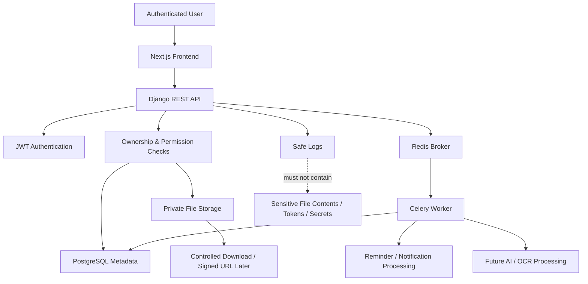
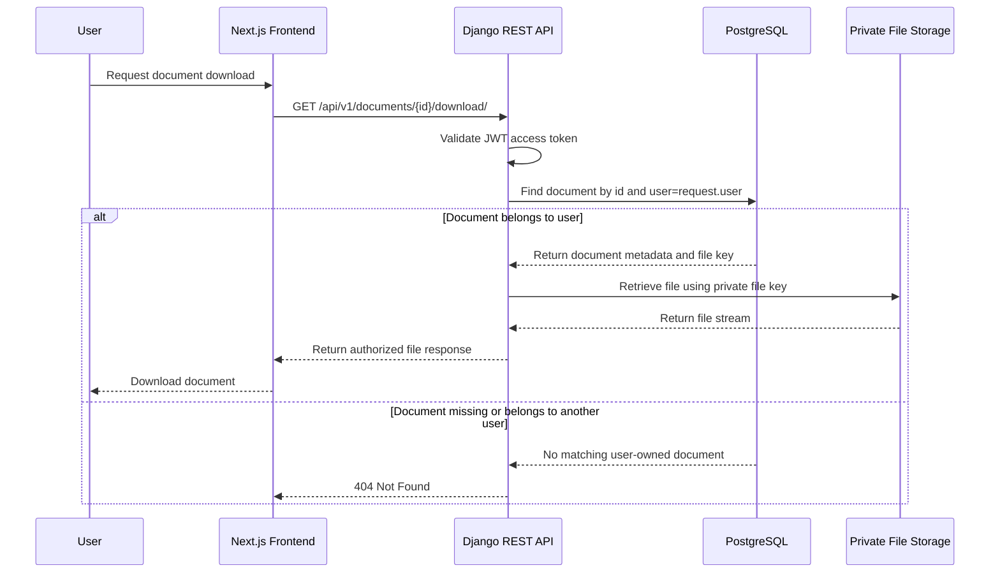
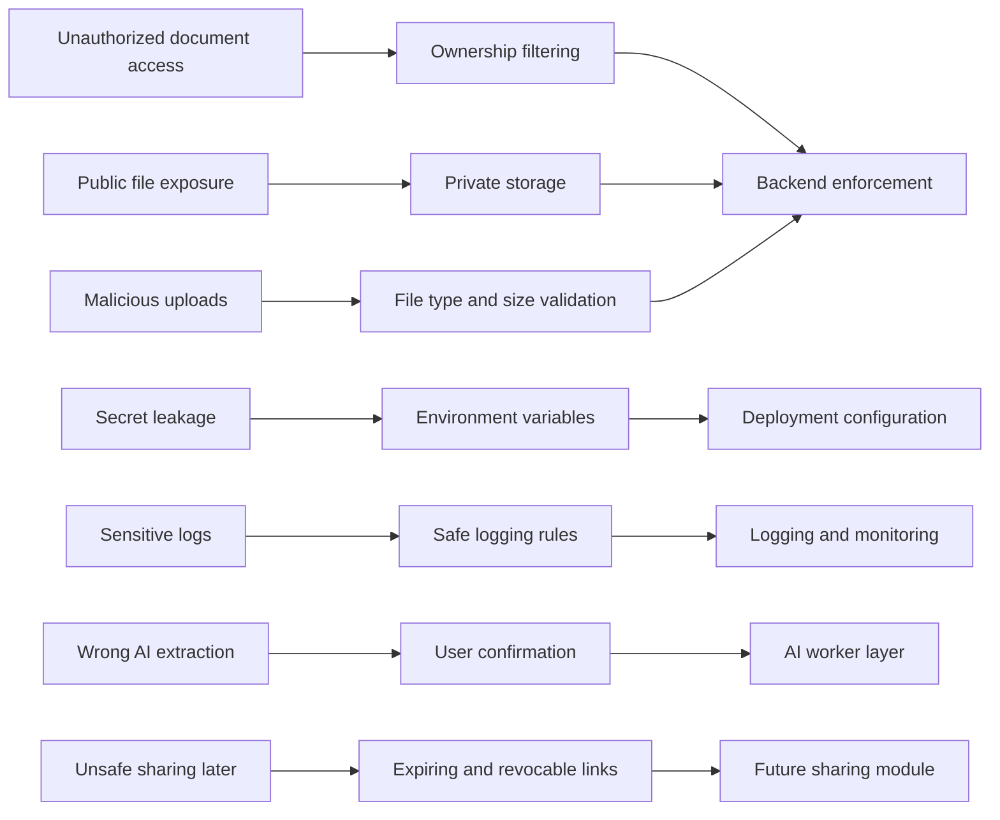

# CertaNest Security Plan

**Version:** v0.1  
**Status:** Planning  
**Product Type:** SaaS-ready life admin platform  
**Security Priority:** High  
**Primary Risk Area:** Sensitive document storage and user-owned data protection  

---

## 1. Security Plan Summary

CertaNest is designed to manage sensitive user information such as passports, visas, certificates, contracts, insurance documents, IDs, invoices, receipts, and renewal records.

Because of this, security must be treated as a core product requirement, not an optional technical improvement.

The first version of CertaNest must be designed around the following principle:

> A user must only be able to access their own data, and sensitive documents must never be publicly exposed by default.

This security plan defines the rules, risks, controls, and implementation expectations for v0.1 and future versions.

---

## 2. Security Objectives

| Objective | Description |
| --- | --- |
| Protect user data | Prevent unauthorized access to documents, renewals, reminders, and application packs |
| Protect uploaded files | Ensure documents are private by default and only accessible by their owner |
| Protect authentication | Use secure registration, login, token handling, and password practices |
| Prevent data leakage | Avoid exposing private data through APIs, logs, errors, URLs, or storage |
| Validate inputs | Prevent unsafe file uploads, invalid data, and malformed requests |
| Support future trust | Prepare for secure sharing, audit logs, and privacy controls later |
| Build safely during development | Avoid using real private documents during development and testing |

---

## 3. Security Principles

CertaNest should follow these principles throughout development.

| Principle | Meaning |
| --- | --- |
| Private by default | Documents and user data are never public unless explicitly shared in future versions |
| Least privilege | Users, services, and code paths should only access what they need |
| Ownership enforcement | Every protected resource must be scoped to the authenticated user |
| Defense in depth | Multiple controls should protect sensitive data, not just one layer |
| Secure defaults | Default settings should favor privacy and safety |
| No secrets in code | API keys, database URLs, and credentials must never be committed |
| Fail safely | Errors should not expose sensitive details |
| User confirmation | AI-extracted data must be reviewed before it affects important deadlines |
| Progressive hardening | Security should improve as the product moves from local MVP to production |

---

## 4. Security Architecture Overview



This diagram shows the main security boundary: the frontend can request resources, but the backend must authenticate, authorize, and verify ownership before accessing database records or files.

---

## 5. Secure Document Access Flow



This flow ensures users can only download documents they own. Even if a user guesses another document ID, the backend returns `404 Not Found`.

---

## 6. Security Control Map



This diagram maps the major CertaNest security risks to the controls that reduce them.

---

## 7. Data Classification

CertaNest data should be treated according to sensitivity.

| Data Type | Sensitivity | Examples | Protection Level |
| --- | --- | --- | --- |
| Account data | High | email, full name, password hash | Strong access control |
| Saved profile details | Very high | DOB, address, passport/national ID numbers saved for form pre-fill | Encrypted at rest (AES-256-GCM, AAD-bound), owner-only, opt-in, never shared, removed with the account |
| Uploaded documents | Very high | passport, visa, ID, certificates, contracts | Private storage and strict authorization |
| Document metadata | High | expiry dates, document types, file names | User-scoped API access |
| Renewal data | Medium to high | subscriptions, costs, provider names | User-scoped API access |
| Application packs | High | grouped documents for applications | User-scoped access |
| Reminder data | Medium | deadline reminders, timestamps | User-scoped access |
| Notifications | Medium | alerts and messages | User-scoped access |
| AI extraction results | High | extracted document fields and dates | User confirmation and careful storage |
| Logs | Potentially high | request metadata, errors | Must not include file contents or secrets |

---

## 8. Primary Security Risks

| Risk | Impact | Mitigation |
| --- | --- | --- |
| User accesses another user’s documents | Severe privacy breach | Strict ownership filtering on every query |
| Uploaded files become publicly accessible | Severe data exposure | Private storage and controlled download endpoints |
| API key or database credentials leak | System compromise | Environment variables and `.env` exclusion |
| Malicious file upload | Server compromise or abuse | File type, size, and content validation |
| Sensitive data appears in logs | Privacy breach | Logging rules and safe error handling |
| AI extracts wrong expiry date | Missed deadline or wrong reminder | Confidence score and user confirmation |
| Share links expose documents | Unauthorized access | Expiring, revocable links in later versions |
| Weak authentication | Account takeover | Strong password validation and secure token handling |
| Over-permissive CORS | Unauthorized frontend access | Strict CORS configuration |
| Insecure deployment settings | Production compromise | Separate development and production settings |

---

## 9. Authentication Security

CertaNest will use JWT-based authentication for API access.

### v0.1 Authentication Requirements

- Users register with email, full name, and password.
- Passwords are hashed using Django’s built-in password hashing.
- Login returns access and refresh tokens.
- Protected API endpoints require a valid access token.
- Refresh tokens are used to obtain new access tokens.
- Logout should invalidate or blacklist refresh tokens if supported.
- User profile endpoints must only return the authenticated user’s data.

### Password Requirements

The backend should enforce reasonable password validation:

- minimum length
- common password prevention
- similarity checks against user data
- numeric-only password prevention
- Django password validators enabled

### Token Security Rules

- Access tokens should have short lifetimes.
- Refresh tokens should have longer but controlled lifetimes.
- Tokens must not be committed or logged.
- Frontend storage strategy should be reviewed carefully before production.
- Token refresh flow must be handled securely.

### Future Authentication Improvements

- email verification
- password reset flow
- two-factor authentication
- account recovery
- login alerts
- session/device management
- social login with Google

---

## 10. Authorization and Ownership Rules

Authorization is one of the most important security areas in CertaNest.

Every user-owned resource must be filtered by `request.user`.

### Critical Rule

Unsafe:

```python
Document.objects.get(id=document_id)
```

Safe:

```python
Document.objects.get(id=document_id, user=request.user)
```

### Ownership Rules

| Resource | Access Rule |
| --- | --- |
| Document | Only the owner can create, view, update, delete, or download |
| Renewal | Only the owner can create, view, update, or delete |
| Reminder | Only the owner can create, view, update, or delete |
| Notification | Only the recipient can view or update |
| ApplicationPack | Only the owner can access |
| ApplicationPackDocument | Pack and document must belong to the same user |
| AIExtractionResult | User can access only if they own the linked document |

### Recommended API Behavior

If a resource exists but belongs to another user, return:

```txt
404 Not Found
```

instead of:

```txt
403 Forbidden
```

This avoids leaking whether another user’s resource exists.

### Implemented: Document ownership enforcement

The shipped `Document` API (`apps.documents`) follows these rules concretely:

- `DocumentViewSet.permission_classes = [IsAuthenticated]` — anonymous requests
  receive `401 Unauthorized`.
- `get_queryset()` returns `Document.objects.filter(owner=self.request.user)`,
  so list/retrieve/update/delete can only ever touch the caller's own rows.
  Accessing another user's document id returns `404 Not Found` (it is simply not
  in the queryset), matching the recommended behavior above.
- `perform_create()` sets `owner=self.request.user`; the serializer marks
  `owner` read-only, so a client cannot assign a document to another user.
- This is verified by tests covering anonymous access, cross-user retrieve,
  update, and delete attempts.

### Implemented: document intelligence and reminder-rule ownership

- Document intelligence is calculated only for the authenticated user's own
  documents.
- Reminder rules are owner-only.
- Attention Needed does not expose shared/public documents.
- Frontend filters are convenience only; backend querysets enforce ownership.
- Search/filter/sort starts from `Document.objects.filter(owner=request.user)`,
  so filters cannot widen the result set to another user's records.
- `GET /api/v1/documents/attention-needed/` excludes another user's documents
  and excludes manually archived documents.
- Reminder-rule endpoints resolve rules through a parent document owned by
  `request.user`; users cannot create, list, update, or delete rules for
  another user's document.
- Upcoming reminder calculations only include enabled rules owned by the
  authenticated user and exclude trashed documents.
- Version history, proof records, emergency packs, export requests, and
  document activity endpoints are owner-scoped. Cross-user access returns
  `404`, not `403`.
- Trashed documents are hidden from active lists, attention-needed results,
  timeline events, reminder calculations, and public share/emergency access.
- Intelligence responses expose document metadata and computed fields only; they
  do not expose internal file paths, storage keys, access-code hashes, or
  share-link internals.

### Implemented: onboarding, trust, demo, and account controls

- **Onboarding state** is a one-to-one user-owned record. Progress timestamps
  are derived from real owner-scoped document workflows where practical and do
  not grant access to document data.
- **Guided setup checklist** is computed from the authenticated user's own
  documents, files, reminders, checklists, and share links. It does not inspect
  another user's records.
- **Demo data** is fake, clearly labeled with `[Demo]` and
  `DUENEST_DEMO_DATA`, and can be cleared only for the current user.
- **Trust summary** returns safe capability flags and beta limitations only. It
  must not return credentials, environment values, access-code hashes, internal
  storage paths, or raw file contents.
- **Account data summary** returns owner-scoped counts and active request
  status only.
- **Account data export** reuses the document metadata export generator, which
  excludes raw files, raw OCR text, share tokens, access-code hashes, and
  internal storage paths.
- **Account deletion** is request-based and cancellable while pending. The API
  does not delete accounts synchronously.

---

## 11. File Upload Security

CertaNest handles document uploads, so file upload security is critical.

### Allowed File Types for v0.1

```txt
application/pdf
image/png
image/jpeg
image/webp
```

### Recommended Size Limit for v0.1

```txt
10 MB per file
```

This can be increased later after production storage, scanning, and performance limits are improved.

### File Upload Requirements

The backend should:

- validate file size
- validate MIME type
- validate file extension
- reject unsupported files
- rename stored files safely
- avoid trusting original file names
- store files outside public static directories
- associate every file with a user-owned `Document` record
- never expose direct public file paths by default

### Dangerous File Types to Reject

For v0.1, reject executable or script-like files, including:

```txt
.exe
.sh
.bat
.cmd
.js
.php
.py
.jar
.html
```

### Implemented: Document file upload, preview, sharing, and activity

The shipped file upload foundation enforces:

- **Auth + ownership:** every file endpoint is `IsAuthenticated`. Attached
  files are scoped to the parent document's owner; standalone File Inbox files
  are scoped to `uploaded_by=request.user`. Listing, retrieving, downloading,
  restoring, or deleting another user's file returns `404`. Uploading to a
  document you don't own returns `404`.
- **Validation (allow-list):** max **10 MB**; extension must be one of
  `.pdf .jpg .jpeg .png .doc .docx`; client content type must be one of the
  matching MIME types. Frontend validation is never trusted.
- **Safe storage paths:** filenames are replaced with a UUID; the original name
  is stored for display only and never used to build the path. Files live under
  `MEDIA_ROOT` and are **not** served as public static media.
- **No path leakage:** API responses expose only controlled `download_url` and
  `preview_url` values (themselves authorized), never the internal storage path.
- **`uploaded_by`** is set from the request user, read-only to clients.
- **File Inbox:** direct uploads may exist with no parent document. They still
  use the same type/size validation, private storage, authenticated
  preview/download, plan counting, trash-first permanent deletion, and owner
  checks as document-attached files.
- **Preview access:** PDF/JPEG/PNG preview is served inline only through the
  backend. Preview authorization is the same as download authorization.
- **File-level share links:** a share link grants controlled access to one
  specific file only. It does **not** grant access to the user's whole vault,
  parent document private fields, other files, or dashboard data.
- **Server-side share permissions:** `view_only` links can preview supported
  files but cannot download; `download_allowed` links can download. The backend
  enforces this regardless of frontend state.
- **Expiry and revocation:** expired and revoked share links are invalid
  immediately for metadata, preview, and download.
- **Access codes:** optional access codes are hashed and never stored in plain
  text. Correct access codes do not bypass expiry, revocation, or permissions.
- **Owner-only share notes:** labels, recipient email, and purpose notes are
  owner-facing and are not exposed by public share endpoints.
- **Owner-only activity:** file activity logs are visible only to the owning
  user. Public share viewers never see the owner's internal activity log.
- **Trash-aware access:** deleting a document or file moves it to trash first.
  Trashed files/documents are unavailable through public share links and
  emergency packs. Permanent deletion is a separate explicit action.
- **Version history:** document versions store metadata and file display
  snapshots only; they do not duplicate blobs or expose internal paths.
- **Structured exports:** vault and bundle metadata exports are owner-only,
  expire, and exclude raw files, raw OCR text, share tokens, access codes,
  access-code hashes, and internal storage paths.
- **Emergency packs:** packs expose only explicitly selected documents/files,
  never the whole vault. Shareable packs use unguessable tokens, optional
  expiry, optional hashed access codes, disable/regenerate controls, and skip
  trashed items.

TODO (hardening): sniff real content type from magic bytes (the client MIME is
spoofable) and add antivirus scanning before files are trusted. Production
preview/download/share access should use authenticated proxy access or private
object storage with signed, time-limited URLs. Raw public media URLs should not
be treated as secure access control.

User-uploaded SVG files should be rejected or heavily sanitized because SVG can contain scripts. Brand SVG assets committed by the developer are different from user-uploaded SVG files.

---

## 12. File Storage Security

### Development Storage

During local development, files may be stored under:

```txt
backend/media/
```

However:

- do not upload real sensitive documents
- do not commit media files
- add media folders to `.gitignore`
- use fake/sample documents only

### Production Storage

Production uses **private object storage** via provider-neutral `STORAGE_*`
configuration (`config/storage.py`), mapped to the django-storages S3 backend.
Any S3-compatible provider works; **Cloudflare R2** is the beta target:

- Bucket: `certanest-prod-documents`, **private** — public **r2.dev** access and
  public custom domains stay **off**.
- Credentials (`STORAGE_ACCESS_KEY_ID` / `STORAGE_SECRET_ACCESS_KEY`) are
  backend-only (Railway env). They are never placed in the frontend / Vercel.
- The S3 backend is configured private by default: no canned ACL is sent
  (`STORAGE_PRIVATE=true`), and any URL it would generate is a short-lived signed
  URL (`STORAGE_SIGNED_URLS=true`, 5-minute TTL) — never a public, permanent link.
- **Files are app-encrypted (AES-256-GCM) before upload**, so object storage
  holds only ciphertext. Delivery streams decrypted bytes through authenticated,
  ownership-checked Django views — object-storage URLs are never used to serve
  user files. Switching providers is a config change, not a code change.
- Local-to-bucket migration uses `migrate_local_media_to_storage` (dry-run first;
  never deletes local files). See `docs/DEPLOYMENT.md` for setup, verification,
  the Railway checklist, and the rollback plan.

### Production File Access Rules

Uploaded files should be:

- private by default
- accessed only after backend authorization
- served through controlled download endpoints or signed URLs
- protected from public bucket listing
- separated by storage keys
- deleted when the user deletes the document, unless retention rules say otherwise

### Database vs Storage

| Data | Storage Location |
| --- | --- |
| document metadata | PostgreSQL |
| file key/path | PostgreSQL |
| actual file content | local storage or object storage |
| temporary ZIP exports | temporary storage with expiration later |

The database should not store large binary files directly.

---

## 13. Environment Variables and Secrets

No secrets should be committed to Git.

### Secrets Must Use Environment Variables

Examples:

```txt
DJANGO_SECRET_KEY=
DATABASE_URL=
REDIS_URL=
JWT_SIGNING_KEY=
PRIVATE_BETA_ENABLED=
EMAIL_HOST_PASSWORD=
S3_ACCESS_KEY_ID=
S3_SECRET_ACCESS_KEY=
OPENAI_API_KEY=
```

### Required `.gitignore` Entries

The repository should ignore:

```txt
.env
.env.*
*.sqlite3
media/
staticfiles/
__pycache__/
node_modules/
.next/
dist/
coverage/
```

### Secret Handling Rules

- Never paste secrets into README files.
- Never commit `.env` files.
- Never expose API keys in frontend code.
- Rotate any key that is accidentally committed.
- Use separate secrets for development and production.

---

## 14. CORS and CSRF Strategy

CertaNest uses a separate Next.js frontend and Django REST API.

### CORS Rules

In development, allow only the local frontend origin:

```txt
http://localhost:3000
```

In production, allow only the deployed frontend domain.

Avoid:

```txt
CORS_ALLOW_ALL_ORIGINS = True
```

in production.

### CSRF Considerations

If using JWT in Authorization headers, CSRF risk differs from cookie-based session auth. However, if refresh tokens or sessions are stored in cookies later, CSRF protections must be reviewed and configured properly.

---

## 15. Input Validation

Every API should validate incoming data.

### Validation Areas

| Input | Validation |
| --- | --- |
| email | valid email format and uniqueness |
| password | Django password validation |
| dates | valid format and logical values |
| file uploads | type, size, extension |
| amount | non-negative decimal |
| currency | valid currency code |
| URLs | valid URL format |
| document type | allowed value |
| category | allowed value |
| status | controlled enum |
| reminder target | must link to document or renewal |

### Frontend vs Backend Validation

Frontend validation improves user experience.

Backend validation is mandatory for security.

Never rely only on frontend validation.

---

## 16. API Error Security

Error responses should be clear but safe.

### Safe Error Example

```json
{
  "error": {
    "code": "DOCUMENT_NOT_FOUND",
    "message": "The requested document was not found.",
    "details": {}
  }
}
```

### Avoid Exposing

- stack traces
- database errors
- file system paths
- storage bucket names
- internal object keys
- token details
- sensitive document content

### Production Rule

Debug mode must be disabled in production:

```txt
DJANGO_DEBUG=False
```

---

## 17. Logging and Monitoring Rules

Logs are useful, but logs can also leak sensitive data.

### Safe to Log

- request method
- endpoint name
- status code
- request duration
- user ID where appropriate
- task success/failure
- generic error codes

### Do Not Log

- passwords
- access tokens
- refresh tokens
- uploaded file contents
- document text
- AI extracted sensitive content
- private document URLs
- full request bodies containing sensitive data
- secret environment variables

### Future Monitoring Tools

Possible production tools:

- Sentry
- platform logs
- Django logging
- Celery worker logs
- uptime monitoring

---

## 18. AI Extraction Security

AI extraction is planned for v0.2 or later.

AI must be introduced carefully because uploaded documents may contain sensitive personal information.

### AI Security Rules

- AI extraction should be optional at first.
- Users should understand that a document will be processed.
- AI output must not be blindly trusted.
- Users must confirm or edit extracted data.
- AI confidence scores should be stored and shown.
- Failed AI extraction should not block document upload.
- Sensitive extracted content should not be logged.
- Only necessary document text should be sent for processing.
- API keys must be kept server-side only.

### AI Output Handling

AI results should be stored separately in `AIExtractionResult`.

AI results should not overwrite user-confirmed data unless the user approves it.

### Implemented: AI usage metering and budget guard (cost control)

Every AI provider call goes through a single chokepoint (`apps.ai.client.generate`),
which is now metered and capped so a small Anthropic credit cannot be drained by a
misconfiguration, a runaway loop, or abuse.

- **Key stays backend-only.** `ANTHROPIC_API_KEY` is read from server settings and
  never returned in any API response or log. Provider errors are logged without the
  exception detail to avoid any chance of leaking the key.
- **Usage metering.** Each call attempt writes one `apps.ai.AiUsage` row recording
  only safe accounting metadata: feature name, provider, model, input/output/total
  tokens, an estimated cost, status (`success` / `error` / `blocked`), a machine
  reason code, and an optional safe provider request id. **No raw prompts, document
  text, model responses, API keys, share/access codes, or payment data are stored.**
- **Infrastructure budget guard.** Before any paid call the guard checks three
  conservative caps — per-user daily tokens (`AI_DAILY_TOKEN_CAP_USER`), global daily
  tokens (`AI_DAILY_TOKEN_CAP_GLOBAL`), and global monthly estimated cost
  (`AI_MONTHLY_COST_LIMIT_USD`). Over a cap, the call is **not** sent to Anthropic; a
  `blocked` usage row is recorded and the user sees a graceful paused message (internal
  limits are never revealed). The budget guard is **separate from plan credits** (see
  below) and remains fully active regardless of plan.
- **Fail-closed.** If the usage tables can't be read during a budget check, the call
  is blocked rather than allowed to spend unmetered.
- **Non-fatal metering.** A metering write failure is logged and swallowed — it never
  breaks the AI action it measures (same philosophy as transactional email).

### Implemented: AI plan credits (product limits)

In addition to the infrastructure budget guard, AI usage is controlled by
**monthly plan credits** — a product-level limit distinct from the infrastructure caps:

- **Free plan:** 10 AI credits/month, 3 AI-indexed documents, basic features only.
- **Pro plan:** 200 AI credits/month, 300 AI-indexed documents, all features.
- Credits are spent **only** after a genuinely successful AI call; blocked, failed,
  budget-paused, or consent-missing calls never consume a credit.
- Plan feature flags gate premium features (`multi_document_qa`, `document_draft`,
  `pack_copilot`, etc.) independently of the credit balance.
- The `ai_actions_per_day` entitlement (migration 0010) is retained for backward
  compatibility but is **no longer used for enforcement**.

**Security layering:** plan credits and the infrastructure budget guard are
independent layers. Both must pass for a paid AI call to proceed. The budget guard
fails closed; plan credit checks also fail closed. Neither layer exposes internal cap
values to users.

### Model routing security

- **Default model is Haiku-class**, not Opus — minimizing cost exposure on a shared
  balance.
- **Opus is never the default** for Free or Pro users. It is reserved for
  founder/admin use or an explicit `AI_MODEL` operator override, and for system
  (user=None) calls.
- Free users are always served Haiku. Pro users get Haiku by default; Sonnet is
  permitted only for heavier features when `AI_PRO_SONNET_ENABLED=true` (default off).
- Model selection is enforced at the `apps.ai.routing.resolve_allowed_ai_model`
  chokepoint — never taken from client input.

Per-user AI credit usage (`limit`, `used`, `remaining`, `period`) is exposed on
`GET /api/v1/ai/preferences/` (see api-spec.md §13B.13). Global spend is never
exposed to normal users.

> TODO (founder console): aggregate cross-user AI spend/usage views for the admin
> console once it has a clean place for them.

### Implemented: chunk-level RAG v1 (answering over document content)

CertaNest can answer questions about the actual **content** of a user's documents,
not just their metadata, via chunk-level retrieval-augmented generation.

- **Safe text source only.** Chunks are built from text the app has *already*
  extracted (`DocumentExtraction.raw_text`, with notes/key-fields as fallback).
  `get_document_text_for_ai()` never reads raw file binaries and never sends a
  file to any AI provider — only extracted text. No text → indexing is skipped.
- **Manual indexing.** Indexing is explicit per document
  (`POST /api/v1/documents/{id}/ai/index/`); `AI_RAG_AUTO_INDEX_ON_UPLOAD`
  defaults **off** so the whole production vault is never auto-indexed. Reindex is
  replace-on-change (no duplicate chunks). The index endpoint **never calls
  Anthropic**; it may call Voyage embeddings only when a key is configured.
- **Owner-scoped retrieval.** `DocumentChunk` is owner-scoped; retrieval filters
  by `owner=user` as the security boundary — a user can never retrieve another
  user's chunks. Retrieval prefers vector similarity when chunks are embedded and
  falls back to lexical scoring; with no chunks it defers to the document-level
  path so nothing regresses.
- **Embeddings optional.** Without `VOYAGE_API_KEY`, chunks are still stored and
  fully usable via lexical retrieval. Embedding failure degrades to lexical and
  never crashes indexing.
- **Grounded + honest answers.** Claude is instructed to answer only from the
  provided excerpts and to reply "I could not find enough information in the
  selected documents." when they're insufficient — no fabricated dates/IDs.
- **Same gates + cost controls.** Q&A and indexing stay behind the `ai_features`
  + `ai_document_qa` flags and per-user consent. Every Claude call still passes
  through the metered, budget-guarded chokepoint (`feature="document_qa"`).
  Context sent to Claude is bounded by `AI_RAG_TOP_K` and
  `AI_RAG_MAX_CONTEXT_CHARS`.
- **No content in logs.** `DocumentChunk` stores extracted text + optional
  vector; `AiUsage` still stores only token/cost accounting — never prompts,
  excerpts, responses, file URLs, or secrets. The Q&A `sources` returned to the
  owner contain excerpts of their *own* documents and no signed URLs.

> Scaling note: vectors are JSON float lists with cosine computed in Python
> (per-owner vault sizes). **pgvector** remains the future option when corpus
> size demands it; not part of v1.

### Implemented: safe URL fetch for requirement link import

The Requirement Link → Checklist feature (`apps/ai/requirement_links.py`,
`fetch_requirement_page`) allows a user to paste an external URL into an
application pack. Because the server fetches a user-supplied URL, this path
includes a dedicated SSRF guard and is intentionally constrained.

**Scheme allowlist.** Only `http` and `https` are accepted. `file://`, `ftp://`,
`javascript:`, `data:`, and all other schemes are rejected immediately with the
`unsupported_scheme` reason. No credit is charged.

**Private-IP rejection (SSRF guard).** The host is resolved via DNS before
connecting. Addresses in private, loopback, link-local, reserved, multicast, or
unspecified ranges are rejected (`blocked_address` reason). This prevents the
server from being used as a proxy to reach internal services.

**Redirect cap.** Redirects are followed manually (not via automatic
`allow_redirects`). A maximum of 3 hops is allowed; each hop is re-validated
against the scheme and IP rules before following.

**Request timeout.** Each HTTP request times out at 10 seconds.

**Response size cap.** The response body is read up to a hard cap of 2 MB.
Responses exceeding that limit are rejected (`too_large`).

**Content type guard.** Only `text/html` and `text/plain` responses are accepted
(`not_readable` for anything else). Binary, JSON, XML, and image responses are
rejected.

**No raw HTML stored.** Only the structured extracted payload is stored in the
`RequirementExtractionDraft` model: the page title, source URL, extracted
requirement fields, and short verbatim source snippets for citation. No full HTML
body, no private file paths, no R2 calls.

**No crawling.** Exactly the one user-provided URL is fetched. No link-following,
no site crawling.

**Existing AI gates reused, not bypassed.** The fetch and extraction paths go
through the same AI consent check (`AiPreference.ai_enabled`), plan entitlement
(`ai_requirement_checklist`, Pro-only), monthly credit balance
(`requirement_link_checklist`, 5 credits), and infrastructure budget guard as
every other AI feature. Credits are charged only on `ai_call_succeeded`; any
block or failure charges 0 credits.

**Known V1 limitation.** DNS-rebinding (TOCTOU) is not fully mitigated: the IP
check is performed at resolution time, not at connection time, so a host that
resolves to a public IP initially but switches to a private IP after the check
could bypass the guard. This covers the common SSRF case for a user-pasted URL
in a personal SaaS vault but should be hardened in a future version if the
feature is opened to higher-volume or untrusted-input paths.

---

## 19. Reminder and Notification Security

Reminders and notifications must also respect user ownership.

### Implemented: document reminder rules and notification delivery

Document reminder rules are stored owner-only and nested under owner-owned
documents. The notification app creates owner-scoped `Notification` records
from due document, subscription, checklist/bundle, organization, share-room,
quick-share, emergency access, and security/account events.

Email delivery runs only through the notification service layer and the
`process_due_notifications` management command. Development defaults to
Django's console email backend; production must configure a real transactional
provider, authenticated sending domain, monitoring, and bounce handling before
email is considered production-ready.

### Rules

- Users can only see their own reminders.
- Users can only see their own notifications.
- Users can only manage reminder rules for documents they own.
- Notification generation must scope every query by user ownership or
  organization membership/role.
- Duplicate reminder records and repeat email delivery are prevented by a
  stable unique `dedupe_key`.
- Notification metadata is sanitized and must not store access codes, share
  tokens, emergency tokens, encryption keys, raw OCR text, file paths, private
  notes, or decrypted document contents.
- Email reminders must never attach files or include full document/file
  contents, decrypted previews, public access tokens, access codes, payment
  credentials, raw OCR text, or private notes.
- Email reminders should drive users back to authenticated CertaNest pages.
- Delivery logs may include notification id, user id, notification type,
  delivery status, safe error category, and timestamp only.

Example safe reminder:

```txt
Your passport document is expiring soon. Please review it in CertaNest.
```

Avoid including highly sensitive details in email bodies unless a future,
explicit, separately reviewed user setting is added.

### Implemented: Weekly Radar email

The Weekly Radar email (`apps/notifications/weekly_radar.py`) is owner-scoped and
**deterministic** — it is built entirely from the existing Life Radar payload
(`build_life_radar`) and makes **no AI call and consumes no AI credits**. It
never includes document contents, private file URLs, attachments, passport/ID
numbers, raw OCR text, or notes — only titles, counts, dates, and internal app
routes (the Life Radar payload itself carries no file URLs).

It is strictly **opt-in** (`NotificationPreference.weekly_radar_email_enabled`,
default off) and additionally requires `email_enabled`. Sending honours
suppression and one-click unsubscribe through the shared `send_branded_email`
(category `lifecycle`), and is **deduped weekly** (no Weekly Radar in the last
6 days, tracked via `EmailLog`) so a weekly beat plus an accidental rerun cannot
double-send. A per-recipient failure never aborts the batch.

---

## 20. Application Pack Security

Application packs bundle multiple documents, so they require strict checks.

### v0.1 Rules

- User must own the application pack.
- User must own every document added to the pack.
- A pack cannot include another user’s document.
- ZIP export must verify ownership before generation.
- Temporary ZIP files should not be kept permanently.

### Future Sharing Rules

When secure sharing is added:

- links must expire
- links must be revocable
- access should be logged
- share tokens must be random and unguessable
- only hashed tokens should be stored
- users should see active links
- users should be able to revoke links immediately

---

## 21. Database Security

### Database Rules

- Use least-privilege database credentials.
- Do not expose database ports publicly in production.
- Use migrations to manage schema changes.
- Use constraints for important invariants.
- Index ownership and date fields for efficient scoped queries.
- Avoid storing raw secrets or sensitive file contents in the database.

### Sensitive Data

PostgreSQL will store metadata such as:

- file names
- document types
- expiry dates
- renewal dates
- provider names

This metadata can still be sensitive and must be protected.

---

## 22. Development Safety Rules

During development:

- use fake/sample documents only
- never upload real passport, visa, ID, certificate, or bank document
- never commit media files
- never commit `.env`
- never hardcode API keys
- review `git status` before committing
- inspect files before pushing
- keep the repository private until ready for public presentation
- use branches and pull requests for changes

### Recommended Pre-Commit Checklist

Before every commit:

```txt
- Did I add secrets accidentally?
- Did I add media files accidentally?
- Did I add private documents accidentally?
- Did I expose API keys?
- Did I change only files related to this branch?
- Is the commit message clear?
```

---

## 23. Production Readiness Security Checklist

Before any production deployment, CertaNest must have:

- [ ] `DEBUG=False`
- [ ] strong `DJANGO_SECRET_KEY`
- [ ] production database credentials
- [ ] strict `ALLOWED_HOSTS`
- [ ] strict CORS origins
- [ ] HTTPS enabled
- [ ] secure file storage
- [ ] private object storage bucket
- [ ] no public media directory exposure
- [ ] environment variables configured securely
- [ ] logs checked for sensitive data leakage
- [ ] upload size limits
- [ ] allowed file type validation
- [ ] authentication tested
- [ ] ownership checks tested
- [ ] secure error responses
- [ ] backup strategy considered
- [ ] admin panel protected
- [ ] test/sample data only unless security is ready

---

## 24. v0.1 Security Acceptance Criteria

v0.1 security is acceptable when:

- users can only access their own account data
- users can only access their own documents
- users can only download their own files
- users can only manage their own renewals
- users can only manage their own reminders
- users can only see their own notifications
- users can only create packs with their own documents
- protected endpoints require authentication
- file uploads validate size and type
- uploaded files are not committed to Git
- uploaded files are not publicly exposed by default
- secrets are stored in environment variables
- `.env` files are ignored
- errors do not expose sensitive internal details
- real sensitive documents are not used in development
- API tests cover critical ownership checks

---

## 25. Security Testing Plan

### Authentication Tests

- register user successfully
- reject duplicate email
- reject weak password
- login with valid credentials
- reject invalid credentials
- access protected route with token
- reject protected route without token

### Authorization Tests

- user cannot list another user’s documents
- user cannot retrieve another user’s document by ID
- user cannot update another user’s document
- user cannot delete another user’s document
- user cannot download another user’s file
- user cannot add another user’s document to an application pack

### File Upload Tests

- accept valid PDF
- accept valid PNG/JPEG/WebP
- reject unsupported file type
- reject oversized file
- safely store file name
- delete file when document is deleted

### API Security Tests

- validation errors are safe
- not found errors do not leak ownership
- unauthorized requests return `401`
- forbidden or hidden resources do not leak data
- list endpoints are scoped to `request.user`

---

## 26. Future Security Enhancements

Future versions should consider:

- email verification
- password reset
- two-factor authentication
- device/session management
- audit logs
- account deletion
- user data export
- document encryption at rest
- object storage signed URLs
- virus scanning
- secure share links
- role-based access control
- workspace permissions
- rate limiting
- abuse detection
- security headers
- content security policy
- backup and recovery plan

---

## 26.5 Document Vault Security Plan

Security considerations for the documents-first roadmap (see
[`document-vault-roadmap.md`](document-vault-roadmap.md)). The vault handles
sensitive identity documents, so security is a first-class product requirement,
not a later add-on.

### Core rules (apply to every phase)

- **User-owned access:** every document, file, reminder, checklist, share link,
  bundle, and activity record is scoped to its owner. Cross-user access returns
  `404`, never `403` (no existence leak).
- **Private storage:** uploaded files are never served as public static media.
  They are returned only through authenticated, ownership-checked endpoints.
- **Preview = download authorization:** the in-app preview endpoint must enforce
  the **same** ownership checks as download. A preview URL is not "less
  sensitive" than a download URL.
- **No path as security:** never expose raw internal file paths or rely on an
  unguessable path as access control. Authorization is checked on every request.
- **No frontend-only access control:** the backend is always the source of
  truth for who can read a file.

### Share links (implemented file-level access)

- Tokens must be **unguessable** (cryptographically random), never sequential.
- Every link has an **expiry**; expired links return nothing.
- Links are **revocable**; revoked links return nothing immediately.
- Optional **access-code** protection (hashed, never stored in plaintext).
- Share links grant access to **one file only**, never the owner's full vault.
- Permissions are enforced server-side: view-only does not allow download.
- Correct access codes do not bypass expiry, revocation, or permissions.
- Owner-only share labels and notes are not exposed publicly by default.
- **Log access** (timestamp, coarse metadata) for the owner's activity view.
- Public share routes must not list other files or expose internal paths.

### OCR privacy (Phase 4)

- OCR runs server-side on owner-private files; extracted text is owner-scoped.
- **OCR must never silently overwrite trusted fields.** Suggestions are stored
  separately and only applied after explicit user review/confirm.
- If a third-party OCR service is ever used, document the data-processing path
  and prefer self-hosted/processing-in-region options for identity documents.

### Sensitive data, masking, and lock mode (Phase 5)

- Support **sensitive-field masking** (e.g. document numbers) in the UI and in
  share/preview contexts.
- **Document lock mode** can require re-authentication before viewing the most
  sensitive records.
- **Private notes** are owner-only and excluded from shares/exports by default.

### Audit, trash, and exports (implemented document-vault foundation)

- **Activity/audit logs** are owner-readable. The document activity endpoint
  merges document-level events with file/share events and does not expose raw
  IP addresses, user agents, tokens, access codes, or file paths.
- **Trash/restore:** deleting moves to trash; restore is possible within a
  recoverable flow. **Trashed or purged files must not remain accessible**
  through public file shares or emergency packs.
- **Exports** are generated on demand, owner-scoped, expiring, and currently
  metadata-only. Vault exports cover account-level document metadata; bundle
  exports cover one owner-owned bundle's readiness, requirements, linked
  document/file summaries, checklist progress, and proof summaries. They exclude
  raw files, raw OCR text, share tokens, access codes, access-code hashes, and
  internal storage paths.
- **Account controls** expose owner-scoped data counts, route account export
  through the same metadata export generator, and track deletion as a pending
  request rather than deleting synchronously.

### Emergency access (Emergency Protocol — implemented, high risk)

- Emergency packs are **very high risk** and must remain explicit, limited, and
  revocable. A pack grants access only to selected documents/files, never the
  whole vault. Require explicit setup, optional expiry, optional hashed access
  codes, token rotation, and immediate disable controls.
- **Unlock rules:** packs set to `owner_approval` or `delayed` never expose items
  on a public scan — item preview/download requires an open `EmergencyUnlockRequest`
  (proved with the `X-Request-Token` header). A denied/revoked request never
  opens; a delayed countdown only auto-unlocks once its `unlock_at` passes.
  `instant_code`/legacy share links keep the original code-gated behaviour.
- **Trusted contacts** store no credentials and never grant access on their own.
- **Emergency location** is **off by default**, never live tracking, and is
  revealed only after access is unlocked; `approximate` precision withholds exact
  coordinates. It is never included in pre-unlock responses.
- **Audit + notifications:** every scan, request, wrong-code attempt, approval,
  denial, view, download, and location reveal is recorded in an append-only
  `EmergencyActivityEvent` log that stores no secrets (codes/tokens), and the
  owner receives in-app notifications for requests, unlocks, downloads, and
  wrong-code attempts. The public request endpoint is rate-limited
  (`emergency_code` scope).

### Production storage

- Move blobs to **private object storage** (S3-compatible) with **signed,
  time-limited URLs**; never make document buckets public.

### Explicit warnings

- Never expose raw internal file paths as security.
- Never trust frontend-only access control.
- Never let OCR overwrite important fields without review.
- Never allow share links without expiry and revocation.
- Never allow deleted files to remain accessible.

---

## 27. Security Non-Goals for v0.1

The following are intentionally not required in the first MVP:

- enterprise SSO
- advanced compliance certification
- end-to-end encryption
- team role-based access control
- secure public sharing links
- virus scanning pipeline
- device management
- full audit log system
- automated privacy compliance workflows
- custom encryption key management

These can be added later as the product matures.

---

## 28. Security Responsibility Matrix

| Area | Responsible Layer |
| --- | --- |
| Authentication | Backend |
| Password hashing | Django |
| Token issuing | Backend |
| Token storage | Frontend with secure strategy |
| Ownership checks | Backend |
| File validation | Backend |
| File storage | Backend/storage provider |
| Document download authorization | Backend |
| Form validation | Frontend and backend |
| Error safety | Backend |
| Logging safety | Backend and infrastructure |
| AI processing safety | Backend and worker layer |
| Secrets management | Environment and deployment platform |

---

## 29. Summary

CertaNest security must be taken seriously from the beginning because the product may handle sensitive personal and professional documents.

The first version should focus on:

- secure authentication
- strict ownership checks
- private file access
- safe file uploads
- environment-based secrets
- safe errors and logs
- no real sensitive documents during development
- tests for user-owned data protection

The long-term security strategy should evolve toward secure sharing, audit logs, stronger authentication, encrypted storage, and privacy controls.

The goal is not to overengineer security in v0.1, but to build the foundation correctly so CertaNest can grow into a trustworthy SaaS product.

---

## 30. Founder Console Security Rules

Founder Console V1 is an internal operations layer, not a staff vault browser.

Access control:

- All `/api/v1/founder/` endpoints require authentication.
- Founder endpoints require `is_staff` or `is_superuser`.
- Normal authenticated users receive `403 Forbidden`.
- The frontend only shows Founder Console navigation after the backend confirms
  founder access.
- The active frontend entry point is `/founder`, which uses a separate founder
  shell instead of the normal dashboard chrome.
- Waitlist and invite management endpoints under `/api/v1/founder/` are
  founder-only.
- Public waitlist submission and invite validation never expose the waitlist
  list, founder notes, registered-user state, or invite management metadata.

Privacy boundaries:

- Founder dashboard, activation, adoption, security, and support views use
  aggregate metrics or safe metadata.
- Public waitlist responses return only the submitted entry confirmation.
- Invite validation returns code health and safe invite metadata only.
- User support summaries intentionally exclude document titles, filenames, raw
  OCR text, private notes, physical locations, access codes, share tokens, and
  internal file paths.
- Product events and error metadata are sanitized before storage. Product
  events also carry a server-generated dedupe key so repeated client events do
  not inflate founder analytics.
- Feature completion, launch readiness, beta profiles, and founder audit logs
  store operational metadata only.
- Country activity is aggregate-only, uses approximate product-event country
  metadata plus waitlist country fields, and does not expose GPS, street-level
  location, city-level drilldowns, or raw IP addresses in ordinary founder UI.
- Future sensitive support access must require explicit user consent and
  audit logging before it is implemented.

Deferred hardening:

- production-grade rate limits for feedback, waitlist, invite validation, and
  client error intake
- production incident-response workflow
- explicit consent-based support access
- richer security-event taxonomy

---

## Premium sharing, Secure Rooms & Calendar security

### Public access scoping

Public share/room access is scoped to a single token. A link/room exposes only
its one file (or its explicit items) — never the rest of the vault, the owner's
identity, other documents, tokens, access-code hashes, or internal storage
paths. Expiry, revocation, access-code verification, view-only download
blocking, and one-time/limited access limits are **all enforced server-side**;
frontend hiding is never the security boundary.

One-time public access is consumed by the first successful sensitive access,
whether that access is a preview, a direct file download, or a Secure Room ZIP
download. After consumption, metadata, preview, download, and ZIP routes return
`410 {state: "limit_reached"}` for that token.

### Access-code grants

After a viewer verifies an access code, the server issues a short-lived (30 min)
signed grant (`TimestampSigner`) bound to that single share/room token. The
viewer presents the grant (query param) instead of re-sending the raw code, so
the raw code is never stored in the browser, and a grant minted for one token
cannot unlock another.

### Screenshot deterrence (not prevention)

CertaNest discourages screenshots with dynamic watermarking, view-only controls,
optional privacy-screen blur on tab blur, access limits, and activity logging.
**Browsers cannot fully prevent OS-level screenshots** — the product never
claims otherwise. View-only download blocking is enforced server-side. The
recipient's email may appear inside the watermark (only when watermarking is
enabled), as it marks the copy for the intended recipient; it is never otherwise
exposed publicly.

### Calendar privacy

Calendar access is authenticated and owner-scoped: a user only ever sees their
own events. Aggregation excludes other users' data, share tokens, access codes,
internal file paths, and founder/operational data. The one-way `.ics` export
uses safe `CertaNest: ...` titles only and omits tokens, codes, paths, and sensitive
numbers. There is no Google/Outlook or two-way external calendar sync.

## Subscription Tracker V1

The Subscription / Recurring Renewal Tracker is authenticated and strictly
owner-scoped: `owner` is set from the request (never the client) and every
query filters by owner, so one user can never read or mutate another's
subscriptions or payment records (cross-user access returns `404`).

Sensitive payment data is deliberately not stored. There is no card number, CVV,
or banking credential field anywhere in the schema; `payment_method_label` is a
human label only (e.g. "Visa ending 1234") and both a model validator and the
serializer reject values that look like a full card number. There is no Stripe,
bank API, or payment automation in this feature.

Subscription events reaching Calendar/Timeline carry only safe summaries
(name, amount, currency, dates) - never account emails or payment labels.
Rule-based review intelligence uses only owner-entered subscription metadata
(dates, auto-renew, amount/currency, importance, and last-used date). It does
not inspect bank data, real service usage, browser activity, email, or files.

Founder analytics expose subscription usage only as aggregate adoption counts.
They must not expose subscription names, account emails, provider names,
payment labels, exact per-user amounts, or private notes.

## Organization Workspace V1 security

Organization Workspace V1 introduces shared resources without changing the
personal vault security boundary.

Backend enforcement rules:

- Every organization workspace endpoint requires JWT authentication.
- The user must have an active `OrganizationMembership` for the organization.
- Suspended, left, removed, or non-members are denied immediately.
- Mutations require role checks. Owners/admins manage members, invites,
  requests, campaigns, bundles, and rooms. Members can view and submit assigned
  work. Viewers cannot mutate resources.
- Admins cannot remove or change owners, and the last active owner cannot be
  removed or demoted.
- Every nested resource lookup is scoped by `organization`.
- Serializer validation rejects cross-organization references such as assigning
  a request to a member from another organization or adding another
  organization's document to a room.
- Organization resources are separate models; personal vault documents do not
  appear in organization workspaces.

Public-link rules:

- Organization invite tokens are unguessable, expiring, revocable, and accepted
  only by an authenticated user whose email matches the invite when present.
- Public document request upload tokens are unguessable, expiring, and scoped
  to one `DocumentRequest`. They expose only request metadata and accept only a
  file submission for that request.
- Public organization secure rooms expose active room metadata and selected
  organization document/file metadata only. Tokens, internal paths, access
  codes, personal documents, and other organization records are not exposed.
- Public organization room file download/ZIP export is deferred in V1, so the
  public room endpoint does not serve file bytes.

File upload rules:

- Organization document files and request submissions reuse the existing V1
  file size and file type allowlist.
- Responses expose original filename, content type, size, and timestamps, not
  storage paths.
- Activity logs store safe summaries only. They do not store file contents,
  tokens, access codes, raw private document numbers, or internal paths.

Founder analytics:

- Organization workspace metrics are aggregate only: total organizations, active
  organizations, average members per organization, organization document count,
  request count, campaign count, room count, and adoption counts.
- Founder analytics must not expose organization names, member lists, document
  titles, filenames, file contents, invite tokens, upload tokens, room tokens,
  private notes, or internal file paths.

## Quick Share QR V1 security

Quick Share reuses the Secure Rooms security model and adds account-to-account
claim controls. Core guarantees:

* The QR/claim URL contains only the random session token
  (`secrets.token_urlsafe(32)`), never file ids, storage paths, access codes, or
  permission payloads.
* `access_code_hash` is hashed with Django's `make_password` and never
  serialized; raw access codes are never stored or logged. Access codes are sent
  via the `X-Access-Code` header and re-verified on every request, throttled at
  `quick_share_code` (10/min) with generic error states.
* A session exposes only its explicitly attached files. Trashed files and files
  the owner no longer owns are excluded automatically, so revoking/trashing a
  file removes it from the share immediately.
* Expiry, revocation, one-time consumption, and max-claim limits are enforced
  server-side via a single state guard. Owner revoke takes effect on the next
  request.
* View-only download and save-copy are blocked server-side regardless of the
  client. Save-copy is honoured only when `save_copy_allowed` is set; the copy is
  re-created from fresh bytes, owned by the receiver, with no sender token,
  access code, or internal metadata carried over.
* Account-to-account file access requires the authenticated receiver to hold an
  accepted (and, when required, sender-approved) claim. Cross-account access to
  unrelated files returns 404; non-owners cannot revoke or manage a session.
* Activity logging records safe events only and never stores raw IP addresses,
  tokens, access codes, or file paths — only a coarse user-agent summary.

Non-goals / limitations: QR codes cannot prevent OS-level screenshots
(watermarking is deterrence only); saved copies cannot be revoked after the
receiver saves them; in-browser camera scanning is not implemented; emergency
and organization-collection QR surfaces are deferred to later iterations.

### Verifiable Shares signing key

* A verified share is signed with an **Ed25519 private key** held only on the
  server (`SHARE_SIGNING_PRIVATE_KEY`, PEM via env; never committed). Only the
  **public** key is ever exposed (`GET /api/v1/verify/key/`), so a leaked response
  cannot forge signatures.
* When the key is unset the app generates an **ephemeral dev key** and logs a
  warning — fine for local dev, but signatures do not persist across restarts, so
  the key must be set for any shared/production deployment.
* The public verify endpoints (`/api/v1/verify/<token>/`, `/verify/key/`) are
  `AllowAny`, rate-limited, and return **metadata + per-file match booleans only —
  never document bytes**; no access code is required (the token already grants the
  recipient the share).
* Verification asserts **provenance + integrity only** (an unaltered copy shared
  from a CertaNest account), never the document's real-world authenticity; the UI
  states this explicitly to avoid over-claiming.

## Smart Profile V1 privacy

Smart Profile stores **reusable application data** (education, work, skills,
achievements, common answers, plus scalar extras like application email,
addresses, and emergency contact). Security posture:

* **Owner-only.** Every endpoint and query is scoped to the signed-in user;
  foreign ids return `404` and a linked `related_document` must belong to the
  user (`400` otherwise). Smart Profile is **never exposed publicly** — there are
  no share endpoints, and it is not surfaced in any unrelated endpoint.
* **Sensitive numbers stay encrypted and are not duplicated.** Passport number
  and national ID continue to live only in the AES-256-GCM-encrypted
  `UserProfileDetails` store (`/users/me/profile-details/`). Smart Profile reads
  only **non-secret** identity values plus presence booleans
  (`has_passport_number`, `has_national_id`) — the actual numbers are never
  returned by, or copied into, Smart Profile.
* **Lower-sensitivity rows are standard owner-scoped data.** Education/work/etc.
  and the scalar extras (incl. emergency-contact phone, addresses) are stored as
  ordinary DB rows with DB-at-rest protection and owner-only access. Field-level
  encryption (`apps.core.security.encryption`) is available and is noted as a
  future hardening option for the emergency-contact/extras fields.
* **No AI, no logs of values.** Smart Profile makes **no AI provider call** and
  consumes **no AI credits**; profile data is not sent to any model in this
  branch. `build_application_context_from_profile` builds a deterministic context
  for *future* AI generation but is service-only (not a public endpoint) and
  excludes passport/ID numbers and file URLs.
* **Deletion.** All Smart Profile rows use `on_delete=CASCADE` to the user, so
  they are removed automatically by the existing account-deletion flow
  (`AccountDeletionRequest`). No new deletion hook is required.

### AI Application Document Generator V1 — security

* **Encrypted at rest.** Exported files (PDF and DOCX) are stored as
  `DocumentFile` records with the same AES-256-GCM field-level encryption that
  protects all vault files. No new storage path or encryption scheme is
  introduced.
* **Private-only download.** Files are served exclusively through
  `/api/v1/files/{id}/download/` (authenticated, owner-scoped). Raw R2 or
  storage URLs are never returned to the client.
* **No passport/ID numbers in model context.**
  `build_application_context_from_profile` explicitly excludes passport numbers
  and national-ID numbers before passing any context to the AI provider. This
  matches the Smart Profile privacy guarantee.
* **No-hallucination policy.** The model is instructed to use only the supplied
  Smart Profile, application, and pack data. Missing information is surfaced in
  `quality_checks.missing_information`; the model must never invent degrees,
  employers, dates, skills, awards, or metrics.
* **Review-before-save (editable).** The generate endpoint returns structured
  content for user review, and the user may edit the draft via `PATCH .../{id}/`
  before persisting. Nothing is written to the vault until the user explicitly
  calls export or save-to-pack. There is no auto-save path.
* **Edit and export paths never call AI or charge credits.** Editing
  `structured_content` deterministically rebuilds the preview and recomputes the
  `ats_score`, `quality_score`, and structured `warnings` with no provider call;
  export renders the edited/persisted content. Neither contacts the AI provider
  or consumes credits. Credits are charged only on a successful generation.
* **Existing consent + credits + budget guard reused.** `AiPreference.ai_enabled`
  consent check, monthly AI credit metering, and the infrastructure budget guard
  (`AI_DAILY_TOKEN_CAP_USER`, `AI_DAILY_TOKEN_CAP_GLOBAL`,
  `AI_MONTHLY_COST_LIMIT_USD`) all apply normally. No second metering system is
  introduced.
* **Pro-only plan gate.** `ai_application_document_generation` entitlement is
  `off` for Free — a Free user hitting the generate endpoint receives a graceful
  `200 { available: false, reason: "ai_feature_not_in_plan" }`, not a server
  error, and 0 credits are consumed.
* **Export respects plan limits.** Export and save-to-pack enforce the standard
  Free/Pro file count and storage quota; exceeding either returns `403
  { code: "plan_limit_exceeded" }`. No AI call is made on the export path.
* **No new dependency exposes secrets.** `python-docx==1.1.2` is a pure-Python
  OOXML library with no system or LibreOffice dependencies. PDFs use the
  existing `fpdf2` library. Neither library makes network calls.

## Magic Inbox V1 security

Magic Inbox lets a user drop a file or paste email/message/requirement text or a
link, then proposes routes into the vault. Capture → Analyze → Review → Apply.

* **Owner-scoped.** Every `MagicInboxItem` and every endpoint is scoped to the
  signed-in user; another user's item returns `404 Not Found`, never `403`.
* **Encrypted file intake, no raw URLs.** File capture stores an encrypted
  `DocumentFile` through the existing File Inbox upload path (AES-256-GCM at
  rest), and is enforced by the Free/Pro **file + storage** plan limits. The file
  is reachable only via the private, owner-only `/api/v1/files/{id}/download/`
  route — raw object-storage/R2 URLs are never returned.
* **Review-before-apply (no auto-create).** Analysis only proposes suggestions;
  nothing is created until the user explicitly selects suggestions and calls
  apply. There is no auto-share, auto-submit, or auto-write path.
* **Apply never calls AI or charges credits.** Applying creates only owner-scoped
  records for the selected suggestions; it makes no AI provider call and consumes
  no AI credits. Deterministic analysis is likewise AI-free and free of charge.
* **AI triage reuses existing gates.** Optional AI smart triage reuses the
  standard layers — consent (`AiPreference.ai_enabled`), rollout flags
  (`magic_inbox_triage` + `ai_features`), Pro entitlement (`ai_magic_inbox`),
  monthly AI credit metering, and the infrastructure budget guard. No second
  metering or bypass path. No-hallucination schema: triage never invents
  documents or deadlines.
* **No external mailbox access (V1).** Magic Inbox does **not** integrate
  Gmail/Outlook or read any external mailbox — it is in-app upload/paste only, so
  it introduces no third-party inbox credentials or OAuth scope. Gmail/Drive/
  Outlook import is future work.

## Document Request Links V1 security

Document Request Links (`DocumentRequestLink`, `apps/documents`) let an
authenticated owner collect **one document from another person** via an
unguessable public upload link. Request → Upload → Review → Accept / Reject /
Needs-replacement → Attach / Save. See also `docs/PUBLIC_LINK_SECURITY.md` and
`docs/security/public-upload-links.md`.

* **Unguessable token.** Each link carries a 256-bit URL-safe
  `secrets.token_urlsafe` token (unique, indexed), the same pattern as the app's
  other share links, resolved by exact token match on the public route only. No
  internal IDs are exposed.
* **Minimal public payload (no owner data, no file URLs).** The public `GET`
  reveals **only** the metadata needed to upload — requested document title/type,
  instructions, due/expiry, recipient name, a safe `from_name` display name +
  "CertaNest", status, and `can_upload`. It **never** discloses the owner's email,
  vault, notes, the uploaded file, or any file URL.
* **Encrypted, owner-owned upload via the private route only.** The recipient
  uploads a single file with no CertaNest account. It is stored as an encrypted,
  owner-owned `DocumentFile` through the standard private-storage chain
  (extension/type/magic-byte validation + malware scan + encrypt-at-rest,
  AES-256-GCM) and is served **only** through the authenticated owner download
  route `/api/v1/files/{id}/download/` — never a raw/public storage URL and never
  returned to the recipient. R2 stays private.
* **Owner file/storage limits enforced on public upload.** Because the file lands
  in the owner's vault, public upload also enforces the **owner's** Free/Pro file
  and storage plan limits, in addition to the per-owner active
  `document_request_links` cap (Free 5 / Pro 100, active statuses only).
* **Review-before-accept (no auto-accept).** Nothing is auto-accepted. The owner
  must explicitly review each upload (accept / reject(reason) /
  needs_replacement(reason)). Save-to-vault and attach-to-pack run **only after
  acceptance**; `needs_replacement` re-opens the link for a fresh upload.
* **No public recipient account.** Recipients never authenticate, never see a
  dashboard, and cannot read any owner resource. Public endpoints are throttled
  (`public_access_code` for metadata, `public_document_upload` for upload) and
  reject uploads once expired/cancelled/accepted/rejected or past the upload
  allowance.
* **Deterministic — no AI.** The entire flow makes no AI provider call and
  consumes no AI credits. This is the bridge toward B2B Portals; full
  portals/staff/bulk/multi-recipient are not in V1.
* **Email carries no private data.** Optional, owner-triggered email uses the
  shared branded path (`send_branded_email`, suppression + `EmailLog`) and
  contains only the request details + the public upload link — no owner
  documents, attachments, or private file URLs. No email is ever sent
  automatically.

## Sharing Rooms V1 security

Sharing Rooms (`SharingRoom`, `apps/documents`) are a secure, owner-scoped
workspace shared around a pack, application, or emergency case: selected
documents/files plus Document Request Links behind **one unguessable public
token**, with expiry / revoke / archive controls and view/upload toggles. This is
a **new, separate model** from the existing personal `ShareRoom` (it does not
replace it). See also `docs/api-spec.md` §35, `docs/PUBLIC_LINK_SECURITY.md`, and
`docs/security/public-upload-links.md`.

* **Unguessable token.** Each room carries a 256-bit URL-safe
  `secrets.token_urlsafe` token (unique, indexed), resolved by exact token match
  on the public route only. No internal IDs are exposed.
* **Selected-item-only exposure.** A room exposes **only** the items the owner
  added (documents/files/request links) — never the rest of the owner's vault.
  Items not added to the room are never reachable through the public route
  (accessing an unrelated `file_id` returns `404`).
* **Minimal public payload (no owner data, no file URLs).** The public `GET`
  reveals only safe room metadata — title, description, `room_type`, `status`,
  `allow_download` / `allow_upload`, `expires_at`, a safe `from_name` display
  name, and pack/application **title** labels. It **never** discloses the owner's
  vault, identity, email, or any raw storage URL.
* **Files via decrypt-in-memory proxy only.** Room files are streamed through the
  authenticated proxy routes
  (`/api/v1/public/sharing-rooms/{token}/files/{file_id}/preview|download/`),
  which decrypt in memory and stream bytes. A storage URL is **never** returned;
  R2 stays private.
* **Download gated by `allow_download`.** With downloads off, only preview is
  available for supported types; the proxy enforces this server-side regardless
  of the client.
* **Revoke / expiry enforced (410).** Revoking a room (`revoked`) and expiry
  (`expire_sharing_rooms()` marks past-expiry rooms `expired`) make the public
  route return `410`. Archive (`archived`) likewise removes public access.
* **Uploads reuse the Document Request Link flow.** There is no second public
  upload system — request links are added as room items and surface their own
  request tokens, so uploaders continue on the existing `/document-request/{token}`
  page with its own review/accept flow. `allow_upload` gates whether those upload
  tokens are surfaced.
* **Lightweight participants, no per-participant tokens.**
  `SharingRoomParticipant` stores only invite metadata (name/email/permission);
  the room's single token governs access in V1.
* **Deterministic — no AI.** The entire flow makes no AI provider call and
  consumes no AI credits. This is a bridge toward CertaNest Portals; full
  portals/staff roles/redaction/bulk rooms are not in V1.

## Redaction + Watermarking V1 security

`ProtectedDocumentCopy` (`apps/documents`) creates a safe **protected copy** of an
owned document/file before sharing — manual redaction rectangles and/or a
watermark, generated **server-side** so redaction is genuinely secure. All
endpoints are owner-scoped and gated behind the founder-only feature flag
`redaction_watermarking`. See also `docs/api-spec.md` §36 and `docs/BILLING.md`.

* **Original is never modified.** The original file is only ever **read**
  (decrypted in memory) to produce the copy; it is byte-for-byte unchanged and its
  text remains extractable (asserted by test). The protected copy is a separate,
  brand-new file — there is no in-place edit path.
* **Secure (non-overlay) redaction.** Redaction is genuinely destructive, not a
  removable layer. For **images (PNG/JPEG)**, redaction rectangles are drawn
  directly into pixel data and the watermark is baked into pixels — nothing is
  recoverable. For **PDFs with redaction**, each page is **rasterized** to an
  image (pdf2image/poppler at 150 DPI), the rectangles + watermark are burned in,
  and pages are recomposed into a new PDF; the underlying text/objects are
  destroyed, so redacted content is **not extractable** (a test asserts sample
  redacted text "SECRET123" is absent from the output's extracted text). This is
  the endorsed safe approach and sacrifices selectable text in the redacted PDF.
* **Watermark-only preserves text.** When there is no redaction, a light watermark
  page is overlaid per page (pypdf + an fpdf2 transparent watermark page), so
  selectable text is preserved — nothing sensitive is being hidden in that case.
* **Backend does the redaction.** The frontend sends only **normalized**
  coordinates (`0..1` fractions of page width/height, DPI/point independent) plus
  watermark config; the server performs the actual redaction. There is no
  client-only "black box" that could be peeled off.
* **Protected output is a new encrypted, private file.** The result is a new
  encrypted (AES-256-GCM), owner-owned `DocumentFile`, served **only** via the
  authenticated owner route `/api/v1/files/{id}/download/` — never a raw/public
  storage URL. R2 stays private. Generation enforces the owner's existing Free/Pro
  **file + storage** plan limits (`403 plan_limit_exceeded` over the limit); no
  separate plan resource was added.
* **No public route; shared only via Sharing Rooms / private download.** There is
  no public endpoint for protected copies. A copy can be added to an owner Sharing
  Room (the **protected** file only — never the original); Document Request Links
  have no public redaction in V1 (the owner may protect an accepted file
  afterward); Magic Inbox has no integration in V1.
* **Deterministic — no AI.** The entire flow makes no AI provider call and
  consumes no AI credits; there is **no automatic PII detection** in V1.
* **Future work (out of scope):** automatic PII detection and audit logs for
  protected-copy generation.

## Audit Logs V1

A unified, **owner-scoped** audit log (`AuditLogEntry`, `apps/documents`,
migration `documents/0038_auditlogentry`) records security-relevant document and
sharing events so an owner can answer *"who uploaded/opened/downloaded this, who
accepted a request, when was a room revoked?"* It is **append-only**,
**deterministic — no AI call and no AI credits**, and built as a **new** model
distinct from the existing per-feature activity trails (`DocumentFileActivity`,
`RoomActivity`, `DocumentActivity`, `QuickShareActivity`, `ProductEvent`), which
are unchanged. The service is `apps/documents/audit.py`.

### What is logged vs never logged

Logged are security-relevant **access/change** events only: Document Requests,
Sharing Rooms, Protected Copies, and Applications/Packs lifecycle actions
(create, accept/reject, open, preview, download, upload, item add/remove, revoke,
archive, status change, requirement satisfied). Read-only dashboard reads are
**not** logged.

The log **never stores** document contents, extracted text, private file URLs,
raw storage keys, raw public tokens, passwords/secrets, passport/ID numbers, AI
prompts/responses, or raw email bodies.

### Salted-hash network fingerprints

IP address and user-agent are stored **only** as a salted SHA-256 hash
(`hash_request_fingerprint`, using the new `AUDIT_LOG_HASH_SALT` setting —
env-backed with a development fallback) — **never in plaintext**. The model has
no raw IP or user-agent columns at all, and the API serializer **excludes the
hashes entirely** (they exist only for server-side correlation). `country_code`
comes from a **CDN edge header** (no IP geolocation), so it is safe to store.

### Metadata sanitization

Event metadata is sanitized at write time by `safe_audit_metadata`: any key whose
name looks sensitive (url / token / storage / key / content / password / etc.) is
dropped via a forbidden-substring filter with a small exact-match allow-list, and
sizes/counts are capped. Allowed metadata is limited to safe values such as
`status_from` / `status_to`, file name/title, request/room/pack/application
titles, `due_date`, `result`, and `reason_category`.

### Owner-only access

All endpoints (`GET /api/v1/audit-logs/`, `/{id}/`, `/summary/`) require
authentication and return only the requesting user's own entries. Public actors
(anonymous token visitors) can **never** read audit logs — there is no public
route. Public-route access is itself *recorded* as an anonymous `public_link`
actor (`record_public_link_event`) so the owner gains accountability without the
visitor's identity ever being stored. The owner-only UI is
`/dashboard/security/audit`.

### Best-effort / non-breaking

`record_audit_event` is wrapped in try/except: a logging failure logs a
server-side warning and returns `None` — it **never raises**, so it can never
break the user action it records (same philosophy as transactional email).

### Append-only and future work

V1 is append-only and keeps entries **indefinitely** (no automatic purge). A
retention/export policy, B2B audit exports, and broader event coverage are future
work. See `docs/security/audit-logs.md` and `docs/api-spec.md` §37 for the full
event catalog and API contract.

## B2B Portals MVP

An organization-facing portal workspace for managing people and document **cases**
(`organizations/{org_id}/portal/`). It is an MVP that **orchestrates existing
primitives** — it does **not** add a second upload, sharing-room, or request
system, and it is **deterministic — no AI, no AI credits**. The three new models
(`PortalPerson`, `PortalCase`, `PortalCaseDocumentRequest`, migration
`organizations/0005_*`) carry only workspace metadata, never files.

### Membership-scoped access, admin-only writes

* Every portal endpoint requires **authentication** and **membership** of the
  target organization. Reads are open to any member; **writes require an
  admin/owner role** (`require_role(ADMIN_ROLES)`).
* **Org isolation:** a member only ever sees and acts on their **own
  organization's** people and cases — there is no cross-organization read or write.
* A **founder-only feature flag** `b2b_portals` gates the entire surface (a `503`
  when off), so the portal currently reaches only founders/beta testers.

### Ownership and reused primitives

The document primitives stay **User-owned** (no org FK). A case's checklist
(`DocumentBundle`), workspace (`SharingRoom`), and document collection
(`DocumentRequestLink`) are owned by the case's **creating member** (`created_by`),
so the existing owner-scoped ownership and permission checks apply unchanged;
organization access is gated by **membership**, not by primitive ownership. The
older/parallel org systems (`OrganizationSecureRoom`, `OrganizationDocument`, the
org-side `DocumentRequest`/campaigns, the personal `ShareRoom`) are **left
untouched** — no duplicate upload/room/request systems were introduced.

### No public portal surface

The portal adds **no new public route**. Recipients continue through the existing
**Document Request Link** (`/document-request/{token}`) and **Sharing Room**
(`/room/{token}`) public pages, which keep their own token security, private
file-serving proxies, and review/accept flows. The portal therefore exposes **no
private file URLs** and never creates a public portal page.

### Audit and privacy

Portal actions are recorded via the unified Audit Logs (`record_audit_event`,
category `system`, owner = the org's owner user, actor = the acting member,
`metadata.org_id` for scoping): `portal_person_created`, `portal_person_archived`,
`portal_case_created`, `portal_case_status_changed`, `portal_case_archived`,
`portal_case_pack_created`, `portal_case_room_created`,
`portal_case_request_created`. No document contents, tokens, or file URLs are
stored (the same privacy rules as Audit Logs V1 above).

See `docs/b2b-portals.md`, `docs/api-spec.md` §38, and
`docs/security/audit-logs.md` for the full contract and event catalog.

### Review + Approval Workflow V1

Staff review uploaded documents and decide accept / reject / needs-replacement
from the portal review queue. It **reuses the Document Request Link + pack
primitives** (no second upload/request/room system) and is **deterministic — no
AI, no AI credits**.

* **Admin-gated decisions, org-isolated.** Reading the review queue / case review
  items / the uploaded file is open to any active org member; **making a decision**
  (start-review, accept, reject, needs-replacement) requires an **admin/owner role**
  (`require_role(ADMIN_ROLES)`). Org isolation, the Teams entitlement gate, and the
  `b2b_portals` feature flag still apply.
* **File served only via the authenticated org-scoped proxy.** The uploaded file is
  an encrypted `DocumentFile` owned by the org owner; because a reviewing admin may
  be a different user, the personal `/files/{id}/download/` route would `404` for
  them. Review therefore streams the **decrypted bytes** through an org-scoped proxy
  (`.../file/preview/` and `.../file/download/`) — authenticated, org-member-gated,
  permission-first, **decrypt-in-memory**, with **no raw storage URL or token** ever
  exposed.
* **Recipient emails carry no private data.** Notification is opt-in and only on
  reject / needs-replacement; it uses the shared branded-email path
  (`portal_review_decision`) and carries only the request title + reason + (for
  needs-replacement) the recipient's own public upload-page link — **never** a
  private file URL, storage key, raw token, or document content.
* **Audited.** `portal_review_started`, `portal_document_accepted`,
  `portal_document_rejected` (severity `warning`),
  `portal_document_needs_replacement`, `portal_recipient_notified` are recorded
  through the unified Audit Logs (category `system`, owner = the org owner, actor =
  the acting member, `metadata.org_id`; no tokens, file URLs, or document contents).

See `docs/b2b-portals.md`, `docs/api-spec.md` §40, `docs/NOTIFICATIONS.md`, and
`docs/security/audit-logs.md`.

### Organization Dashboard V1

A **read-only** operational command center (`GET …/portal/dashboard/`) that does one
deterministic READ over existing portal data and returns metrics + bounded action
queues + the org plan-usage payload. **Deterministic — no AI, no AI credits.**

* **Read-only, member-gated, org-isolated.** Any **active org member** may read;
  non-members are denied. The `b2b_portals` feature flag and the org Teams
  entitlement gate it, exactly like the rest of the portal. It performs **no
  writes**.
* **Exposes no sensitive data.** Returns only safe operational fields — **never**
  raw public tokens, private file URLs, document contents, or storage keys. All
  `action_url`s are relative app routes. The org-scoped uploaded-file proxy
  (`.../file/preview/` `…/file/download/`) is **not** surfaced here — file access
  stays review-only.
* **No noisy logging.** Opening the dashboard records **no audit event**
  (deliberate). Its recent-activity feed only **reads** recent safe portal audit
  events (safe labels only).

See `docs/b2b-portals.md`, `docs/api-spec.md` §41, and
`docs/security/audit-logs.md`.

### B2B Bulk Reminder Emails V1

Staff can send a controlled **batch of branded reminder emails** to portal recipients
who must upload, replace, or complete documents
(`apps/organizations/portal_reminders.py`). It **reuses existing primitives** (the
Document Request Links, the shared branded-email helper, the unified Audit Log) and
adds **no new public route or email system**. **Deterministic — no AI.**

* **Admin-gated, org-isolated.** Preview is readable by any **active org member**;
  **create / send / cancel are OWNER/ADMIN only**. Non-members are denied. The
  `b2b_portals` feature flag and the org Teams entitlement gate it like the rest of
  the portal. No public endpoint.
* **Emails carry no private data.** The `portal_bulk_reminder` email includes only the
  organization/requester name, reason, document/case context, due date, and a **public
  recipient-facing action link only when one safely exists** (the upload page or an
  open case room) — **never** a private file URL, storage key, raw token, document
  content, or internal staff note.
* **Suppression + unsubscribe respected.** Sends go through `send_branded_email`
  (category `transactional`), honoring `SuppressedEmail` and one-click unsubscribe, and
  are logged in `EmailLog`. A **3-day cooldown** prevents re-sending the same reminder
  type to the same recipient for the same case/request (overridable by staff).
* **Sanitized audit metadata.** The five `portal_reminder_*` events record only safe
  keys (reminder type, counts, case id, reason category, result) — **never** a raw
  upload token, private file URL, storage key, document content, or full email body.

See `docs/b2b-portals.md`, `docs/api-spec.md` §42, `docs/NOTIFICATIONS.md`, and
`docs/security/audit-logs.md`.

## Teams Plan + Portal Limits V1

Portals are now governed by an **organization-level entitlement** in addition to
the membership scoping above. A new `OrganizationPlanProfile` (OneToOne →
`Organization`, migration `organizations/0006_organizationplanprofile`) carries the
org's `plan`, `status`, `portal_enabled`, and optional per-org caps. **An org with
no profile has portals disabled.** It is **deterministic — no AI.**

### Two gates

* **`b2b_portals` feature flag** — controls beta exposure (`503` when off).
* **Org entitlement** — controls actual usage: a non-Teams (portal-disabled) org
  gets `403 portal_not_enabled`, and an over-limit create gets `403
  organization_plan_limit_exceeded` (distinct from the personal
  `plan_limit_exceeded`). Limits are enforced **org-wide and portal-scoped only**
  (never a member's unrelated personal rooms/requests).

### Founder-command activation only (no self-serve, no secrets stored)

A Teams plan is activated **only** by a founder/beta management command
(`python manage.py set_organization_plan …`), **not** by public self-serve or live
checkout. No live Stripe prices are created and **no billing secrets/tokens are
stored** on the profile — the profile holds plan/status/limit metadata only.
Activation records audit events (`organization_plan_profile_created`,
`organization_plan_changed`, `organization_portal_enabled`,
`organization_portal_disabled`, `organization_portal_limit_reached`) through the
unified Audit Logs (category `system`, owner = the org owner, `metadata.org_id`; no
secrets/tokens/URLs).

The org-limits readout `GET /api/v1/organizations/{org_id}/portal/limits/` is
readable by **any member** (even when portals are disabled) so the UI can show the
paywall, but it exposes only plan/limit/usage metadata — no tokens or file URLs.

See `docs/b2b-portals.md`, `docs/api-spec.md` §39, `docs/BILLING.md`, and
`docs/security/audit-logs.md`.
