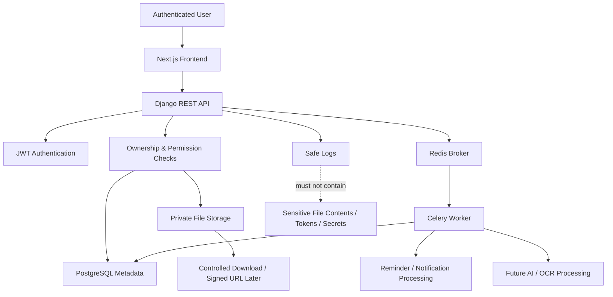
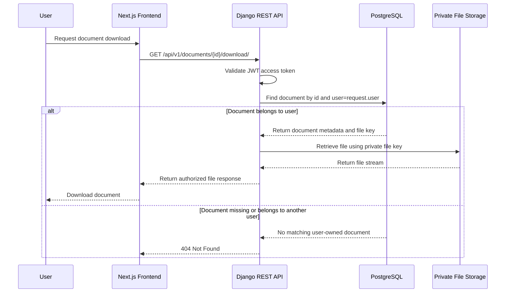
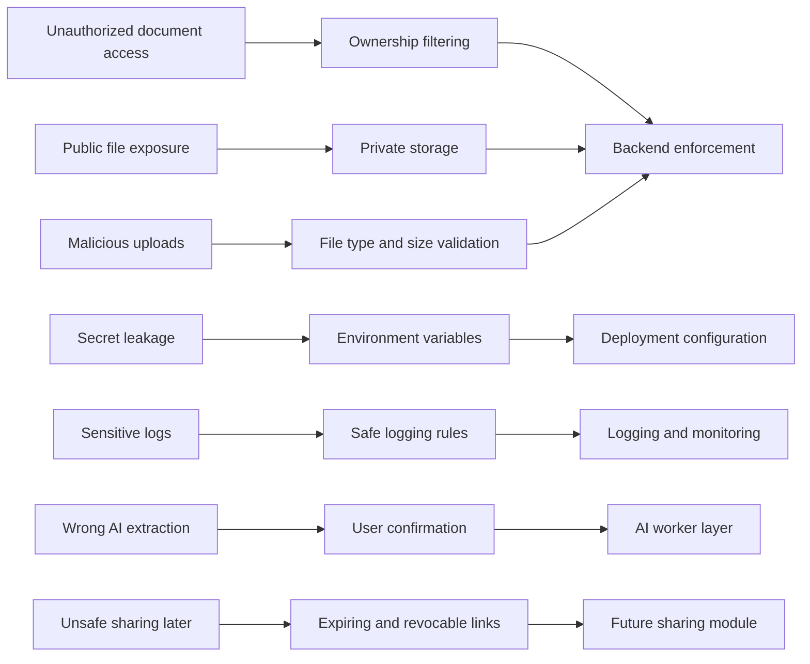

# DueNest Security Plan

**Version:** v0.1  
**Status:** Planning  
**Product Type:** SaaS-ready life admin platform  
**Security Priority:** High  
**Primary Risk Area:** Sensitive document storage and user-owned data protection  

---

## 1. Security Plan Summary

DueNest is designed to manage sensitive user information such as passports, visas, certificates, contracts, insurance documents, IDs, invoices, receipts, and renewal records.

Because of this, security must be treated as a core product requirement, not an optional technical improvement.

The first version of DueNest must be designed around the following principle:

> A user must only be able to access their own data, and sensitive documents must never be publicly exposed by default.

This security plan defines the rules, risks, controls, and implementation expectations for v0.1 and future versions.

---

## 2. Security Objectives

| Objective | Description |
| --- | --- |
| Protect user data | Prevent unauthorized access to documents, renewals, reminders, and application packs |
| Protect uploaded files | Ensure documents are private by default and only accessible by their owner |
| Protect authentication | Use secure registration, login, token handling, and password practices |
| Prevent data leakage | Avoid exposing private data through APIs, logs, errors, URLs, or storage |
| Validate inputs | Prevent unsafe file uploads, invalid data, and malformed requests |
| Support future trust | Prepare for secure sharing, audit logs, and privacy controls later |
| Build safely during development | Avoid using real private documents during development and testing |

---

## 3. Security Principles

DueNest should follow these principles throughout development.

| Principle | Meaning |
| --- | --- |
| Private by default | Documents and user data are never public unless explicitly shared in future versions |
| Least privilege | Users, services, and code paths should only access what they need |
| Ownership enforcement | Every protected resource must be scoped to the authenticated user |
| Defense in depth | Multiple controls should protect sensitive data, not just one layer |
| Secure defaults | Default settings should favor privacy and safety |
| No secrets in code | API keys, database URLs, and credentials must never be committed |
| Fail safely | Errors should not expose sensitive details |
| User confirmation | AI-extracted data must be reviewed before it affects important deadlines |
| Progressive hardening | Security should improve as the product moves from local MVP to production |

---

## 4. Security Architecture Overview



This diagram shows the main security boundary: the frontend can request resources, but the backend must authenticate, authorize, and verify ownership before accessing database records or files.

---

## 5. Secure Document Access Flow



This flow ensures users can only download documents they own. Even if a user guesses another document ID, the backend returns `404 Not Found`.

---

## 6. Security Control Map



This diagram maps the major DueNest security risks to the controls that reduce them.

---

## 7. Data Classification

DueNest data should be treated according to sensitivity.

| Data Type | Sensitivity | Examples | Protection Level |
| --- | --- | --- | --- |
| Account data | High | email, full name, password hash | Strong access control |
| Uploaded documents | Very high | passport, visa, ID, certificates, contracts | Private storage and strict authorization |
| Document metadata | High | expiry dates, document types, file names | User-scoped API access |
| Renewal data | Medium to high | subscriptions, costs, provider names | User-scoped API access |
| Application packs | High | grouped documents for applications | User-scoped access |
| Reminder data | Medium | deadline reminders, timestamps | User-scoped access |
| Notifications | Medium | alerts and messages | User-scoped access |
| AI extraction results | High | extracted document fields and dates | User confirmation and careful storage |
| Logs | Potentially high | request metadata, errors | Must not include file contents or secrets |

---

## 8. Primary Security Risks

| Risk | Impact | Mitigation |
| --- | --- | --- |
| User accesses another user’s documents | Severe privacy breach | Strict ownership filtering on every query |
| Uploaded files become publicly accessible | Severe data exposure | Private storage and controlled download endpoints |
| API key or database credentials leak | System compromise | Environment variables and `.env` exclusion |
| Malicious file upload | Server compromise or abuse | File type, size, and content validation |
| Sensitive data appears in logs | Privacy breach | Logging rules and safe error handling |
| AI extracts wrong expiry date | Missed deadline or wrong reminder | Confidence score and user confirmation |
| Share links expose documents | Unauthorized access | Expiring, revocable links in later versions |
| Weak authentication | Account takeover | Strong password validation and secure token handling |
| Over-permissive CORS | Unauthorized frontend access | Strict CORS configuration |
| Insecure deployment settings | Production compromise | Separate development and production settings |

---

## 9. Authentication Security

DueNest will use JWT-based authentication for API access.

### v0.1 Authentication Requirements

- Users register with email, full name, and password.
- Passwords are hashed using Django’s built-in password hashing.
- Login returns access and refresh tokens.
- Protected API endpoints require a valid access token.
- Refresh tokens are used to obtain new access tokens.
- Logout should invalidate or blacklist refresh tokens if supported.
- User profile endpoints must only return the authenticated user’s data.

### Password Requirements

The backend should enforce reasonable password validation:

- minimum length
- common password prevention
- similarity checks against user data
- numeric-only password prevention
- Django password validators enabled

### Token Security Rules

- Access tokens should have short lifetimes.
- Refresh tokens should have longer but controlled lifetimes.
- Tokens must not be committed or logged.
- Frontend storage strategy should be reviewed carefully before production.
- Token refresh flow must be handled securely.

### Future Authentication Improvements

- email verification
- password reset flow
- two-factor authentication
- account recovery
- login alerts
- session/device management
- social login with Google

---

## 10. Authorization and Ownership Rules

Authorization is one of the most important security areas in DueNest.

Every user-owned resource must be filtered by `request.user`.

### Critical Rule

Unsafe:

```python
Document.objects.get(id=document_id)
```

Safe:

```python
Document.objects.get(id=document_id, user=request.user)
```

### Ownership Rules

| Resource | Access Rule |
| --- | --- |
| Document | Only the owner can create, view, update, delete, or download |
| Renewal | Only the owner can create, view, update, or delete |
| Reminder | Only the owner can create, view, update, or delete |
| Notification | Only the recipient can view or update |
| ApplicationPack | Only the owner can access |
| ApplicationPackDocument | Pack and document must belong to the same user |
| AIExtractionResult | User can access only if they own the linked document |

### Recommended API Behavior

If a resource exists but belongs to another user, return:

```txt
404 Not Found
```

instead of:

```txt
403 Forbidden
```

This avoids leaking whether another user’s resource exists.

### Implemented: Document ownership enforcement

The shipped `Document` API (`apps.documents`) follows these rules concretely:

- `DocumentViewSet.permission_classes = [IsAuthenticated]` — anonymous requests
  receive `401 Unauthorized`.
- `get_queryset()` returns `Document.objects.filter(owner=self.request.user)`,
  so list/retrieve/update/delete can only ever touch the caller's own rows.
  Accessing another user's document id returns `404 Not Found` (it is simply not
  in the queryset), matching the recommended behavior above.
- `perform_create()` sets `owner=self.request.user`; the serializer marks
  `owner` read-only, so a client cannot assign a document to another user.
- This is verified by tests covering anonymous access, cross-user retrieve,
  update, and delete attempts.

---

## 11. File Upload Security

DueNest handles document uploads, so file upload security is critical.

### Allowed File Types for v0.1

```txt
application/pdf
image/png
image/jpeg
image/webp
```

### Recommended Size Limit for v0.1

```txt
10 MB per file
```

This can be increased later after production storage, scanning, and performance limits are improved.

### File Upload Requirements

The backend should:

- validate file size
- validate MIME type
- validate file extension
- reject unsupported files
- rename stored files safely
- avoid trusting original file names
- store files outside public static directories
- associate every file with a user-owned `Document` record
- never expose direct public file paths by default

### Dangerous File Types to Reject

For v0.1, reject executable or script-like files, including:

```txt
.exe
.sh
.bat
.cmd
.js
.php
.py
.jar
.html
```

User-uploaded SVG files should be rejected or heavily sanitized because SVG can contain scripts. Brand SVG assets committed by the developer are different from user-uploaded SVG files.

---

## 12. File Storage Security

### Development Storage

During local development, files may be stored under:

```txt
backend/media/
```

However:

- do not upload real sensitive documents
- do not commit media files
- add media folders to `.gitignore`
- use fake/sample documents only

### Production Storage

Production should use private object storage such as:

- AWS S3
- Cloudflare R2
- Supabase Storage
- DigitalOcean Spaces

### Production File Access Rules

Uploaded files should be:

- private by default
- accessed only after backend authorization
- served through controlled download endpoints or signed URLs
- protected from public bucket listing
- separated by storage keys
- deleted when the user deletes the document, unless retention rules say otherwise

### Database vs Storage

| Data | Storage Location |
| --- | --- |
| document metadata | PostgreSQL |
| file key/path | PostgreSQL |
| actual file content | local storage or object storage |
| temporary ZIP exports | temporary storage with expiration later |

The database should not store large binary files directly.

---

## 13. Environment Variables and Secrets

No secrets should be committed to Git.

### Secrets Must Use Environment Variables

Examples:

```txt
DJANGO_SECRET_KEY=
DATABASE_URL=
REDIS_URL=
JWT_SIGNING_KEY=
EMAIL_HOST_PASSWORD=
S3_ACCESS_KEY_ID=
S3_SECRET_ACCESS_KEY=
OPENAI_API_KEY=
```

### Required `.gitignore` Entries

The repository should ignore:

```txt
.env
.env.*
*.sqlite3
media/
staticfiles/
__pycache__/
node_modules/
.next/
dist/
coverage/
```

### Secret Handling Rules

- Never paste secrets into README files.
- Never commit `.env` files.
- Never expose API keys in frontend code.
- Rotate any key that is accidentally committed.
- Use separate secrets for development and production.

---

## 14. CORS and CSRF Strategy

DueNest uses a separate Next.js frontend and Django REST API.

### CORS Rules

In development, allow only the local frontend origin:

```txt
http://localhost:3000
```

In production, allow only the deployed frontend domain.

Avoid:

```txt
CORS_ALLOW_ALL_ORIGINS = True
```

in production.

### CSRF Considerations

If using JWT in Authorization headers, CSRF risk differs from cookie-based session auth. However, if refresh tokens or sessions are stored in cookies later, CSRF protections must be reviewed and configured properly.

---

## 15. Input Validation

Every API should validate incoming data.

### Validation Areas

| Input | Validation |
| --- | --- |
| email | valid email format and uniqueness |
| password | Django password validation |
| dates | valid format and logical values |
| file uploads | type, size, extension |
| amount | non-negative decimal |
| currency | valid currency code |
| URLs | valid URL format |
| document type | allowed value |
| category | allowed value |
| status | controlled enum |
| reminder target | must link to document or renewal |

### Frontend vs Backend Validation

Frontend validation improves user experience.

Backend validation is mandatory for security.

Never rely only on frontend validation.

---

## 16. API Error Security

Error responses should be clear but safe.

### Safe Error Example

```json
{
  "error": {
    "code": "DOCUMENT_NOT_FOUND",
    "message": "The requested document was not found.",
    "details": {}
  }
}
```

### Avoid Exposing

- stack traces
- database errors
- file system paths
- storage bucket names
- internal object keys
- token details
- sensitive document content

### Production Rule

Debug mode must be disabled in production:

```txt
DJANGO_DEBUG=False
```

---

## 17. Logging and Monitoring Rules

Logs are useful, but logs can also leak sensitive data.

### Safe to Log

- request method
- endpoint name
- status code
- request duration
- user ID where appropriate
- task success/failure
- generic error codes

### Do Not Log

- passwords
- access tokens
- refresh tokens
- uploaded file contents
- document text
- AI extracted sensitive content
- private document URLs
- full request bodies containing sensitive data
- secret environment variables

### Future Monitoring Tools

Possible production tools:

- Sentry
- platform logs
- Django logging
- Celery worker logs
- uptime monitoring

---

## 18. AI Extraction Security

AI extraction is planned for v0.2 or later.

AI must be introduced carefully because uploaded documents may contain sensitive personal information.

### AI Security Rules

- AI extraction should be optional at first.
- Users should understand that a document will be processed.
- AI output must not be blindly trusted.
- Users must confirm or edit extracted data.
- AI confidence scores should be stored and shown.
- Failed AI extraction should not block document upload.
- Sensitive extracted content should not be logged.
- Only necessary document text should be sent for processing.
- API keys must be kept server-side only.

### AI Output Handling

AI results should be stored separately in `AIExtractionResult`.

AI results should not overwrite user-confirmed data unless the user approves it.

---

## 19. Reminder and Notification Security

Reminders and notifications must also respect user ownership.

### Rules

- Users can only see their own reminders.
- Users can only see their own notifications.
- Background jobs must scope queries correctly.
- Notification messages should not expose unnecessary sensitive data.
- Email reminders should avoid attaching sensitive documents.
- Email reminders should use safe wording.

Example safe reminder:

```txt
Your passport document is expiring soon. Please review it in DueNest.
```

Avoid including highly sensitive details in email bodies unless the user explicitly configures that later.

---

## 20. Application Pack Security

Application packs bundle multiple documents, so they require strict checks.

### v0.1 Rules

- User must own the application pack.
- User must own every document added to the pack.
- A pack cannot include another user’s document.
- ZIP export must verify ownership before generation.
- Temporary ZIP files should not be kept permanently.

### Future Sharing Rules

When secure sharing is added:

- links must expire
- links must be revocable
- access should be logged
- share tokens must be random and unguessable
- only hashed tokens should be stored
- users should see active links
- users should be able to revoke links immediately

---

## 21. Database Security

### Database Rules

- Use least-privilege database credentials.
- Do not expose database ports publicly in production.
- Use migrations to manage schema changes.
- Use constraints for important invariants.
- Index ownership and date fields for efficient scoped queries.
- Avoid storing raw secrets or sensitive file contents in the database.

### Sensitive Data

PostgreSQL will store metadata such as:

- file names
- document types
- expiry dates
- renewal dates
- provider names

This metadata can still be sensitive and must be protected.

---

## 22. Development Safety Rules

During development:

- use fake/sample documents only
- never upload real passport, visa, ID, certificate, or bank document
- never commit media files
- never commit `.env`
- never hardcode API keys
- review `git status` before committing
- inspect files before pushing
- keep the repository private until ready for public presentation
- use branches and pull requests for changes

### Recommended Pre-Commit Checklist

Before every commit:

```txt
- Did I add secrets accidentally?
- Did I add media files accidentally?
- Did I add private documents accidentally?
- Did I expose API keys?
- Did I change only files related to this branch?
- Is the commit message clear?
```

---

## 23. Production Readiness Security Checklist

Before any production deployment, DueNest must have:

- [ ] `DEBUG=False`
- [ ] strong `DJANGO_SECRET_KEY`
- [ ] production database credentials
- [ ] strict `ALLOWED_HOSTS`
- [ ] strict CORS origins
- [ ] HTTPS enabled
- [ ] secure file storage
- [ ] private object storage bucket
- [ ] no public media directory exposure
- [ ] environment variables configured securely
- [ ] logs checked for sensitive data leakage
- [ ] upload size limits
- [ ] allowed file type validation
- [ ] authentication tested
- [ ] ownership checks tested
- [ ] secure error responses
- [ ] backup strategy considered
- [ ] admin panel protected
- [ ] test/sample data only unless security is ready

---

## 24. v0.1 Security Acceptance Criteria

v0.1 security is acceptable when:

- users can only access their own account data
- users can only access their own documents
- users can only download their own files
- users can only manage their own renewals
- users can only manage their own reminders
- users can only see their own notifications
- users can only create packs with their own documents
- protected endpoints require authentication
- file uploads validate size and type
- uploaded files are not committed to Git
- uploaded files are not publicly exposed by default
- secrets are stored in environment variables
- `.env` files are ignored
- errors do not expose sensitive internal details
- real sensitive documents are not used in development
- API tests cover critical ownership checks

---

## 25. Security Testing Plan

### Authentication Tests

- register user successfully
- reject duplicate email
- reject weak password
- login with valid credentials
- reject invalid credentials
- access protected route with token
- reject protected route without token

### Authorization Tests

- user cannot list another user’s documents
- user cannot retrieve another user’s document by ID
- user cannot update another user’s document
- user cannot delete another user’s document
- user cannot download another user’s file
- user cannot add another user’s document to an application pack

### File Upload Tests

- accept valid PDF
- accept valid PNG/JPEG/WebP
- reject unsupported file type
- reject oversized file
- safely store file name
- delete file when document is deleted

### API Security Tests

- validation errors are safe
- not found errors do not leak ownership
- unauthorized requests return `401`
- forbidden or hidden resources do not leak data
- list endpoints are scoped to `request.user`

---

## 26. Future Security Enhancements

Future versions should consider:

- email verification
- password reset
- two-factor authentication
- device/session management
- audit logs
- account deletion
- user data export
- document encryption at rest
- object storage signed URLs
- virus scanning
- secure share links
- role-based access control
- workspace permissions
- rate limiting
- abuse detection
- security headers
- content security policy
- backup and recovery plan

---

## 27. Security Non-Goals for v0.1

The following are intentionally not required in the first MVP:

- enterprise SSO
- advanced compliance certification
- end-to-end encryption
- team role-based access control
- secure public sharing links
- virus scanning pipeline
- device management
- full audit log system
- automated privacy compliance workflows
- custom encryption key management

These can be added later as the product matures.

---

## 28. Security Responsibility Matrix

| Area | Responsible Layer |
| --- | --- |
| Authentication | Backend |
| Password hashing | Django |
| Token issuing | Backend |
| Token storage | Frontend with secure strategy |
| Ownership checks | Backend |
| File validation | Backend |
| File storage | Backend/storage provider |
| Document download authorization | Backend |
| Form validation | Frontend and backend |
| Error safety | Backend |
| Logging safety | Backend and infrastructure |
| AI processing safety | Backend and worker layer |
| Secrets management | Environment and deployment platform |

---

## 29. Summary

DueNest security must be taken seriously from the beginning because the product may handle sensitive personal and professional documents.

The first version should focus on:

- secure authentication
- strict ownership checks
- private file access
- safe file uploads
- environment-based secrets
- safe errors and logs
- no real sensitive documents during development
- tests for user-owned data protection

The long-term security strategy should evolve toward secure sharing, audit logs, stronger authentication, encrypted storage, and privacy controls.

The goal is not to overengineer security in v0.1, but to build the foundation correctly so DueNest can grow into a trustworthy SaaS product.